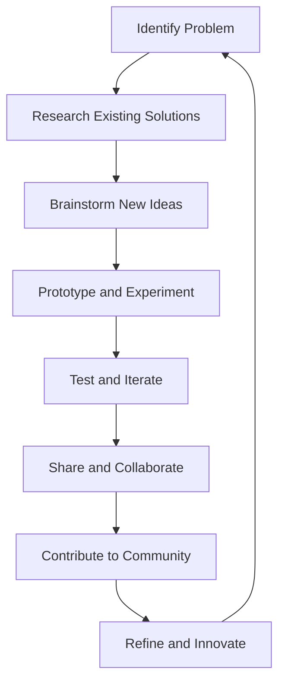

## 23.5 Encouraging Innovation and Exploration

In the realm of software development, innovation and exploration are the driving forces that propel us forward. As expert software engineers and architects, we are tasked with not only solving existing problems but also envisioning new possibilities and pushing the boundaries of what can be achieved. In this section, we will delve into how Haskell, with its unique features and paradigms, serves as a fertile ground for innovation and exploration. We will explore ways to experiment with new ideas, contribute to the Haskell ecosystem, and ultimately, become pioneers in the field of functional programming.

### Innovation in Haskell

#### Pushing the Boundaries

Haskell, with its strong emphasis on pure functional programming, offers a distinct approach to software design and architecture. Its features, such as strong static typing, lazy evaluation, and powerful abstractions like monads and type classes, provide a rich canvas for innovation.

- **Embrace Type-Level Programming**: Haskell's advanced type system allows for type-level programming, where types are used to enforce constraints and invariants at compile time. This can lead to more robust and error-free code. Experiment with Generalized Algebraic Data Types (GADTs) and type families to create expressive and safe APIs.

- **Explore Category Theory**: Haskell's roots in category theory provide a theoretical foundation for understanding and designing complex systems. Concepts like functors, monads, and applicatives are not just abstract ideas but practical tools for structuring code. Dive deeper into category theory to uncover new patterns and abstractions.

- **Leverage Lazy Evaluation**: Haskell's lazy evaluation model allows for the creation of infinite data structures and the separation of concerns between data generation and consumption. Use this feature to design efficient algorithms and explore new ways of handling large data sets.

#### Code Example: Type-Level Programming

```haskell
{-# LANGUAGE GADTs, TypeFamilies #-}

-- Define a type family for addition at the type level
type family Add (a :: Nat) (b :: Nat) :: Nat where
    Add 'Zero b = b
    Add ('Succ a) b = 'Succ (Add a b)

-- Use GADTs to define natural numbers
data Nat = Zero | Succ Nat

-- Function to convert type-level natural numbers to value-level
toInt :: Nat -> Int
toInt Zero     = 0
toInt (Succ n) = 1 + toInt n

-- Example usage
example :: Int
example = toInt (Succ (Succ Zero)) -- Result: 2
```

In this example, we demonstrate how to perform addition at the type level using type families and GADTs. This approach ensures that operations are type-safe and verified at compile time.

### Exploration in Haskell

#### Experimenting with New Ideas

Exploration is about venturing into the unknown and experimenting with new ideas and patterns. Haskell's expressive syntax and powerful abstractions make it an ideal language for prototyping and testing novel concepts.

- **Design Domain-Specific Languages (DSLs)**: Haskell's syntax and type system make it well-suited for creating DSLs. Experiment with designing DSLs for specific problem domains, allowing for more intuitive and expressive code.

- **Prototype with Lenses and Optics**: Lenses and optics provide a way to work with immutable data structures in a composable manner. Use them to explore new ways of manipulating data and building complex transformations.

- **Integrate with Other Paradigms**: Haskell's interoperability with other languages and paradigms allows for the integration of functional programming with object-oriented or procedural codebases. Experiment with combining paradigms to leverage the strengths of each.

#### Code Example: Designing a DSL

```haskell
{-# LANGUAGE OverloadedStrings #-}

import Data.Text (Text)
import qualified Data.Text as T

-- Define a simple DSL for building HTML
data HTML = Element Text [HTML] | TextNode Text

-- Render HTML to a string
render :: HTML -> Text
render (Element tag children) =
    "<" <> tag <> ">" <> T.concat (map render children) <> "</" <> tag <> ">"
render (TextNode text) = text

-- Example usage of the DSL
exampleHTML :: HTML
exampleHTML = Element "div"
    [ Element "h1" [TextNode "Hello, World!"]
    , Element "p" [TextNode "This is a paragraph."]
    ]

-- Render the example HTML
renderedHTML :: Text
renderedHTML = render exampleHTML
```

In this example, we create a simple DSL for building HTML documents. This DSL allows us to construct HTML in a type-safe and composable manner, demonstrating the power of Haskell's abstractions.

### Call to Action: Contributing to the Haskell Ecosystem

#### Building the Community

Innovation and exploration are not solitary endeavors. They thrive in a community where ideas are shared, critiqued, and built upon. As expert developers, we have the opportunity to contribute to the Haskell ecosystem and help shape its future.

- **Contribute to Open Source Projects**: Engage with the Haskell community by contributing to open source projects. Whether it's fixing bugs, adding features, or improving documentation, your contributions can have a significant impact.

- **Share Knowledge and Insights**: Write blog posts, give talks, or create tutorials to share your experiences and insights with the community. By sharing knowledge, you help others learn and grow, fostering a culture of collaboration and innovation.

- **Participate in Haskell Events**: Attend conferences, meetups, and hackathons to connect with other Haskell enthusiasts. These events provide a platform for exchanging ideas, learning from others, and finding inspiration for new projects.

#### Code Example: Contributing to an Open Source Project

```haskell
-- Example of a simple contribution to an open source Haskell library

-- Original function with a bug
-- sumList :: [Int] -> Int
-- sumList [] = 0
-- sumList (x:xs) = x + sumList xs

-- Fixed version of the function
sumList :: Num a => [a] -> a
sumList = foldr (+) 0

-- Explanation:
-- The original function was specific to Int, limiting its usability.
-- The fixed version uses a more general type signature, allowing it to work with any Num type.
```

In this example, we demonstrate a simple contribution to an open source Haskell library by fixing a bug and improving the function's type signature. This kind of contribution helps improve the quality and usability of the library.

### Visualizing Innovation and Exploration

To better understand the process of innovation and exploration in Haskell, let's visualize it using a flowchart.



**Figure 1**: The cycle of innovation and exploration in Haskell. This flowchart illustrates the iterative process of identifying problems, brainstorming ideas, prototyping, testing, sharing, and contributing to the community.

### Knowledge Check

Let's reinforce what we've learned with a few questions and exercises:

1. **What are some key features of Haskell that enable innovation?**
2. **How can type-level programming contribute to more robust code?**
3. **Design a simple DSL for a domain of your choice. What are the key considerations?**
4. **What are some ways to contribute to the Haskell community?**
5. **Experiment with the provided code examples. Can you extend them with additional features?**

### Embrace the Journey

Remember, innovation and exploration are ongoing journeys. As you continue to push the boundaries of what's possible with Haskell, keep experimenting, stay curious, and enjoy the process. The Haskell community is a vibrant and welcoming place, full of opportunities to learn, grow, and make a difference.

### Quiz: Encouraging Innovation and Exploration



### What is a key feature of Haskell that enables innovation?

- [x] Strong static typing
- [ ] Dynamic typing
- [ ] Weak typing
- [ ] No typing

> **Explanation:** Haskell's strong static typing allows for more robust and error-free code, enabling innovation.

### How can type-level programming contribute to more robust code?

- [x] By enforcing constraints at compile time
- [ ] By allowing runtime type checks
- [ ] By ignoring type errors
- [ ] By using dynamic typing

> **Explanation:** Type-level programming in Haskell allows for constraints and invariants to be enforced at compile time, leading to more robust code.

### What is a benefit of designing a DSL in Haskell?

- [x] It allows for more intuitive and expressive code
- [ ] It makes code harder to read
- [ ] It limits the use of Haskell's type system
- [ ] It requires more boilerplate code

> **Explanation:** Designing a DSL in Haskell allows for more intuitive and expressive code, leveraging Haskell's syntax and type system.

### What is a way to contribute to the Haskell community?

- [x] Contribute to open source projects
- [ ] Keep knowledge to oneself
- [ ] Avoid sharing insights
- [ ] Ignore community events

> **Explanation:** Contributing to open source projects is a great way to engage with the Haskell community and help shape its future.

### What is the role of lazy evaluation in Haskell?

- [x] It allows for the creation of infinite data structures
- [ ] It forces immediate evaluation of expressions
- [ ] It prevents the use of recursion
- [ ] It limits the use of higher-order functions

> **Explanation:** Lazy evaluation in Haskell allows for the creation of infinite data structures and separates data generation from consumption.

### How can you share knowledge with the Haskell community?

- [x] Write blog posts and give talks
- [ ] Keep insights private
- [ ] Avoid creating tutorials
- [ ] Ignore community feedback

> **Explanation:** Sharing knowledge through blog posts, talks, and tutorials helps others learn and fosters a culture of collaboration.

### What is a key consideration when designing a DSL?

- [x] Ensuring the DSL is intuitive and expressive
- [ ] Making the DSL as complex as possible
- [ ] Avoiding the use of Haskell's type system
- [ ] Limiting the DSL's functionality

> **Explanation:** When designing a DSL, it's important to ensure it is intuitive and expressive, leveraging Haskell's syntax and type system.

### What is the benefit of participating in Haskell events?

- [x] Connecting with other Haskell enthusiasts
- [ ] Avoiding new ideas
- [ ] Keeping to oneself
- [ ] Ignoring community feedback

> **Explanation:** Participating in Haskell events allows for the exchange of ideas, learning from others, and finding inspiration for new projects.

### What is a simple contribution to an open source project?

- [x] Fixing bugs and improving documentation
- [ ] Ignoring issues
- [ ] Avoiding code reviews
- [ ] Keeping changes private

> **Explanation:** Fixing bugs and improving documentation are simple yet impactful contributions to open source projects.

### True or False: Innovation and exploration are solitary endeavors.

- [ ] True
- [x] False

> **Explanation:** Innovation and exploration thrive in a community where ideas are shared, critiqued, and built upon.



By embracing innovation and exploration, we can continue to push the boundaries of what's possible with Haskell, contribute to the community, and shape the future of functional programming. Keep experimenting, stay curious, and enjoy the journey!
