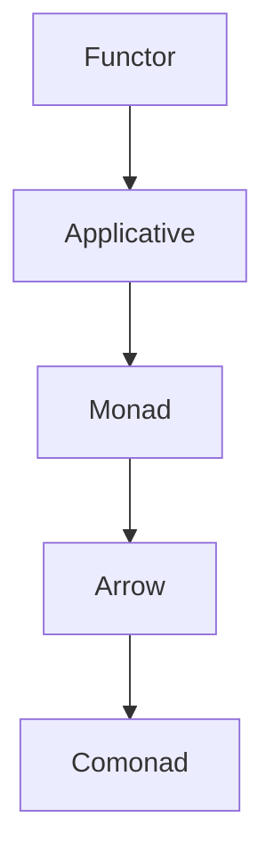

## 23.6 Next Steps and Advanced Topics

As we conclude our journey through the advanced design patterns in Haskell, it's essential to look forward to the next steps and delve into some of the more advanced topics that can further enhance your expertise. This section will guide you through the realms of type-level programming, dependent types, and category theory, offering suggestions for deeper exploration in areas that pique your interest.

### Type-Level Programming in Haskell

Type-level programming in Haskell allows you to leverage the type system to enforce constraints and invariants at compile time, leading to safer and more robust code. This approach can be particularly beneficial in complex systems where runtime errors can be costly.

#### Key Concepts

- **Generalized Algebraic Data Types (GADTs):** GADTs extend the capabilities of regular algebraic data types by allowing more precise type information. They enable pattern matching with richer type information, making your code more expressive and type-safe.

- **Type Families:** Type families provide a way to define functions at the type level. They allow you to associate types with other types, similar to how functions associate values with values.

- **Data Kinds:** Data kinds elevate data types to the type level, allowing you to use them as kinds. This feature is crucial for defining more expressive type-level computations.

#### Sample Code Snippet

```haskell
{-# LANGUAGE GADTs, TypeFamilies, DataKinds, KindSignatures #-}

data Nat = Zero | Succ Nat

data Vector (n :: Nat) a where
    VNil  :: Vector 'Zero a
    VCons :: a -> Vector n a -> Vector ('Succ n) a

type family Add (n :: Nat) (m :: Nat) :: Nat where
    Add 'Zero m = m
    Add ('Succ n) m = 'Succ (Add n m)

append :: Vector n a -> Vector m a -> Vector (Add n m) a
append VNil ys = ys
append (VCons x xs) ys = VCons x (append xs ys)
```

In this example, we define a `Vector` type indexed by a natural number, representing its length. The `append` function concatenates two vectors, and its type signature ensures that the resulting vector's length is the sum of the lengths of the input vectors.

#### Try It Yourself

Experiment with the `Vector` type by implementing additional operations, such as reversing a vector or mapping a function over its elements. Consider how the type system helps prevent errors.

### Dependent Types

Dependent types take type-level programming a step further by allowing types to depend on values. While Haskell does not natively support full dependent types, you can simulate some aspects using advanced type system features.

#### Concepts and Examples

- **Singleton Types:** Singleton types are a technique to bridge the gap between values and types. They allow you to reflect runtime values at the type level.

- **Dependent Pairs:** Dependent pairs, or Sigma types, pair a value with a type that depends on that value. They enable more precise type specifications.

#### Sample Code Snippet

```haskell
{-# LANGUAGE GADTs, DataKinds, KindSignatures, TypeFamilies #-}

data Nat = Zero | Succ Nat

data SNat (n :: Nat) where
    SZero :: SNat 'Zero
    SSucc :: SNat n -> SNat ('Succ n)

data Vec (n :: Nat) a where
    VNil  :: Vec 'Zero a
    VCons :: a -> Vec n a -> Vec ('Succ n) a

vecLength :: Vec n a -> SNat n
vecLength VNil = SZero
vecLength (VCons _ xs) = SSucc (vecLength xs)
```

In this example, `SNat` is a singleton type representing natural numbers at the type level. The `vecLength` function computes the length of a vector, returning a singleton type that reflects the length at the type level.

### Category Theory in Haskell

Category theory provides a mathematical framework for understanding and structuring abstractions in programming. Haskell's type system and functional paradigm align closely with category-theoretic concepts, making it a natural fit for exploring these ideas.

#### Key Concepts

- **Functors, Applicatives, and Monads:** These are fundamental abstractions in Haskell that correspond to category-theoretic constructs. They provide a way to work with computations in a structured manner.

- **Arrows:** Arrows generalize functions and provide a way to model computations that have more structure than monads.

- **Comonads:** Comonads are the dual of monads and provide a way to work with context-dependent computations.

#### Sample Code Snippet

```haskell
{-# LANGUAGE Arrows #-}

import Control.Arrow

newtype SimpleFunc a b = SimpleFunc { runSimpleFunc :: a -> b }

instance Category SimpleFunc where
    id = SimpleFunc id
    (SimpleFunc f) . (SimpleFunc g) = SimpleFunc (f . g)

instance Arrow SimpleFunc where
    arr f = SimpleFunc f
    first (SimpleFunc f) = SimpleFunc (first f)
```

In this example, we define a simple arrow type `SimpleFunc` and implement instances for the `Category` and `Arrow` type classes. This demonstrates how arrows can be used to model computations with more structure than monads.

#### Visualizing Category Theory



This diagram illustrates the relationships between different category-theoretic constructs in Haskell. Each construct builds upon the previous one, providing more structure and capabilities.

### Suggestions for Further Exploration

As you continue your journey in mastering Haskell and its advanced design patterns, consider delving deeper into specific areas that interest you. Here are some suggestions:

- **Explore Libraries and Frameworks:** Investigate Haskell libraries and frameworks that leverage advanced type system features, such as `lens`, `servant`, and `reflex`.

- **Contribute to Open Source Projects:** Engage with the Haskell community by contributing to open source projects. This will deepen your understanding and provide valuable experience.

- **Study Formal Methods:** Explore formal methods and verification techniques to ensure the correctness of your Haskell programs.

- **Learn About Other Functional Languages:** Expand your knowledge by exploring other functional programming languages, such as Scala, OCaml, or F#. Understanding different paradigms can provide new insights and perspectives.

- **Attend Conferences and Meetups:** Participate in Haskell conferences and meetups to connect with other enthusiasts and learn about the latest developments in the field.

### Embrace the Journey

Remember, this is just the beginning. As you progress, you'll build more complex and interactive systems using Haskell's powerful features. Keep experimenting, stay curious, and enjoy the journey!

## Quiz: Next Steps and Advanced Topics



### What is a key benefit of type-level programming in Haskell?

- [x] Enforcing constraints and invariants at compile time
- [ ] Improving runtime performance
- [ ] Simplifying code syntax
- [ ] Reducing memory usage

> **Explanation:** Type-level programming allows you to enforce constraints and invariants at compile time, leading to safer and more robust code.

### Which Haskell feature allows more precise type information in pattern matching?

- [x] Generalized Algebraic Data Types (GADTs)
- [ ] Type Families
- [ ] Data Kinds
- [ ] Singleton Types

> **Explanation:** GADTs extend the capabilities of regular algebraic data types by allowing more precise type information, enabling richer pattern matching.

### What is the purpose of singleton types in Haskell?

- [x] Bridging the gap between values and types
- [ ] Improving runtime performance
- [ ] Simplifying code syntax
- [ ] Reducing memory usage

> **Explanation:** Singleton types allow you to reflect runtime values at the type level, bridging the gap between values and types.

### Which category-theoretic construct is the dual of monads?

- [x] Comonads
- [ ] Functors
- [ ] Applicatives
- [ ] Arrows

> **Explanation:** Comonads are the dual of monads and provide a way to work with context-dependent computations.

### What is a key feature of arrows in Haskell?

- [x] Modeling computations with more structure than monads
- [ ] Simplifying code syntax
- [ ] Reducing memory usage
- [ ] Improving runtime performance

> **Explanation:** Arrows generalize functions and provide a way to model computations that have more structure than monads.

### Which library is known for leveraging advanced type system features in Haskell?

- [x] Lens
- [ ] QuickCheck
- [ ] HSpec
- [ ] Criterion

> **Explanation:** The `lens` library leverages advanced type system features to provide powerful abstractions for working with data structures.

### What is a benefit of contributing to open source projects?

- [x] Deepening understanding and gaining valuable experience
- [ ] Simplifying code syntax
- [ ] Reducing memory usage
- [ ] Improving runtime performance

> **Explanation:** Contributing to open source projects helps deepen your understanding and provides valuable experience in real-world scenarios.

### Which functional programming language is NOT mentioned as a suggestion for further exploration?

- [x] Python
- [ ] Scala
- [ ] OCaml
- [ ] F#

> **Explanation:** Python is not mentioned as a suggestion for further exploration in the context of functional programming languages.

### What is the purpose of formal methods in Haskell?

- [x] Ensuring the correctness of programs
- [ ] Simplifying code syntax
- [ ] Reducing memory usage
- [ ] Improving runtime performance

> **Explanation:** Formal methods and verification techniques are used to ensure the correctness of Haskell programs.

### True or False: Attending conferences and meetups can help you connect with other Haskell enthusiasts.

- [x] True
- [ ] False

> **Explanation:** Attending conferences and meetups provides opportunities to connect with other Haskell enthusiasts and learn about the latest developments in the field.


