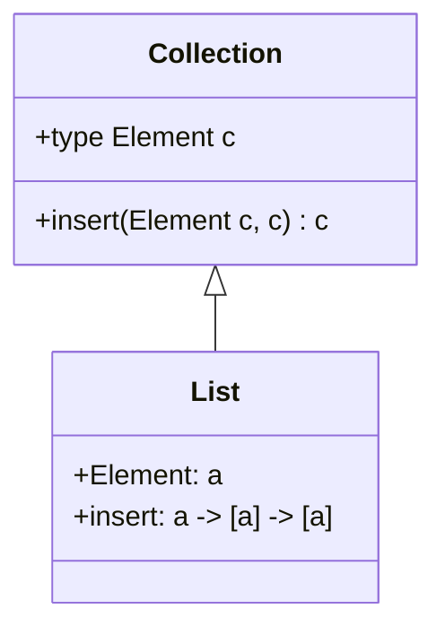

## 24.10 Haskell Language Extensions Reference

Haskell, a statically typed, purely functional programming language, is known for its expressive type system and high-level abstractions. The Glasgow Haskell Compiler (GHC) offers a plethora of language extensions that allow developers to go beyond the standard Haskell 2010 language specification. These extensions enable advanced type system features, syntactic sugar, and optimizations that can significantly enhance the expressiveness and performance of Haskell programs.

In this section, we will explore some of the most commonly used GHC language extensions, their purposes, and how they can be effectively utilized in Haskell projects. We will also provide code examples to illustrate their use and discuss potential pitfalls and best practices.

### Understanding Language Extensions

Language extensions in Haskell are compiler directives that enable additional features not present in the standard language. They are specified at the top of a Haskell source file using the `{-# LANGUAGE ExtensionName #-}` pragma. Extensions can be used to:

- Introduce new syntax or modify existing syntax.
- Enhance the type system with additional capabilities.
- Enable optimizations and performance improvements.
- Facilitate interoperability with other languages.

### Key Language Extensions

#### 1. **OverloadedStrings**

**Purpose:** Simplifies the use of string literals by allowing them to be interpreted as any type that is an instance of the `IsString` type class.

**Usage:** This extension is particularly useful when working with libraries that define their own string types, such as `Text` or `ByteString`.

```haskell
{-# LANGUAGE OverloadedStrings #-}

import Data.Text (Text)

greet :: Text
greet = "Hello, World!"  -- Interpreted as Text
```

**Considerations:** Be cautious when using `OverloadedStrings` as it can lead to ambiguous type errors if the intended type is not clear.

#### 2. **TypeFamilies**

**Purpose:** Enables type-level functions, allowing for more flexible and reusable code by defining families of types that are related in a specific way.

**Usage:** Type families are useful for defining type-level computations and can be either open or closed.

```haskell
{-# LANGUAGE TypeFamilies #-}

class Collection c where
  type Element c
  insert :: Element c -> c -> c

instance Collection [a] where
  type Element [a] = a
  insert = (:)
```

**Considerations:** Type families can make type inference more complex, so it's important to ensure that the intended relationships between types are clear.

#### 3. **GADTs (Generalized Algebraic Data Types)**

**Purpose:** Provides more precise type information by allowing constructors to specify the exact types of their arguments.

**Usage:** GADTs are useful for encoding invariants directly in the type system.

```haskell
{-# LANGUAGE GADTs #-}

data Expr a where
  IVal :: Int -> Expr Int
  BVal :: Bool -> Expr Bool
  Add  :: Expr Int -> Expr Int -> Expr Int

eval :: Expr a -> a
eval (IVal n) = n
eval (BVal b) = b
eval (Add x y) = eval x + eval y
```

**Considerations:** GADTs can complicate type inference, so explicit type annotations may be necessary.

#### 4. **TemplateHaskell**

**Purpose:** Enables metaprogramming by allowing Haskell code to be generated and manipulated at compile time.

**Usage:** Template Haskell is useful for generating boilerplate code, such as instances of type classes.

```haskell
{-# LANGUAGE TemplateHaskell #-}

import Language.Haskell.TH

genShowInstance :: Name -> Q [Dec]
genShowInstance name = [d| instance Show $(conT name) where show _ = "Instance" |]
```

**Considerations:** Template Haskell can make code harder to read and debug, so use it judiciously.

#### 5. **FlexibleInstances**

**Purpose:** Allows more flexibility in defining instances of type classes by relaxing some of the restrictions on instance declarations.

**Usage:** This extension is useful when you need to define instances for specific types that don't fit the standard instance rules.

```haskell
{-# LANGUAGE FlexibleInstances #-}

class MyShow a where
  myShow :: a -> String

instance MyShow [Char] where
  myShow = id
```

**Considerations:** Overuse of `FlexibleInstances` can lead to overlapping instances, which can cause ambiguity.

### Visualizing Language Extensions

To better understand how these extensions interact with the Haskell type system, let's visualize the relationships between types and instances using a class diagram.



**Diagram Explanation:** The diagram illustrates the `Collection` type class and its instance for lists, showing how the `Element` type family is used to define the type of elements that can be inserted into a collection.

### Best Practices for Using Language Extensions

1. **Use Extensions Judiciously:** Only enable extensions that are necessary for your project. Overusing extensions can lead to complex and hard-to-maintain code.

2. **Document Extensions:** Clearly document the purpose of each extension in your codebase to help other developers understand why they are used.

3. **Test Extensively:** Ensure that your code is thoroughly tested, especially when using extensions that affect the type system or introduce metaprogramming.

4. **Stay Informed:** Keep up-to-date with the latest GHC releases and changes to language extensions, as they can evolve over time.

### References and Further Reading

- [GHC User's Guide](https://downloads.haskell.org/~ghc/latest/docs/html/users_guide/exts.html)
- [Haskell Language Extensions](https://wiki.haskell.org/Language_extensions)

### Knowledge Check

To reinforce your understanding of Haskell language extensions, consider the following questions:

1. What are the potential pitfalls of using `OverloadedStrings`?
2. How do type families enhance the flexibility of Haskell's type system?
3. What are the benefits and drawbacks of using Template Haskell for metaprogramming?

### Embrace the Journey

Remember, mastering Haskell language extensions is a journey. As you explore these powerful features, you'll unlock new possibilities for designing expressive and efficient Haskell programs. Keep experimenting, stay curious, and enjoy the process!

## Quiz: Haskell Language Extensions Reference



### Which extension allows string literals to be interpreted as any type that is an instance of the `IsString` type class?

- [x] OverloadedStrings
- [ ] TypeFamilies
- [ ] GADTs
- [ ] FlexibleInstances

> **Explanation:** `OverloadedStrings` allows string literals to be interpreted as any type that is an instance of the `IsString` type class.

### What is the purpose of the `TypeFamilies` extension?

- [x] To enable type-level functions
- [ ] To allow string literals to be overloaded
- [ ] To provide metaprogramming capabilities
- [ ] To relax instance declaration rules

> **Explanation:** `TypeFamilies` enables type-level functions, allowing for more flexible and reusable code.

### Which extension provides more precise type information by allowing constructors to specify the exact types of their arguments?

- [x] GADTs
- [ ] OverloadedStrings
- [ ] TemplateHaskell
- [ ] FlexibleInstances

> **Explanation:** GADTs (Generalized Algebraic Data Types) provide more precise type information by allowing constructors to specify the exact types of their arguments.

### What is a potential drawback of using Template Haskell?

- [x] It can make code harder to read and debug
- [ ] It restricts the use of string literals
- [ ] It limits the flexibility of instance declarations
- [ ] It prevents the use of type-level functions

> **Explanation:** Template Haskell can make code harder to read and debug due to its metaprogramming capabilities.

### Which extension allows more flexibility in defining instances of type classes?

- [x] FlexibleInstances
- [ ] OverloadedStrings
- [ ] TypeFamilies
- [ ] GADTs

> **Explanation:** `FlexibleInstances` allows more flexibility in defining instances of type classes by relaxing some of the restrictions on instance declarations.

### What should be considered when using `OverloadedStrings`?

- [x] Potential for ambiguous type errors
- [ ] Increased performance
- [ ] Simplified instance declarations
- [ ] Enhanced metaprogramming capabilities

> **Explanation:** `OverloadedStrings` can lead to ambiguous type errors if the intended type is not clear.

### How can type families complicate type inference?

- [x] By introducing complex relationships between types
- [ ] By restricting the use of string literals
- [ ] By limiting metaprogramming capabilities
- [ ] By preventing flexible instance declarations

> **Explanation:** Type families can complicate type inference by introducing complex relationships between types.

### What is a benefit of using GADTs?

- [x] Encoding invariants directly in the type system
- [ ] Simplifying string literal usage
- [ ] Enhancing metaprogramming capabilities
- [ ] Relaxing instance declaration rules

> **Explanation:** GADTs allow encoding invariants directly in the type system, providing more precise type information.

### Which extension is particularly useful for generating boilerplate code?

- [x] TemplateHaskell
- [ ] OverloadedStrings
- [ ] TypeFamilies
- [ ] GADTs

> **Explanation:** Template Haskell is useful for generating boilerplate code through metaprogramming.

### True or False: Language extensions should be used extensively to maximize code flexibility.

- [ ] True
- [x] False

> **Explanation:** Language extensions should be used judiciously to avoid complex and hard-to-maintain code.


