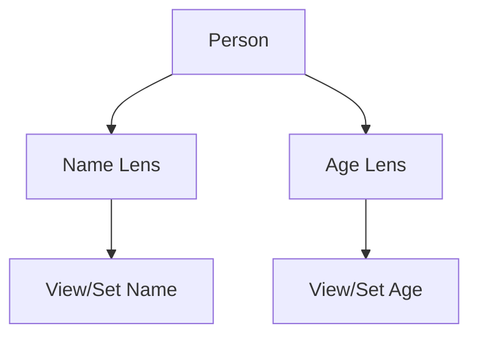

## 24.11 Cheat Sheets for Common Libraries (e.g., Lens, Conduit)

In this section, we delve into some of the most powerful libraries in the Haskell ecosystem: **Lens**, **Conduit**, **Aeson**, and **Text**. These libraries are essential for expert Haskell developers, providing tools for data manipulation, streaming, JSON handling, and efficient text processing. This cheat sheet serves as a quick reference guide, complete with code snippets and explanations to help you master these libraries.

### Lens Library

The **Lens** library is a powerful tool for functional programming in Haskell, providing a way to manipulate data structures in a concise and expressive manner. It is particularly useful for accessing and updating deeply nested data.

#### Key Concepts

- **Lens**: A composable getter and setter.
- **Traversal**: A lens that can focus on multiple elements.
- **Prism**: A lens for working with sum types.
- **Iso**: A bidirectional transformation.

#### Common Functions

| Function       | Description                                      |
|----------------|--------------------------------------------------|
| `view`         | Extracts the value from a lens.                  |
| `set`          | Sets the value at a lens.                        |
| `over`         | Applies a function to the value at a lens.       |
| `(^.)`         | Infix version of `view`.                         |
| `(.~)`         | Infix version of `set`.                          |
| `(%~)`         | Infix version of `over`.                         |

#### Sample Code Snippet

```haskell
import Control.Lens

data Person = Person { _name :: String, _age :: Int } deriving Show
makeLenses ''Person

-- Create a person
let john = Person "John Doe" 30

-- View the name
let name = john ^. name

-- Set the age
let olderJohn = john & age .~ 31

-- Increment the age
let evenOlderJohn = john & age %~ (+1)
```

#### Design Considerations

- **When to Use**: Use Lens when you need to manipulate nested data structures without boilerplate code.
- **Pitfalls**: Overusing Lens can lead to code that is difficult to understand for those unfamiliar with the library.

#### Haskell Unique Features

- **Type Safety**: Lens leverages Haskell's type system to ensure safe data manipulation.
- **Composability**: Lenses can be composed to create complex data access patterns.

### Conduit Library

The **Conduit** library provides a framework for building efficient and composable streaming data pipelines. It is ideal for processing large datasets or handling I/O operations.

#### Key Concepts

- **Source**: A producer of data.
- **Sink**: A consumer of data.
- **Conduit**: A transformer that can both consume and produce data.

#### Common Functions

| Function       | Description                                      |
|----------------|--------------------------------------------------|
| `yield`        | Produces a value in a source.                    |
| `await`        | Consumes a value in a sink.                      |
| `($$)`         | Connects a source to a sink.                     |
| `($=)`         | Connects a source to a conduit.                  |
| `($$+)`        | Connects a conduit to a sink.                    |

#### Sample Code Snippet

```haskell
import Conduit

main :: IO ()
main = runConduit $ yieldMany [1..10] .| mapC (*2) .| sinkList >>= print
```

#### Design Considerations

- **When to Use**: Use Conduit for streaming data processing, especially when dealing with large datasets.
- **Pitfalls**: Ensure proper resource management to avoid leaks.

#### Haskell Unique Features

- **Resource Safety**: Conduit ensures resources are managed efficiently, even in the presence of exceptions.
- **Backpressure**: Conduit supports backpressure, allowing consumers to control the flow of data.

### Aeson Library

The **Aeson** library is the go-to choice for JSON parsing and encoding in Haskell. It provides a simple and efficient way to work with JSON data.

#### Key Concepts

- **ToJSON**: A typeclass for converting Haskell values to JSON.
- **FromJSON**: A typeclass for parsing JSON into Haskell values.
- **Value**: A generic JSON data type.

#### Common Functions

| Function       | Description                                      |
|----------------|--------------------------------------------------|
| `encode`       | Converts a Haskell value to a JSON ByteString.   |
| `decode`       | Parses a JSON ByteString into a Haskell value.   |
| `eitherDecode` | Like `decode`, but returns an error message on failure. |

#### Sample Code Snippet

```haskell
{-# LANGUAGE DeriveGeneric #-}

import Data.Aeson
import GHC.Generics

data Person = Person { name :: String, age :: Int } deriving (Show, Generic)

instance ToJSON Person
instance FromJSON Person

main :: IO ()
main = do
    let person = Person "Alice" 25
    let json = encode person
    print json
    let decodedPerson = decode json :: Maybe Person
    print decodedPerson
```

#### Design Considerations

- **When to Use**: Use Aeson for JSON serialization and deserialization.
- **Pitfalls**: Be mindful of performance when dealing with large JSON data.

#### Haskell Unique Features

- **Generic Derivation**: Aeson can automatically derive JSON instances using GHC's Generic mechanism.
- **Type Safety**: Aeson provides type-safe JSON parsing, reducing runtime errors.

### Text Library

The **Text** library is designed for efficient manipulation of Unicode text. It is a replacement for the standard `String` type, offering better performance and memory usage.

#### Key Concepts

- **Text**: A type for Unicode text.
- **Builder**: A type for efficiently constructing `Text`.

#### Common Functions

| Function       | Description                                      |
|----------------|--------------------------------------------------|
| `pack`         | Converts a `String` to `Text`.                   |
| `unpack`       | Converts `Text` to a `String`.                   |
| `append`       | Concatenates two `Text` values.                  |
| `length`       | Returns the number of characters in `Text`.      |
| `toUpper`      | Converts `Text` to uppercase.                    |

#### Sample Code Snippet

```haskell
import Data.Text
import qualified Data.Text.IO as T

main :: IO ()
main = do
    let text1 = pack "Hello"
    let text2 = pack "World"
    let combined = text1 `append` text2
    T.putStrLn combined
    print $ length combined
```

#### Design Considerations

- **When to Use**: Use Text for any non-trivial text processing tasks.
- **Pitfalls**: Be aware of encoding issues when interfacing with external systems.

#### Haskell Unique Features

- **Performance**: The Text library is optimized for performance, using packed UTF-16 arrays.
- **Immutability**: Text values are immutable, ensuring thread safety.

### Try It Yourself

To deepen your understanding, try modifying the code examples provided. For instance, experiment with creating more complex lenses, or try building a conduit pipeline that processes a file. Consider how you might handle errors in JSON parsing with Aeson, or explore the performance differences between `String` and `Text`.

### Visualizing Lens Composition

To better understand how lenses compose, consider the following diagram:



**Diagram Description**: This diagram illustrates how a `Person` data structure can be accessed and modified using `Name` and `Age` lenses. Each lens provides a path to view or set the respective field.

### References and Links

- [Haskell Lens Library Documentation](https://hackage.haskell.org/package/lens)
- [Conduit Library Documentation](https://hackage.haskell.org/package/conduit)
- [Aeson Library Documentation](https://hackage.haskell.org/package/aeson)
- [Text Library Documentation](https://hackage.haskell.org/package/text)

### Knowledge Check

1. What is the primary use of the Lens library in Haskell?
2. How does Conduit handle resource management?
3. What are the benefits of using Aeson for JSON parsing?
4. Why is the Text library preferred over String for text manipulation?

### Embrace the Journey

Remember, mastering these libraries is a journey. As you experiment and build more complex applications, you'll discover new patterns and techniques. Stay curious, keep exploring, and enjoy the process of becoming a Haskell expert!

## Quiz: Cheat Sheets for Common Libraries (e.g., Lens, Conduit)



### What is a primary advantage of using the Lens library?

- [x] It allows for concise manipulation of nested data structures.
- [ ] It provides a way to handle asynchronous programming.
- [ ] It is used for JSON parsing.
- [ ] It offers a framework for streaming data.

> **Explanation:** The Lens library is primarily used for accessing and updating nested data structures in a concise manner.

### Which function in Conduit is used to produce a value in a source?

- [x] `yield`
- [ ] `await`
- [ ] `($$)`
- [ ] `($=)`

> **Explanation:** `yield` is used to produce a value in a source within the Conduit library.

### What does the `encode` function in Aeson do?

- [x] Converts a Haskell value to a JSON ByteString.
- [ ] Parses a JSON ByteString into a Haskell value.
- [ ] Connects a source to a sink.
- [ ] Converts `Text` to uppercase.

> **Explanation:** The `encode` function in Aeson is used to convert a Haskell value into a JSON ByteString.

### What type does the Text library provide for Unicode text?

- [x] `Text`
- [ ] `String`
- [ ] `ByteString`
- [ ] `Char`

> **Explanation:** The Text library provides the `Text` type for efficient manipulation of Unicode text.

### Which of the following is a key feature of the Conduit library?

- [x] Backpressure support
- [ ] JSON parsing
- [ ] Lens composition
- [ ] Text manipulation

> **Explanation:** Conduit supports backpressure, allowing consumers to control the flow of data.

### How does Aeson handle JSON parsing errors?

- [x] It returns an error message on failure with `eitherDecode`.
- [ ] It throws an exception.
- [ ] It logs the error and continues.
- [ ] It silently ignores the error.

> **Explanation:** Aeson provides `eitherDecode`, which returns an error message if JSON parsing fails.

### What is a common pitfall when using the Lens library?

- [x] Overusing Lens can lead to difficult-to-understand code.
- [ ] It lacks type safety.
- [ ] It is not composable.
- [ ] It cannot handle nested data structures.

> **Explanation:** Overusing Lens can make code difficult to understand for those unfamiliar with the library.

### Which function in the Text library converts a `String` to `Text`?

- [x] `pack`
- [ ] `unpack`
- [ ] `append`
- [ ] `length`

> **Explanation:** The `pack` function is used to convert a `String` to `Text`.

### True or False: The Conduit library is ideal for processing small datasets.

- [ ] True
- [x] False

> **Explanation:** Conduit is designed for efficient streaming and processing of large datasets.

### Which library is best suited for JSON serialization in Haskell?

- [x] Aeson
- [ ] Lens
- [ ] Conduit
- [ ] Text

> **Explanation:** Aeson is the go-to library for JSON serialization and deserialization in Haskell.


