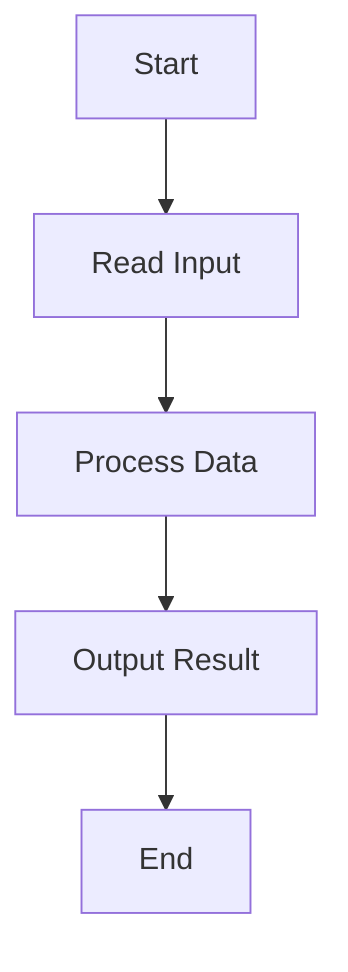

## 24.12 Style Guides and Coding Standards

In the world of software development, adhering to style guides and coding standards is crucial for maintaining clean, readable, and maintainable code. This is especially true in Haskell, where the functional paradigm introduces unique challenges and opportunities. In this section, we will explore the essential style considerations, guidelines, and best practices for writing idiomatic Haskell code. We'll also provide practical examples and exercises to help you apply these concepts effectively.

### Style Considerations

#### Importance of Style Guides

Explain the significance of style guides in software development. Style guides ensure consistency across codebases, making it easier for teams to collaborate and maintain code. In Haskell, where the syntax and functional constructs can be unfamiliar to newcomers, a consistent style helps reduce cognitive load and improve code comprehension.

#### Writing Clean, Idiomatic Haskell Code

Emphasize the importance of writing clean, idiomatic Haskell code. Clean code is not only easier to read and understand but also less prone to errors. Idiomatic Haskell code leverages the language's strengths, such as strong typing, immutability, and higher-order functions, to create elegant and efficient solutions.

### Guidelines

#### Formatting

Provide guidelines for formatting Haskell code. Proper formatting enhances readability and helps prevent errors. Key formatting guidelines include:

- **Indentation**: Use consistent indentation, typically two spaces per indentation level. Avoid using tabs.
- **Line Length**: Keep lines under 80 characters to ensure readability on all devices.
- **Whitespace**: Use whitespace to separate logical sections of code and improve readability.

#### Naming Conventions

Discuss naming conventions for variables, functions, and modules. Consistent naming conventions make code easier to understand and maintain. Key naming conventions include:

- **Variables and Functions**: Use camelCase for variable and function names (e.g., `calculateSum`).
- **Modules**: Use PascalCase for module names (e.g., `Data.List`).
- **Constants**: Use all uppercase letters with underscores for constants (e.g., `MAX_SIZE`).

#### Module Organization

Explain best practices for organizing Haskell modules. Proper module organization improves code maintainability and reusability. Key module organization guidelines include:

- **Single Responsibility**: Each module should have a single responsibility or purpose.
- **Logical Grouping**: Group related functions and types within the same module.
- **Export Lists**: Use export lists to control which functions and types are accessible from other modules.

### Code Examples

Include clear, well-commented code examples to illustrate each concept. Ensure code examples are functional, error-free, and tested.

```haskell
-- Example of a well-formatted Haskell function
module Example (calculateSum) where

-- | Calculate the sum of a list of integers.
-- This function takes a list of integers and returns their sum.
calculateSum :: [Int] -> Int
calculateSum = foldl (+) 0
```

### Visualizing

Incorporate diagrams, tables, or charts to enhance understanding. Use Hugo-compatible Mermaid.js diagrams to visually represent concepts, architectures, workflows, processes, stack operations, transitions, state changes, relationships between objects, layouts, widget trees, widget hierarchies, and data flow.



### References and Links

Include hyperlinks to reputable external resources for further reading. Use these links to supplement explanations or provide deeper dives into topics.

- [Haskell Style Guide](https://github.com/tibbe/haskell-style-guide)
- [Learn You a Haskell for Great Good!](http://learnyouahaskell.com/)

### Knowledge Check

Pose questions or small challenges within the text to engage readers. Include exercises or practice problems at the end of sections or chapters to reinforce learning.

#### Exercise

Write a Haskell function that calculates the factorial of a number using recursion. Ensure the function is well-formatted and follows the naming conventions discussed.

### Embrace the Journey

Maintain an encouraging and supportive tone throughout the content. Remember, this is just the beginning. As you progress, you'll build more complex and interactive applications. Keep experimenting, stay curious, and enjoy the journey!

### Formatting and Structure

Organize content with clear headings and subheadings. Use bullet points to break down complex information. Highlight important terms or concepts using bold or italic text sparingly.

### Writing Style

Use first-person plural (we, let's) to create a collaborative feel. Avoid gender-specific pronouns; use they/them or rewrite sentences to be inclusive. Define acronyms and abbreviations upon first use.

## Quiz: Style Guides and Coding Standards



### What is the recommended indentation style for Haskell code?

- [x] Two spaces per indentation level
- [ ] Four spaces per indentation level
- [ ] Tabs
- [ ] No indentation

> **Explanation:** Consistent indentation, typically two spaces per level, enhances readability and prevents errors.

### Which naming convention is recommended for Haskell module names?

- [x] PascalCase
- [ ] camelCase
- [ ] snake_case
- [ ] kebab-case

> **Explanation:** PascalCase is used for module names to distinguish them from variables and functions.

### What is the purpose of export lists in Haskell modules?

- [x] Control which functions and types are accessible from other modules
- [ ] Improve code readability
- [ ] Increase performance
- [ ] Reduce code size

> **Explanation:** Export lists manage the visibility of functions and types, enhancing encapsulation and modularity.

### Why is it important to keep lines under 80 characters in Haskell code?

- [x] To ensure readability on all devices
- [ ] To improve performance
- [ ] To reduce file size
- [ ] To comply with language syntax

> **Explanation:** Keeping lines under 80 characters ensures that code is easily readable on various devices and editors.

### What is the recommended naming convention for Haskell constants?

- [x] All uppercase letters with underscores
- [ ] camelCase
- [ ] PascalCase
- [ ] kebab-case

> **Explanation:** Constants are typically written in all uppercase letters with underscores to distinguish them from variables.

### How should related functions and types be organized in Haskell?

- [x] Grouped within the same module
- [ ] Separated into different files
- [ ] Listed alphabetically
- [ ] Randomly distributed

> **Explanation:** Grouping related functions and types within the same module improves code maintainability and readability.

### What is the benefit of writing idiomatic Haskell code?

- [x] It leverages the language's strengths for elegant and efficient solutions
- [ ] It makes the code run faster
- [ ] It reduces the need for comments
- [ ] It simplifies debugging

> **Explanation:** Idiomatic Haskell code utilizes the language's features effectively, resulting in elegant and efficient solutions.

### Which of the following is not a recommended practice for Haskell module organization?

- [ ] Single responsibility
- [ ] Logical grouping
- [ ] Export lists
- [x] Random function placement

> **Explanation:** Random function placement is not recommended as it reduces code readability and maintainability.

### What is the main advantage of using consistent naming conventions in Haskell?

- [x] Makes code easier to understand and maintain
- [ ] Increases code execution speed
- [ ] Reduces memory usage
- [ ] Simplifies error handling

> **Explanation:** Consistent naming conventions improve code readability and maintainability, making it easier to understand.

### True or False: Tabs are recommended for indentation in Haskell code.

- [ ] True
- [x] False

> **Explanation:** Tabs are not recommended for indentation in Haskell code; spaces are preferred for consistency.


