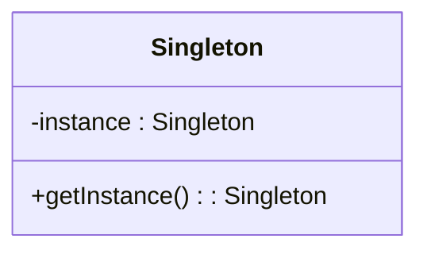
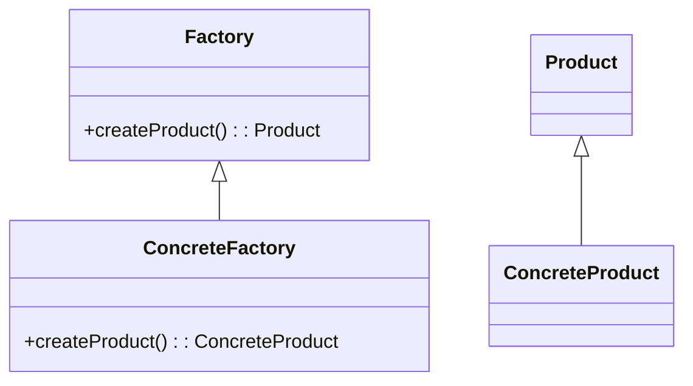
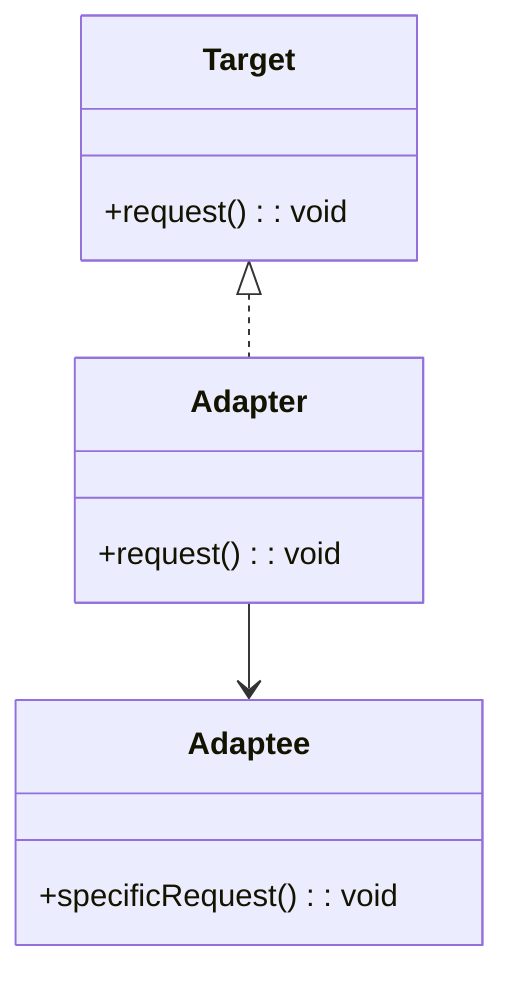
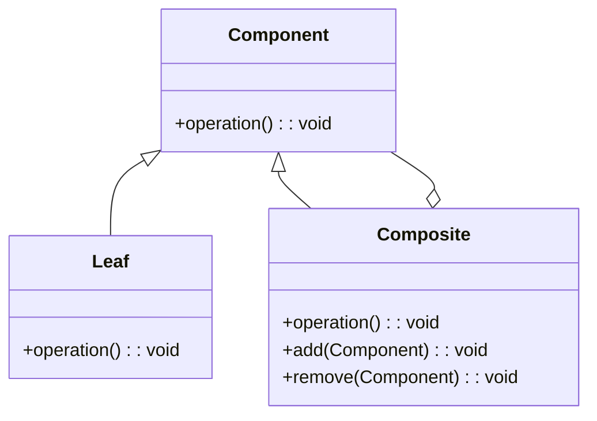
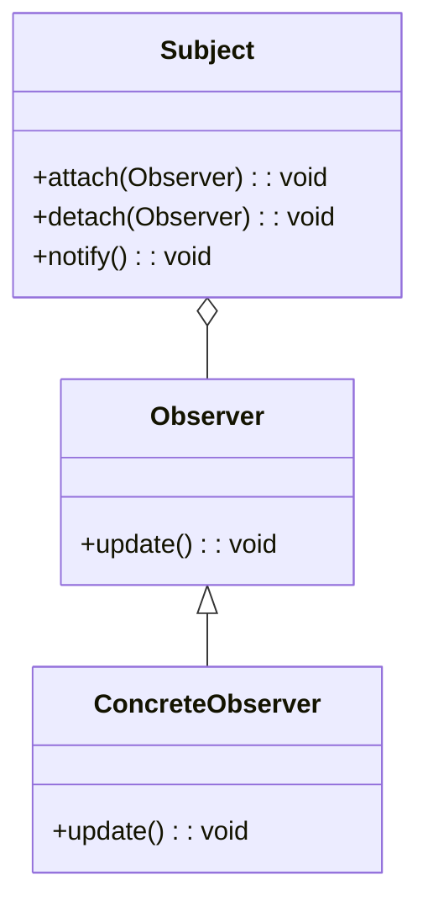
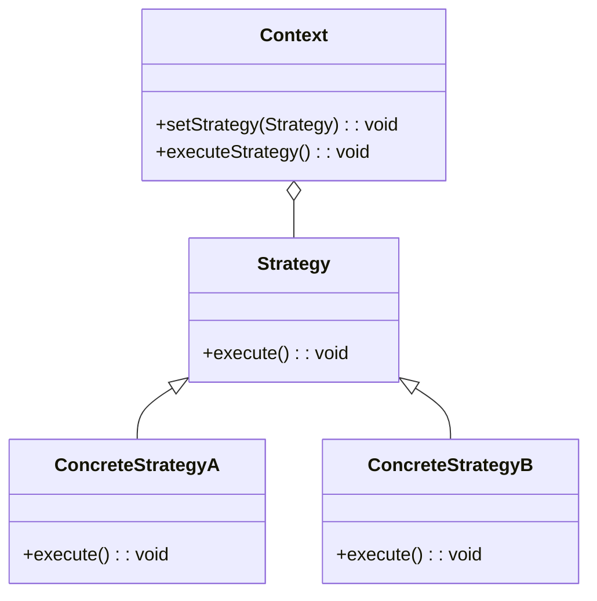

## 24.3 Pattern Reference Cheat Sheet

Welcome to the Pattern Reference Cheat Sheet for Haskell Design Patterns. This section serves as a quick-reference guide for all design patterns discussed in the guide, summarizing key information for easy recall and comparison. Whether you're an expert software engineer or an architect, this cheat sheet will help you navigate the world of Haskell design patterns efficiently.

### Creational Patterns

#### Singleton Pattern

- **Category**: Creational
- **Intent**: Ensure a class has only one instance and provide a global point of access to it.
- **Structure Diagram**:

- **Key Participants**: Singleton
- **Applicability**: Use when exactly one instance of a class is needed to coordinate actions across the system.
- **Haskell Unique Features**: Utilize Haskell's module system to encapsulate the singleton instance.
- **Design Considerations**: Ensure thread safety if the singleton is accessed concurrently.

#### Factory Pattern

- **Category**: Creational
- **Intent**: Define an interface for creating an object, but let subclasses alter the type of objects that will be created.
- **Structure Diagram**:

- **Key Participants**: Factory, ConcreteFactory, Product
- **Applicability**: Use when a class can't anticipate the class of objects it must create.
- **Haskell Unique Features**: Use type classes and smart constructors to implement factory methods.
- **Design Considerations**: Consider using phantom types to ensure type safety.

### Structural Patterns

#### Adapter Pattern

- **Category**: Structural
- **Intent**: Convert the interface of a class into another interface clients expect.
- **Structure Diagram**:

- **Key Participants**: Target, Adapter, Adaptee
- **Applicability**: Use when you want to use an existing class, and its interface does not match the one you need.
- **Haskell Unique Features**: Leverage type classes and newtypes to implement adapters.
- **Design Considerations**: Ensure that the adapter correctly translates requests from the target interface to the adaptee.

#### Composite Pattern

- **Category**: Structural
- **Intent**: Compose objects into tree structures to represent part-whole hierarchies.
- **Structure Diagram**:

- **Key Participants**: Component, Leaf, Composite
- **Applicability**: Use to represent hierarchies of objects where individual objects and compositions of objects should be treated uniformly.
- **Haskell Unique Features**: Use recursive data structures to naturally represent composite patterns.
- **Design Considerations**: Ensure that operations on composite structures are efficient.

### Behavioral Patterns

#### Observer Pattern

- **Category**: Behavioral
- **Intent**: Define a one-to-many dependency between objects so that when one object changes state, all its dependents are notified and updated automatically.
- **Structure Diagram**:

- **Key Participants**: Subject, Observer, ConcreteObserver
- **Applicability**: Use when a change to one object requires changing others, and you don't know how many objects need to be changed.
- **Haskell Unique Features**: Use Functional Reactive Programming (FRP) libraries to implement observer patterns.
- **Design Considerations**: Ensure that observers are efficiently notified and updated.

#### Strategy Pattern

- **Category**: Behavioral
- **Intent**: Define a family of algorithms, encapsulate each one, and make them interchangeable.
- **Structure Diagram**:

- **Key Participants**: Context, Strategy, ConcreteStrategy
- **Applicability**: Use when you want to define a class that will have one behavior that is similar to other behaviors in a list.
- **Haskell Unique Features**: Use higher-order functions to implement strategy patterns.
- **Design Considerations**: Ensure that strategies are easily interchangeable and maintainable.

### Haskell Unique Features

Haskell's strong static typing, type inference, and lazy evaluation make it uniquely suited for implementing design patterns in a functional style. Here are some unique features to consider:

- **Type Classes**: Use type classes to define interfaces and polymorphic behavior.
- **Monads**: Leverage monads for managing side effects and encapsulating computations.
- **Lazy Evaluation**: Utilize lazy evaluation to defer computations until necessary, optimizing performance.
- **Higher-Order Functions**: Use higher-order functions to create flexible and reusable code components.
- **Algebraic Data Types**: Define complex data structures using algebraic data types for better type safety and expressiveness.

### Design Considerations

When implementing design patterns in Haskell, consider the following:

- **Immutability**: Embrace immutability to ensure thread safety and simplify reasoning about code.
- **Purity**: Maintain pure functions to avoid side effects and improve testability.
- **Type Safety**: Use Haskell's type system to enforce constraints and prevent runtime errors.
- **Performance**: Be mindful of lazy evaluation and potential space leaks, optimizing where necessary.
- **Concurrency**: Utilize Haskell's concurrency primitives, such as STM and async, for efficient parallel processing.

### Differences and Similarities

Some patterns may appear similar but serve different purposes. For example:

- **Adapter vs. Decorator**: Both patterns involve wrapping an object, but the adapter changes the interface, while the decorator adds behavior.
- **Strategy vs. State**: Both patterns involve changing behavior, but the strategy pattern changes algorithms, while the state pattern changes states.

### Easy Navigation

This cheat sheet is organized by pattern category for easy navigation. Use it as a quick reference to understand the intent, applicability, and unique features of each pattern in Haskell.

## Quiz: Pattern Reference Cheat Sheet



### Which pattern ensures a class has only one instance?

- [x] Singleton Pattern
- [ ] Factory Pattern
- [ ] Adapter Pattern
- [ ] Strategy Pattern

> **Explanation:** The Singleton Pattern ensures a class has only one instance and provides a global point of access to it.

### What is the primary intent of the Factory Pattern?

- [ ] Ensure a class has only one instance
- [x] Define an interface for creating an object
- [ ] Convert the interface of a class
- [ ] Define a family of algorithms

> **Explanation:** The Factory Pattern defines an interface for creating an object, but lets subclasses alter the type of objects that will be created.

### Which pattern is used to convert the interface of a class into another interface?

- [ ] Singleton Pattern
- [ ] Factory Pattern
- [x] Adapter Pattern
- [ ] Strategy Pattern

> **Explanation:** The Adapter Pattern converts the interface of a class into another interface clients expect.

### What is the key feature of the Composite Pattern?

- [ ] Ensures a class has only one instance
- [ ] Defines an interface for creating an object
- [x] Composes objects into tree structures
- [ ] Defines a family of algorithms

> **Explanation:** The Composite Pattern composes objects into tree structures to represent part-whole hierarchies.

### Which pattern defines a one-to-many dependency between objects?

- [ ] Singleton Pattern
- [ ] Factory Pattern
- [ ] Adapter Pattern
- [x] Observer Pattern

> **Explanation:** The Observer Pattern defines a one-to-many dependency between objects so that when one object changes state, all its dependents are notified and updated automatically.

### What is the primary intent of the Strategy Pattern?

- [ ] Ensure a class has only one instance
- [ ] Define an interface for creating an object
- [ ] Convert the interface of a class
- [x] Define a family of algorithms

> **Explanation:** The Strategy Pattern defines a family of algorithms, encapsulates each one, and makes them interchangeable.

### Which Haskell feature is used to define interfaces and polymorphic behavior?

- [x] Type Classes
- [ ] Monads
- [ ] Lazy Evaluation
- [ ] Higher-Order Functions

> **Explanation:** Type Classes in Haskell are used to define interfaces and polymorphic behavior.

### What should be considered when implementing design patterns in Haskell?

- [x] Immutability
- [x] Purity
- [x] Type Safety
- [ ] Ignoring Lazy Evaluation

> **Explanation:** When implementing design patterns in Haskell, consider immutability, purity, and type safety, while being mindful of lazy evaluation.

### Which pattern involves wrapping an object to change its interface?

- [ ] Singleton Pattern
- [ ] Factory Pattern
- [x] Adapter Pattern
- [ ] Decorator Pattern

> **Explanation:** The Adapter Pattern involves wrapping an object to change its interface.

### True or False: The Strategy Pattern changes states.

- [ ] True
- [x] False

> **Explanation:** The Strategy Pattern changes algorithms, not states. The State Pattern is used to change states.



Remember, this is just the beginning. As you progress, you'll build more complex and interactive systems using Haskell design patterns. Keep experimenting, stay curious, and enjoy the journey!
