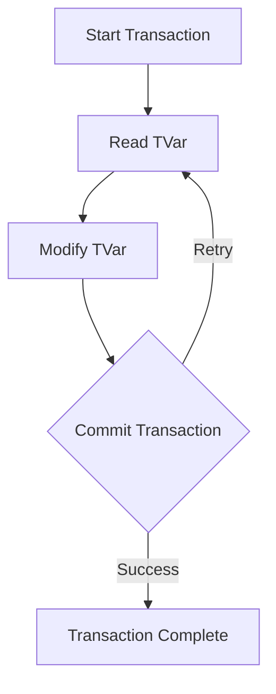

## 24.4 Common Interview Questions for Haskell Developers

As a Haskell developer, preparing for interviews involves understanding both the fundamental concepts of the language and its advanced features. This guide will help you navigate through typical interview questions, covering language basics, design patterns, and advanced concepts. We will provide sample questions along with model answers to help you articulate your understanding effectively.

### Preparation

Before diving into specific questions, it's essential to have a solid grasp of Haskell's core principles. Ensure you are comfortable with:

- **Functional Programming Paradigms**: Understand pure functions, immutability, and higher-order functions.
- **Type System**: Familiarize yourself with Haskell's strong static typing, type inference, and type classes.
- **Monads and Functors**: Be able to explain and use these constructs in practical scenarios.
- **Concurrency and Parallelism**: Know how Haskell handles concurrent programming with tools like STM and Async.
- **Design Patterns**: Understand how traditional design patterns are adapted in Haskell's functional context.

### Topics Covered

This section will cover a range of topics typically encountered in Haskell developer interviews:

1. **Language Basics**: Syntax, data types, and basic constructs.
2. **Functional Programming Concepts**: Pure functions, immutability, and function composition.
3. **Advanced Haskell Features**: Monads, type classes, and lazy evaluation.
4. **Concurrency and Parallelism**: Techniques for writing concurrent Haskell programs.
5. **Design Patterns**: How design patterns are implemented in Haskell.
6. **Problem Solving**: Applying Haskell to solve complex problems.

### Example Questions and Model Answers

#### 1. Language Basics

**Question**: Explain the concept of immutability in Haskell and its benefits.

**Model Answer**: In Haskell, immutability means that once a value is assigned to a variable, it cannot be changed. This leads to several benefits, such as easier reasoning about code, as there are no side effects or changes in state. It also enhances concurrency, as immutable data structures can be safely shared between threads without the need for locks.

**Question**: What are algebraic data types (ADTs) in Haskell?

**Model Answer**: Algebraic data types are a way to define custom data types in Haskell. They are composed of one or more constructors, each of which can have zero or more arguments. ADTs allow for the creation of complex data structures and are fundamental to pattern matching in Haskell.

```haskell
data Shape = Circle Float | Rectangle Float Float

-- Example of pattern matching with ADTs
area :: Shape -> Float
area (Circle r) = pi * r * r
area (Rectangle w h) = w * h
```

#### 2. Functional Programming Concepts

**Question**: How does Haskell handle function composition, and why is it useful?

**Model Answer**: Haskell uses the `(.)` operator for function composition, allowing you to combine functions in a clean and concise manner. This is useful for creating pipelines of transformations, improving code readability and maintainability.

```haskell
-- Function composition example
double :: Num a => a -> a
double x = x * 2

increment :: Num a => a -> a
increment x = x + 1

-- Composing functions
doubleIncrement = double . increment

-- Usage
result = doubleIncrement 3  -- Result is 8
```

**Question**: What is currying in Haskell?

**Model Answer**: Currying is the process of transforming a function that takes multiple arguments into a series of functions that each take a single argument. In Haskell, all functions are curried by default, allowing for partial application and more flexible function composition.

```haskell
-- Curried function example
add :: Int -> Int -> Int
add x y = x + y

-- Partial application
addFive = add 5

-- Usage
result = addFive 10  -- Result is 15
```

#### 3. Advanced Haskell Features

**Question**: Explain the role of monads in Haskell.

**Model Answer**: Monads in Haskell are a type class that encapsulate computations with context, such as side effects, state, or I/O. They provide a way to chain operations while maintaining the context, using the `bind` operator `(>>=)` and the `return` function to inject values into the monadic context.

```haskell
-- Example of using the Maybe monad
safeDivide :: Double -> Double -> Maybe Double
safeDivide _ 0 = Nothing
safeDivide x y = Just (x / y)

-- Chaining operations with monads
result = Just 10 >>= \x -> safeDivide x 2 >>= \y -> return (y + 1)
```

**Question**: What is lazy evaluation, and how does it benefit Haskell programs?

**Model Answer**: Lazy evaluation means that expressions are not evaluated until their values are needed. This allows for the creation of infinite data structures and can improve performance by avoiding unnecessary computations. It also enables more modular code, as functions can be composed without worrying about the order of evaluation.

```haskell
-- Example of lazy evaluation with infinite lists
naturals :: [Integer]
naturals = [0..]

-- Taking the first 10 natural numbers
firstTen = take 10 naturals  -- Result is [0,1,2,3,4,5,6,7,8,9]
```

#### 4. Concurrency and Parallelism

**Question**: How does Haskell implement concurrency, and what are the benefits of using Software Transactional Memory (STM)?

**Model Answer**: Haskell implements concurrency using lightweight threads and abstractions like STM, which provides a composable way to manage shared state. STM allows for atomic transactions, making concurrent programming safer and more straightforward by avoiding common pitfalls like deadlocks and race conditions.

```haskell
import Control.Concurrent.STM

-- Example of using STM
transfer :: TVar Int -> TVar Int -> Int -> STM ()
transfer from to amount = do
  fromBalance <- readTVar from
  toBalance <- readTVar to
  writeTVar from (fromBalance - amount)
  writeTVar to (toBalance + amount)
```

#### 5. Design Patterns

**Question**: How can the Singleton pattern be implemented in Haskell?

**Model Answer**: In Haskell, the Singleton pattern can be implemented using a module with a constant value. Since Haskell's values are immutable, this ensures that the singleton instance remains consistent throughout the program.

```haskell
-- Singleton pattern using a module
module Config where

singletonConfig :: Config
singletonConfig = Config { setting1 = "value1", setting2 = "value2" }
```

**Question**: Describe how the Strategy pattern can be applied using higher-order functions in Haskell.

**Model Answer**: The Strategy pattern can be implemented in Haskell using higher-order functions, where different strategies are represented as functions that can be passed as arguments.

```haskell
-- Strategy pattern with higher-order functions
type Strategy = Int -> Int

addStrategy :: Strategy
addStrategy x = x + 1

multiplyStrategy :: Strategy
multiplyStrategy x = x * 2

applyStrategy :: Strategy -> Int -> Int
applyStrategy strategy x = strategy x

-- Usage
resultAdd = applyStrategy addStrategy 5  -- Result is 6
resultMultiply = applyStrategy multiplyStrategy 5  -- Result is 10
```

#### 6. Problem Solving

**Question**: Provide a solution to the classic "FizzBuzz" problem in Haskell.

**Model Answer**: The FizzBuzz problem can be solved in Haskell using list comprehensions and pattern matching to generate the desired output.

```haskell
-- FizzBuzz solution
fizzBuzz :: [String]
fizzBuzz = [ fizzBuzzValue x | x <- [1..100] ]
  where
    fizzBuzzValue x
      | x `mod` 15 == 0 = "FizzBuzz"
      | x `mod` 3 == 0  = "Fizz"
      | x `mod` 5 == 0  = "Buzz"
      | otherwise       = show x
```

### Try It Yourself

To deepen your understanding, try modifying the provided code examples:

- **Experiment with Currying**: Create a curried function that takes three arguments and partially apply it.
- **Explore Lazy Evaluation**: Implement a function that generates an infinite list of Fibonacci numbers.
- **Concurrency Challenge**: Use STM to implement a simple bank account system with deposit and withdrawal operations.

### Visualizing Haskell Concepts

To better understand Haskell's concurrency model, let's visualize how STM manages transactions:



**Diagram Description**: This diagram illustrates the flow of a transaction in Haskell's STM. The transaction starts, reads and modifies TVars, and attempts to commit. If successful, the transaction completes; otherwise, it retries.

### References and Links

- [Haskell Language Documentation](https://www.haskell.org/documentation/)
- [Real World Haskell](http://book.realworldhaskell.org/)
- [Learn You a Haskell for Great Good!](http://learnyouahaskell.com/)

### Knowledge Check

- **What are the benefits of using immutability in Haskell?**
- **How does function composition enhance code readability?**
- **Explain the role of monads in managing side effects.**
- **What are the advantages of lazy evaluation?**
- **How does STM improve concurrency in Haskell?**

### Embrace the Journey

Remember, mastering Haskell is a journey. As you progress, you'll discover new patterns and techniques that will enhance your problem-solving skills. Keep experimenting, stay curious, and enjoy the process of learning and applying Haskell in real-world scenarios.

## Quiz: Common Interview Questions for Haskell Developers



### What is the primary benefit of immutability in Haskell?

- [x] Easier reasoning about code
- [ ] Faster execution
- [ ] More concise syntax
- [ ] Better error messages

> **Explanation:** Immutability ensures that data cannot be changed, leading to easier reasoning about code and avoiding side effects.

### How does Haskell achieve function composition?

- [x] Using the (.) operator
- [ ] Using the (+) operator
- [ ] Using the (++) operator
- [ ] Using the (:) operator

> **Explanation:** Haskell uses the (.) operator to compose functions, allowing for clean and concise function pipelines.

### What is the purpose of the Maybe monad?

- [x] To handle computations that may fail
- [ ] To perform I/O operations
- [ ] To manage state
- [ ] To handle concurrency

> **Explanation:** The Maybe monad is used to handle computations that may fail, providing a way to represent optional values.

### What is lazy evaluation?

- [x] Delaying computation until the result is needed
- [ ] Executing all computations immediately
- [ ] Evaluating expressions in parallel
- [ ] Avoiding computation altogether

> **Explanation:** Lazy evaluation delays computation until the result is needed, allowing for efficient handling of infinite data structures.

### How does STM improve concurrency in Haskell?

- [x] By providing atomic transactions
- [ ] By using locks
- [ ] By avoiding shared state
- [ ] By using threads

> **Explanation:** STM provides atomic transactions, making concurrent programming safer and avoiding common pitfalls like deadlocks.

### What is currying in Haskell?

- [x] Transforming a function to take multiple arguments into a series of functions
- [ ] Combining two functions into one
- [ ] Evaluating functions in parallel
- [ ] Optimizing function execution

> **Explanation:** Currying transforms a function that takes multiple arguments into a series of functions that each take a single argument.

### How can the Singleton pattern be implemented in Haskell?

- [x] Using a module with a constant value
- [ ] Using a class with static methods
- [ ] Using a global variable
- [ ] Using a mutable object

> **Explanation:** In Haskell, the Singleton pattern can be implemented using a module with a constant value, ensuring immutability.

### What is the role of monads in Haskell?

- [x] To encapsulate computations with context
- [ ] To perform arithmetic operations
- [ ] To manage memory
- [ ] To optimize performance

> **Explanation:** Monads encapsulate computations with context, such as side effects, state, or I/O, allowing for chaining operations.

### What is the advantage of using higher-order functions in Haskell?

- [x] They allow for more flexible and reusable code
- [ ] They execute faster
- [ ] They reduce memory usage
- [ ] They simplify syntax

> **Explanation:** Higher-order functions allow for more flexible and reusable code by enabling functions to be passed as arguments or returned as results.

### True or False: Haskell's type system is dynamically typed.

- [ ] True
- [x] False

> **Explanation:** Haskell's type system is statically typed, meaning types are checked at compile time, not at runtime.


