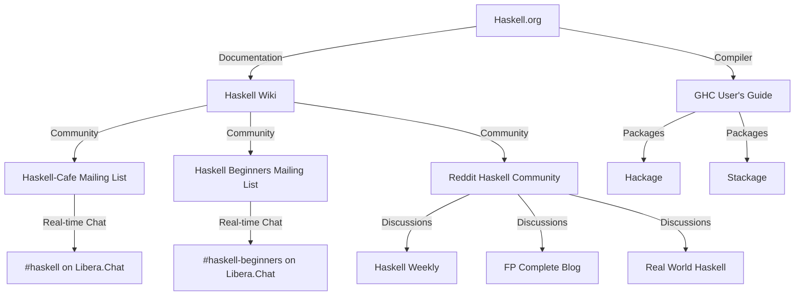

## 24.5 Online Resources and Haskell Communities

As an expert software engineer or architect delving into Haskell, it's crucial to leverage the wealth of knowledge and support available through various online resources and communities. This section will guide you through the most valuable forums, mailing lists, IRC channels, websites, and references that can enhance your Haskell expertise.

### 1. Haskell Communities

#### 1.1 Forums and Mailing Lists

**Haskell-Cafe Mailing List**  
The Haskell-Cafe mailing list is a vibrant community where developers discuss a wide range of topics related to Haskell. It's an excellent place to ask questions, share insights, and stay updated on the latest developments in the Haskell ecosystem. You can subscribe to the mailing list [here](https://mail.haskell.org/mailman/listinfo/haskell-cafe).

**Haskell Beginners Mailing List**  
For those new to Haskell or looking to solidify their foundational knowledge, the Haskell Beginners mailing list is a supportive environment. It focuses on helping newcomers with questions and challenges they encounter. Subscribe [here](https://mail.haskell.org/mailman/listinfo/beginners).

**Haskell Reddit Community**  
The [Haskell subreddit](https://www.reddit.com/r/haskell/) is a popular forum for Haskell enthusiasts. It features discussions on a wide range of topics, from beginner questions to advanced functional programming techniques. The community is active and welcoming, making it a great place to engage with fellow Haskell developers.

#### 1.2 IRC Channels

**#haskell on Libera.Chat**  
The #haskell IRC channel on Libera.Chat is a real-time chat room where you can interact with Haskell developers from around the world. It's a great place to get quick answers to your questions, share your projects, and learn from others. You can join the channel using an IRC client or through a web interface [here](https://web.libera.chat/#haskell).

**#haskell-beginners on Libera.Chat**  
For those new to Haskell, the #haskell-beginners IRC channel provides a friendly environment to ask questions and learn from more experienced developers. It's a supportive community that encourages learning and exploration.

### 2. Haskell Websites

#### 2.1 Official Documentation

**Haskell.org**  
The official Haskell website, [Haskell.org](https://www.haskell.org/), is the primary source for official documentation, tutorials, and resources. It provides comprehensive information on the Haskell language, libraries, and tools. The site is regularly updated and serves as a central hub for Haskell developers.

**GHC User's Guide**  
The Glasgow Haskell Compiler (GHC) is the most widely used Haskell compiler. The [GHC User's Guide](https://downloads.haskell.org/~ghc/latest/docs/html/users_guide/) offers detailed documentation on GHC's features, extensions, and usage. It's an essential resource for understanding the intricacies of the Haskell language and its implementation.

#### 2.2 Blogs and Tutorials

**Haskell Weekly**  
[Haskell Weekly](https://haskellweekly.news/) is a newsletter that curates the latest news, articles, and tutorials from the Haskell community. It's an excellent way to stay informed about new developments, best practices, and interesting projects in the Haskell ecosystem.

**FP Complete Blog**  
The [FP Complete Blog](https://www.fpcomplete.com/blog/) features articles on Haskell and functional programming. It covers a wide range of topics, from beginner tutorials to advanced techniques, and is a valuable resource for expanding your Haskell knowledge.

**Real World Haskell**  
[Real World Haskell](http://book.realworldhaskell.org/) is an online book that provides a practical introduction to Haskell. It covers real-world applications and includes numerous examples and exercises to reinforce learning. The book is freely available online and is highly recommended for developers looking to apply Haskell in practical scenarios.

### 3. Haskell References

#### 3.1 Haskell Wiki

The [Haskell Wiki](https://wiki.haskell.org/) is a collaborative platform where developers can share knowledge, tips, and best practices. It contains a wealth of information on Haskell libraries, tools, and techniques, making it an invaluable resource for both beginners and experienced developers.

#### 3.2 Hackage

[Hackage](https://hackage.haskell.org/) is the Haskell community's central package archive. It hosts a vast collection of Haskell libraries and applications, making it easy to find and install packages for your projects. Hackage is an essential resource for discovering new libraries and staying up-to-date with the latest releases.

#### 3.3 Stackage

[Stackage](https://www.stackage.org/) is a curated collection of Haskell packages that are tested and guaranteed to work together. It provides a stable and reliable set of packages for building Haskell applications, making it a popular choice for developers who prioritize stability and compatibility.

### 4. Visualizing Haskell Community Interactions

To better understand how these resources and communities interact, let's visualize the connections between them using a Mermaid.js diagram.

**Diagram Description:** This diagram illustrates the relationships between various Haskell resources and communities. It shows how official documentation, community forums, and package repositories are interconnected, providing a comprehensive support network for Haskell developers.

### 5. Knowledge Check

To reinforce your understanding of the Haskell resources and communities, consider the following questions:

- What is the primary purpose of the Haskell-Cafe mailing list?
- How can you access the #haskell IRC channel on Libera.Chat?
- What type of content does Haskell Weekly provide?
- How does Stackage ensure package compatibility?
- What is the role of the Haskell Wiki in the community?

### 6. Embrace the Journey

Remember, exploring these resources and engaging with the Haskell community is just the beginning of your journey. As you delve deeper into Haskell, you'll discover new tools, techniques, and best practices that will enhance your skills and broaden your understanding of functional programming. Keep experimenting, stay curious, and enjoy the journey!

### 7. Quiz: Online Resources and Haskell Communities



### What is the primary purpose of the Haskell-Cafe mailing list?

- [x] To discuss a wide range of topics related to Haskell
- [ ] To provide official documentation for Haskell
- [ ] To host Haskell packages
- [ ] To offer real-time chat support

> **Explanation:** The Haskell-Cafe mailing list is a platform for discussing various topics related to Haskell.

### How can you access the #haskell IRC channel on Libera.Chat?

- [x] Using an IRC client or through a web interface
- [ ] By subscribing to a mailing list
- [ ] By visiting the Haskell Wiki
- [ ] Through the Haskell.org website

> **Explanation:** The #haskell IRC channel can be accessed using an IRC client or through a web interface.

### What type of content does Haskell Weekly provide?

- [x] Curated news, articles, and tutorials from the Haskell community
- [ ] Official Haskell documentation
- [ ] Real-time chat support
- [ ] Package management tools

> **Explanation:** Haskell Weekly provides curated news, articles, and tutorials from the Haskell community.

### How does Stackage ensure package compatibility?

- [x] By curating a collection of packages that are tested and guaranteed to work together
- [ ] By hosting all available Haskell packages
- [ ] By providing real-time chat support
- [ ] By offering official documentation

> **Explanation:** Stackage curates a collection of packages that are tested and guaranteed to work together.

### What is the role of the Haskell Wiki in the community?

- [x] To share knowledge, tips, and best practices
- [ ] To provide real-time chat support
- [ ] To host Haskell packages
- [ ] To offer official documentation

> **Explanation:** The Haskell Wiki is a collaborative platform for sharing knowledge, tips, and best practices.

### Which resource is the primary source for official Haskell documentation?

- [x] Haskell.org
- [ ] Haskell Wiki
- [ ] Hackage
- [ ] Stackage

> **Explanation:** Haskell.org is the primary source for official Haskell documentation.

### Where can you find a curated collection of Haskell packages?

- [x] Stackage
- [ ] Haskell Wiki
- [ ] Haskell-Cafe Mailing List
- [ ] Reddit Haskell Community

> **Explanation:** Stackage provides a curated collection of Haskell packages.

### What is the focus of the Haskell Beginners mailing list?

- [x] Helping newcomers with questions and challenges
- [ ] Discussing advanced Haskell topics
- [ ] Providing real-time chat support
- [ ] Hosting Haskell packages

> **Explanation:** The Haskell Beginners mailing list focuses on helping newcomers with questions and challenges.

### Which resource offers a practical introduction to Haskell through an online book?

- [x] Real World Haskell
- [ ] Haskell Weekly
- [ ] FP Complete Blog
- [ ] Haskell.org

> **Explanation:** Real World Haskell offers a practical introduction to Haskell through an online book.

### True or False: The #haskell-beginners IRC channel is for advanced Haskell developers.

- [ ] True
- [x] False

> **Explanation:** The #haskell-beginners IRC channel is for newcomers to Haskell, not advanced developers.



By engaging with these resources and communities, you'll be well-equipped to master Haskell and contribute to its vibrant ecosystem.
