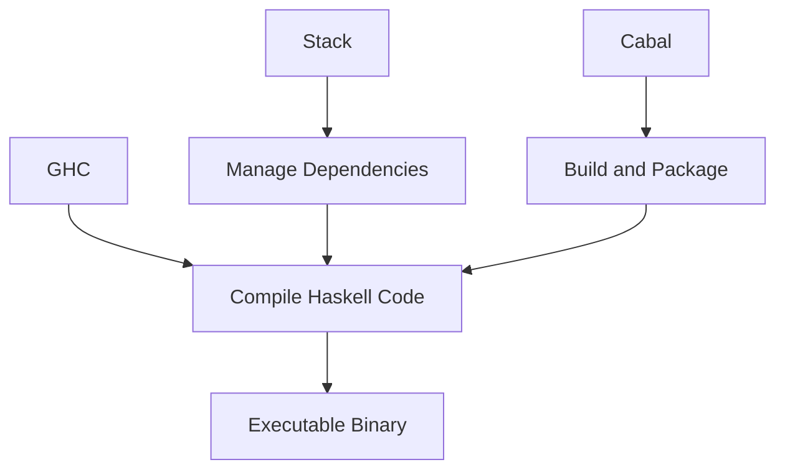

## 24.7 Installation and Setup Guides

Welcome to the comprehensive guide on installing and setting up Haskell development environments across different platforms. Whether you're using Windows, macOS, or Linux, this guide will walk you through the installation of essential Haskell tools: GHC, Stack, and Cabal. These tools are fundamental for building scalable and efficient Haskell applications.

### Introduction to Haskell Tools

Before diving into the installation process, let's briefly introduce the key tools you'll be working with:

- **GHC (Glasgow Haskell Compiler)**: The primary compiler for Haskell, known for its performance and extensive feature set.
- **Stack**: A project management tool for Haskell that simplifies dependency management and builds.
- **Cabal**: A system for building and packaging Haskell libraries and programs.

Each of these tools plays a crucial role in the Haskell ecosystem, and understanding their functions will enhance your development workflow.

### Installing Haskell on Windows

#### Step 1: Install GHC

1. **Download the Haskell Platform**: Visit the [Haskell Platform website](https://www.haskell.org/platform/) and download the installer for Windows. The Haskell Platform includes GHC, Cabal, and other essential tools.
   
2. **Run the Installer**: Execute the downloaded installer and follow the on-screen instructions. Ensure that you select the option to add Haskell to your system's PATH.

3. **Verify Installation**: Open a Command Prompt and type `ghc --version` to verify that GHC is installed correctly.

```shell
C:\> ghc --version
The Glorious Glasgow Haskell Compilation System, version X.Y.Z
```

#### Step 2: Install Stack

1. **Download Stack**: Visit the [Stack website](https://docs.haskellstack.org/en/stable/README/) and download the Windows installer.

2. **Run the Installer**: Follow the installation instructions. Stack will automatically configure GHC for you.

3. **Verify Installation**: Open a Command Prompt and type `stack --version`.

```shell
C:\> stack --version
Version X.Y.Z
```

#### Step 3: Install Cabal

1. **Install via GHC**: Cabal is typically included with GHC. If not, you can install it using Stack.

2. **Verify Installation**: Type `cabal --version` in the Command Prompt.

```shell
C:\> cabal --version
cabal-install version X.Y.Z
```

### Installing Haskell on macOS

#### Step 1: Install GHC

1. **Use Homebrew**: Open Terminal and install GHC using Homebrew, a popular package manager for macOS.

```shell
$ brew install ghc
```

2. **Verify Installation**: Check the installation by typing `ghc --version`.

```shell
$ ghc --version
The Glorious Glasgow Haskell Compilation System, version X.Y.Z
```

#### Step 2: Install Stack

1. **Install via Homebrew**: Use Homebrew to install Stack.

```shell
$ brew install haskell-stack
```

2. **Verify Installation**: Confirm the installation by typing `stack --version`.

```shell
$ stack --version
Version X.Y.Z
```

#### Step 3: Install Cabal

1. **Install via Homebrew**: Use Homebrew to install Cabal.

```shell
$ brew install cabal-install
```

2. **Verify Installation**: Check the installation by typing `cabal --version`.

```shell
$ cabal --version
cabal-install version X.Y.Z
```

### Installing Haskell on Linux

#### Step 1: Install GHC

1. **Use Package Manager**: Depending on your distribution, use the appropriate package manager.

   - **Ubuntu/Debian**: 
     ```shell
     $ sudo apt-get update
     $ sudo apt-get install ghc
     ```

   - **Fedora**:
     ```shell
     $ sudo dnf install ghc
     ```

2. **Verify Installation**: Check the installation by typing `ghc --version`.

```shell
$ ghc --version
The Glorious Glasgow Haskell Compilation System, version X.Y.Z
```

#### Step 2: Install Stack

1. **Download Stack Script**: Use the official script to install Stack.

```shell
$ curl -sSL https://get.haskellstack.org/ | sh
```

2. **Verify Installation**: Confirm the installation by typing `stack --version`.

```shell
$ stack --version
Version X.Y.Z
```

#### Step 3: Install Cabal

1. **Use Package Manager**: Install Cabal using your package manager.

   - **Ubuntu/Debian**:
     ```shell
     $ sudo apt-get install cabal-install
     ```

   - **Fedora**:
     ```shell
     $ sudo dnf install cabal-install
     ```

2. **Verify Installation**: Check the installation by typing `cabal --version`.

```shell
$ cabal --version
cabal-install version X.Y.Z
```

### Setting Up Your Haskell Development Environment

Now that you have installed GHC, Stack, and Cabal, let's set up your development environment.

#### Configuring Stack

1. **Initialize a New Project**: Use Stack to create a new Haskell project.

```shell
$ stack new my-project
$ cd my-project
```

2. **Build the Project**: Compile your project using Stack.

```shell
$ stack build
```

3. **Run the Project**: Execute your Haskell application.

```shell
$ stack exec my-project-exe
```

#### Configuring Cabal

1. **Create a New Project**: Use Cabal to initialize a new project.

```shell
$ cabal init
```

2. **Build the Project**: Compile your project using Cabal.

```shell
$ cabal build
```

3. **Run the Project**: Execute your Haskell application.

```shell
$ cabal run
```

### Visualizing the Haskell Toolchain

To better understand how these tools interact, let's visualize the Haskell toolchain using a Mermaid diagram.



**Diagram Description**: This diagram illustrates the interaction between GHC, Stack, and Cabal. GHC compiles Haskell code into executable binaries. Stack manages dependencies and integrates with GHC for building projects. Cabal builds and packages Haskell libraries and applications, also leveraging GHC for compilation.

### Try It Yourself

Now that you have a basic setup, try modifying the generated Haskell project. Add new modules, experiment with different libraries, and explore the Haskell ecosystem. Remember, the best way to learn is by doing!

### Knowledge Check

- What are the primary tools used in Haskell development?
- How do you verify the installation of GHC on your system?
- What command initializes a new Stack project?
- How does Cabal differ from Stack in terms of project management?

### Embrace the Journey

Remember, setting up your Haskell environment is just the beginning. As you progress, you'll explore more complex patterns and build sophisticated applications. Keep experimenting, stay curious, and enjoy the journey!

### References and Further Reading

- [Haskell Platform](https://www.haskell.org/platform/)
- [Stack Documentation](https://docs.haskellstack.org/en/stable/README/)
- [Cabal User Guide](https://www.haskell.org/cabal/users-guide/)

## Quiz: Installation and Setup Guides



### What is the primary compiler for Haskell?

- [x] GHC
- [ ] GCC
- [ ] LLVM
- [ ] Clang

> **Explanation:** GHC, or Glasgow Haskell Compiler, is the primary compiler for Haskell.

### Which tool is used for managing Haskell project dependencies?

- [x] Stack
- [ ] Make
- [ ] Ant
- [ ] Maven

> **Explanation:** Stack is used for managing dependencies and building Haskell projects.

### How can you install GHC on macOS?

- [x] Using Homebrew
- [ ] Using apt-get
- [ ] Using yum
- [ ] Using pacman

> **Explanation:** Homebrew is a popular package manager for macOS, used to install GHC.

### What command verifies the installation of Stack?

- [x] stack --version
- [ ] stack --check
- [ ] stack --info
- [ ] stack --validate

> **Explanation:** The command `stack --version` checks the installed version of Stack.

### Which command initializes a new Cabal project?

- [x] cabal init
- [ ] cabal start
- [ ] cabal new
- [ ] cabal create

> **Explanation:** `cabal init` is used to initialize a new Cabal project.

### What is the role of Cabal in Haskell development?

- [x] Building and packaging Haskell libraries and programs
- [ ] Compiling C programs
- [ ] Managing Java dependencies
- [ ] Running Python scripts

> **Explanation:** Cabal is used for building and packaging Haskell libraries and programs.

### Which tool integrates with GHC for building projects?

- [x] Stack
- [ ] Maven
- [ ] Gradle
- [ ] Ant

> **Explanation:** Stack integrates with GHC to manage dependencies and build Haskell projects.

### How do you install Stack on Linux?

- [x] Using the official Stack script
- [ ] Using apt-get only
- [ ] Using yum only
- [ ] Using pacman only

> **Explanation:** The official Stack script can be used to install Stack on Linux.

### What command is used to build a project with Stack?

- [x] stack build
- [ ] stack compile
- [ ] stack make
- [ ] stack run

> **Explanation:** `stack build` is used to compile a Haskell project with Stack.

### True or False: Cabal and Stack can both be used to manage Haskell project dependencies.

- [x] True
- [ ] False

> **Explanation:** Both Cabal and Stack can manage dependencies, but they have different approaches and features.


