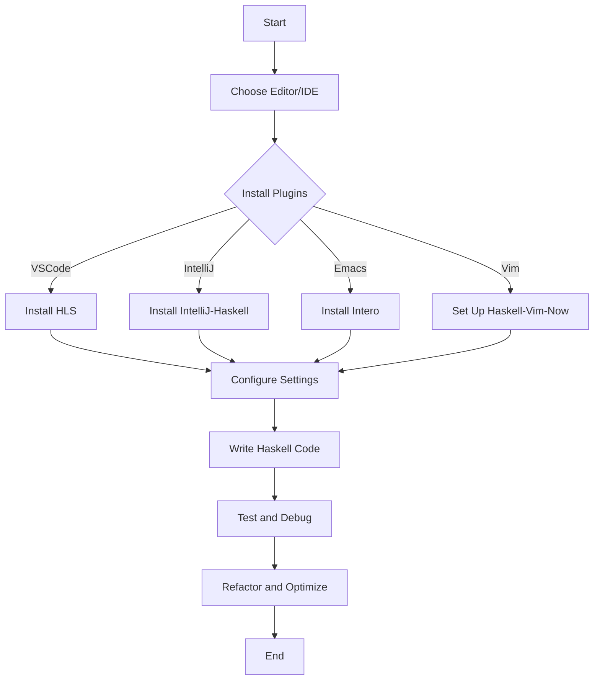

## 24.8 Additional Tools and IDE Support

As expert software engineers and architects, having the right tools and integrated development environments (IDEs) is crucial for efficient Haskell development. In this section, we will explore various editors, IDEs, plugins, and configurations that can enhance your Haskell programming experience. We will also provide code examples, diagrams, and exercises to help you get the most out of these tools.

### Editors and IDEs

#### Visual Studio Code (VSCode)

**Visual Studio Code** is a popular, lightweight editor that offers robust support for Haskell development through extensions. It is highly customizable and supports a wide range of plugins to enhance productivity.

- **Haskell Language Server (HLS)**: This extension provides features like code completion, linting, and type information. It integrates seamlessly with VSCode to offer a smooth Haskell development experience.

```json
// Example VSCode settings for Haskell
{
    "haskell.formattingProvider": "ormolu",
    "haskell.checkProject": true,
    "haskell.trace.server": "verbose"
}
```

- **Key Features**:
  - Syntax highlighting
  - Code navigation
  - Integrated terminal
  - Debugging support

**Try It Yourself**: Install the Haskell Language Server extension in VSCode and explore its features by opening a Haskell project. Experiment with code completion and linting.

#### IntelliJ IDEA

**IntelliJ IDEA** is a powerful IDE known for its comprehensive support for various programming languages, including Haskell. With the IntelliJ-Haskell plugin, you can leverage its advanced features for Haskell development.

- **IntelliJ-Haskell Plugin**: This plugin provides support for Haskell projects, including syntax highlighting, code completion, and error detection.

```xml
<!-- Example IntelliJ configuration for Haskell -->
<component name="Haskell">
    <option name="Haskell SDK" value="GHC 8.10.4" />
    <option name="Enable HLint" value="true" />
</component>
```

- **Key Features**:
  - Advanced code refactoring
  - Version control integration
  - Built-in terminal
  - Extensive plugin ecosystem

**Try It Yourself**: Install the IntelliJ-Haskell plugin and create a new Haskell project. Explore the refactoring tools and version control integration.

#### Emacs

**Emacs** is a highly extensible text editor that can be configured for Haskell development using various packages. It is favored by many developers for its powerful customization capabilities.

- **Intero**: A popular package for Haskell development in Emacs, providing features like type checking, code completion, and REPL integration.

```lisp
;; Example Emacs configuration for Haskell
(use-package intero
  :ensure t
  :hook (haskell-mode . intero-mode))
```

- **Key Features**:
  - Customizable key bindings
  - Powerful text manipulation
  - Integrated REPL
  - Extensive package repository

**Try It Yourself**: Install the Intero package in Emacs and open a Haskell file. Experiment with the REPL and type checking features.

#### Vim

**Vim** is a highly efficient text editor that can be configured for Haskell development with the right plugins. It is known for its speed and keyboard-centric interface.

- **Haskell-Vim-Now**: A curated set of Vim plugins and configurations for Haskell development, providing features like syntax highlighting and code navigation.

```vim
" Example Vim configuration for Haskell
let g:haskell_enable_quantification = 1
let g:haskell_enable_recursivedo = 1
```

- **Key Features**:
  - Fast and lightweight
  - Extensive plugin support
  - Customizable through Vimscript
  - Efficient keyboard shortcuts

**Try It Yourself**: Set up Haskell-Vim-Now and open a Haskell file in Vim. Explore the syntax highlighting and navigation features.

### Plugins

#### Haskell Language Server (HLS)

The **Haskell Language Server** is a crucial tool for enhancing Haskell development across various editors. It provides features like code completion, linting, and type information.

- **Installation**: HLS can be installed using `ghcup`, a tool for managing Haskell installations.

```bash
# Install Haskell Language Server using ghcup
ghcup install hls
```

- **Configuration**: Configure your editor to use HLS for a seamless development experience.

**Try It Yourself**: Install HLS and configure it with your preferred editor. Test its features by writing and refactoring Haskell code.

#### HLint

**HLint** is a linter for Haskell that suggests improvements to your code. It is a valuable tool for maintaining code quality and consistency.

- **Installation**: HLint can be installed using `cabal` or `stack`.

```bash
# Install HLint using cabal
cabal update
cabal install hlint
```

- **Usage**: Run HLint on your Haskell files to receive suggestions for improvements.

```bash
# Run HLint on a Haskell file
hlint MyHaskellFile.hs
```

**Try It Yourself**: Install HLint and run it on a Haskell project. Review the suggestions and apply improvements to your code.

### Configuration

Setting up a development environment for Haskell involves configuring your editor or IDE, installing necessary tools, and managing dependencies.

#### Setting Up VSCode for Haskell

1. **Install VSCode**: Download and install Visual Studio Code from the [official website](https://code.visualstudio.com/).
2. **Install Haskell Language Server**: Use the Extensions Marketplace to install the Haskell Language Server extension.
3. **Configure Settings**: Customize your settings for optimal Haskell development.

```json
// Example VSCode settings for Haskell
{
    "haskell.formattingProvider": "fourmolu",
    "haskell.checkProject": true,
    "editor.formatOnSave": true
}
```

#### Setting Up IntelliJ IDEA for Haskell

1. **Install IntelliJ IDEA**: Download and install IntelliJ IDEA from the [JetBrains website](https://www.jetbrains.com/idea/).
2. **Install IntelliJ-Haskell Plugin**: Use the Plugin Marketplace to install the IntelliJ-Haskell plugin.
3. **Configure SDK**: Set up the Haskell SDK in IntelliJ for your project.

```xml
<!-- Example IntelliJ configuration for Haskell -->
<component name="Haskell">
    <option name="Haskell SDK" value="GHC 9.0.1" />
    <option name="Enable HLint" value="true" />
</component>
```

#### Setting Up Emacs for Haskell

1. **Install Emacs**: Download and install Emacs from the [GNU website](https://www.gnu.org/software/emacs/).
2. **Install Intero**: Use the Emacs package manager to install Intero.

```lisp
;; Example Emacs configuration for Haskell
(use-package intero
  :ensure t
  :hook (haskell-mode . intero-mode))
```

3. **Customize Key Bindings**: Configure key bindings for efficient Haskell development.

#### Setting Up Vim for Haskell

1. **Install Vim**: Download and install Vim from the [official website](https://www.vim.org/).
2. **Set Up Haskell-Vim-Now**: Follow the instructions on the [Haskell-Vim-Now GitHub page](https://github.com/begriffs/haskell-vim-now) to set up your environment.

```vim
" Example Vim configuration for Haskell
let g:haskell_enable_quantification = 1
let g:haskell_enable_recursivedo = 1
```

3. **Customize Plugins**: Add additional plugins for enhanced functionality.

### Visualizing the Development Workflow

To better understand the Haskell development workflow with these tools, let's visualize the process using a flowchart.



**Description**: This flowchart illustrates the typical workflow for setting up a Haskell development environment, from choosing an editor or IDE to writing, testing, and optimizing Haskell code.

### References and Links

- [Visual Studio Code](https://code.visualstudio.com/)
- [JetBrains IntelliJ IDEA](https://www.jetbrains.com/idea/)
- [GNU Emacs](https://www.gnu.org/software/emacs/)
- [Vim](https://www.vim.org/)
- [Haskell Language Server](https://github.com/haskell/haskell-language-server)
- [HLint](https://github.com/ndmitchell/hlint)

### Knowledge Check

- **Question**: What are the key features of the Haskell Language Server?
- **Exercise**: Set up a Haskell development environment using your preferred editor or IDE and write a simple Haskell program.

### Embrace the Journey

Remember, setting up your development environment is just the beginning. As you progress, you'll discover new tools and configurations that can further enhance your Haskell programming experience. Keep experimenting, stay curious, and enjoy the journey!

## Quiz: Additional Tools and IDE Support



### Which editor is known for its lightweight and extensible nature, popular among Haskell developers?

- [x] Visual Studio Code
- [ ] IntelliJ IDEA
- [ ] Emacs
- [ ] Vim

> **Explanation:** Visual Studio Code is a lightweight and extensible editor popular among Haskell developers due to its robust plugin support.

### What is the primary purpose of the Haskell Language Server?

- [x] To provide code completion, linting, and type information
- [ ] To compile Haskell code
- [ ] To manage Haskell project dependencies
- [ ] To provide a graphical user interface for Haskell

> **Explanation:** The Haskell Language Server provides features like code completion, linting, and type information to enhance the Haskell development experience.

### Which plugin is recommended for Haskell development in Emacs?

- [x] Intero
- [ ] HLint
- [ ] IntelliJ-Haskell
- [ ] Haskell-Vim-Now

> **Explanation:** Intero is a popular package for Haskell development in Emacs, providing features like type checking and REPL integration.

### What is a key feature of IntelliJ IDEA for Haskell development?

- [x] Advanced code refactoring
- [ ] Lightweight and fast
- [ ] Keyboard-centric interface
- [ ] Minimalistic design

> **Explanation:** IntelliJ IDEA is known for its advanced code refactoring capabilities, which are beneficial for Haskell development.

### Which tool is used to suggest improvements to Haskell code?

- [x] HLint
- [ ] Haskell Language Server
- [ ] Intero
- [ ] Haskell-Vim-Now

> **Explanation:** HLint is a linter for Haskell that suggests improvements to code, helping maintain quality and consistency.

### What is the primary benefit of using Vim for Haskell development?

- [x] Fast and lightweight
- [ ] Advanced graphical user interface
- [ ] Built-in version control
- [ ] Extensive debugging tools

> **Explanation:** Vim is known for being fast and lightweight, making it a popular choice for efficient text editing.

### Which configuration tool is used to manage Haskell installations?

- [x] ghcup
- [ ] cabal
- [ ] stack
- [ ] HLint

> **Explanation:** ghcup is a tool used to manage Haskell installations, including the Haskell Language Server.

### What is a common feature shared by most Haskell development tools?

- [x] Syntax highlighting
- [ ] Graphical user interface
- [ ] Built-in web server
- [ ] Cloud integration

> **Explanation:** Syntax highlighting is a common feature shared by most Haskell development tools, aiding in code readability.

### Which editor is known for its powerful customization capabilities?

- [x] Emacs
- [ ] Visual Studio Code
- [ ] IntelliJ IDEA
- [ ] Vim

> **Explanation:** Emacs is known for its powerful customization capabilities, allowing developers to tailor their environment extensively.

### True or False: Haskell-Vim-Now is a curated set of Vim plugins for Haskell development.

- [x] True
- [ ] False

> **Explanation:** Haskell-Vim-Now is indeed a curated set of Vim plugins and configurations specifically for Haskell development.


