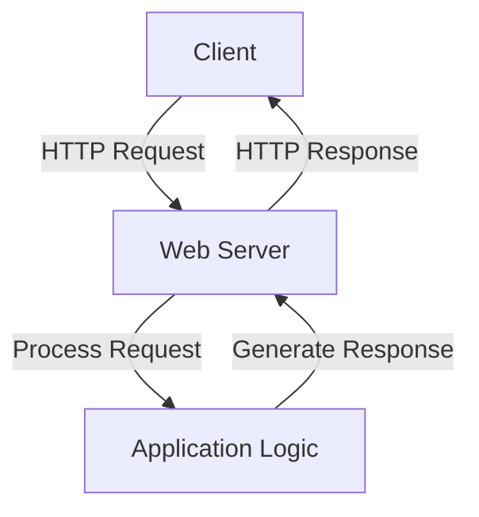

## 24.9 Sample Projects and Tutorials

Welcome to the "Sample Projects and Tutorials" section of our comprehensive guide on Haskell design patterns. This section is designed to provide you with practical, hands-on experience in applying the concepts and patterns discussed throughout the guide. By working through these projects and tutorials, you'll gain a deeper understanding of how to leverage Haskell's unique features to build robust, scalable, and maintainable software systems.

### Learning by Example

In this section, we will explore several sample projects that demonstrate the application of advanced Haskell design patterns. Each project is accompanied by a detailed tutorial that guides you through the implementation process, highlighting key concepts and best practices along the way.

#### Project 1: Building a Simple Web Server with Warp

**Objective**: Learn how to build a simple web server using the Warp library, a fast and lightweight web server for Haskell.

**Key Concepts**:
- Understanding the Warp library and its role in web development.
- Implementing a basic HTTP server.
- Handling requests and responses.

**Tutorial**:

1. **Setting Up the Environment**:
   - Install the Warp library using Cabal or Stack.
   - Set up a new Haskell project.

2. **Creating the Server**:
   - Import necessary modules:
     ```haskell
     import Network.Wai
     import Network.Wai.Handler.Warp
     import Network.HTTP.Types (status200)
     import Data.ByteString.Lazy.Char8 as L8
     ```

   - Define a simple application:
     ```haskell
     app :: Application
     app request respond = respond $ responseLBS
       status200
       [("Content-Type", "text/plain")]
       "Hello, World!"
     ```

   - Run the server:
     ```haskell
     main :: IO ()
     main = run 8080 app
     ```

3. **Testing the Server**:
   - Start the server and access `http://localhost:8080` in your browser.
   - Observe the "Hello, World!" message.

4. **Extending Functionality**:
   - Add routing to handle different endpoints.
   - Implement middleware for logging and error handling.

**Try It Yourself**: Modify the server to return JSON responses and handle POST requests.

#### Project 2: Implementing a Todo List Application with Servant

**Objective**: Build a RESTful API for a Todo list application using the Servant library.

**Key Concepts**:
- Designing RESTful APIs with Servant.
- Using type-safe routing and request handling.
- Integrating with a database for persistent storage.

**Tutorial**:

1. **Setting Up the Environment**:
   - Install the Servant library and its dependencies.
   - Create a new Haskell project.

2. **Defining the API**:
   - Define the API type using Servant's combinators:
     ```haskell
     type TodoAPI = "todos" :> Get '[JSON] [Todo]
               :<|> "todos" :> ReqBody '[JSON] Todo :> Post '[JSON] Todo
     ```

   - Create data types for Todo items:
     ```haskell
     data Todo = Todo
       { id :: Int
       , title :: String
       , completed :: Bool
       } deriving (Eq, Show, Generic)

     instance ToJSON Todo
     instance FromJSON Todo
     ```

3. **Implementing the Server**:
   - Define handlers for the API endpoints:
     ```haskell
     server :: Server TodoAPI
     server = getTodos :<|> createTodo

     getTodos :: Handler [Todo]
     getTodos = return [Todo 1 "Learn Haskell" False]

     createTodo :: Todo -> Handler Todo
     createTodo todo = return todo
     ```

   - Run the server using Servant's `serve` function:
     ```haskell
     main :: IO ()
     main = run 8080 (serve (Proxy :: Proxy TodoAPI) server)
     ```

4. **Testing the API**:
   - Use a tool like Postman to test the API endpoints.
   - Verify that you can retrieve and create Todo items.

5. **Extending Functionality**:
   - Add endpoints for updating and deleting Todo items.
   - Connect to a database for persistent storage.

**Try It Yourself**: Implement authentication and authorization for the API.

#### Project 3: Creating a Real-Time Chat Application with WebSockets

**Objective**: Develop a real-time chat application using WebSockets for bidirectional communication.

**Key Concepts**:
- Understanding WebSockets and their use cases.
- Implementing a WebSocket server in Haskell.
- Managing concurrent connections and message broadcasting.

**Tutorial**:

1. **Setting Up the Environment**:
   - Install the `websockets` library.
   - Create a new Haskell project.

2. **Creating the WebSocket Server**:
   - Import necessary modules:
     ```haskell
     import Network.WebSockets
     import Control.Concurrent (MVar, newMVar, modifyMVar_, readMVar)
     import Control.Monad (forM_, forever)
     ```

   - Define a data structure to hold connected clients:
     ```haskell
     type Client = (Connection, String)
     type ServerState = [Client]

     newServerState :: ServerState
     newServerState = []
     ```

   - Implement the server logic:
     ```haskell
     main :: IO ()
     main = do
       state <- newMVar newServerState
       runServer "127.0.0.1" 9160 $ application state

     application :: MVar ServerState -> ServerApp
     application state pending = do
       conn <- acceptRequest pending
       client <- newClient conn
       modifyMVar_ state $ \s -> return (client : s)
       talk conn state client
     ```

3. **Handling Client Communication**:
   - Implement the `talk` function to handle messages:
     ```haskell
     talk :: Connection -> MVar ServerState -> Client -> IO ()
     talk conn state client = forever $ do
       msg <- receiveData conn
       broadcast state client msg
     ```

   - Implement the `broadcast` function to send messages to all clients:
     ```haskell
     broadcast :: MVar ServerState -> Client -> Text -> IO ()
     broadcast state (conn, name) msg = do
       clients <- readMVar state
       forM_ clients $ \\(conn', _) -> sendTextData conn' (name <> ": " <> msg)
     ```

4. **Testing the Chat Application**:
   - Connect multiple clients using a WebSocket client tool.
   - Send messages and observe real-time broadcasting.

5. **Extending Functionality**:
   - Add user authentication and private messaging.
   - Implement message history and persistence.

**Try It Yourself**: Enhance the chat application with a web-based frontend using HTML and JavaScript.

### Tutorials

In addition to the sample projects, we provide step-by-step tutorials that cover various aspects of Haskell programming and design patterns. These tutorials are designed to help you build a strong foundation in Haskell and apply advanced concepts effectively.

#### Tutorial 1: Understanding Monads and Monad Transformers

**Objective**: Gain a deep understanding of monads and monad transformers, and learn how to use them effectively in Haskell.

**Key Concepts**:
- Understanding the Monad type class and its laws.
- Using common monads like Maybe, Either, and IO.
- Combining monads with monad transformers.

**Tutorial**:

1. **Introduction to Monads**:
   - Define the Monad type class:
     ```haskell
     class Applicative m => Monad m where
       (>>=) :: m a -> (a -> m b) -> m b
       return :: a -> m a
     ```

   - Explain the Monad laws: left identity, right identity, and associativity.

2. **Working with Common Monads**:
   - Demonstrate the use of the Maybe monad for handling optional values:
     ```haskell
     safeDivide :: Double -> Double -> Maybe Double
     safeDivide _ 0 = Nothing
     safeDivide x y = Just (x / y)
     ```

   - Use the Either monad for error handling:
     ```haskell
     divide :: Double -> Double -> Either String Double
     divide _ 0 = Left "Division by zero"
     divide x y = Right (x / y)
     ```

3. **Monad Transformers**:
   - Introduce the concept of monad transformers and their purpose.
   - Use the MaybeT transformer to combine Maybe with IO:
     ```haskell
     import Control.Monad.Trans.Maybe
     import Control.Monad.IO.Class

     getLineMaybe :: MaybeT IO String
     getLineMaybe = MaybeT $ do
       line <- getLine
       return $ if null line then Nothing else Just line
     ```

4. **Practical Applications**:
   - Implement a simple command-line application using monad transformers.
   - Demonstrate how to handle multiple effects in a clean and modular way.

**Try It Yourself**: Create a monadic parser using the State monad and monad transformers.

#### Tutorial 2: Building a Functional Reactive Programming (FRP) Application

**Objective**: Learn how to build an interactive application using Functional Reactive Programming (FRP) in Haskell.

**Key Concepts**:
- Understanding the principles of FRP.
- Using the Reflex library for FRP in Haskell.
- Building dynamic and interactive user interfaces.

**Tutorial**:

1. **Introduction to FRP**:
   - Explain the core concepts of FRP, including signals and events.
   - Discuss the benefits of using FRP for building interactive applications.

2. **Setting Up the Environment**:
   - Install the Reflex library and its dependencies.
   - Create a new Haskell project.

3. **Building a Simple FRP Application**:
   - Define a basic Reflex application:
     ```haskell
     import Reflex.Dom

     main :: IO ()
     main = mainWidget $ do
       el "h1" $ text "Hello, Reflex!"
       el "p" $ text "This is a simple FRP application."
     ```

   - Add interactivity using dynamic elements and events:
     ```haskell
     el "div" $ do
       t <- inputElement def
       dynText $ _inputElement_value t
     ```

4. **Advanced FRP Concepts**:
   - Use combinators to manage complex event streams.
   - Implement a simple counter application with buttons to increment and decrement the count.

5. **Testing and Deployment**:
   - Test the application in a web browser.
   - Deploy the application using GHCJS for client-side execution.

**Try It Yourself**: Extend the application to include a real-time chat feature using WebSockets.

### Sources

To further enhance your learning experience, we recommend exploring the following sources:

- **GitHub Repositories**: Browse open-source Haskell projects on GitHub to see real-world applications of design patterns.
- **Online Courses**: Enroll in online courses that cover advanced Haskell programming and design patterns.
- **Books and Articles**: Read books and articles on functional programming and Haskell design patterns to deepen your understanding.

### Visualizing Haskell Design Patterns

To aid your understanding of Haskell design patterns, we provide visual representations of key concepts using Mermaid.js diagrams. These diagrams illustrate the relationships between different components and the flow of data within a system.

#### Example: Visualizing a Simple Web Server Architecture



**Description**: This diagram illustrates the flow of data in a simple web server architecture. The client sends an HTTP request to the web server, which processes the request using the application logic and generates a response.

### Knowledge Check

To reinforce your learning, we encourage you to complete the following exercises:

1. **Exercise 1**: Modify the Todo list application to include user authentication and authorization.
2. **Exercise 2**: Implement a caching mechanism in the web server to improve performance.
3. **Exercise 3**: Extend the chat application to support private messaging and message history.

### Embrace the Journey

Remember, learning Haskell and mastering design patterns is a journey. As you progress through these projects and tutorials, you'll gain valuable skills that will enable you to build more complex and interactive applications. Keep experimenting, stay curious, and enjoy the journey!

## Quiz: Sample Projects and Tutorials



### What is the primary purpose of the Warp library in Haskell?

- [x] To build fast and lightweight web servers
- [ ] To manage database connections
- [ ] To handle concurrency
- [ ] To perform data serialization

> **Explanation:** The Warp library is used to build fast and lightweight web servers in Haskell.

### Which Haskell library is used for building RESTful APIs with type-safe routing?

- [x] Servant
- [ ] Warp
- [ ] Reflex
- [ ] Aeson

> **Explanation:** Servant is a Haskell library used for building RESTful APIs with type-safe routing.

### What is the role of the `MaybeT` transformer in Haskell?

- [x] To combine the Maybe monad with other monads
- [ ] To handle concurrency
- [ ] To perform data serialization
- [ ] To manage database connections

> **Explanation:** The `MaybeT` transformer is used to combine the Maybe monad with other monads, allowing for handling of optional values in a monadic context.

### In a WebSocket server, what is the purpose of the `broadcast` function?

- [x] To send messages to all connected clients
- [ ] To handle HTTP requests
- [ ] To manage database connections
- [ ] To perform data serialization

> **Explanation:** The `broadcast` function in a WebSocket server is used to send messages to all connected clients.

### What is the main advantage of using Functional Reactive Programming (FRP)?

- [x] Building dynamic and interactive user interfaces
- [ ] Managing database connections
- [ ] Performing data serialization
- [ ] Handling concurrency

> **Explanation:** FRP is primarily used for building dynamic and interactive user interfaces by managing time-varying values and events.

### Which library is used for Functional Reactive Programming in Haskell?

- [x] Reflex
- [ ] Servant
- [ ] Warp
- [ ] Aeson

> **Explanation:** Reflex is a Haskell library used for Functional Reactive Programming (FRP).

### What is the purpose of the `Monad` type class in Haskell?

- [x] To define a standard interface for monadic operations
- [ ] To manage database connections
- [ ] To perform data serialization
- [ ] To handle concurrency

> **Explanation:** The `Monad` type class defines a standard interface for monadic operations, including `>>=` (bind) and `return`.

### What is a key benefit of using the Servant library for API development?

- [x] Type-safe routing and request handling
- [ ] Managing database connections
- [ ] Performing data serialization
- [ ] Handling concurrency

> **Explanation:** Servant provides type-safe routing and request handling, ensuring compile-time safety for API development.

### Which of the following is a common use case for the `Either` monad?

- [x] Error handling
- [ ] Managing database connections
- [ ] Performing data serialization
- [ ] Handling concurrency

> **Explanation:** The `Either` monad is commonly used for error handling, allowing for the representation of success or failure.

### True or False: The Reflex library is used for building web servers in Haskell.

- [ ] True
- [x] False

> **Explanation:** False. The Reflex library is used for Functional Reactive Programming (FRP), not for building web servers.



By engaging with these projects, tutorials, and exercises, you'll gain practical experience and a deeper understanding of Haskell design patterns. Happy coding!


