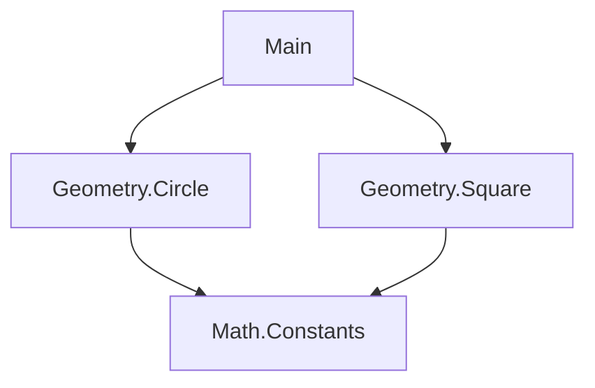

## 3.1 Modules and Namespaces

In Haskell, the module system is a powerful feature that allows developers to organize code into manageable, reusable components. By structuring code into modules, we can control the visibility of functions and types, prevent name clashes, and maintain a clean codebase. This section will delve into the intricacies of Haskell's module system, providing expert guidance on best practices for using modules and namespaces effectively.

### Understanding Haskell Modules

A module in Haskell is a collection of related functions, types, and typeclasses. Modules serve as the building blocks of a Haskell program, enabling developers to encapsulate functionality and expose only the necessary parts to other modules.

#### Creating a Module

To create a module in Haskell, we start by defining a module header at the top of a file. Here's a simple example:

```haskell
module Geometry.Circle (area, circumference) where

-- | Calculate the area of a circle given its radius.
area :: Float -> Float
area radius = pi * radius * radius

-- | Calculate the circumference of a circle given its radius.
circumference :: Float -> Float
circumference radius = 2 * pi * radius
```

In this example, we define a module `Geometry.Circle` that exports two functions: `area` and `circumference`. The `where` keyword indicates the start of the module's implementation.

#### Importing Modules

To use functions or types from another module, we need to import it. Haskell provides several ways to import modules, allowing for fine-grained control over what is imported.

```haskell
import Geometry.Circle (area)

main :: IO ()
main = do
    let r = 5.0
    putStrLn $ "The area of the circle is: " ++ show (area r)
```

In this example, we import only the `area` function from the `Geometry.Circle` module. This selective import helps prevent name clashes and keeps the namespace clean.

#### Qualified Imports

Sometimes, it's beneficial to import a module with a qualified name to avoid conflicts with similarly named functions from other modules.

```haskell
import qualified Geometry.Circle as Circle

main :: IO ()
main = do
    let r = 5.0
    putStrLn $ "The circumference of the circle is: " ++ show (Circle.circumference r)
```

By using `qualified`, we can access the `circumference` function with the prefix `Circle.`, making it clear which module the function belongs to.

### Controlling Visibility with Export Lists

The export list in a module header specifies which functions, types, and typeclasses are accessible to other modules. By default, if no export list is provided, all top-level definitions are exported. However, it's a good practice to explicitly define an export list to control the module's interface.

#### Example of Export List

```haskell
module Geometry.Square (area, perimeter) where

-- | Calculate the area of a square given its side length.
area :: Float -> Float
area side = side * side

-- | Calculate the perimeter of a square given its side length.
perimeter :: Float -> Float
perimeter side = 4 * side

-- Internal function, not exported
diagonal :: Float -> Float
diagonal side = sqrt 2 * side
```

In this example, the `diagonal` function is not included in the export list, making it private to the `Geometry.Square` module.

### Best Practices for Using Modules

#### Organizing Code into Modules

1. **Logical Grouping**: Group related functions and types into a single module. For example, all geometric calculations can be placed under a `Geometry` module.

2. **Modular Design**: Design modules to be independent and reusable. Avoid circular dependencies between modules.

3. **Granularity**: Strike a balance between too many small modules and too few large ones. Each module should have a clear purpose.

#### Preventing Name Clashes

1. **Selective Imports**: Use selective imports to bring only the necessary functions into scope.

2. **Qualified Imports**: Employ qualified imports to distinguish between functions with the same name from different modules.

3. **Unique Naming**: Choose unique and descriptive names for functions and types to minimize the risk of clashes.

#### Maintaining Clean Code Structure

1. **Consistent Naming Conventions**: Follow consistent naming conventions for modules, functions, and types. This enhances readability and maintainability.

2. **Documentation**: Document modules and their exports using Haddock comments. This provides clarity on the module's purpose and usage.

3. **Refactoring**: Regularly refactor modules to improve structure and remove unused code.

### Advanced Module Features

#### Hierarchical Module Names

Haskell supports hierarchical module names, allowing for a structured organization of modules. This is particularly useful for large projects.

```haskell
module Company.Project.ModuleName where
```

Hierarchical names reflect the directory structure of the project, aiding in navigation and organization.

#### Module Re-exports

Modules can re-export functions and types from other modules, providing a unified interface.

```haskell
module Geometry (module Geometry.Circle, module Geometry.Square) where

import Geometry.Circle
import Geometry.Square
```

This technique is useful for creating a facade module that aggregates functionality from several modules.

### Visualizing Module Dependencies

Understanding the dependencies between modules is crucial for maintaining a clean architecture. The following diagram illustrates a simple module dependency graph:



In this diagram, the `Main` module depends on `Geometry.Circle` and `Geometry.Square`, both of which depend on `Math.Constants`.

### Try It Yourself

Experiment with the module system by creating your own modules. Try the following:

1. Create a module for handling basic arithmetic operations.
2. Use selective and qualified imports to use functions from your module.
3. Refactor your code to improve module organization and readability.

### Knowledge Check

- What is the purpose of a module in Haskell?
- How can you prevent name clashes when importing functions from different modules?
- Why is it important to use export lists in modules?

### Summary

In this section, we've explored the Haskell module system, learning how to organize code into modules, control visibility, and maintain a clean code structure. By following best practices, we can prevent name clashes and enhance the readability and maintainability of our code. Remember, mastering modules and namespaces is a crucial step in becoming an expert Haskell developer.

## Quiz: Modules and Namespaces



### What is the primary purpose of a module in Haskell?

- [x] To organize code into reusable components
- [ ] To execute code in parallel
- [ ] To compile code faster
- [ ] To handle exceptions

> **Explanation:** Modules in Haskell are used to organize code into reusable components, encapsulating functionality and controlling visibility.

### How can you prevent name clashes when importing functions from different modules?

- [x] Use qualified imports
- [ ] Use global variables
- [ ] Use inline comments
- [ ] Use dynamic typing

> **Explanation:** Qualified imports allow you to prefix functions with the module name, preventing name clashes.

### What does an export list in a module header do?

- [x] Controls which functions and types are accessible to other modules
- [ ] Specifies the module's dependencies
- [ ] Lists all functions in the module
- [ ] Defines the module's main function

> **Explanation:** An export list specifies which functions and types are accessible to other modules, controlling the module's interface.

### What is the benefit of using hierarchical module names?

- [x] They provide a structured organization of modules
- [ ] They increase execution speed
- [ ] They simplify syntax
- [ ] They reduce memory usage

> **Explanation:** Hierarchical module names provide a structured organization, reflecting the directory structure and aiding navigation.

### Which of the following is a best practice for maintaining clean code structure in Haskell?

- [x] Consistent naming conventions
- [ ] Using global variables
- [ ] Avoiding comments
- [ ] Using dynamic typing

> **Explanation:** Consistent naming conventions enhance readability and maintainability, contributing to a clean code structure.

### What is a facade module?

- [x] A module that re-exports functions from other modules
- [ ] A module that handles user interfaces
- [ ] A module that manages database connections
- [ ] A module that performs logging

> **Explanation:** A facade module re-exports functions from other modules, providing a unified interface.

### How can you import only specific functions from a module?

- [x] Use selective imports
- [ ] Use global imports
- [ ] Use dynamic imports
- [ ] Use inline imports

> **Explanation:** Selective imports allow you to import only specific functions, keeping the namespace clean.

### What is the purpose of documenting modules with Haddock comments?

- [x] To provide clarity on the module's purpose and usage
- [ ] To increase execution speed
- [ ] To reduce memory usage
- [ ] To simplify syntax

> **Explanation:** Documenting modules with Haddock comments provides clarity on the module's purpose and usage, aiding understanding.

### What is the default behavior if no export list is provided in a module?

- [x] All top-level definitions are exported
- [ ] No definitions are exported
- [ ] Only functions are exported
- [ ] Only types are exported

> **Explanation:** If no export list is provided, all top-level definitions are exported by default.

### True or False: Modules in Haskell can have circular dependencies.

- [ ] True
- [x] False

> **Explanation:** Circular dependencies between modules should be avoided as they can lead to complex and hard-to-maintain code structures.



Remember, mastering the module system is just the beginning. As you progress, you'll discover more advanced techniques and patterns that will further enhance your Haskell programming skills. Keep experimenting, stay curious, and enjoy the journey!
