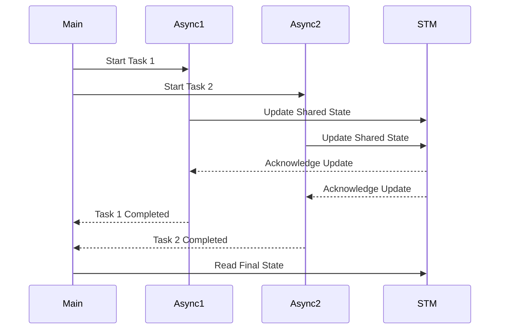

## 3.10 Asynchronous Programming with Async and STM

Asynchronous programming is a powerful paradigm that allows developers to write non-blocking code, enabling applications to perform multiple operations concurrently. In Haskell, the `Async` library and Software Transactional Memory (STM) provide robust tools for managing concurrency. This section will guide you through the concepts and practical applications of these tools, helping you build safe and efficient concurrent programs in Haskell.

### Understanding Asynchronous Programming

Asynchronous programming involves executing tasks concurrently without waiting for each task to complete before starting the next one. This approach is particularly useful in I/O-bound applications, where waiting for external resources can lead to inefficiencies. By leveraging asynchronous programming, you can improve the responsiveness and throughput of your applications.

### The Async Library: Simplifying Concurrent Haskell Programming

The `Async` library in Haskell provides a high-level interface for managing asynchronous tasks. It abstracts away the complexities of thread management, allowing you to focus on the logic of your concurrent operations.

#### Key Features of the Async Library

- **Simple API**: The `Async` library offers a straightforward API for creating and managing asynchronous tasks.
- **Exception Handling**: It provides mechanisms for handling exceptions in concurrent code, ensuring that errors are propagated correctly.
- **Cancellation**: You can cancel asynchronous tasks, giving you control over the lifecycle of your concurrent operations.

#### Basic Usage of the Async Library

Let's start with a simple example to illustrate how to use the `Async` library:

```haskell
import Control.Concurrent.Async

main :: IO ()
main = do
    -- Start two asynchronous tasks
    async1 <- async $ do
        putStrLn "Task 1: Starting"
        threadDelay 2000000  -- Simulate a long-running task
        putStrLn "Task 1: Completed"
    
    async2 <- async $ do
        putStrLn "Task 2: Starting"
        threadDelay 1000000  -- Simulate a shorter task
        putStrLn "Task 2: Completed"
    
    -- Wait for both tasks to complete
    waitBoth async1 async2
    putStrLn "Both tasks completed"
```

In this example, we create two asynchronous tasks using the `async` function. Each task simulates a long-running operation using `threadDelay`. The `waitBoth` function is used to wait for both tasks to complete before proceeding.

#### Exception Handling with Async

Handling exceptions in concurrent code is crucial to ensure the robustness of your applications. The `Async` library provides functions like `waitCatch` to handle exceptions gracefully:

```haskell
import Control.Concurrent.Async
import Control.Exception

main :: IO ()
main = do
    asyncTask <- async $ do
        putStrLn "Task: Starting"
        throwIO (userError "An error occurred")
    
    result <- waitCatch asyncTask
    case result of
        Left ex  -> putStrLn $ "Task failed with exception: " ++ show ex
        Right _  -> putStrLn "Task completed successfully"
```

In this example, we simulate an error in the asynchronous task using `throwIO`. The `waitCatch` function captures the exception, allowing us to handle it appropriately.

### Software Transactional Memory (STM): Composable Memory Transactions

Software Transactional Memory (STM) is a concurrency control mechanism that simplifies the management of shared state in concurrent programs. STM allows you to perform memory transactions, ensuring that operations on shared data are atomic and consistent.

#### Key Features of STM

- **Atomic Transactions**: STM ensures that transactions are executed atomically, preventing race conditions.
- **Composable**: Transactions can be composed, allowing you to build complex operations from simpler ones.
- **Retry Mechanism**: STM provides a retry mechanism to handle conflicts, ensuring that transactions are retried until they succeed.

#### Basic Usage of STM

Let's explore a simple example of using STM to manage shared state:

```haskell
import Control.Concurrent.STM
import Control.Concurrent
import Control.Monad

main :: IO ()
main = do
    counter <- atomically $ newTVar 0
    
    let incrementCounter = atomically $ modifyTVar' counter (+1)
    
    -- Create multiple threads to increment the counter
    replicateM_ 10 $ forkIO $ replicateM_ 1000 incrementCounter
    
    -- Wait for threads to complete
    threadDelay 1000000
    
    -- Read the final value of the counter
    finalValue <- atomically $ readTVar counter
    putStrLn $ "Final counter value: " ++ show finalValue
```

In this example, we create a shared counter using `TVar`, a transactional variable. Multiple threads increment the counter concurrently, and STM ensures that the operations are atomic and consistent.

### Combining Async and STM: Building Safe and Efficient Concurrent Programs

By combining the `Async` library and STM, you can build powerful concurrent applications that are both efficient and safe. The `Async` library allows you to manage asynchronous tasks, while STM provides a robust mechanism for handling shared state.

#### Example: Concurrent Web Scraper

Let's build a simple concurrent web scraper using `Async` and STM:

```haskell
import Control.Concurrent.Async
import Control.Concurrent.STM
import Network.HTTP.Simple

-- Function to fetch a URL and return the response body
fetchURL :: String -> IO String
fetchURL url = do
    response <- httpLBS (parseRequest_ url)
    return $ show $ getResponseBody response

main :: IO ()
main = do
    let urls = ["http://example.com", "http://example.org", "http://example.net"]
    
    -- Create a TVar to store the results
    results <- atomically $ newTVar []
    
    -- Fetch URLs concurrently
    asyncTasks <- mapM (async . fetchAndStore results) urls
    
    -- Wait for all tasks to complete
    mapM_ wait asyncTasks
    
    -- Read and print the results
    finalResults <- atomically $ readTVar results
    mapM_ putStrLn finalResults

-- Function to fetch a URL and store the result in a TVar
fetchAndStore :: TVar [String] -> String -> IO ()
fetchAndStore results url = do
    result <- fetchURL url
    atomically $ modifyTVar' results (result :)
```

In this example, we use `Async` to fetch multiple URLs concurrently. The results are stored in a `TVar`, ensuring that the shared state is managed safely using STM.

### Visualizing Asynchronous Programming with Async and STM

To better understand the flow of asynchronous programming with `Async` and STM, let's visualize the process using a sequence diagram:



**Diagram Description**: This sequence diagram illustrates the interaction between the main program, asynchronous tasks, and STM. The main program starts two asynchronous tasks, which update the shared state managed by STM. Once both tasks are completed, the main program reads the final state.

### References and Further Reading

- [Async Library Documentation](https://hackage.haskell.org/package/async)
- [STM Library Documentation](https://hackage.haskell.org/package/stm)

### Knowledge Check

- Explain the benefits of using the `Async` library for managing asynchronous tasks.
- Describe how STM ensures atomicity and consistency in concurrent programs.
- Provide an example of combining `Async` and STM in a real-world application.

### Try It Yourself

Experiment with the code examples provided in this section. Try modifying the number of concurrent tasks or the operations performed within each task. Observe how the `Async` library and STM handle concurrency and shared state management.

### Embrace the Journey

Remember, mastering asynchronous programming in Haskell is a journey. As you explore the capabilities of the `Async` library and STM, you'll discover new ways to build efficient and safe concurrent applications. Keep experimenting, stay curious, and enjoy the journey!

## Quiz: Asynchronous Programming with Async and STM



### What is the primary purpose of the Async library in Haskell?

- [x] To simplify concurrent programming by managing asynchronous tasks.
- [ ] To provide a graphical user interface for Haskell applications.
- [ ] To handle file I/O operations in Haskell.
- [ ] To manage database connections in Haskell.

> **Explanation:** The Async library is designed to simplify concurrent programming by providing a high-level interface for managing asynchronous tasks.

### How does STM ensure atomicity in concurrent programs?

- [x] By executing memory transactions atomically.
- [ ] By using locks and semaphores.
- [ ] By running tasks sequentially.
- [ ] By using global variables.

> **Explanation:** STM ensures atomicity by executing memory transactions atomically, preventing race conditions and ensuring consistency.

### What function is used to handle exceptions in the Async library?

- [x] waitCatch
- [ ] async
- [ ] forkIO
- [ ] atomically

> **Explanation:** The `waitCatch` function is used to handle exceptions in the Async library, allowing you to capture and manage errors in asynchronous tasks.

### Which of the following is a key feature of STM?

- [x] Composable transactions
- [ ] Thread pooling
- [ ] Network communication
- [ ] File system access

> **Explanation:** STM provides composable transactions, allowing you to build complex operations from simpler ones.

### What is the purpose of the `atomically` function in STM?

- [x] To execute a transaction atomically.
- [ ] To start a new thread.
- [ ] To read a file.
- [ ] To connect to a database.

> **Explanation:** The `atomically` function is used to execute a transaction atomically, ensuring that operations on shared data are consistent and isolated.

### How can you cancel an asynchronous task in the Async library?

- [x] Using the `cancel` function.
- [ ] By calling `stop`.
- [ ] By using `terminate`.
- [ ] By setting a flag.

> **Explanation:** The `cancel` function is used to cancel an asynchronous task in the Async library, giving you control over the task's lifecycle.

### What is a TVar in STM?

- [x] A transactional variable used to manage shared state.
- [ ] A type of thread in Haskell.
- [ ] A network socket.
- [ ] A file descriptor.

> **Explanation:** A TVar is a transactional variable used in STM to manage shared state safely and consistently.

### Which function is used to create an asynchronous task in the Async library?

- [x] async
- [ ] forkIO
- [ ] atomically
- [ ] newTVar

> **Explanation:** The `async` function is used to create an asynchronous task in the Async library, allowing you to run operations concurrently.

### What is the benefit of using STM over traditional locking mechanisms?

- [x] STM provides composable transactions without the need for locks.
- [ ] STM is faster than all locking mechanisms.
- [ ] STM requires less memory.
- [ ] STM is easier to implement.

> **Explanation:** STM provides composable transactions without the need for locks, making it easier to manage shared state in concurrent programs.

### True or False: The Async library can only be used for I/O-bound tasks.

- [ ] True
- [x] False

> **Explanation:** False. The Async library can be used for both I/O-bound and CPU-bound tasks, providing a flexible way to manage concurrency in Haskell.


