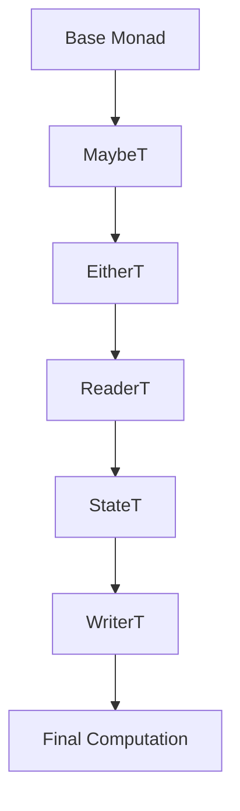

## 3.11 Monad Transformers and Effect Stacking

In the world of Haskell, monads are a powerful abstraction that allows us to handle side effects, manage state, and perform computations in a functional way. However, when dealing with multiple effects simultaneously, we encounter the challenge of combining different monads. This is where **Monad Transformers** come into play. They provide a way to stack monads, allowing us to work with multiple effects in a clean and organized manner. In this section, we will explore the concept of monad transformers, how they work, and best practices for managing complex monad stacks.

### Monad Transformers Overview

**Monad Transformers** are a design pattern in Haskell that allows us to combine monads to handle multiple effects. They provide a way to "stack" monads, enabling us to work with computations that involve more than one effect. For example, we might want to combine the `Maybe` monad, which handles computations that might fail, with the `IO` monad, which handles input/output operations.

#### Key Concepts

- **Stacking Monads**: Monad transformers allow us to stack monads on top of each other, creating a monad stack. Each layer of the stack represents a different effect.
- **Lifting**: When working with monad transformers, we often need to "lift" operations from one monad to another. This involves using functions like `lift` to move computations up the stack.
- **Common Transformers**: Some of the most commonly used monad transformers include `MaybeT`, `EitherT`, `ReaderT`, `StateT`, and `WriterT`.

### Common Monad Transformers

Let's explore some of the most commonly used monad transformers and how they can be used to manage different effects.

#### MaybeT

The `MaybeT` transformer is used to add the possibility of failure to a computation. It combines the `Maybe` monad with another monad, allowing us to handle computations that might fail within a monadic context.

```haskell
import Control.Monad.Trans.Maybe
import Control.Monad.IO.Class

example :: MaybeT IO String
example = do
    liftIO $ putStrLn "Enter your name:"
    name <- liftIO getLine
    if null name
        then MaybeT $ return Nothing
        else return name
```

In this example, `MaybeT IO` is a monad stack that combines `Maybe` and `IO`. The `liftIO` function is used to lift `IO` operations into the `MaybeT` monad.

#### EitherT

The `EitherT` transformer is similar to `MaybeT`, but it allows us to handle computations that can fail with an error message. It combines the `Either` monad with another monad.

```haskell
import Control.Monad.Trans.Either
import Control.Monad.IO.Class

example :: EitherT String IO Int
example = do
    liftIO $ putStrLn "Enter a number:"
    input <- liftIO getLine
    let number = read input :: Int
    if number < 0
        then left "Negative number not allowed"
        else right number
```

Here, `EitherT String IO` is a monad stack that combines `Either` and `IO`. The `left` and `right` functions are used to handle errors and successful computations, respectively.

#### ReaderT

The `ReaderT` transformer is used to pass a read-only environment to a computation. It combines the `Reader` monad with another monad, allowing us to access shared configuration or state.

```haskell
import Control.Monad.Trans.Reader

example :: ReaderT String IO ()
example = do
    env <- ask
    liftIO $ putStrLn $ "Hello, " ++ env
```

In this example, `ReaderT String IO` is a monad stack that combines `Reader` and `IO`. The `ask` function is used to access the environment.

#### StateT

The `StateT` transformer is used to add stateful computations to a monad. It combines the `State` monad with another monad, allowing us to manage state within a monadic context.

```haskell
import Control.Monad.Trans.State

example :: StateT Int IO ()
example = do
    liftIO $ putStrLn "Incrementing state"
    modify (+1)
    state <- get
    liftIO $ putStrLn $ "Current state: " ++ show state
```

Here, `StateT Int IO` is a monad stack that combines `State` and `IO`. The `modify` and `get` functions are used to update and access the state.

#### WriterT

The `WriterT` transformer is used to add logging or output to a computation. It combines the `Writer` monad with another monad, allowing us to accumulate logs or output alongside computations.

```haskell
import Control.Monad.Trans.Writer

example :: WriterT [String] IO ()
example = do
    liftIO $ putStrLn "Logging a message"
    tell ["This is a log message"]
    liftIO $ putStrLn "Another message"
```

In this example, `WriterT [String] IO` is a monad stack that combines `Writer` and `IO`. The `tell` function is used to add log messages.

### Best Practices for Monad Transformers

Managing the complexity of monad stacks can be challenging. Here are some best practices to keep in mind:

- **Keep the Stack Shallow**: Avoid deeply nested monad stacks, as they can become difficult to manage and understand. Try to keep the stack as shallow as possible.
- **Use `lift` Sparingly**: While `lift` is necessary to move computations up the stack, overusing it can lead to code that is difficult to read. Consider using helper functions to encapsulate lifting logic.
- **Leverage Type Aliases**: Use type aliases to simplify complex monad stacks and improve code readability.
- **Consider Alternative Approaches**: In some cases, alternative approaches like the `mtl` library or free monads may be more appropriate for managing effects.

### Visualizing Monad Transformers

To better understand how monad transformers work, let's visualize a simple monad stack using a diagram.



This diagram represents a monad stack with multiple layers, each adding a different effect to the computation.

### Haskell Unique Features

Haskell's strong type system and support for higher-order functions make it uniquely suited for working with monad transformers. The ability to define custom monads and transformers allows developers to create highly modular and reusable code.

### Differences and Similarities

Monad transformers are often compared to other approaches for managing effects, such as the `mtl` library and free monads. While each approach has its strengths and weaknesses, monad transformers are particularly well-suited for scenarios where effects need to be combined in a specific order.

### Try It Yourself

Experiment with the code examples provided in this section. Try modifying the monad stacks to add or remove effects, and observe how the behavior of the computations changes. This hands-on approach will help solidify your understanding of monad transformers.

### Knowledge Check

- What are monad transformers, and why are they useful?
- How do you use the `lift` function in the context of monad transformers?
- What are some common monad transformers, and what effects do they manage?
- How can you simplify complex monad stacks in Haskell?

### Embrace the Journey

Remember, mastering monad transformers and effect stacking is a journey. As you continue to explore these concepts, you'll gain a deeper understanding of how to manage complex effects in Haskell. Keep experimenting, stay curious, and enjoy the process!

## Quiz: Monad Transformers and Effect Stacking



### What is the primary purpose of monad transformers in Haskell?

- [x] To combine multiple monads to handle different effects simultaneously.
- [ ] To replace all monads with a single universal monad.
- [ ] To eliminate the need for monads in functional programming.
- [ ] To simplify the syntax of monadic expressions.

> **Explanation:** Monad transformers allow us to stack multiple monads, enabling us to handle different effects in a single computation.

### Which function is commonly used to lift operations from one monad to another in a monad stack?

- [x] lift
- [ ] map
- [ ] bind
- [ ] return

> **Explanation:** The `lift` function is used to move computations from one monad to a higher level in a monad stack.

### What does the `MaybeT` transformer add to a computation?

- [x] The possibility of failure.
- [ ] Logging capabilities.
- [ ] State management.
- [ ] Input/output operations.

> **Explanation:** `MaybeT` combines the `Maybe` monad with another monad, allowing computations that might fail.

### Which monad transformer would you use to handle computations with error messages?

- [x] EitherT
- [ ] MaybeT
- [ ] ReaderT
- [ ] WriterT

> **Explanation:** `EitherT` is used to handle computations that can fail with an error message.

### What is the role of the `ReaderT` transformer?

- [x] To pass a read-only environment to a computation.
- [ ] To manage stateful computations.
- [ ] To accumulate logs or output.
- [ ] To handle input/output operations.

> **Explanation:** `ReaderT` combines the `Reader` monad with another monad, allowing access to a shared environment.

### How can you simplify complex monad stacks in Haskell?

- [x] Use type aliases to improve readability.
- [ ] Avoid using monad transformers altogether.
- [ ] Use deeply nested monad stacks.
- [ ] Overuse the `lift` function.

> **Explanation:** Type aliases can help simplify complex monad stacks and make the code more readable.

### What is a potential drawback of deeply nested monad stacks?

- [x] They can become difficult to manage and understand.
- [ ] They eliminate the need for monads.
- [ ] They simplify the syntax of monadic expressions.
- [ ] They improve performance.

> **Explanation:** Deeply nested monad stacks can be challenging to manage and understand, leading to complex code.

### Which library is often used as an alternative to monad transformers for managing effects?

- [x] mtl
- [ ] lens
- [ ] aeson
- [ ] conduit

> **Explanation:** The `mtl` library provides an alternative approach to managing effects in Haskell.

### What is the purpose of the `tell` function in the context of the `WriterT` transformer?

- [x] To add log messages to a computation.
- [ ] To handle input/output operations.
- [ ] To pass a read-only environment.
- [ ] To manage stateful computations.

> **Explanation:** The `tell` function is used to add log messages or output to a computation in the `WriterT` monad.

### True or False: Monad transformers eliminate the need for monads in Haskell.

- [ ] True
- [x] False

> **Explanation:** Monad transformers do not eliminate the need for monads; they provide a way to combine multiple monads to handle different effects.




