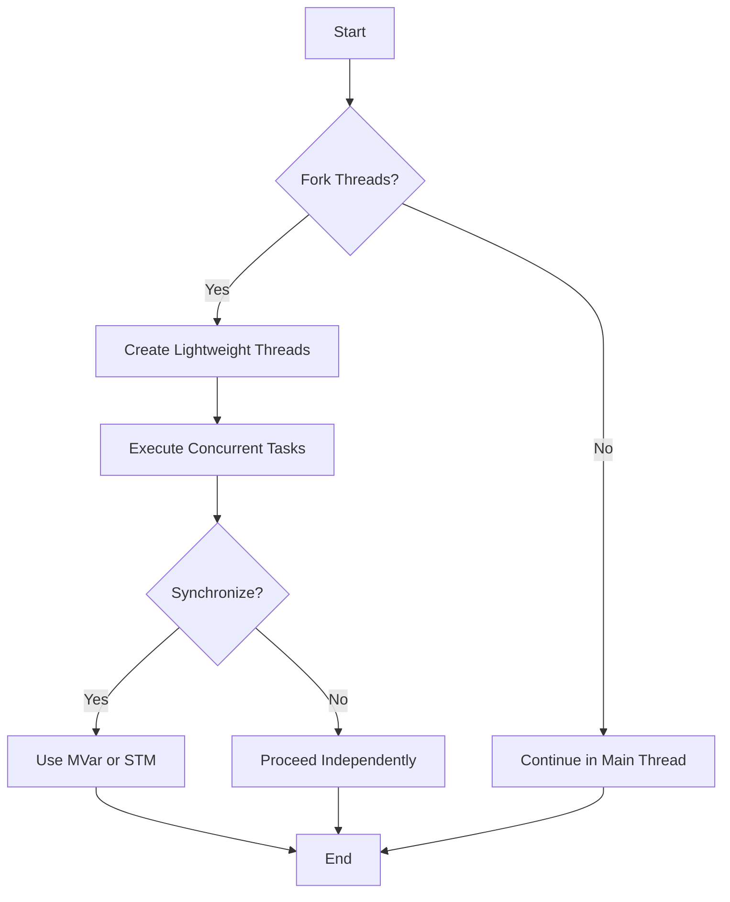

## 3.12 Concurrency and Parallelism in Haskell

Concurrency and parallelism are crucial concepts in modern software development, especially for building scalable and efficient applications. Haskell, with its strong emphasis on functional programming, offers unique approaches to concurrency and parallelism. In this section, we will explore Haskell's concurrency support, parallelism techniques, and the libraries and tools available to harness these capabilities effectively.

### Concurrency Support in Haskell

Concurrency in Haskell is about dealing with multiple tasks at once, allowing them to make progress independently. Haskell provides lightweight threads and concurrency primitives that make it easier to write concurrent programs.

#### Lightweight Threads

Haskell's runtime system supports lightweight threads, also known as "green threads." These threads are managed by the Haskell runtime rather than the operating system, allowing for thousands of concurrent threads without the overhead of OS threads.

```haskell
import Control.Concurrent

main :: IO ()
main = do
    forkIO $ putStrLn "Hello from thread 1"
    forkIO $ putStrLn "Hello from thread 2"
    threadDelay 1000000  -- Wait for 1 second to let threads finish
```

In this example, `forkIO` is used to create new threads. Each thread executes a simple `putStrLn` action. The `threadDelay` function ensures the main thread waits long enough for the other threads to complete.

#### Concurrency Primitives

Haskell provides several concurrency primitives to synchronize and communicate between threads:

- **MVar**: A mutable location that can be empty or contain a value. It is used for communication between threads.

```haskell
import Control.Concurrent

main :: IO ()
main = do
    mvar <- newEmptyMVar
    forkIO $ putMVar mvar "Hello from another thread"
    message <- takeMVar mvar
    putStrLn message
```

- **STM (Software Transactional Memory)**: A composable memory transaction system that allows for safe concurrent access to shared memory.

```haskell
import Control.Concurrent.STM

main :: IO ()
main = do
    tvar <- atomically $ newTVar 0
    atomically $ modifyTVar' tvar (+1)
    value <- atomically $ readTVar tvar
    print value
```

### Parallelism Techniques

Parallelism in Haskell involves executing computations simultaneously to improve performance. Haskell's purity and laziness make it well-suited for parallel execution.

#### Strategies and Evaluation Control

Haskell provides the `Control.Parallel.Strategies` module to control evaluation strategies, allowing you to specify how computations should be evaluated in parallel.

```haskell
import Control.Parallel.Strategies

parSum :: [Int] -> Int
parSum xs = runEval $ do
    let (ys, zs) = splitAt (length xs `div` 2) xs
    sum1 <- rpar (sum ys)
    sum2 <- rpar (sum zs)
    rseq sum1
    rseq sum2
    return (sum1 + sum2)
```

In this example, `rpar` is used to evaluate parts of the list in parallel, while `rseq` ensures that the results are fully evaluated before combining them.

#### Parallel List Comprehensions

Haskell also supports parallel list comprehensions, which allow you to process lists in parallel.

```haskell
import Control.Parallel

parMap :: (a -> b) -> [a] -> [b]
parMap f xs = map f xs `using` parList rseq
```

The `parList` strategy evaluates each element of the list in parallel, using `rseq` to ensure each element is fully evaluated.

### Libraries and Tools

Haskell's ecosystem includes several libraries and tools to facilitate concurrency and parallelism.

#### GHC Extensions

The Glasgow Haskell Compiler (GHC) provides several extensions to support concurrency and parallelism, such as:

- **Parallel Haskell**: A set of extensions for parallel programming.
- **GHC's Runtime Options**: Options to control the number of cores used for parallel execution.

#### Asynchronous Programming with `async`

The `async` library provides a higher-level abstraction for asynchronous programming, making it easier to work with concurrent tasks.

```haskell
import Control.Concurrent.Async

main :: IO ()
main = do
    a1 <- async (putStrLn "Task 1")
    a2 <- async (putStrLn "Task 2")
    wait a1
    wait a2
```

The `async` function runs an IO action in a separate thread, and `wait` blocks until the action completes.

#### Software Transactional Memory (STM)

STM provides a powerful abstraction for managing shared state in concurrent programs. It allows you to compose atomic transactions, ensuring consistency and avoiding common concurrency issues like deadlocks.

```haskell
import Control.Concurrent.STM

main :: IO ()
main = do
    tvar <- atomically $ newTVar 0
    atomically $ modifyTVar' tvar (+1)
    value <- atomically $ readTVar tvar
    print value
```

### Visualizing Concurrency and Parallelism

To better understand how concurrency and parallelism work in Haskell, let's visualize the process using a flowchart.



This diagram illustrates the decision-making process when working with concurrency in Haskell. It shows how threads are forked, tasks are executed, and synchronization is handled.

### Try It Yourself

Experiment with the provided code examples by modifying them to suit your needs. Try creating more complex concurrent programs using different concurrency primitives and parallelism techniques. Consider the following challenges:

- Modify the `parSum` function to work with a larger list and measure the performance improvement.
- Implement a concurrent program that uses `STM` to manage shared state between multiple threads.
- Use the `async` library to run multiple IO actions concurrently and handle their results.

### Knowledge Check

- What is the difference between concurrency and parallelism in Haskell?
- How do lightweight threads differ from OS threads in Haskell?
- What are the benefits of using STM over traditional locking mechanisms?

### Summary

In this section, we've explored Haskell's concurrency and parallelism capabilities, including lightweight threads, concurrency primitives, and parallelism techniques. We've also looked at the libraries and tools available to harness these capabilities effectively. Remember, mastering concurrency and parallelism in Haskell can significantly improve the performance and scalability of your applications.

### References and Further Reading

- [Haskell Concurrency and Parallelism](https://wiki.haskell.org/Concurrency_and_parallelism)
- [GHC User's Guide: Concurrent Haskell](https://downloads.haskell.org/~ghc/latest/docs/html/users_guide/concurrent.html)
- [Parallel and Concurrent Programming in Haskell](https://www.oreilly.com/library/view/parallel-and-concurrent/9781449335939/)

## Quiz: Concurrency and Parallelism in Haskell



### What is the primary difference between concurrency and parallelism in Haskell?

- [x] Concurrency is about managing multiple tasks, while parallelism is about executing tasks simultaneously.
- [ ] Concurrency is about executing tasks simultaneously, while parallelism is about managing multiple tasks.
- [ ] Concurrency and parallelism are the same in Haskell.
- [ ] Concurrency is only used for IO operations, while parallelism is used for computations.

> **Explanation:** Concurrency involves managing multiple tasks that can make progress independently, while parallelism focuses on executing tasks simultaneously to improve performance.

### How does Haskell's lightweight threading model differ from OS threads?

- [x] Lightweight threads are managed by the Haskell runtime, allowing for thousands of concurrent threads.
- [ ] Lightweight threads are managed by the operating system, similar to OS threads.
- [ ] Lightweight threads are slower than OS threads.
- [ ] Lightweight threads cannot be used for IO operations.

> **Explanation:** Haskell's lightweight threads, or green threads, are managed by the Haskell runtime system, allowing for efficient concurrency without the overhead of OS threads.

### Which Haskell library provides a higher-level abstraction for asynchronous programming?

- [x] async
- [ ] STM
- [ ] MVar
- [ ] Control.Parallel

> **Explanation:** The `async` library provides a higher-level abstraction for asynchronous programming, making it easier to work with concurrent tasks.

### What is the purpose of Software Transactional Memory (STM) in Haskell?

- [x] To provide a composable memory transaction system for safe concurrent access.
- [ ] To manage lightweight threads.
- [ ] To execute computations in parallel.
- [ ] To handle IO operations asynchronously.

> **Explanation:** STM provides a composable memory transaction system that allows for safe concurrent access to shared memory, avoiding common concurrency issues like deadlocks.

### Which function is used to create a new lightweight thread in Haskell?

- [x] forkIO
- [ ] async
- [ ] newTVar
- [ ] rpar

> **Explanation:** The `forkIO` function is used to create a new lightweight thread in Haskell.

### What is the role of the `rpar` function in Haskell's parallelism?

- [x] To evaluate computations in parallel.
- [ ] To manage lightweight threads.
- [ ] To synchronize concurrent tasks.
- [ ] To handle IO operations asynchronously.

> **Explanation:** The `rpar` function is used to evaluate computations in parallel, allowing for improved performance through parallel execution.

### How does the `async` library simplify concurrent programming in Haskell?

- [x] By providing a higher-level abstraction for running IO actions in separate threads.
- [ ] By managing lightweight threads.
- [ ] By executing computations in parallel.
- [ ] By handling IO operations asynchronously.

> **Explanation:** The `async` library simplifies concurrent programming by providing a higher-level abstraction for running IO actions in separate threads and handling their results.

### What is the benefit of using parallel list comprehensions in Haskell?

- [x] They allow processing lists in parallel, improving performance.
- [ ] They simplify the syntax of list comprehensions.
- [ ] They are only used for IO operations.
- [ ] They manage lightweight threads.

> **Explanation:** Parallel list comprehensions allow processing lists in parallel, improving performance by taking advantage of parallel execution.

### Which concurrency primitive is used for communication between threads in Haskell?

- [x] MVar
- [ ] STM
- [ ] async
- [ ] forkIO

> **Explanation:** `MVar` is a concurrency primitive used for communication between threads in Haskell, allowing threads to share data safely.

### True or False: Haskell's STM allows for safe concurrent access to shared memory without traditional locking mechanisms.

- [x] True
- [ ] False

> **Explanation:** True. STM provides a composable memory transaction system that allows for safe concurrent access to shared memory, avoiding traditional locking mechanisms.



Remember, this is just the beginning. As you progress, you'll build more complex and interactive applications using Haskell's concurrency and parallelism features. Keep experimenting, stay curious, and enjoy the journey!
