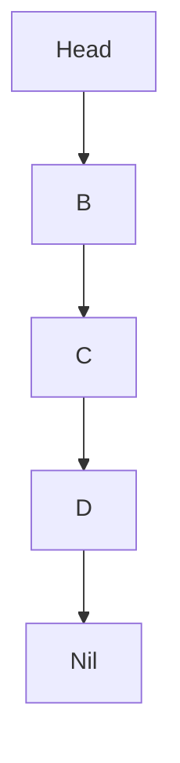
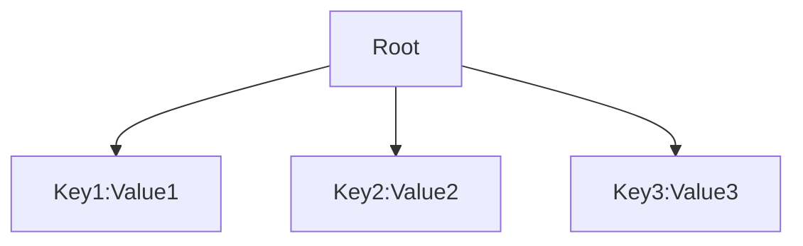
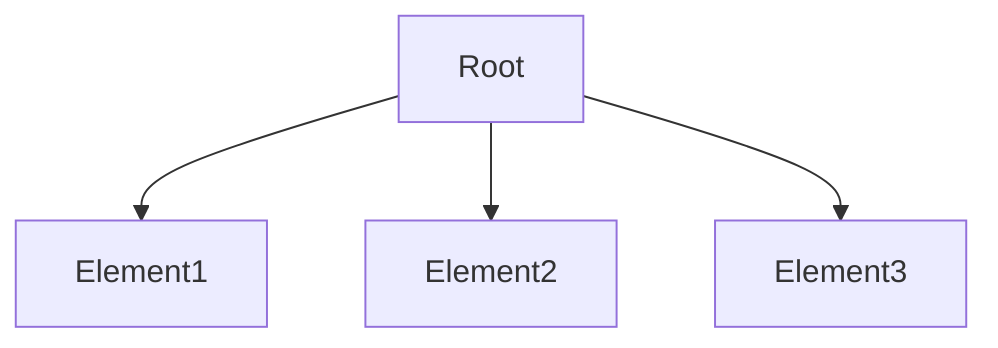

## 3.13 Collections and Functional Data Structures

In Haskell, collections and functional data structures are foundational to writing efficient and expressive code. As an expert software engineer or architect, understanding these structures is crucial for building scalable and maintainable systems. This section delves into the immutable collections available in Haskell, such as lists, maps, and sets, and explores efficient alternatives like `Data.Sequence` and `Data.Vector`. We will also discuss how to choose the right structure based on performance considerations and trade-offs.

### Immutable Collections

Haskell's immutable collections are a cornerstone of its functional programming paradigm. These collections ensure that data remains unchanged once created, promoting safer and more predictable code. Let's explore some of the most commonly used immutable collections in Haskell.

#### Lists

Lists are perhaps the most fundamental collection type in Haskell. They are simple, versatile, and well-integrated into the language's syntax and standard library.

```haskell
-- Define a list of integers
let numbers = [1, 2, 3, 4, 5]

-- Access the head and tail of a list
let headOfList = head numbers  -- 1
let tailOfList = tail numbers  -- [2, 3, 4, 5]

-- Concatenate two lists
let moreNumbers = [6, 7, 8]
let combined = numbers ++ moreNumbers  -- [1, 2, 3, 4, 5, 6, 7, 8]
```

**Key Points:**
- Lists are linked lists, making them efficient for sequential access but less so for random access.
- They are ideal for operations that involve processing elements in order, such as folds and maps.

#### Maps

Maps (or dictionaries) are collections of key-value pairs. In Haskell, the `Data.Map` module provides an efficient implementation of maps.

```haskell
import qualified Data.Map as Map

-- Create a map from a list of key-value pairs
let phoneBook = Map.fromList [("Alice", "1234"), ("Bob", "5678")]

-- Lookup a value by key
let aliceNumber = Map.lookup "Alice" phoneBook  -- Just "1234"

-- Insert a new key-value pair
let updatedPhoneBook = Map.insert "Charlie" "91011" phoneBook
```

**Key Points:**
- Maps are implemented as balanced binary trees, providing logarithmic time complexity for lookups, insertions, and deletions.
- They are suitable for scenarios where you need fast access to elements by key.

#### Sets

Sets are collections of unique elements. The `Data.Set` module offers an efficient implementation of sets in Haskell.

```haskell
import qualified Data.Set as Set

-- Create a set from a list
let numbersSet = Set.fromList [1, 2, 3, 4, 5]

-- Check for membership
let isThreePresent = Set.member 3 numbersSet  -- True

-- Add an element to a set
let updatedSet = Set.insert 6 numbersSet
```

**Key Points:**
- Sets are also implemented as balanced binary trees, offering logarithmic time complexity for membership tests, insertions, and deletions.
- They are ideal for operations that require uniqueness, such as filtering duplicates.

### Data.Sequence and Data.Vector

While lists, maps, and sets are versatile, they may not always be the most efficient choice for certain operations. `Data.Sequence` and `Data.Vector` provide more efficient alternatives for specific use cases.

#### Data.Sequence

`Data.Sequence` is a module that provides a sequence data structure, which is more efficient than lists for certain operations, such as appending and accessing elements at arbitrary positions.

```haskell
import qualified Data.Sequence as Seq

-- Create a sequence
let seqNumbers = Seq.fromList [1, 2, 3, 4, 5]

-- Access an element by index
let thirdElement = Seq.index seqNumbers 2  -- 3

-- Append an element
let updatedSeq = seqNumbers Seq.|> 6
```

**Key Points:**
- `Data.Sequence` is implemented as a finger tree, offering logarithmic time complexity for indexing, appending, and splitting.
- It is suitable for scenarios where you need efficient random access and concatenation.

#### Data.Vector

`Data.Vector` provides a more efficient alternative to lists for numerical computations and scenarios where performance is critical.

```haskell
import qualified Data.Vector as Vector

-- Create a vector
let vecNumbers = Vector.fromList [1, 2, 3, 4, 5]

-- Access an element by index
let secondElement = vecNumbers Vector.! 1  -- 2

-- Update an element
let updatedVec = vecNumbers Vector.// [(1, 10)]
```

**Key Points:**
- `Data.Vector` offers constant-time indexing and updates, making it ideal for performance-critical applications.
- It is implemented as a contiguous array, providing better cache locality compared to lists.

### Choosing the Right Structure

Selecting the appropriate data structure is crucial for optimizing performance and ensuring code maintainability. Here are some considerations and trade-offs to keep in mind:

#### Performance Considerations

- **Access Patterns**: Choose lists for sequential access, `Data.Sequence` for efficient concatenation and random access, and `Data.Vector` for numerical computations.
- **Memory Usage**: Consider the memory overhead of each structure. `Data.Vector` is more memory-efficient than lists for large datasets.
- **Complexity**: Evaluate the time complexity of operations. Maps and sets offer logarithmic time complexity for lookups, while vectors provide constant-time access.

#### Trade-Offs

- **Immutability vs. Performance**: While immutability offers safety and predictability, it may come at the cost of performance. Use `Data.Vector` for mutable-like performance in a functional context.
- **Ease of Use vs. Efficiency**: Lists are easy to use and integrate well with Haskell's syntax, but may not be the most efficient choice for all scenarios.

### Visualizing Data Structures

To better understand the differences between these data structures, let's visualize them using Mermaid.js diagrams.

#### List Structure



**Caption:** A simple linked list structure, where each node points to the next.

#### Map Structure



**Caption:** A balanced binary tree representation of a map, where each node contains a key-value pair.

#### Set Structure



**Caption:** A balanced binary tree representation of a set, where each node contains a unique element.

### Try It Yourself

Experiment with the code examples provided in this section. Try modifying the lists, maps, and sets to include different types of data. Use `Data.Sequence` and `Data.Vector` to see how they perform with larger datasets. Consider implementing a small application that requires efficient data manipulation, and choose the appropriate data structures based on the requirements.

### References and Links

- [Haskell Data.Map Documentation](https://hackage.haskell.org/package/containers/docs/Data-Map.html)
- [Haskell Data.Set Documentation](https://hackage.haskell.org/package/containers/docs/Data-Set.html)
- [Haskell Data.Sequence Documentation](https://hackage.haskell.org/package/containers/docs/Data-Sequence.html)
- [Haskell Data.Vector Documentation](https://hackage.haskell.org/package/vector/docs/Data-Vector.html)

### Knowledge Check

1. What are the key differences between lists and vectors in Haskell?
2. How does immutability affect the performance of data structures?
3. When would you choose `Data.Sequence` over a list?
4. What are the trade-offs of using maps and sets in Haskell?

### Embrace the Journey

Remember, mastering collections and functional data structures in Haskell is a journey. As you progress, you'll gain a deeper understanding of how to leverage these structures to write efficient and expressive code. Keep experimenting, stay curious, and enjoy the journey!

## Quiz: Collections and Functional Data Structures



### What is a key advantage of using immutable collections in Haskell?

- [x] Predictability and safety
- [ ] Faster performance
- [ ] Easier syntax
- [ ] Reduced memory usage

> **Explanation:** Immutable collections ensure that data remains unchanged, promoting safer and more predictable code.

### Which data structure is implemented as a finger tree in Haskell?

- [ ] List
- [x] Data.Sequence
- [ ] Data.Vector
- [ ] Data.Map

> **Explanation:** `Data.Sequence` is implemented as a finger tree, offering efficient operations for indexing, appending, and splitting.

### What is the time complexity of lookups in a Haskell map?

- [ ] Constant time
- [x] Logarithmic time
- [ ] Linear time
- [ ] Quadratic time

> **Explanation:** Maps in Haskell are implemented as balanced binary trees, providing logarithmic time complexity for lookups.

### Which data structure is most suitable for numerical computations in Haskell?

- [ ] List
- [ ] Data.Sequence
- [x] Data.Vector
- [ ] Data.Set

> **Explanation:** `Data.Vector` offers constant-time indexing and updates, making it ideal for performance-critical numerical computations.

### What is a trade-off of using lists in Haskell?

- [x] Less efficient random access
- [ ] High memory usage
- [ ] Complex syntax
- [ ] Lack of immutability

> **Explanation:** Lists are linked lists, making them less efficient for random access compared to other data structures like vectors.

### How are sets implemented in Haskell?

- [ ] As arrays
- [ ] As linked lists
- [x] As balanced binary trees
- [ ] As hash tables

> **Explanation:** Sets in Haskell are implemented as balanced binary trees, offering logarithmic time complexity for operations.

### Which data structure provides constant-time indexing in Haskell?

- [ ] List
- [ ] Data.Sequence
- [x] Data.Vector
- [ ] Data.Map

> **Explanation:** `Data.Vector` provides constant-time indexing, making it suitable for scenarios where performance is critical.

### What is a benefit of using `Data.Sequence` over lists?

- [ ] Simpler syntax
- [x] Efficient concatenation
- [ ] Lower memory usage
- [ ] Better integration with Haskell syntax

> **Explanation:** `Data.Sequence` offers more efficient concatenation and random access compared to lists.

### What is the primary use case for maps in Haskell?

- [ ] Storing unique elements
- [x] Fast access to elements by key
- [ ] Sequential processing
- [ ] Numerical computations

> **Explanation:** Maps are collections of key-value pairs, providing fast access to elements by key.

### True or False: `Data.Vector` is more memory-efficient than lists for large datasets.

- [x] True
- [ ] False

> **Explanation:** `Data.Vector` is implemented as a contiguous array, providing better memory efficiency compared to lists for large datasets.


