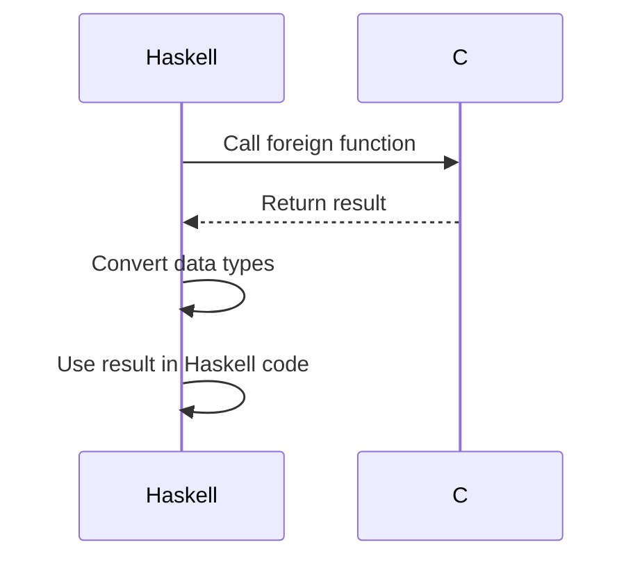

## 3.14 Foreign Function Interface (FFI)

In the realm of software development, interoperability between different programming languages is often a necessity. Haskell, with its strong type system and functional paradigm, provides a robust mechanism for interacting with foreign code through its Foreign Function Interface (FFI). This section will guide you through the essentials of using FFI in Haskell, focusing on calling C functions, handling data conversion, and ensuring safe interactions.

### Interoperability: Calling Foreign Code from Haskell

Interoperability is a critical feature for many applications, allowing developers to leverage existing libraries and systems written in other languages. Haskell's FFI is a powerful tool that enables Haskell programs to call functions written in C and other languages, thus expanding the capabilities of Haskell applications.

#### FFI Basics: Importing C Functions and Handling Data Conversion

The Foreign Function Interface (FFI) in Haskell allows you to call functions written in C, and potentially other languages, from Haskell code. This is achieved by importing foreign functions and managing data conversion between Haskell and the foreign language.

##### Importing C Functions

To import a C function into Haskell, you use the `foreign import` declaration. This declaration specifies the C function's name, its type signature in Haskell, and any calling conventions. Here's a basic example:

```haskell
{-# LANGUAGE ForeignFunctionInterface #-}

module Main where

-- Importing a C function
foreign import ccall "math.h sin" c_sin :: Double -> Double

main :: IO ()
main = do
    let angle = 0.5
    let result = c_sin angle
    putStrLn $ "The sine of " ++ show angle ++ " is " ++ show result
```

In this example, we import the `sin` function from the C standard library's `math.h` header. The `ccall` keyword specifies the calling convention, which is typically `ccall` for C functions.

##### Handling Data Conversion

Data conversion between Haskell and C is crucial for FFI. Haskell provides several types and functions to facilitate this conversion. The `Foreign.C.Types` module defines types that correspond to C types, such as `CInt`, `CDouble`, and `CString`.

Here's an example of converting a Haskell `String` to a C-style string (`CString`):

```haskell
import Foreign.C.String

main :: IO ()
main = do
    let haskellString = "Hello, C!"
    cString <- newCString haskellString
    putStrLn "Converted Haskell String to CString"
    -- Remember to free the CString after use
    free cString
```

The `newCString` function converts a Haskell `String` to a `CString`, and `free` is used to deallocate the memory when it's no longer needed.

#### Safety and Practicality: Ensuring Safe Interactions with Foreign Code

When interacting with foreign code, safety is paramount. Haskell's FFI provides mechanisms to ensure that interactions with foreign functions are safe and practical.

##### Safe and Unsafe Calls

Haskell distinguishes between safe and unsafe foreign calls. A safe call allows other Haskell threads to continue running while the foreign function executes, whereas an unsafe call does not. Use the `safe` keyword for safe calls and `unsafe` for unsafe calls:

```haskell
foreign import ccall safe "math.h sin" c_safe_sin :: Double -> Double
foreign import ccall unsafe "math.h sin" c_unsafe_sin :: Double -> Double
```

Safe calls are generally preferred unless performance is critical and you are certain that the foreign function will not block for a long time.

##### Managing Resources

When using FFI, it's important to manage resources carefully to avoid memory leaks and other issues. Haskell provides several functions for resource management, such as `malloc`, `free`, and `withForeignPtr`.

Here's an example of using `malloc` and `free`:

```haskell
import Foreign
import Foreign.C.Types

main :: IO ()
main = do
    ptr <- malloc :: IO (Ptr CInt)
    poke ptr 42
    value <- peek ptr
    putStrLn $ "Value at pointer: " ++ show value
    free ptr
```

In this example, `malloc` allocates memory for a `CInt`, `poke` writes a value to the allocated memory, and `peek` reads the value. Finally, `free` deallocates the memory.

### Visualizing FFI Interactions

To better understand the flow of data and control between Haskell and C, let's visualize the interaction using a sequence diagram.



**Figure 1:** This diagram illustrates the sequence of interactions when calling a C function from Haskell using FFI. The Haskell code calls the foreign function, receives the result, converts data types as necessary, and then uses the result within Haskell.

### Advanced FFI Techniques

As you become more comfortable with FFI, you may encounter scenarios that require more advanced techniques, such as handling callbacks, working with complex data structures, or integrating with other languages.

#### Handling Callbacks

Sometimes, you may need to pass a Haskell function as a callback to a C function. This can be achieved using `FunPtr` and `foreign export`.

```haskell
{-# LANGUAGE ForeignFunctionInterface #-}

import Foreign
import Foreign.C.Types

foreign import ccall "wrapper"
    mkCallback :: (CInt -> IO ()) -> IO (FunPtr (CInt -> IO ()))

foreign import ccall "dynamic"
    callCallback :: FunPtr (CInt -> IO ()) -> CInt -> IO ()

myCallback :: CInt -> IO ()
myCallback n = putStrLn $ "Callback called with: " ++ show n

main :: IO ()
main = do
    callbackPtr <- mkCallback myCallback
    callCallback callbackPtr 10
    freeHaskellFunPtr callbackPtr
```

In this example, `mkCallback` creates a `FunPtr` from a Haskell function, and `callCallback` calls the function pointer. Remember to free the function pointer with `freeHaskellFunPtr` when it's no longer needed.

#### Working with Complex Data Structures

When dealing with complex data structures, you may need to define corresponding Haskell data types and use `Storable` instances for conversion.

```haskell
import Foreign
import Foreign.C.Types

data Point = Point CDouble CDouble

instance Storable Point where
    sizeOf _ = sizeOf (undefined :: CDouble) * 2
    alignment _ = alignment (undefined :: CDouble)
    peek ptr = do
        x <- peekElemOff (castPtr ptr) 0
        y <- peekElemOff (castPtr ptr) 1
        return (Point x y)
    poke ptr (Point x y) = do
        pokeElemOff (castPtr ptr) 0 x
        pokeElemOff (castPtr ptr) 1 y
```

This example defines a `Point` data structure and implements the `Storable` instance for it, allowing you to read and write `Point` values to and from memory.

### Haskell Unique Features in FFI

Haskell's strong type system and functional paradigm offer unique features that can be leveraged when using FFI.

#### Leveraging Type Safety

Haskell's type system helps ensure that data passed between Haskell and foreign code is correctly typed, reducing the risk of errors. By using types like `CInt`, `CDouble`, and `CString`, you can ensure that data is correctly converted and handled.

#### Functional Abstractions

Haskell's functional nature allows you to create higher-order functions and abstractions that can simplify FFI interactions. For example, you can create a higher-order function that wraps foreign calls with resource management logic.

```haskell
withCString :: String -> (CString -> IO a) -> IO a
withCString str action = do
    cstr <- newCString str
    result <- action cstr
    free cstr
    return result
```

This `withCString` function takes a Haskell `String`, converts it to a `CString`, performs an action with it, and ensures that the `CString` is freed afterward.

### Differences and Similarities with Other Patterns

FFI in Haskell is often compared to similar mechanisms in other languages, such as Java's JNI or Python's ctypes. While the core concept of calling foreign functions is similar, Haskell's approach is distinguished by its emphasis on type safety and functional programming principles.

### Design Considerations

When using FFI, consider the following design considerations:

- **Performance**: While FFI allows you to call foreign functions, it may introduce overhead due to data conversion and context switching. Use FFI judiciously and profile your application to identify performance bottlenecks.
- **Safety**: Always prefer safe calls unless performance is critical and you are confident in the foreign code's behavior.
- **Resource Management**: Carefully manage resources to avoid memory leaks and ensure that all allocated memory is properly freed.

### Try It Yourself

To deepen your understanding of FFI, try modifying the code examples provided. Experiment with importing different C functions, handling various data types, and implementing callbacks. Consider integrating a C library into a Haskell project and explore how FFI can enhance your application's capabilities.

### Knowledge Check

- What is the purpose of Haskell's Foreign Function Interface (FFI)?
- How do you import a C function into Haskell using FFI?
- What are the differences between safe and unsafe foreign calls?
- How can you manage resources when using FFI in Haskell?

### Summary

In this section, we've explored Haskell's Foreign Function Interface (FFI) and its role in enabling interoperability with foreign code. We've covered the basics of importing C functions, handling data conversion, and ensuring safe interactions. By leveraging Haskell's unique features, such as its strong type system and functional abstractions, you can effectively integrate foreign code into your Haskell applications.

Remember, mastering FFI is just one step in your journey as a Haskell developer. As you continue to explore Haskell's capabilities, you'll discover new ways to enhance your applications and tackle complex challenges. Keep experimenting, stay curious, and enjoy the journey!

## Quiz: Foreign Function Interface (FFI)



### What is the primary purpose of Haskell's Foreign Function Interface (FFI)?

- [x] To enable interoperability with foreign code
- [ ] To improve Haskell's performance
- [ ] To simplify Haskell's syntax
- [ ] To enhance Haskell's type system

> **Explanation:** The FFI is designed to allow Haskell programs to call functions written in other languages, such as C, enabling interoperability.

### How do you specify a foreign function import in Haskell?

- [x] Using the `foreign import` declaration
- [ ] Using the `import` keyword
- [ ] Using the `foreign call` declaration
- [ ] Using the `ccall` keyword

> **Explanation:** The `foreign import` declaration is used to specify foreign function imports in Haskell.

### What is the difference between safe and unsafe foreign calls?

- [x] Safe calls allow other Haskell threads to continue running
- [ ] Unsafe calls are faster and always preferred
- [ ] Safe calls are only used for debugging
- [ ] Unsafe calls prevent data conversion

> **Explanation:** Safe calls allow other Haskell threads to continue running while the foreign function executes, whereas unsafe calls do not.

### Which module provides types corresponding to C types in Haskell?

- [x] Foreign.C.Types
- [ ] Foreign.Marshal
- [ ] Foreign.Ptr
- [ ] Foreign.Storable

> **Explanation:** The `Foreign.C.Types` module provides types that correspond to C types, such as `CInt` and `CDouble`.

### How can you convert a Haskell `String` to a C-style string (`CString`)?

- [x] Using the `newCString` function
- [ ] Using the `toCString` function
- [ ] Using the `convertString` function
- [ ] Using the `stringToC` function

> **Explanation:** The `newCString` function is used to convert a Haskell `String` to a `CString`.

### What should you do after using a `CString` in Haskell?

- [x] Free the `CString` using the `free` function
- [ ] Convert it back to a Haskell `String`
- [ ] Store it in a global variable
- [ ] Nothing, it is automatically managed

> **Explanation:** After using a `CString`, you should free it using the `free` function to avoid memory leaks.

### What is the purpose of the `Storable` instance in Haskell?

- [x] To define how a data type can be stored in memory
- [ ] To convert data types to strings
- [ ] To manage memory allocation
- [ ] To improve performance

> **Explanation:** The `Storable` instance defines how a data type can be stored in memory, allowing it to be read and written to foreign memory.

### Which keyword is used to specify the calling convention for a foreign function?

- [x] `ccall`
- [ ] `stdcall`
- [ ] `cdecl`
- [ ] `fastcall`

> **Explanation:** The `ccall` keyword is used to specify the calling convention for a foreign function in Haskell.

### What is a `FunPtr` used for in Haskell's FFI?

- [x] To represent a pointer to a function
- [ ] To store foreign data
- [ ] To manage memory allocation
- [ ] To convert data types

> **Explanation:** A `FunPtr` is used to represent a pointer to a function, allowing Haskell functions to be passed as callbacks to foreign code.

### True or False: Haskell's FFI can only be used with C functions.

- [x] False
- [ ] True

> **Explanation:** While Haskell's FFI is commonly used with C functions, it can potentially be used with other languages that support C calling conventions.


