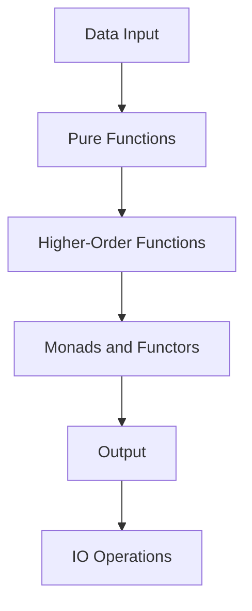

## 3.15 Writing Idiomatic Haskell Code

Writing idiomatic Haskell code is an art that combines the elegance of functional programming with the power of Haskell's unique features. This section will guide you through the best practices, common idioms, and pitfalls to avoid when crafting Haskell code that is not only correct but also elegant and maintainable.

### Code Style Guidelines

#### 1. Follow Community Conventions

Haskell has a rich community with established conventions that enhance code readability and maintainability. Adhering to these conventions is crucial for writing idiomatic Haskell code.

- **Naming Conventions**: Use camelCase for functions and variables, and PascalCase for data types and constructors. For example:

  ```haskell
  data Person = Person { firstName :: String, lastName :: String }
  ```

- **Indentation**: Use consistent indentation, typically two spaces. This helps in maintaining the visual structure of the code.

- **Line Length**: Keep lines under 80 characters when possible. This ensures that code is easily readable in various environments.

- **Module Structure**: Organize code into modules with clear exports. Use module headers to document the purpose and usage of each module.

#### 2. Use Type Annotations

Type annotations improve code readability and help the compiler catch errors early. They serve as documentation for the expected types of functions and variables.

```haskell
add :: Int -> Int -> Int
add x y = x + y
```

#### 3. Leverage Pattern Matching

Pattern matching is a powerful feature in Haskell that simplifies code and enhances readability. Use it to destructure data types and handle different cases elegantly.

```haskell
describeList :: [a] -> String
describeList xs = case xs of
  [] -> "The list is empty."
  [x] -> "The list has one element."
  _ -> "The list has multiple elements."
```

### Common Idioms

#### 1. Use Higher-Order Functions

Higher-order functions are functions that take other functions as arguments or return them as results. They are central to functional programming and Haskell.

- **Map and Filter**: Use `map` and `filter` to operate on lists.

  ```haskell
  squares :: [Int] -> [Int]
  squares = map (^2)

  evens :: [Int] -> [Int]
  evens = filter even
  ```

- **Fold**: Use `foldr` and `foldl` to reduce lists to a single value.

  ```haskell
  sumList :: [Int] -> Int
  sumList = foldr (+) 0
  ```

#### 2. Embrace Immutability

Haskell's immutability ensures that data cannot be changed once created, leading to safer and more predictable code. Use persistent data structures and avoid mutable state.

#### 3. Utilize Monads and Functors

Monads and functors abstract common patterns of computation. Use them to handle side effects, manage state, and compose functions.

- **Maybe Monad**: Handle optional values without null checks.

  ```haskell
  safeHead :: [a] -> Maybe a
  safeHead [] = Nothing
  safeHead (x:_) = Just x
  ```

- **IO Monad**: Manage side effects in a controlled manner.

  ```haskell
  main :: IO ()
  main = do
    putStrLn "Enter your name:"
    name <- getLine
    putStrLn ("Hello, " ++ name)
  ```

### Avoiding Anti-Patterns

#### 1. Recognize and Avoid Partial Functions

Partial functions are functions that do not handle all possible inputs, leading to runtime errors. Use total functions that cover all cases.

- **Avoid**: Using `head` on an empty list.

  ```haskell
  -- Unsafe
  firstElement :: [a] -> a
  firstElement = head
  ```

- **Use**: Safe alternatives like `safeHead`.

  ```haskell
  safeHead :: [a] -> Maybe a
  safeHead [] = Nothing
  safeHead (x:_) = Just x
  ```

#### 2. Avoid Excessive Use of IO

While IO is necessary for side effects, excessive use can lead to code that is difficult to test and reason about. Isolate IO operations and keep the core logic pure.

#### 3. Steer Clear of Overusing Type Classes

Type classes are powerful, but overusing them can lead to complex and unreadable code. Use them judiciously to provide polymorphism without sacrificing clarity.

### Try It Yourself

Let's experiment with some of the concepts discussed:

1. **Modify the `describeList` function** to handle lists with exactly two elements differently.
2. **Implement a function** that uses `foldr` to concatenate a list of strings with a separator.
3. **Refactor an IO-heavy function** to separate pure logic from side effects.

### Visualizing Idiomatic Haskell

To better understand how these concepts fit together, let's visualize the flow of data and functions in a typical Haskell program.



**Diagram Description**: This flowchart illustrates the typical flow in a Haskell program, starting from data input, through pure functions and higher-order functions, utilizing monads and functors, and finally reaching output and IO operations.

### References and Links

- [Haskell Wiki: Programming Guidelines](https://wiki.haskell.org/Programming_guidelines)
- [Learn You a Haskell for Great Good!](http://learnyouahaskell.com/)
- [Real World Haskell](http://book.realworldhaskell.org/)

### Knowledge Check

- What are the benefits of using type annotations in Haskell?
- How can pattern matching improve code readability?
- Why is it important to avoid partial functions?

### Embrace the Journey

Remember, writing idiomatic Haskell code is a journey of continuous learning and improvement. As you practice these principles, you'll find yourself writing more elegant and efficient Haskell code. Keep experimenting, stay curious, and enjoy the journey!

### Quiz: Writing Idiomatic Haskell Code



### What is the recommended naming convention for functions in Haskell?

- [x] camelCase
- [ ] snake_case
- [ ] PascalCase
- [ ] kebab-case

> **Explanation:** In Haskell, functions and variables typically use camelCase naming convention.

### What is the purpose of type annotations in Haskell?

- [x] Improve code readability and catch errors early
- [ ] Slow down the compiler
- [ ] Make code less readable
- [ ] Increase runtime performance

> **Explanation:** Type annotations serve as documentation and help the compiler catch errors early.

### Which of the following is a higher-order function in Haskell?

- [x] map
- [ ] if-else
- [ ] let-in
- [ ] case-of

> **Explanation:** `map` is a higher-order function that applies a function to each element of a list.

### What is a common anti-pattern in Haskell?

- [x] Using partial functions
- [ ] Using pure functions
- [ ] Using higher-order functions
- [ ] Using type annotations

> **Explanation:** Partial functions can lead to runtime errors if not all cases are handled.

### How can you handle optional values in Haskell?

- [x] Using the Maybe monad
- [ ] Using the IO monad
- [ ] Using the List monad
- [ ] Using the Either monad

> **Explanation:** The `Maybe` monad is used to handle optional values without null checks.

### What is the benefit of immutability in Haskell?

- [x] Safer and more predictable code
- [ ] Slower code execution
- [ ] More complex code
- [ ] Increased memory usage

> **Explanation:** Immutability ensures data cannot change, leading to safer and more predictable code.

### Which of the following is a total function?

- [x] safeHead
- [ ] head
- [ ] tail
- [ ] init

> **Explanation:** `safeHead` handles all possible inputs, making it a total function.

### What is the role of the IO monad in Haskell?

- [x] Manage side effects
- [ ] Improve performance
- [ ] Make code pure
- [ ] Handle optional values

> **Explanation:** The IO monad is used to manage side effects in Haskell.

### What is a common use of foldr in Haskell?

- [x] Reduce a list to a single value
- [ ] Create a list from a single value
- [ ] Sort a list
- [ ] Filter a list

> **Explanation:** `foldr` is used to reduce a list to a single value by applying a function.

### True or False: Overusing type classes can lead to complex and unreadable code.

- [x] True
- [ ] False

> **Explanation:** While type classes are powerful, overusing them can make code complex and hard to read.



By following these guidelines and practices, you'll be well on your way to writing idiomatic Haskell code that is both elegant and efficient. Keep exploring and refining your skills, and you'll find that Haskell's expressive power can lead to truly remarkable software solutions.
