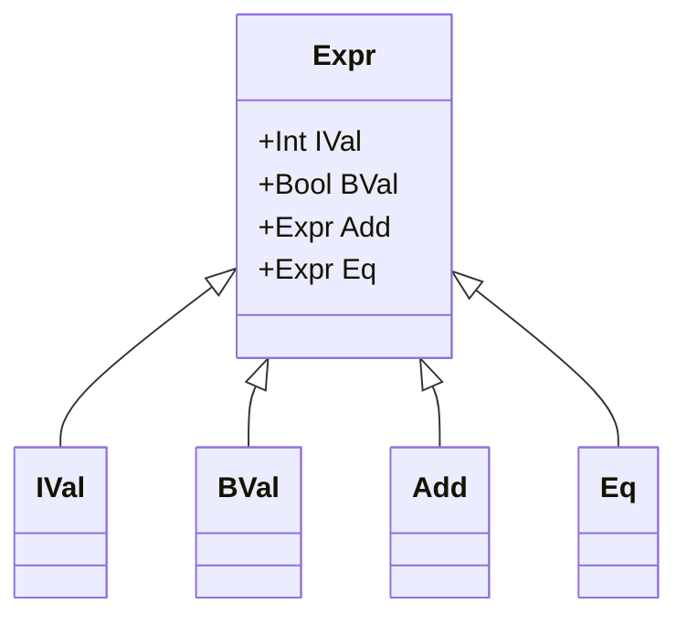
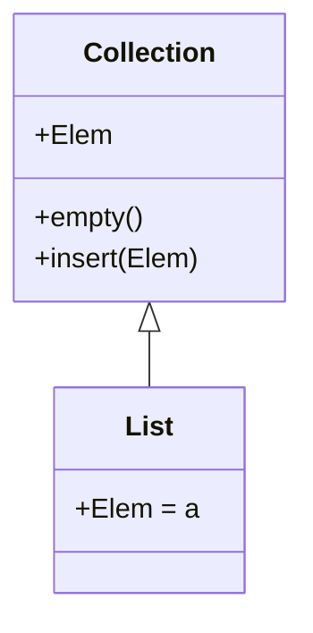

## 3.16 Haskell Language Extensions

Haskell is renowned for its expressive type system and functional programming paradigm. However, the language's core features can be extended to accommodate more advanced programming techniques and paradigms. Haskell language extensions are tools that allow developers to enhance the language's capabilities, enabling more concise, expressive, and powerful code. In this section, we will delve into the purpose of these extensions, explore some notable examples, and provide guidelines on their responsible use.

### Purpose of Extensions

Haskell language extensions serve to augment the language's standard features, allowing developers to:

- **Enhance Expressiveness**: Introduce new syntactic constructs that make code more readable and expressive.
- **Enable Advanced Type System Features**: Utilize more sophisticated type system capabilities, such as generalized algebraic data types (GADTs) and type families.
- **Facilitate Metaprogramming**: Use tools like TemplateHaskell for generating code programmatically.
- **Improve Interoperability**: Simplify integration with other languages and systems.

### Notable Extensions

Let's explore some of the most commonly used Haskell language extensions and their applications.

#### 1. OverloadedStrings

**Intent**: Allow string literals to be interpreted as different types, not just `String`.

**Usage**: This extension is particularly useful when working with libraries that use types like `Text` or `ByteString` instead of `String`.

```haskell
{-# LANGUAGE OverloadedStrings #-}

import Data.Text (Text)

greet :: Text -> Text
greet name = "Hello, " <> name

main :: IO ()
main = putStrLn $ greet "World"
```

**Explanation**: With `OverloadedStrings`, the string literal `"World"` is automatically interpreted as `Text`, thanks to the `IsString` type class.

#### 2. TemplateHaskell

**Intent**: Enable metaprogramming by allowing Haskell code to be generated and manipulated programmatically.

**Usage**: TemplateHaskell is used for tasks like generating boilerplate code, creating domain-specific languages, and more.

```haskell
{-# LANGUAGE TemplateHaskell #-}

import Language.Haskell.TH

-- Generate a simple function using TemplateHaskell
genFunction :: Q [Dec]
genFunction = [d| hello :: String -> String
                  hello name = "Hello, " ++ name |]

-- Splice the generated function into the module
$(genFunction)
```

**Explanation**: The `genFunction` generates a function definition, which is then spliced into the module using `$(...)`.

#### 3. Generalized Algebraic Data Types (GADTs)

**Intent**: Allow more precise type definitions by enabling constructors to have specific return types.

**Usage**: GADTs are useful for encoding more information in types, leading to safer and more expressive code.

```haskell
{-# LANGUAGE GADTs #-}

data Expr a where
  IVal :: Int -> Expr Int
  BVal :: Bool -> Expr Bool
  Add  :: Expr Int -> Expr Int -> Expr Int
  Eq   :: Expr Int -> Expr Int -> Expr Bool

eval :: Expr a -> a
eval (IVal n)   = n
eval (BVal b)   = b
eval (Add x y)  = eval x + eval y
eval (Eq x y)   = eval x == eval y
```

**Explanation**: The `Expr` type uses GADTs to ensure that operations like `Add` and `Eq` are only applied to compatible types.

#### 4. Type Families

**Intent**: Provide a way to define families of types that are related in some way.

**Usage**: Type families are used to create type-level functions, enabling more flexible and reusable code.

```haskell
{-# LANGUAGE TypeFamilies #-}

class Collection c where
  type Elem c
  empty :: c
  insert :: Elem c -> c -> c

instance Collection [a] where
  type Elem [a] = a
  empty = []
  insert = (:)
```

**Explanation**: The `Collection` class uses a type family to define an associated type `Elem`, allowing different collections to specify their element types.

#### 5. DataKinds

**Intent**: Promote data constructors to type-level, enabling more expressive type definitions.

**Usage**: DataKinds are used to enforce constraints at the type level, improving type safety.

```haskell
{-# LANGUAGE DataKinds #-}

data Nat = Zero | Succ Nat

type family Add (a :: Nat) (b :: Nat) :: Nat where
  Add Zero b = b
  Add (Succ a) b = Succ (Add a b)
```

**Explanation**: The `Nat` data type is promoted to the type level, allowing us to define type-level functions like `Add`.

### Guidelines for Using Language Extensions

While language extensions can significantly enhance Haskell's capabilities, they should be used judiciously. Here are some guidelines for their responsible use:

1. **Understand the Extension**: Before using an extension, ensure you understand its purpose and implications. Some extensions can introduce complexity or affect type inference.

2. **Use Extensions Sparingly**: Only use extensions when they provide clear benefits. Overusing extensions can make code harder to read and maintain.

3. **Document Extension Usage**: Clearly document the purpose of each extension in your code. This helps other developers understand why an extension is used.

4. **Consider Compatibility**: Some extensions may not be supported by all Haskell compilers or tools. Ensure that your code remains portable and compatible with your development environment.

5. **Evaluate Alternatives**: Before resorting to an extension, consider whether the same functionality can be achieved using standard Haskell features.

6. **Stay Updated**: Language extensions evolve over time. Stay informed about changes and new extensions that may offer better solutions.

### Visualizing Language Extensions

To better understand how language extensions interact with Haskell's type system and syntax, let's visualize some of these concepts using Mermaid.js diagrams.

#### Visualizing GADTs



**Caption**: This diagram illustrates the `Expr` GADT, showing how different constructors relate to the `Expr` type.

#### Visualizing Type Families



**Caption**: This diagram shows the `Collection` type class with a type family `Elem`, demonstrating how different instances specify their element types.

### Try It Yourself

To deepen your understanding of Haskell language extensions, try modifying the code examples provided. For instance, experiment with adding new constructors to the `Expr` GADT or defining additional type families. Observe how these changes affect type inference and code behavior.

### Knowledge Check

- **What are the benefits of using language extensions in Haskell?**
- **How does the `OverloadedStrings` extension enhance string handling?**
- **What is the purpose of TemplateHaskell, and how can it be used?**
- **Explain the role of GADTs in Haskell's type system.**
- **How do type families contribute to more flexible code design?**

### Embrace the Journey

Remember, exploring Haskell language extensions is just the beginning of your journey into advanced functional programming. As you continue to experiment and learn, you'll discover new ways to leverage these powerful tools to write more expressive and efficient code. Keep experimenting, stay curious, and enjoy the journey!

## Quiz: Haskell Language Extensions



### What is the primary purpose of Haskell language extensions?

- [x] To enhance the language's capabilities and expressiveness
- [ ] To replace the standard Haskell syntax
- [ ] To make Haskell compatible with other programming languages
- [ ] To simplify the Haskell compiler

> **Explanation:** Haskell language extensions are designed to enhance the language's capabilities and expressiveness, allowing developers to write more powerful and concise code.

### Which extension allows string literals to be interpreted as different types?

- [x] OverloadedStrings
- [ ] TemplateHaskell
- [ ] GADTs
- [ ] TypeFamilies

> **Explanation:** The `OverloadedStrings` extension allows string literals to be interpreted as different types, such as `Text` or `ByteString`, by utilizing the `IsString` type class.

### What is the role of TemplateHaskell in Haskell programming?

- [x] To enable metaprogramming by generating and manipulating code programmatically
- [ ] To enforce strict type checking
- [ ] To simplify string handling
- [ ] To improve performance of Haskell programs

> **Explanation:** TemplateHaskell is used for metaprogramming, allowing developers to generate and manipulate Haskell code programmatically.

### How do GADTs enhance Haskell's type system?

- [x] By allowing constructors to have specific return types
- [ ] By simplifying type inference
- [ ] By enabling dynamic typing
- [ ] By improving string handling

> **Explanation:** GADTs allow constructors to have specific return types, enabling more precise and expressive type definitions in Haskell.

### What is a key benefit of using type families in Haskell?

- [x] They provide a way to define families of types that are related
- [ ] They simplify string handling
- [ ] They improve performance
- [ ] They enable dynamic typing

> **Explanation:** Type families allow developers to define families of types that are related, enabling more flexible and reusable code.

### Which extension promotes data constructors to the type level?

- [x] DataKinds
- [ ] OverloadedStrings
- [ ] TemplateHaskell
- [ ] GADTs

> **Explanation:** The `DataKinds` extension promotes data constructors to the type level, allowing for more expressive type definitions.

### What should developers consider before using a language extension?

- [x] Understand its purpose and implications
- [ ] Use it in every project
- [ ] Avoid documenting its usage
- [ ] Ensure it replaces standard Haskell features

> **Explanation:** Developers should understand the purpose and implications of a language extension before using it, ensuring it provides clear benefits.

### How can language extensions affect code readability?

- [x] They can make code harder to read if overused
- [ ] They always improve readability
- [ ] They have no impact on readability
- [ ] They simplify all code

> **Explanation:** Overusing language extensions can make code harder to read and maintain, so they should be used judiciously.

### What is a potential drawback of using too many language extensions?

- [x] Code may become harder to maintain and understand
- [ ] Code will always run slower
- [ ] Code will be less expressive
- [ ] Code will be incompatible with all compilers

> **Explanation:** Using too many language extensions can make code harder to maintain and understand, so it's important to use them sparingly.

### True or False: Language extensions are a mandatory part of Haskell programming.

- [ ] True
- [x] False

> **Explanation:** Language extensions are optional tools that enhance Haskell's capabilities, but they are not mandatory for programming in Haskell.


