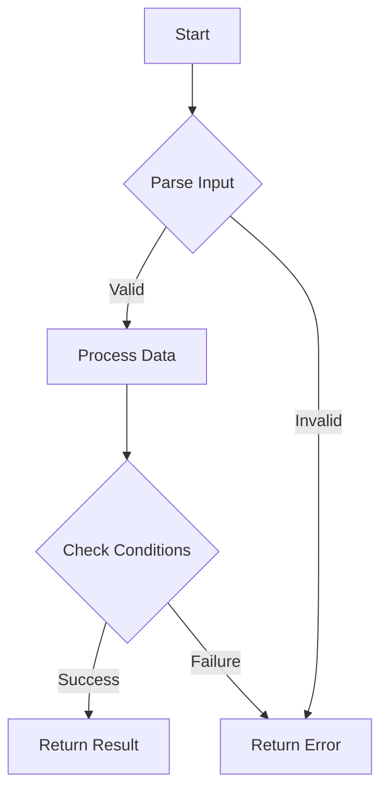

## 3.17 Error Handling and Validation Patterns

In the realm of functional programming, error handling and validation are crucial components that ensure the robustness and reliability of software systems. Haskell, with its strong type system and functional paradigms, offers unique and powerful ways to handle errors and validate data. In this section, we will explore various error handling and validation patterns in Haskell, focusing on types like `Either` and `Validation`, and how to design for failure effectively.

### Approaches to Error Handling

Error handling in Haskell is fundamentally different from imperative languages. Instead of using exceptions, Haskell relies on types to represent computations that may fail. This approach not only makes error handling explicit but also integrates it seamlessly into the type system, allowing for more predictable and maintainable code.

#### Using `Either` for Error Handling

The `Either` type is a fundamental tool in Haskell for representing computations that can fail. It is defined as follows:

```haskell
data Either a b = Left a | Right b
```

- **Left** is typically used to represent an error, while **Right** represents a successful computation.
- This dual nature allows functions to return either a result or an error, making error handling explicit.

##### Example: Using `Either` in a Function

Let's consider a simple example where we parse an integer from a string:

```haskell
parseInt :: String -> Either String Int
parseInt s = case reads s of
    [(n, "")] -> Right n
    _         -> Left "Invalid integer"
```

In this example, `parseInt` returns an `Either String Int`, where `Left` contains an error message and `Right` contains the parsed integer.

##### Chaining Computations with `Either`

Haskell's `Either` type can be used in conjunction with monadic operations to chain computations that may fail:

```haskell
import Control.Monad (liftM2)

addParsedInts :: String -> String -> Either String Int
addParsedInts s1 s2 = liftM2 (+) (parseInt s1) (parseInt s2)
```

Here, `liftM2` is used to apply the addition operation to two `Either` values, propagating errors if any occur.

#### Validation with `Data.Validation`

While `Either` is suitable for handling single errors, it is not ideal for accumulating multiple validation errors. This is where the `Validation` type from the `Data.Validation` library comes into play.

##### Introduction to `Validation`

The `Validation` type is similar to `Either`, but it is designed to accumulate errors:

```haskell
data Validation e a = Failure e | Success a
```

- **Failure** accumulates errors, while **Success** represents a successful computation.

##### Example: Using `Validation` for Multiple Errors

Consider a scenario where we validate a user registration form:

```haskell
import Data.Validation

data User = User { username :: String, age :: Int }

validateUsername :: String -> Validation [String] String
validateUsername name
    | length name < 3 = Failure ["Username too short"]
    | otherwise       = Success name

validateAge :: Int -> Validation [String] Int
validateAge age
    | age < 18   = Failure ["User must be at least 18"]
    | otherwise  = Success age

validateUser :: String -> Int -> Validation [String] User
validateUser name age = User <$> validateUsername name <*> validateAge age
```

In this example, `validateUser` uses the applicative style to combine multiple validations, accumulating errors if any occur.

### Designing for Failure

Designing for failure involves crafting functions and systems that can gracefully handle errors and communicate them effectively. This includes using types to represent errors, providing meaningful error messages, and ensuring that errors are handled at appropriate levels in the application.

#### Crafting Functions with Error Handling

When designing functions, consider the following best practices:

- **Use Types to Represent Errors**: Leverage Haskell's type system to represent errors explicitly. This makes it clear which functions can fail and what kind of errors they might produce.
- **Provide Meaningful Error Messages**: Ensure that error messages are informative and help diagnose the problem.
- **Handle Errors at the Right Level**: Decide whether errors should be handled locally within a function or propagated to higher levels.

##### Example: Designing a Robust Function

Let's design a function that reads a file and parses its content as integers:

```haskell
import System.IO
import Control.Exception (try, IOException)

readIntegersFromFile :: FilePath -> IO (Either String [Int])
readIntegersFromFile path = do
    result <- try (readFile path) :: IO (Either IOException String)
    case result of
        Left _ -> return $ Left "Failed to read file"
        Right content -> return $ traverse parseInt (lines content)
```

In this example, `readIntegersFromFile` uses `try` to handle IO exceptions and returns an `Either` type to represent potential errors.

### Error Handling Patterns

Haskell provides several patterns for handling errors effectively. Let's explore some of these patterns and how they can be applied in real-world scenarios.

#### Pattern: Using `Maybe` for Optional Values

The `Maybe` type is used to represent computations that may not return a value:

```haskell
data Maybe a = Nothing | Just a
```

- **Nothing** represents the absence of a value, while **Just** contains a value.

##### Example: Using `Maybe` for Safe Lookup

Consider a function that looks up a value in a list:

```haskell
safeLookup :: Eq a => a -> [(a, b)] -> Maybe b
safeLookup _ [] = Nothing
safeLookup key ((k, v):xs)
    | key == k  = Just v
    | otherwise = safeLookup key xs
```

In this example, `safeLookup` returns `Nothing` if the key is not found, and `Just` the value if it is.

#### Pattern: Using `MonadError` for Error Handling

The `MonadError` type class provides a way to handle errors in a monadic context:

```haskell
class Monad m => MonadError e m | m -> e where
    throwError :: e -> m a
    catchError :: m a -> (e -> m a) -> m a
```

##### Example: Using `MonadError` with `Either`

Let's use `MonadError` to handle errors in a computation:

```haskell
import Control.Monad.Except

type MyMonad = ExceptT String IO

exampleComputation :: MyMonad Int
exampleComputation = do
    x <- liftIO $ parseInt "123"
    y <- liftIO $ parseInt "abc"
    return (x + y) `catchError` \err -> liftIO $ putStrLn ("Error: " ++ err) >> return 0
```

In this example, `exampleComputation` uses `MonadError` to catch and handle errors during the computation.

### Visualizing Error Handling with Mermaid.js

To better understand how error handling flows in Haskell, let's visualize the process using a Mermaid.js flowchart.



**Figure 1**: This flowchart illustrates a typical error handling process in Haskell, where input is parsed, conditions are checked, and errors are returned if necessary.

### Key Participants in Error Handling

- **Types**: `Either`, `Maybe`, `Validation`, and custom error types.
- **Functions**: Functions that return these types and handle errors appropriately.
- **Libraries**: Libraries like `Data.Validation` that provide additional tools for error handling.

### Applicability of Error Handling Patterns

Error handling patterns in Haskell are applicable in a wide range of scenarios, from simple data validation to complex system interactions. They are particularly useful in:

- **Data Parsing**: Ensuring that data is correctly parsed and validated.
- **IO Operations**: Handling potential failures in file and network operations.
- **Business Logic**: Validating business rules and constraints.

### Design Considerations

When applying error handling patterns, consider the following:

- **Error Propagation**: Decide whether errors should be propagated or handled locally.
- **Error Accumulation**: Use `Validation` for scenarios where multiple errors need to be accumulated.
- **Performance**: Consider the performance implications of error handling, especially in high-performance applications.

### Haskell Unique Features

Haskell's type system and functional paradigms provide unique features for error handling:

- **Type Safety**: Errors are represented as types, ensuring that they are handled explicitly.
- **Composability**: Error handling can be composed using monadic and applicative operations.
- **Immutability**: Immutable data structures ensure that errors do not lead to unexpected side effects.

### Differences and Similarities with Other Patterns

- **`Either` vs `Maybe`**: `Either` is used for computations that can fail with an error, while `Maybe` is used for optional values.
- **`Either` vs `Validation`**: `Either` is suitable for single errors, while `Validation` is used for accumulating multiple errors.

### Try It Yourself

Experiment with the code examples provided in this section. Try modifying the error messages, adding new validation rules, or using different error handling patterns. This hands-on approach will deepen your understanding of error handling in Haskell.

### Knowledge Check

- What is the primary purpose of the `Either` type in Haskell?
- How does the `Validation` type differ from `Either`?
- Why is it important to design functions with error handling in mind?
- How can `MonadError` be used to handle errors in a monadic context?

### Embrace the Journey

Remember, mastering error handling and validation patterns in Haskell is a journey. As you progress, you'll build more robust and reliable systems. Keep experimenting, stay curious, and enjoy the journey!

## Quiz: Error Handling and Validation Patterns



### What is the primary purpose of the `Either` type in Haskell?

- [x] To represent computations that can fail with an error or succeed with a result.
- [ ] To represent optional values that may or may not exist.
- [ ] To accumulate multiple validation errors.
- [ ] To handle exceptions in IO operations.

> **Explanation:** The `Either` type is used to represent computations that can fail with an error (Left) or succeed with a result (Right).

### How does the `Validation` type differ from `Either`?

- [x] `Validation` is used to accumulate multiple errors, while `Either` handles single errors.
- [ ] `Validation` is used for optional values, while `Either` is not.
- [ ] `Validation` is a monad, while `Either` is not.
- [ ] `Validation` is used for IO operations, while `Either` is not.

> **Explanation:** The `Validation` type is designed to accumulate multiple errors, unlike `Either`, which is used for single errors.

### What is the role of `MonadError` in Haskell?

- [x] To provide a way to handle errors in a monadic context.
- [ ] To represent computations that may not return a value.
- [ ] To accumulate validation errors.
- [ ] To handle exceptions in IO operations.

> **Explanation:** `MonadError` provides a way to handle errors within a monadic context, allowing for error propagation and handling.

### Which type is used to represent optional values in Haskell?

- [x] Maybe
- [ ] Either
- [ ] Validation
- [ ] MonadError

> **Explanation:** The `Maybe` type is used to represent optional values that may or may not exist.

### What is a key benefit of using types for error handling in Haskell?

- [x] It makes error handling explicit and integrates it into the type system.
- [ ] It allows for implicit error handling without additional code.
- [ ] It eliminates the need for error messages.
- [ ] It simplifies IO operations.

> **Explanation:** Using types for error handling makes it explicit and integrates it into the type system, ensuring that errors are handled predictably.

### How can `Validation` be used in Haskell?

- [x] To accumulate multiple validation errors in a computation.
- [ ] To handle exceptions in IO operations.
- [ ] To represent optional values.
- [ ] To simplify monadic computations.

> **Explanation:** `Validation` is used to accumulate multiple validation errors, making it ideal for scenarios where multiple checks are needed.

### What is a common use case for the `Either` type?

- [x] Parsing input data that may fail.
- [ ] Representing optional values.
- [ ] Accumulating multiple errors.
- [ ] Handling exceptions in IO operations.

> **Explanation:** The `Either` type is commonly used for parsing input data that may fail, returning an error or a result.

### What is the purpose of `catchError` in `MonadError`?

- [x] To handle errors in a monadic computation.
- [ ] To represent optional values.
- [ ] To accumulate validation errors.
- [ ] To simplify IO operations.

> **Explanation:** `catchError` is used to handle errors within a monadic computation, allowing for error recovery.

### Which pattern is suitable for accumulating multiple validation errors?

- [x] Validation
- [ ] Either
- [ ] Maybe
- [ ] MonadError

> **Explanation:** The `Validation` pattern is suitable for accumulating multiple validation errors, unlike `Either`, which handles single errors.

### True or False: The `Either` type can be used to accumulate multiple errors in a computation.

- [ ] True
- [x] False

> **Explanation:** The `Either` type is not designed to accumulate multiple errors; it handles single errors. For multiple errors, `Validation` is more appropriate.


