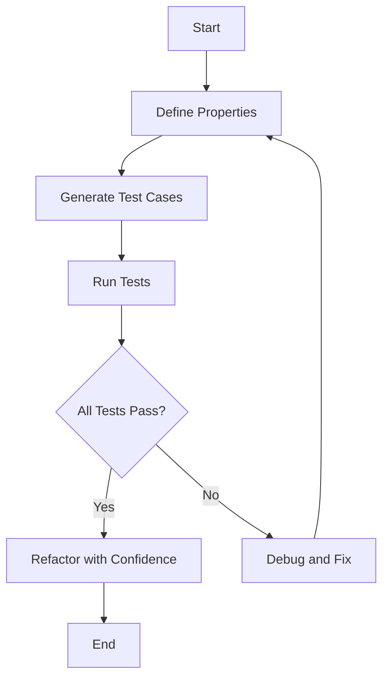

## 3.18 Testing and Property-Based Testing

In the realm of software development, testing is a crucial aspect that ensures the correctness, reliability, and robustness of applications. In Haskell, a language known for its strong emphasis on correctness and type safety, testing plays an equally vital role. This section delves into the importance of testing in Haskell, with a particular focus on property-based testing using QuickCheck and behavior-driven development using Hspec.

### Importance of Testing in Haskell

Testing in Haskell is essential for several reasons:

1. **Ensuring Correctness**: Haskell's type system is powerful, but it cannot catch all logical errors. Testing helps ensure that the code behaves as expected.
2. **Refactoring Confidence**: With comprehensive tests, developers can refactor code with confidence, knowing that any regressions will be caught.
3. **Documentation**: Tests serve as a form of documentation, illustrating how functions are intended to be used and what their expected outputs are.
4. **Functional Paradigms**: Haskell's functional nature allows for unique testing strategies, such as property-based testing, which can be more expressive and powerful than traditional example-based testing.

### QuickCheck: Property-Based Testing

QuickCheck is a library for property-based testing in Haskell. It allows developers to specify properties that functions should satisfy and then automatically generates test cases to verify these properties.

#### Key Concepts of QuickCheck

- **Properties**: A property is a statement about the expected behavior of a function. For example, a property might state that reversing a list twice should yield the original list.
- **Generators**: QuickCheck uses generators to produce random test data. This allows for a wide range of inputs to be tested, increasing the likelihood of uncovering edge cases.
- **Shrinking**: When a test fails, QuickCheck attempts to simplify the input to find the smallest failing case, making debugging easier.

#### Writing Properties with QuickCheck

Let's explore how to write properties using QuickCheck with a simple example:

```haskell
import Test.QuickCheck

-- Property: Reversing a list twice yields the original list
prop_reverseTwice :: [Int] -> Bool
prop_reverseTwice xs = reverse (reverse xs) == xs

-- Run the property test
main :: IO ()
main = quickCheck prop_reverseTwice
```

In this example, `prop_reverseTwice` is a property that states reversing a list twice should return the original list. QuickCheck will automatically generate lists of integers to test this property.

#### Advanced QuickCheck Features

- **Custom Generators**: You can define custom generators for more complex data types.
- **Conditional Properties**: Properties can include preconditions that must be satisfied for the test to run.
- **Combining Properties**: Multiple properties can be combined to form more comprehensive tests.

#### Try It Yourself

Experiment with QuickCheck by modifying the property to test different list operations, such as concatenation or sorting. Observe how QuickCheck handles these properties and the types of test cases it generates.

### Hspec: Behavior-Driven Development

Hspec is a testing framework for Haskell inspired by behavior-driven development (BDD). It allows developers to write human-readable specifications for their code, making tests more understandable and maintainable.

#### Key Concepts of Hspec

- **Specifications**: Hspec tests are written as specifications, describing the behavior of functions in a declarative manner.
- **Describe and It Blocks**: Tests are organized into `describe` blocks, which group related tests, and `it` blocks, which specify individual test cases.
- **Integration with QuickCheck**: Hspec can be integrated with QuickCheck to include property-based tests within behavior-driven specifications.

#### Writing Tests with Hspec

Here's an example of how to write tests using Hspec:

```haskell
import Test.Hspec

-- Function to test
add :: Int -> Int -> Int
add x y = x + y

-- Hspec test suite
main :: IO ()
main = hspec $ do
  describe "add" $ do
    it "adds two positive numbers" $ do
      add 1 2 `shouldBe` 3

    it "adds a positive and a negative number" $ do
      add 1 (-1) `shouldBe` 0

    it "is commutative" $ do
      property $ \x y -> add x y == add y x
```

In this example, we define a simple `add` function and write tests to verify its behavior. The `property` function is used to integrate QuickCheck properties into the Hspec test suite.

#### Advanced Hspec Features

- **Hooks**: Hspec supports setup and teardown hooks for managing test state.
- **Focused and Pending Tests**: Tests can be marked as focused or pending to control which tests are run.
- **Custom Matchers**: Developers can define custom matchers to extend Hspec's expressive power.

#### Try It Yourself

Enhance the `add` function tests by adding more properties, such as associativity or identity. Experiment with Hspec's hooks to manage test state.

### Visualizing Testing Workflows

To better understand the testing workflow in Haskell, let's visualize the process using a flowchart:



**Figure 1**: This flowchart illustrates the typical workflow for testing in Haskell using QuickCheck and Hspec. It highlights the iterative nature of testing, where failing tests lead to debugging and fixing, while passing tests provide confidence for refactoring.

### References and Further Reading

- [QuickCheck Documentation](https://hackage.haskell.org/package/QuickCheck)
- [Hspec Documentation](https://hspec.github.io/)
- [Property-Based Testing in Haskell](https://www.fpcomplete.com/haskell/tutorial/quickcheck/)
- [Behavior-Driven Development with Hspec](https://hspec.github.io/)

### Knowledge Check

- What is the primary advantage of property-based testing over example-based testing?
- How does QuickCheck simplify debugging when a test fails?
- What are the benefits of using Hspec for behavior-driven development?

### Exercises

1. **Property Exploration**: Write a QuickCheck property for a function that checks if a list is a palindrome.
2. **Hspec Integration**: Create an Hspec test suite for a simple calculator application, integrating QuickCheck properties for commutative operations.
3. **Custom Generators**: Define a custom generator for a data type representing a binary tree and write properties to test tree operations.

### Embrace the Journey

Remember, testing is an integral part of the software development process. As you continue to explore Haskell's testing capabilities, you'll gain deeper insights into the language's strengths and how to leverage them for building robust applications. Keep experimenting, stay curious, and enjoy the journey!

## Quiz: Testing and Property-Based Testing



### What is the primary advantage of property-based testing?

- [x] It automatically generates a wide range of test cases.
- [ ] It requires less code than example-based testing.
- [ ] It is easier to understand than example-based testing.
- [ ] It provides better performance than example-based testing.

> **Explanation:** Property-based testing automatically generates a wide range of test cases, increasing the likelihood of uncovering edge cases.

### How does QuickCheck simplify debugging when a test fails?

- [x] By shrinking the input to find the smallest failing case.
- [ ] By providing detailed error messages.
- [ ] By automatically fixing the code.
- [ ] By generating a report of all test cases.

> **Explanation:** QuickCheck simplifies debugging by shrinking the input to find the smallest failing case, making it easier to identify the root cause of the failure.

### What is a key feature of Hspec?

- [x] It allows writing human-readable specifications.
- [ ] It automatically generates test cases.
- [ ] It integrates with JavaScript testing frameworks.
- [ ] It provides a graphical user interface for testing.

> **Explanation:** Hspec allows writing human-readable specifications, making tests more understandable and maintainable.

### How can QuickCheck properties be integrated into Hspec?

- [x] Using the `property` function within `it` blocks.
- [ ] By importing a special QuickCheck module.
- [ ] By writing properties in a separate file.
- [ ] By using a command-line tool.

> **Explanation:** QuickCheck properties can be integrated into Hspec using the `property` function within `it` blocks.

### What is the purpose of custom generators in QuickCheck?

- [x] To produce random test data for complex data types.
- [ ] To simplify the test setup process.
- [ ] To improve test performance.
- [ ] To automatically fix failing tests.

> **Explanation:** Custom generators in QuickCheck are used to produce random test data for complex data types, allowing for more comprehensive testing.

### What is a benefit of using behavior-driven development with Hspec?

- [x] It makes tests more understandable and maintainable.
- [ ] It reduces the need for documentation.
- [ ] It eliminates the need for manual testing.
- [ ] It improves code performance.

> **Explanation:** Behavior-driven development with Hspec makes tests more understandable and maintainable by using human-readable specifications.

### What is a common use case for QuickCheck's shrinking feature?

- [x] Simplifying the input to find the smallest failing case.
- [ ] Generating a large number of test cases.
- [ ] Improving test performance.
- [ ] Automatically fixing code errors.

> **Explanation:** QuickCheck's shrinking feature is commonly used to simplify the input to find the smallest failing case, aiding in debugging.

### What is a key advantage of using property-based testing in Haskell?

- [x] It can uncover edge cases that example-based testing might miss.
- [ ] It requires less setup than example-based testing.
- [ ] It is easier to write than example-based testing.
- [ ] It provides better performance than example-based testing.

> **Explanation:** Property-based testing can uncover edge cases that example-based testing might miss, making it a powerful testing strategy.

### What is the role of the `describe` block in Hspec?

- [x] To group related tests together.
- [ ] To define a single test case.
- [ ] To integrate with QuickCheck.
- [ ] To provide setup and teardown hooks.

> **Explanation:** The `describe` block in Hspec is used to group related tests together, organizing the test suite.

### True or False: QuickCheck can only be used for testing pure functions.

- [ ] True
- [x] False

> **Explanation:** False. QuickCheck can be used for testing both pure and impure functions, although it is most commonly used for pure functions due to Haskell's functional nature.


