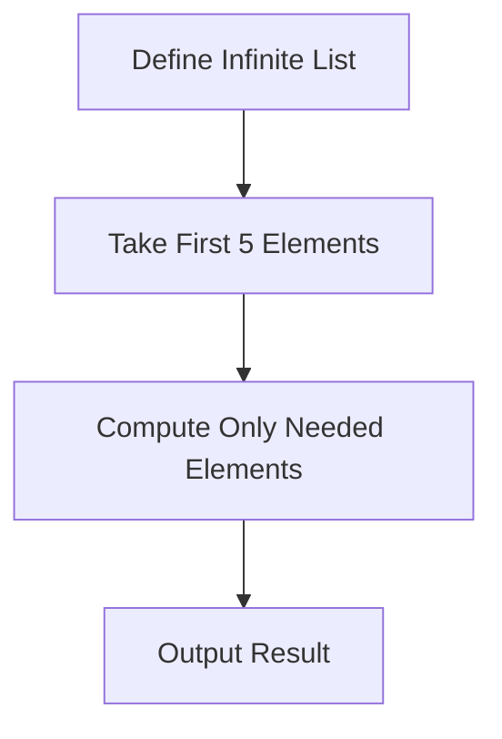

## 3.19 Performance Optimization Techniques

In the world of Haskell programming, performance optimization is a critical aspect that can significantly impact the efficiency and scalability of your applications. As expert software engineers and architects, understanding how to leverage Haskell's unique features to optimize performance is essential. This section will guide you through the intricacies of performance optimization in Haskell, focusing on profiling tools, code optimization strategies, and the nuances of lazy evaluation.

### Profiling Tools: Identifying Performance Bottlenecks

Profiling is the first step in performance optimization. It involves measuring various aspects of your program to identify bottlenecks. Haskell offers several powerful profiling tools that can help you gain insights into your program's performance.

#### GHC Profiler

The GHC (Glasgow Haskell Compiler) profiler is a built-in tool that provides detailed information about your program's runtime behavior. It can help you identify which parts of your code consume the most time and memory.

- **How to Use GHC Profiler**: Compile your Haskell program with profiling enabled using the `-prof` flag. For example:
  ```bash
  ghc -prof -fprof-auto -rtsopts MyProgram.hs
  ```
  Run your program with runtime options to generate a profile report:
  ```bash
  ./MyProgram +RTS -p
  ```

- **Interpreting Profile Reports**: The profile report includes information about time and space usage. Look for functions with high percentages of total runtime or memory allocation.

#### ThreadScope

For concurrent Haskell programs, ThreadScope is an invaluable tool. It provides a visual representation of your program's execution, helping you understand thread behavior and identify concurrency issues.

- **Using ThreadScope**: First, compile your program with event logging enabled:
  ```bash
  ghc -eventlog MyProgram.hs
  ```
  Run your program to generate an event log file:
  ```bash
  ./MyProgram +RTS -l
  ```
  Open the log file in ThreadScope to analyze thread activity.

#### Criterion

Criterion is a benchmarking library that helps you measure the performance of individual functions. It provides precise and reliable measurements, making it ideal for micro-optimizations.

- **Setting Up Criterion**: Add Criterion to your project's dependencies and create a benchmark suite. Here's an example:
  ```haskell
  import Criterion.Main

  main :: IO ()
  main = defaultMain [
      bench "fib 10" $ whnf fib 10
    ]

  fib :: Int -> Int
  fib 0 = 0
  fib 1 = 1
  fib n = fib (n - 1) + fib (n - 2)
  ```

### Optimizing Code: Strategies for Improving Time and Space Efficiency

Once you've identified bottlenecks, the next step is to optimize your code. Haskell's functional nature and lazy evaluation model offer unique opportunities and challenges for optimization.

#### Algorithmic Improvements

- **Choose Efficient Algorithms**: The choice of algorithm can have a significant impact on performance. For example, using a more efficient sorting algorithm or data structure can reduce time complexity.

- **Avoid Unnecessary Computations**: Use memoization to store the results of expensive computations and avoid recalculating them. Haskell's lazy evaluation can help with this, but explicit memoization may be necessary for certain cases.

#### Data Structure Optimization

- **Use Appropriate Data Structures**: Choose data structures that match your access patterns. For example, use `Data.Map` for associative arrays and `Data.Vector` for efficient arrays.

- **Leverage Persistent Data Structures**: Haskell's immutable data structures can be optimized for performance by using persistent data structures that share common parts.

#### Code Refactoring

- **Inline Small Functions**: Inlining small functions can reduce function call overhead. Use the `INLINE` pragma to suggest inlining to the compiler.

- **Eliminate Redundant Code**: Remove unnecessary computations and simplify expressions to reduce execution time.

#### Parallelism and Concurrency

- **Use Parallelism**: Haskell's `par` and `pseq` combinators allow you to express parallel computations. Use them to take advantage of multi-core processors.

- **Leverage Concurrency**: Use Haskell's lightweight threads and Software Transactional Memory (STM) for concurrent programming. This can improve performance in I/O-bound applications.

### Understanding Lazy Evaluation: How Laziness Affects Performance

Lazy evaluation is a core feature of Haskell that can both improve and hinder performance. Understanding how laziness works is crucial for effective optimization.

#### Benefits of Lazy Evaluation

- **Avoid Unnecessary Computations**: Laziness allows Haskell to defer computations until their results are needed. This can lead to performance improvements by avoiding unnecessary work.

- **Infinite Data Structures**: Laziness enables the use of infinite data structures, such as streams, which can be processed incrementally.

#### Challenges of Lazy Evaluation

- **Space Leaks**: Laziness can lead to space leaks if unevaluated thunks accumulate in memory. Use strict evaluation (`seq`, `BangPatterns`) to force evaluation and prevent space leaks.

- **Predicting Performance**: The deferred nature of lazy evaluation can make it difficult to predict performance. Profiling and careful analysis are necessary to understand the impact of laziness on your program.

#### Strategies for Managing Laziness

- **Use Strict Data Structures**: When performance is critical, consider using strict versions of data structures, such as `Data.Vector` or `Data.ByteString`.

- **Control Evaluation Order**: Use `seq` and `deepseq` to control the order of evaluation and ensure that critical computations are performed eagerly.

### Visualizing Lazy Evaluation

To better understand lazy evaluation, let's visualize how it works in Haskell using a simple example.

```haskell
-- Define a lazy list of numbers
numbers :: [Int]
numbers = [1..]

-- Take the first 5 numbers
firstFive :: [Int]
firstFive = take 5 numbers

main :: IO ()
main = print firstFive
```

In this example, the list `numbers` is infinite, but due to lazy evaluation, only the first five elements are computed. This demonstrates how laziness can efficiently handle potentially large computations.



### Try It Yourself

Experiment with the code examples provided in this section. Try modifying the `fib` function to use memoization, or explore the impact of different data structures on performance. Use profiling tools to measure the effects of your changes.

### Knowledge Check

- What are the benefits and challenges of lazy evaluation in Haskell?
- How can you use profiling tools to identify performance bottlenecks?
- What strategies can you employ to optimize Haskell code for time and space efficiency?

### Embrace the Journey

Remember, performance optimization is an iterative process. As you gain experience with Haskell's unique features, you'll become more adept at identifying and addressing performance issues. Keep experimenting, stay curious, and enjoy the journey of mastering Haskell performance optimization.

## Quiz: Performance Optimization Techniques



### What is the primary purpose of profiling in Haskell?

- [x] To identify performance bottlenecks
- [ ] To compile Haskell code
- [ ] To write Haskell code
- [ ] To debug Haskell code

> **Explanation:** Profiling is used to measure various aspects of a program to identify performance bottlenecks.

### Which tool provides a visual representation of thread behavior in concurrent Haskell programs?

- [ ] GHC Profiler
- [x] ThreadScope
- [ ] Criterion
- [ ] Haddock

> **Explanation:** ThreadScope provides a visual representation of thread behavior, helping to identify concurrency issues.

### What is a common challenge associated with lazy evaluation in Haskell?

- [ ] Increased time complexity
- [x] Space leaks
- [ ] Lack of concurrency support
- [ ] Difficulty in writing code

> **Explanation:** Lazy evaluation can lead to space leaks if unevaluated thunks accumulate in memory.

### Which Haskell feature allows you to express parallel computations?

- [ ] STM
- [ ] MVar
- [x] par and pseq
- [ ] IO Monad

> **Explanation:** The `par` and `pseq` combinators allow you to express parallel computations in Haskell.

### What is the benefit of using strict data structures in Haskell?

- [x] Improved performance by avoiding space leaks
- [ ] Easier code readability
- [ ] Better concurrency support
- [ ] Simplified syntax

> **Explanation:** Strict data structures can improve performance by avoiding space leaks associated with lazy evaluation.

### How can you control the order of evaluation in Haskell?

- [ ] Using lazy patterns
- [x] Using seq and deepseq
- [ ] Using type classes
- [ ] Using monads

> **Explanation:** `seq` and `deepseq` can be used to control the order of evaluation and ensure eager computation.

### Which library is used for benchmarking individual functions in Haskell?

- [ ] GHC Profiler
- [ ] ThreadScope
- [x] Criterion
- [ ] QuickCheck

> **Explanation:** Criterion is a benchmarking library used to measure the performance of individual functions.

### What is a benefit of lazy evaluation in Haskell?

- [x] Avoiding unnecessary computations
- [ ] Increased memory usage
- [ ] Simplified syntax
- [ ] Improved concurrency

> **Explanation:** Lazy evaluation allows Haskell to defer computations until their results are needed, avoiding unnecessary work.

### Which pragma can be used to suggest inlining to the Haskell compiler?

- [ ] NOINLINE
- [x] INLINE
- [ ] SPECIALIZE
- [ ] UNPACK

> **Explanation:** The `INLINE` pragma suggests inlining small functions to the Haskell compiler.

### True or False: Profiling is only useful for identifying memory usage issues.

- [ ] True
- [x] False

> **Explanation:** Profiling is useful for identifying both time and memory usage issues in a program.




