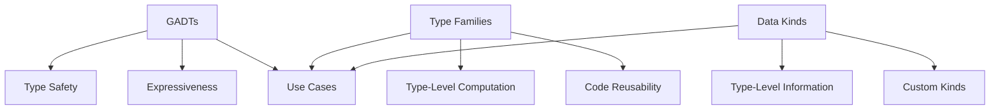

## 3.2 Advanced Type System Features (GADTs, Type Families, Data Kinds)

In this section, we delve into the advanced type system features of Haskell that empower developers to write more expressive, type-safe, and maintainable code. These features include Generalized Algebraic Data Types (GADTs), Type Families, and Data Kinds. By mastering these concepts, you can leverage Haskell's powerful type system to enforce invariants and encode domain-specific logic directly in the type system.

### Generalized Algebraic Data Types (GADTs)

**Generalized Algebraic Data Types (GADTs)** extend the capabilities of traditional algebraic data types by allowing more precise type annotations. This feature enhances type safety and expressiveness, enabling developers to encode more complex invariants in the type system.

#### Understanding GADTs

GADTs allow you to specify the type of each constructor explicitly, providing more control over the types involved in your data structures. This is particularly useful for encoding invariants and ensuring that only valid operations are performed on your data.

**Example:**

Let's consider a simple example of a GADT representing expressions that can be either integers or booleans:

```haskell
{-# LANGUAGE GADTs #-}

data Expr a where
    IntLit  :: Int -> Expr Int
    BoolLit :: Bool -> Expr Bool
    Add     :: Expr Int -> Expr Int -> Expr Int
    And     :: Expr Bool -> Expr Bool -> Expr Bool

-- Evaluate function for expressions
eval :: Expr a -> a
eval (IntLit n)   = n
eval (BoolLit b)  = b
eval (Add e1 e2)  = eval e1 + eval e2
eval (And e1 e2)  = eval e1 && eval e2
```

In this example, the `Expr` type is a GADT that can represent integer literals, boolean literals, addition of integers, and logical conjunction of booleans. The type of each constructor is explicitly specified, ensuring that operations like `Add` and `And` are only applied to compatible types.

#### Key Benefits of GADTs

- **Enhanced Type Safety**: GADTs allow you to enforce more precise type constraints, reducing the likelihood of runtime errors.
- **Expressiveness**: You can encode complex invariants and relationships directly in the type system.
- **Pattern Matching**: GADTs enable more expressive pattern matching, allowing the compiler to infer types more accurately.

#### Use Cases for GADTs

- **Embedded Domain-Specific Languages (DSLs)**: GADTs are ideal for implementing DSLs where you need to enforce specific rules and constraints.
- **Type-Safe Abstract Syntax Trees (ASTs)**: Use GADTs to represent ASTs with precise type information, ensuring that only valid operations are performed.
- **Data Validation**: Encode validation rules directly in the type system to prevent invalid data from being constructed.

### Type Families

**Type Families** provide a way to define type-level functions, enabling more flexible and reusable type abstractions. They allow you to associate types with other types, similar to how functions associate values with values.

#### Understanding Type Families

Type families come in two flavors: **data families** and **type synonym families**. Data families allow you to define a family of data types, while type synonym families define a family of type synonyms.

**Example:**

Let's explore a simple example of a type family that associates a result type with an input type:

```haskell
{-# LANGUAGE TypeFamilies #-}

class ResultType a where
    type Result a

instance ResultType Int where
    type Result Int = Bool

instance ResultType Bool where
    type Result Bool = String

-- Function that uses the type family
process :: ResultType a => a -> Result a
process x = case x of
    42 -> True
    _  -> "Not the answer"
```

In this example, we define a type family `Result` that associates a result type with an input type. The `process` function uses this type family to determine the result type based on the input type.

#### Key Benefits of Type Families

- **Type-Level Computation**: Type families enable type-level computation, allowing you to define complex type relationships.
- **Code Reusability**: By abstracting over types, you can write more generic and reusable code.
- **Type Abstraction**: Type families provide a way to abstract over types, similar to how functions abstract over values.

#### Use Cases for Type Families

- **Generic Programming**: Use type families to define generic algorithms that work with a variety of types.
- **Type-Level Logic**: Encode type-level logic and constraints using type families.
- **Library Design**: Type families are useful for designing libraries with flexible and extensible type interfaces.

### Data Kinds

**Data Kinds** elevate data types to the kind level, allowing you to use types as kinds. This feature enables more expressive type-level programming and enhances the ability to enforce invariants at the type level.

#### Understanding Data Kinds

Data kinds allow you to define custom kinds and use them to parameterize types. This is particularly useful for encoding additional information in the type system.

**Example:**

Consider a simple example of using data kinds to represent different units of measurement:

```haskell
{-# LANGUAGE DataKinds #-}
{-# LANGUAGE KindSignatures #-}

data Unit = Meter | Second

data Quantity (u :: Unit) where
    Distance :: Double -> Quantity 'Meter
    Time     :: Double -> Quantity 'Second

-- Function to convert quantities
convert :: Quantity 'Meter -> Quantity 'Second
convert (Distance d) = Time (d / 299792458)  -- Convert meters to seconds (light speed)
```

In this example, we define a data kind `Unit` with two constructors: `Meter` and `Second`. The `Quantity` type is parameterized by a unit kind, allowing us to represent quantities with specific units.

#### Key Benefits of Data Kinds

- **Type-Level Information**: Data kinds allow you to encode additional information at the type level, enhancing type safety.
- **Custom Kinds**: You can define custom kinds to represent domain-specific concepts.
- **Type-Level Constraints**: Use data kinds to enforce constraints and invariants at the type level.

#### Use Cases for Data Kinds

- **Units of Measurement**: Use data kinds to represent units of measurement and enforce unit consistency.
- **Type-Level State Machines**: Encode state machines at the type level using data kinds.
- **Domain Modeling**: Use data kinds to represent domain-specific concepts and enforce domain rules.

### Use Cases: When and How to Use These Advanced Features

The advanced type system features of Haskell—GADTs, Type Families, and Data Kinds—are powerful tools for enhancing type safety and expressiveness. Here are some scenarios where these features can be particularly beneficial:

- **Domain-Specific Languages (DSLs)**: Use GADTs to implement DSLs with precise type constraints, ensuring that only valid programs can be constructed.
- **Type-Safe APIs**: Leverage type families to define flexible and reusable APIs that adapt to different types.
- **Invariant Enforcement**: Use data kinds to encode invariants and constraints directly in the type system, preventing invalid data from being constructed.
- **Generic Programming**: Employ type families to write generic algorithms that work with a variety of types, enhancing code reusability.
- **Library Design**: Use these features to design libraries with flexible and extensible type interfaces, allowing users to customize behavior through types.

### Visualizing Advanced Type System Features

To better understand the relationships between these advanced type system features, let's visualize them using a Mermaid.js diagram.



**Diagram Description:** This diagram illustrates the key benefits and use cases of GADTs, Type Families, and Data Kinds. GADTs enhance type safety and expressiveness, Type Families enable type-level computation and code reusability, and Data Kinds provide type-level information and custom kinds. All three features contribute to various use cases, such as domain-specific languages, type-safe APIs, and invariant enforcement.

### Try It Yourself

To deepen your understanding of these advanced type system features, try modifying the code examples provided. Experiment with adding new constructors to the GADT, defining additional type family instances, or creating new data kinds. By exploring these features hands-on, you'll gain a deeper appreciation for their power and flexibility.

### Knowledge Check

- **What are the key benefits of using GADTs in Haskell?**
- **How do type families enable type-level computation?**
- **What are some use cases for data kinds in Haskell?**

### Embrace the Journey

Remember, mastering these advanced type system features is a journey. As you explore GADTs, Type Families, and Data Kinds, you'll unlock new possibilities for writing expressive, type-safe, and maintainable code. Keep experimenting, stay curious, and enjoy the journey!

### References and Links

- [Haskell Language Extensions](https://downloads.haskell.org/~ghc/latest/docs/html/users_guide/exts.html)
- [GADTs in Haskell](https://wiki.haskell.org/GADTs)
- [Type Families in Haskell](https://wiki.haskell.org/Type_families)
- [Data Kinds in Haskell](https://wiki.haskell.org/DataKinds)

## Quiz: Advanced Type System Features (GADTs, Type Families, Data Kinds)



### What is a key benefit of using GADTs in Haskell?

- [x] Enhanced type safety
- [ ] Simplified syntax
- [ ] Faster compilation
- [ ] Reduced memory usage

> **Explanation:** GADTs enhance type safety by allowing more precise type annotations and enforcing invariants directly in the type system.

### How do type families enable type-level computation?

- [x] By associating types with other types
- [ ] By providing runtime type checks
- [ ] By simplifying type syntax
- [ ] By reducing type complexity

> **Explanation:** Type families enable type-level computation by allowing you to define type-level functions that associate types with other types.

### What is a use case for data kinds in Haskell?

- [x] Representing units of measurement
- [ ] Simplifying function syntax
- [ ] Improving runtime performance
- [ ] Reducing code duplication

> **Explanation:** Data kinds are useful for representing units of measurement and enforcing unit consistency at the type level.

### Which feature allows you to define custom kinds in Haskell?

- [x] Data Kinds
- [ ] Type Classes
- [ ] GADTs
- [ ] Type Synonyms

> **Explanation:** Data Kinds allow you to define custom kinds and use them to parameterize types.

### What is a common use case for GADTs?

- [x] Implementing domain-specific languages (DSLs)
- [ ] Simplifying type syntax
- [ ] Improving runtime performance
- [ ] Reducing code duplication

> **Explanation:** GADTs are commonly used to implement DSLs with precise type constraints, ensuring that only valid programs can be constructed.

### How do type families enhance code reusability?

- [x] By abstracting over types
- [ ] By simplifying function syntax
- [ ] By improving runtime performance
- [ ] By reducing memory usage

> **Explanation:** Type families enhance code reusability by abstracting over types, allowing you to write more generic and reusable code.

### What is a benefit of using data kinds?

- [x] Encoding additional information at the type level
- [ ] Simplifying function syntax
- [ ] Improving runtime performance
- [ ] Reducing code duplication

> **Explanation:** Data kinds allow you to encode additional information at the type level, enhancing type safety and expressiveness.

### Which feature is useful for designing flexible and extensible type interfaces?

- [x] Type Families
- [ ] GADTs
- [ ] Data Kinds
- [ ] Type Synonyms

> **Explanation:** Type families are useful for designing flexible and extensible type interfaces, allowing users to customize behavior through types.

### What is a key benefit of using data kinds?

- [x] Type-level constraints
- [ ] Simplified syntax
- [ ] Faster compilation
- [ ] Reduced memory usage

> **Explanation:** Data kinds provide type-level constraints, allowing you to enforce invariants and rules directly in the type system.

### True or False: GADTs can be used to implement type-safe abstract syntax trees (ASTs).

- [x] True
- [ ] False

> **Explanation:** GADTs can be used to implement type-safe ASTs by providing precise type information and ensuring that only valid operations are performed.


