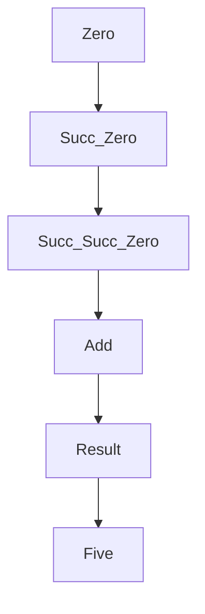
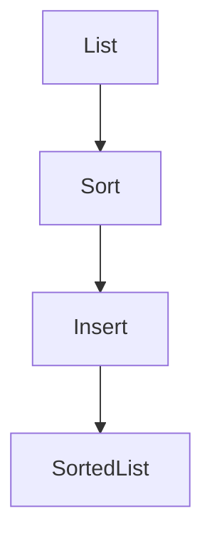

## 3.20 Best Practices for Type-Level Programming

Type-level programming in Haskell allows developers to leverage the powerful type system to encode constraints, invariants, and logic directly into the types themselves. This approach can lead to more robust and maintainable code by catching errors at compile time. However, it also introduces complexity that must be managed carefully. In this section, we will explore best practices for type-level programming, including design principles, practical applications, and strategies for balancing complexity.

### Introduction to Type-Level Programming

Type-level programming involves using Haskell's type system to perform computations and enforce constraints that would traditionally be handled at runtime. This paradigm shift allows developers to leverage the compiler to ensure correctness, leading to safer and more reliable software.

#### Key Concepts

- **Type-Level Design**: Using types to encode constraints and invariants.
- **Balancing Complexity**: Avoiding overly complex type-level code.
- **Examples**: Practical applications of type-level programming.

### Type-Level Design Principles

When designing type-level programs, it's essential to keep several principles in mind to ensure that the resulting code is both powerful and maintainable.

#### 1. **Expressiveness vs. Complexity**

While type-level programming can express complex invariants, it's crucial to balance expressiveness with complexity. Overly complex type-level code can become difficult to understand and maintain. Aim for simplicity and clarity, using type-level features only when they provide clear benefits.

#### 2. **Use Type Classes Wisely**

Type classes are a powerful feature in Haskell that can be used to define generic interfaces. When used in type-level programming, they can help manage complexity by abstracting common patterns and behaviors. However, avoid overusing type classes, as they can lead to convoluted code if not managed carefully.

#### 3. **Leverage GADTs and Data Kinds**

Generalized Algebraic Data Types (GADTs) and Data Kinds are advanced features that enable more expressive type-level programming. Use GADTs to define data types with more precise type constraints, and Data Kinds to promote data types to the type level, allowing for more sophisticated type-level computations.

#### 4. **Promote Code Reusability**

Design type-level code with reusability in mind. Create modular and composable components that can be easily reused across different parts of your application. This approach not only reduces duplication but also makes it easier to manage changes and updates.

#### 5. **Document Type-Level Logic**

Type-level programming can be challenging to understand, especially for those new to the concept. Provide clear documentation and comments to explain the purpose and logic of your type-level code. This practice will help others (and your future self) understand and maintain the codebase.

### Practical Applications of Type-Level Programming

Type-level programming can be applied to a wide range of problems, from enforcing invariants to optimizing performance. Here are some practical applications:

#### 1. **Encoding Invariants**

Use type-level programming to encode invariants directly into your types. For example, you can define a type for non-empty lists that ensures a list always has at least one element, preventing runtime errors related to empty lists.

```haskell
{-# LANGUAGE GADTs, DataKinds, KindSignatures #-}

data Nat = Zero | Succ Nat

data Vec :: Nat -> * -> * where
    VNil  :: Vec 'Zero a
    VCons :: a -> Vec n a -> Vec ('Succ n) a

-- Example usage
nonEmptyVec :: Vec ('Succ 'Zero) Int
nonEmptyVec = VCons 1 VNil
```

In this example, the `Vec` type encodes the length of the vector at the type level, ensuring that operations on vectors respect their length constraints.

#### 2. **Type-Safe APIs**

Design type-safe APIs that prevent incorrect usage at compile time. For instance, you can use type-level programming to enforce that certain functions are only called with specific types or in specific contexts.

```haskell
{-# LANGUAGE DataKinds, KindSignatures, GADTs #-}

data UserType = Admin | Regular

data User (t :: UserType) where
    AdminUser :: String -> User 'Admin
    RegularUser :: String -> User 'Regular

performAdminAction :: User 'Admin -> String
performAdminAction (AdminUser name) = "Admin action performed by " ++ name

-- Example usage
adminUser = AdminUser "Alice"
result = performAdminAction adminUser
```

Here, the `User` type ensures that `performAdminAction` can only be called with an `AdminUser`, preventing misuse.

#### 3. **Optimizing Performance**

Type-level programming can also be used to optimize performance by eliminating unnecessary runtime checks. By encoding constraints and logic at the type level, you can reduce the need for runtime validation, leading to more efficient code.

### Balancing Complexity in Type-Level Programming

While type-level programming offers many benefits, it also introduces complexity that must be managed carefully. Here are some strategies for balancing complexity:

#### 1. **Start Simple**

Begin with simple type-level constructs and gradually introduce more complexity as needed. This approach allows you to build a solid foundation and avoid overwhelming yourself or your team with overly complex code.

#### 2. **Refactor Regularly**

Regularly refactor your type-level code to improve clarity and maintainability. Look for opportunities to simplify complex logic, remove duplication, and improve documentation.

#### 3. **Use Type Aliases**

Type aliases can help simplify complex type signatures, making your code easier to read and understand. Use type aliases to give meaningful names to complex types, improving code readability.

```haskell
type NonEmptyList a = Vec ('Succ n) a
```

#### 4. **Limit Type-Level Logic**

Avoid embedding too much logic at the type level. While it's tempting to encode as much as possible into types, this can lead to overly complex and difficult-to-maintain code. Use type-level programming judiciously, focusing on the most critical constraints and invariants.

#### 5. **Leverage Community Resources**

The Haskell community is a valuable resource for learning and improving your type-level programming skills. Engage with the community through forums, mailing lists, and conferences to learn from others and share your experiences.

### Code Examples and Exercises

Let's explore some code examples and exercises to reinforce the concepts covered in this section.

#### Example 1: Type-Level Arithmetic

Implement a type-level addition function for natural numbers represented as types.

```haskell
{-# LANGUAGE DataKinds, TypeFamilies #-}

data Nat = Zero | Succ Nat

type family Add (a :: Nat) (b :: Nat) :: Nat where
    Add 'Zero b = b
    Add ('Succ a) b = 'Succ (Add a b)

-- Example usage
type Two = 'Succ ('Succ 'Zero)
type Three = 'Succ Two
type Five = Add Two Three
```

#### Example 2: Type-Level Sorting

Implement a type-level sorting algorithm for lists of natural numbers.

```haskell
{-# LANGUAGE DataKinds, TypeFamilies, TypeOperators #-}

data Nat = Zero | Succ Nat

type family Min (a :: Nat) (b :: Nat) :: Nat where
    Min 'Zero b = 'Zero
    Min a 'Zero = 'Zero
    Min ('Succ a) ('Succ b) = 'Succ (Min a b)

type family Sort (xs :: [Nat]) :: [Nat] where
    Sort '[] = '[]
    Sort (x ': xs) = Insert x (Sort xs)

type family Insert (x :: Nat) (xs :: [Nat]) :: [Nat] where
    Insert x '[] = '[x]
    Insert x (y ': ys) = If (x <=? y) (x ': y ': ys) (y ': Insert x ys)

type family (a :: Nat) <=? (b :: Nat) :: Bool where
    'Zero <=? b = 'True
    a <=? 'Zero = 'False
    'Succ a <=? 'Succ b = a <=? b

type family If (cond :: Bool) (true :: k) (false :: k) :: k where
    If 'True true false = true
    If 'False true false = false

-- Example usage
type SortedList = Sort '[Three, Two, Five]
```

### Try It Yourself

Encourage experimentation by suggesting modifications to the code examples. For instance, try implementing additional type-level functions or constraints, or explore different applications of type-level programming in your projects.

### Visualizing Type-Level Programming

To better understand type-level programming, let's visualize some of the concepts using diagrams.

#### Diagram: Type-Level Arithmetic



*Caption: Visualizing type-level arithmetic with natural numbers.*

#### Diagram: Type-Level Sorting



*Caption: Visualizing type-level sorting of a list of natural numbers.*

### References and Further Reading

For more information on type-level programming in Haskell, consider exploring the following resources:

- [Haskell Language Documentation](https://www.haskell.org/documentation/)
- [GHC User's Guide](https://downloads.haskell.org/~ghc/latest/docs/html/users_guide/)
- [Type-Level Programming in Haskell](https://www.oreilly.com/library/view/type-level-programming-in/9781492042659/)

### Knowledge Check

To reinforce your understanding of type-level programming, consider the following questions and exercises:

1. What are the benefits of encoding invariants at the type level?
2. How can type-level programming improve the safety and reliability of your code?
3. Implement a type-level function to compute the factorial of a natural number.
4. What are some strategies for managing complexity in type-level programming?
5. How can type aliases improve the readability of your type-level code?

### Embrace the Journey

Remember, mastering type-level programming is a journey. As you progress, you'll discover new ways to leverage Haskell's powerful type system to build more robust and maintainable software. Keep experimenting, stay curious, and enjoy the journey!

## Quiz: Best Practices for Type-Level Programming



### What is the primary benefit of type-level programming in Haskell?

- [x] Encoding constraints and invariants at compile time
- [ ] Improving runtime performance
- [ ] Simplifying code syntax
- [ ] Reducing code duplication

> **Explanation:** Type-level programming allows developers to encode constraints and invariants at compile time, ensuring correctness and reducing runtime errors.

### Which Haskell feature is commonly used in type-level programming to define generic interfaces?

- [ ] GADTs
- [x] Type Classes
- [ ] Data Kinds
- [ ] Type Families

> **Explanation:** Type classes are commonly used in type-level programming to define generic interfaces and manage complexity.

### What is a key strategy for managing complexity in type-level programming?

- [ ] Avoid using type-level programming altogether
- [x] Start simple and gradually introduce complexity
- [ ] Use as many type-level features as possible
- [ ] Focus solely on runtime optimizations

> **Explanation:** Starting simple and gradually introducing complexity helps manage the complexity of type-level programming.

### How can type aliases improve type-level programming?

- [x] By simplifying complex type signatures
- [ ] By increasing code execution speed
- [ ] By reducing the number of type errors
- [ ] By eliminating the need for type classes

> **Explanation:** Type aliases can simplify complex type signatures, making code easier to read and understand.

### What is the role of GADTs in type-level programming?

- [x] Defining data types with more precise type constraints
- [ ] Improving runtime performance
- [ ] Simplifying function definitions
- [ ] Reducing memory usage

> **Explanation:** GADTs allow developers to define data types with more precise type constraints, enhancing type-level programming.

### Which of the following is a practical application of type-level programming?

- [x] Encoding invariants
- [ ] Improving syntax readability
- [ ] Reducing code length
- [ ] Simplifying function calls

> **Explanation:** Encoding invariants is a practical application of type-level programming, ensuring correctness at compile time.

### What is a common pitfall of type-level programming?

- [ ] Overusing runtime checks
- [x] Overly complex type-level code
- [ ] Ignoring type classes
- [ ] Avoiding type aliases

> **Explanation:** Overly complex type-level code can become difficult to understand and maintain, making it a common pitfall.

### How can the Haskell community help with type-level programming?

- [x] By providing resources and sharing experiences
- [ ] By writing all your code for you
- [ ] By eliminating the need for type-level programming
- [ ] By simplifying the Haskell language

> **Explanation:** The Haskell community can provide valuable resources and share experiences to help improve type-level programming skills.

### What is a benefit of using Data Kinds in type-level programming?

- [x] Promoting data types to the type level
- [ ] Reducing code execution time
- [ ] Simplifying function signatures
- [ ] Eliminating the need for GADTs

> **Explanation:** Data Kinds allow developers to promote data types to the type level, enabling more sophisticated type-level computations.

### True or False: Type-level programming can eliminate all runtime errors.

- [ ] True
- [x] False

> **Explanation:** While type-level programming can significantly reduce runtime errors by catching issues at compile time, it cannot eliminate all runtime errors.


