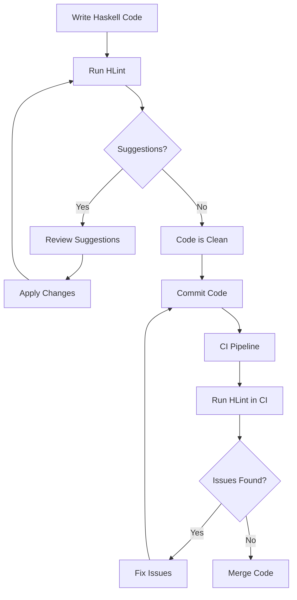

## 3.21 Code Formatting and Linting Tools (e.g., HLint)

In the realm of Haskell development, maintaining high-quality code is paramount. Code formatting and linting tools play a crucial role in ensuring that codebases remain clean, readable, and maintainable. This section delves into the intricacies of Haskell code formatting and linting, with a particular focus on **HLint**, a powerful tool for suggesting improvements to Haskell code.

### Introduction to Code Formatting and Linting

Code formatting and linting are essential practices in software development. They help maintain a consistent code style across a project, making it easier for teams to collaborate and for new developers to onboard. In Haskell, these practices are especially important due to the language's expressive syntax and powerful type system.

#### Code Formatting

Code formatting involves organizing code in a consistent style. This includes aspects such as indentation, spacing, line length, and naming conventions. Proper formatting improves readability and helps prevent errors that can arise from misaligned code.

#### Linting

Linting refers to the process of analyzing code to identify potential errors, stylistic issues, or deviations from best practices. Linting tools provide suggestions for improving code quality, ensuring adherence to coding standards, and catching bugs early in the development process.

### HLint: A Comprehensive Overview

**HLint** is a widely used linting tool for Haskell that provides suggestions for improving code quality. It analyzes Haskell code and offers recommendations for refactoring, optimizing, and adhering to best practices.

#### Key Features of HLint

- **Code Suggestions**: HLint provides suggestions for simplifying code, removing redundancies, and improving readability.
- **Customizable Rules**: Users can define custom rules to tailor HLint's behavior to their project's specific needs.
- **Integration with Editors**: HLint can be integrated with popular text editors and IDEs, providing real-time feedback as you code.
- **Command-Line Interface**: HLint offers a robust command-line interface for batch processing and automation.

#### Installing HLint

To install HLint, you can use the Haskell package manager, Cabal, or Stack. Here's how you can install it using both tools:

```bash
# Using Cabal
cabal update
cabal install hlint

# Using Stack
stack update
stack install hlint
```

Once installed, you can run HLint on your Haskell files to receive suggestions for improvements.

### Using HLint: A Practical Guide

Let's explore how to use HLint effectively to enhance your Haskell codebase.

#### Running HLint

To run HLint on a Haskell file, use the following command:

```bash
hlint MyHaskellFile.hs
```

HLint will analyze the file and output suggestions for improvements. Each suggestion includes the line number, the current code, and the recommended change.

#### Interpreting HLint Suggestions

HLint suggestions are categorized based on their severity and type. Common categories include:

- **Warning**: Indicates potential issues that may not cause errors but could lead to suboptimal code.
- **Error**: Highlights definite issues that should be addressed to prevent runtime errors.
- **Refactor**: Suggests changes to improve code readability and maintainability.

#### Customizing HLint

HLint allows you to customize its behavior by defining your own rules. You can create a `.hlint.yaml` file in your project directory to specify custom rules and ignore specific suggestions.

Here's an example of a custom HLint rule:

```yaml
- warn: {lhs: "map f (map g x)", rhs: "map (f . g) x", name: "Use function composition"}
```

This rule suggests using function composition instead of nested `map` calls.

### Integrating HLint into Your Workflow

Integrating HLint into your development workflow ensures that code quality is maintained consistently across your project.

#### Editor Integration

Many text editors and IDEs support HLint integration, providing real-time feedback as you write code. Popular editors like Visual Studio Code, Atom, and Emacs have plugins that integrate HLint seamlessly.

#### Continuous Integration

Incorporating HLint into your continuous integration (CI) pipeline ensures that code quality checks are automated. You can configure your CI system to run HLint on every commit or pull request, preventing code with issues from being merged into the main branch.

### Code Formatting Tools

In addition to HLint, several tools are available for formatting Haskell code. These tools help maintain a consistent code style across your project.

#### Stylish Haskell

**Stylish Haskell** is a popular tool for automatically formatting Haskell code. It enforces a consistent style by rearranging imports, aligning code, and applying other formatting rules.

To install Stylish Haskell, use the following command:

```bash
cabal install stylish-haskell
```

You can then run it on a Haskell file to format the code:

```bash
stylish-haskell -i MyHaskellFile.hs
```

#### Ormolu

**Ormolu** is another tool for formatting Haskell code. It aims to provide a consistent and opinionated style, minimizing the need for configuration.

To install Ormolu, use the following command:

```bash
cabal install ormolu
```

Run Ormolu on a Haskell file to format it:

```bash
ormolu --mode inplace MyHaskellFile.hs
```

### Best Practices for Code Formatting and Linting

Adopting best practices for code formatting and linting ensures that your Haskell codebase remains clean and maintainable.

#### Consistent Style

Establish a consistent code style for your project and enforce it using formatting tools. This includes naming conventions, indentation, and line length.

#### Regular Linting

Run HLint regularly to catch potential issues early. Incorporate linting into your development workflow to ensure that code quality is maintained consistently.

#### Custom Rules

Define custom HLint rules to tailor its behavior to your project's specific needs. This allows you to enforce project-specific coding standards and best practices.

### Visualizing Code Quality Workflow

To better understand the workflow of integrating code formatting and linting tools, let's visualize the process using a flowchart.



### Try It Yourself: Experiment with HLint

To get hands-on experience with HLint, try running it on a sample Haskell file. Experiment with different custom rules and observe how they affect the suggestions provided by HLint.

1. Create a simple Haskell file with some common issues, such as redundant code or inefficient patterns.
2. Run HLint on the file and review the suggestions.
3. Modify the code based on the suggestions and rerun HLint to see the improvements.
4. Define a custom rule in a `.hlint.yaml` file and observe how it changes HLint's behavior.

### References and Further Reading

- [HLint GitHub Repository](https://github.com/ndmitchell/hlint)
- [Stylish Haskell GitHub Repository](https://github.com/jaspervdj/stylish-haskell)
- [Ormolu GitHub Repository](https://github.com/tweag/ormolu)

### Knowledge Check

Before we conclude, let's reinforce what we've learned with some questions and exercises.

- What are the benefits of using code formatting and linting tools in Haskell?
- How can you customize HLint to fit your project's specific needs?
- Experiment with different formatting tools and compare their output on the same Haskell file.

### Embrace the Journey

Remember, mastering code formatting and linting tools is an ongoing journey. As you continue to develop in Haskell, these tools will become invaluable in maintaining high-quality code. Keep experimenting, stay curious, and enjoy the process of refining your codebase.

## Quiz: Code Formatting and Linting Tools (e.g., HLint)



### What is the primary purpose of HLint in Haskell development?

- [x] To suggest improvements and refactorings for Haskell code
- [ ] To compile Haskell code into executable binaries
- [ ] To manage Haskell package dependencies
- [ ] To format Haskell code according to a specific style

> **Explanation:** HLint is a tool designed to analyze Haskell code and provide suggestions for improvements, refactorings, and adherence to best practices.

### Which of the following tools is used for formatting Haskell code?

- [x] Stylish Haskell
- [ ] GHC
- [ ] Cabal
- [x] Ormolu

> **Explanation:** Stylish Haskell and Ormolu are tools used for formatting Haskell code, ensuring consistency in style across a codebase.

### How can you customize HLint's behavior for a specific project?

- [x] By creating a `.hlint.yaml` file with custom rules
- [ ] By modifying the Haskell compiler settings
- [ ] By using a different version of GHC
- [ ] By changing the project's directory structure

> **Explanation:** HLint allows customization through a `.hlint.yaml` file, where developers can define custom rules and ignore specific suggestions.

### What command would you use to install HLint using Cabal?

- [x] `cabal install hlint`
- [ ] `cabal build hlint`
- [ ] `cabal update hlint`
- [ ] `cabal run hlint`

> **Explanation:** The `cabal install hlint` command is used to install HLint using the Cabal package manager.

### Which of the following is NOT a feature of HLint?

- [ ] Code suggestions
- [ ] Customizable rules
- [x] Automatic code formatting
- [ ] Integration with editors

> **Explanation:** HLint provides code suggestions, customizable rules, and integration with editors, but it does not perform automatic code formatting.

### What is the benefit of integrating HLint into a CI pipeline?

- [x] To automate code quality checks and prevent issues from being merged
- [ ] To compile the code faster
- [ ] To manage project dependencies
- [ ] To automatically deploy the application

> **Explanation:** Integrating HLint into a CI pipeline automates code quality checks, ensuring that code with issues is not merged into the main branch.

### Which tool aims to provide a consistent and opinionated style for Haskell code?

- [ ] HLint
- [x] Ormolu
- [ ] GHC
- [ ] Stack

> **Explanation:** Ormolu is a tool designed to provide a consistent and opinionated style for Haskell code, minimizing the need for configuration.

### What is the purpose of a `.hlint.yaml` file?

- [x] To define custom rules and ignore specific suggestions in HLint
- [ ] To specify package dependencies for a Haskell project
- [ ] To configure the Haskell compiler settings
- [ ] To manage project build scripts

> **Explanation:** A `.hlint.yaml` file is used to define custom rules and ignore specific suggestions in HLint, tailoring its behavior to a project's needs.

### Which of the following is a common category for HLint suggestions?

- [x] Warning
- [ ] Compilation
- [ ] Deployment
- [ ] Packaging

> **Explanation:** HLint suggestions are categorized into warnings, errors, and refactors, with warnings indicating potential issues that may not cause errors but could lead to suboptimal code.

### True or False: HLint can be integrated with popular text editors to provide real-time feedback.

- [x] True
- [ ] False

> **Explanation:** HLint can be integrated with popular text editors and IDEs, providing real-time feedback as developers write code, helping them adhere to best practices and improve code quality.


