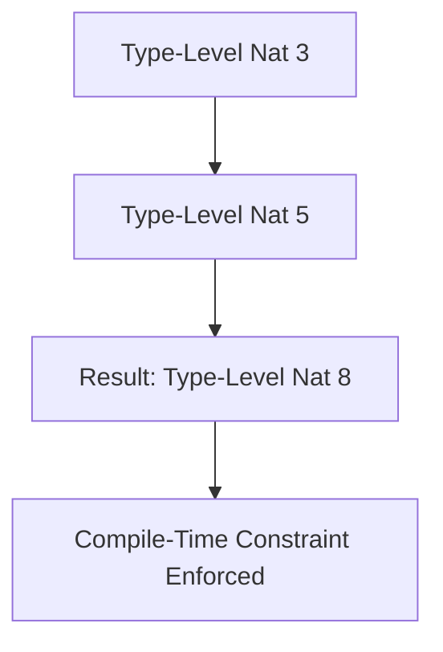
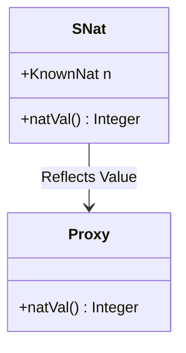

## 3.3 Type-Level Programming in Haskell

Type-level programming in Haskell is a powerful paradigm that allows developers to leverage the type system to enforce constraints, ensure correctness, and enhance expressiveness at compile time. By treating types as first-class citizens, Haskell enables sophisticated type manipulations that can lead to more robust and maintainable code. In this section, we will delve into the core concepts of type-level programming, including type literals, operators, singleton types, and their practical applications.

### Type Literals and Operators

**Type literals** are a way to represent values at the type level. In Haskell, type literals are often used in conjunction with type-level operators to perform computations and enforce constraints at compile time. This approach allows developers to encode invariants directly into the type system, reducing runtime errors and improving code safety.

#### Type-Level Naturals

Haskell provides a way to work with natural numbers at the type level using the `GHC.TypeLits` module. This module introduces the `Nat` kind, which represents natural numbers, and allows for operations on these numbers using type-level operators.

```haskell
{-# LANGUAGE DataKinds #-}
{-# LANGUAGE TypeOperators #-}

import GHC.TypeLits

-- Define a type-level addition
type family Add (a :: Nat) (b :: Nat) :: Nat where
  Add a b = a + b

-- Example usage
type Result = Add 3 5  -- Result is 8
```

In this example, we define a type family `Add` that performs addition on type-level natural numbers. The `+` operator is a type-level operator provided by `GHC.TypeLits`.

#### Type-Level Strings

Type-level strings are another powerful feature provided by `GHC.TypeLits`. They allow for the manipulation and comparison of string literals at the type level.

```haskell
{-# LANGUAGE DataKinds #-}
{-# LANGUAGE TypeFamilies #-}
{-# LANGUAGE TypeOperators #-}

import GHC.TypeLits

-- Define a type-level string concatenation
type family Concat (a :: Symbol) (b :: Symbol) :: Symbol where
  Concat a b = AppendSymbol a b

-- Example usage
type Greeting = Concat "Hello, " "World!"  -- Greeting is "Hello, World!"
```

Here, we use the `AppendSymbol` type family to concatenate two type-level strings. This can be particularly useful for generating descriptive error messages or constructing type-level identifiers.

### Singleton Types

**Singleton types** are a technique used to bridge the gap between values and types. They provide a way to reflect runtime values at the type level, enabling more precise type-level computations and constraints.

#### Defining Singleton Types

A singleton type is typically defined using a data type with a single constructor that carries a type-level representation of a value.

```haskell
{-# LANGUAGE DataKinds #-}
{-# LANGUAGE GADTs #-}
{-# LANGUAGE KindSignatures #-}

import GHC.TypeLits

-- Define a singleton type for natural numbers
data SNat (n :: Nat) where
  SNat :: KnownNat n => SNat n

-- Function to get the value of a singleton
natVal :: SNat n -> Integer
natVal SNat = natVal (Proxy :: Proxy n)
```

In this example, `SNat` is a singleton type for natural numbers. The `natVal` function retrieves the runtime value associated with the singleton type.

#### Using Singleton Types

Singleton types can be used to enforce constraints and guide type-level computations. For example, they can be used to ensure that a list has a specific length at compile time.

```haskell
{-# LANGUAGE DataKinds #-}
{-# LANGUAGE GADTs #-}
{-# LANGUAGE KindSignatures #-}
{-# LANGUAGE TypeOperators #-}

import GHC.TypeLits

-- Define a length-indexed list
data Vec (n :: Nat) a where
  VNil  :: Vec 0 a
  VCons :: a -> Vec n a -> Vec (n + 1) a

-- Function to append two vectors
vAppend :: Vec n a -> Vec m a -> Vec (n + m) a
vAppend VNil ys = ys
vAppend (VCons x xs) ys = VCons x (vAppend xs ys)
```

In this example, `Vec` is a length-indexed list, where the length is encoded at the type level. The `vAppend` function appends two vectors, and the resulting vector's length is the sum of the input lengths, enforced by the type system.

### Practical Applications

Type-level programming in Haskell has numerous practical applications, particularly in enforcing compile-time constraints and invariants. By leveraging the type system, developers can catch errors early and ensure that certain properties hold throughout the codebase.

#### Enforcing Invariants

One of the most significant benefits of type-level programming is the ability to enforce invariants at compile time. For example, consider a scenario where we want to ensure that a matrix is always square.

```haskell
{-# LANGUAGE DataKinds #-}
{-# LANGUAGE GADTs #-}
{-# LANGUAGE KindSignatures #-}
{-# LANGUAGE TypeOperators #-}

import GHC.TypeLits

-- Define a square matrix type
data SquareMatrix (n :: Nat) a where
  SMNil  :: SquareMatrix 0 a
  SMCons :: Vec n a -> SquareMatrix n a -> SquareMatrix (n + 1) a

-- Function to create an identity matrix
identity :: KnownNat n => SquareMatrix n (Vec n a)
identity = undefined  -- Implementation omitted for brevity
```

In this example, `SquareMatrix` is a type that enforces the invariant that the matrix is square. The type system ensures that operations on square matrices preserve this property.

#### Compile-Time Calculations

Type-level programming can also be used for compile-time calculations, such as computing the size of a data structure or verifying constraints.

```haskell
{-# LANGUAGE DataKinds #-}
{-# LANGUAGE TypeFamilies #-}
{-# LANGUAGE TypeOperators #-}

import GHC.TypeLits

-- Define a type family to compute the size of a vector
type family Size (v :: Vec n a) :: Nat where
  Size VNil = 0
  Size (VCons _ xs) = 1 + Size xs

-- Example usage
type VecSize = Size (VCons 1 (VCons 2 VNil))  -- VecSize is 2
```

Here, we define a type family `Size` that computes the size of a vector at compile time. This can be useful for ensuring that operations on vectors are valid and efficient.

### Visualizing Type-Level Programming

To better understand type-level programming in Haskell, let's visualize some of the concepts using Mermaid.js diagrams.

#### Type-Level Addition



**Figure 1:** Visualizing type-level addition of natural numbers.

#### Singleton Type Representation



**Figure 2:** Singleton type representation and reflection of values.

### References and Further Reading

- [GHC.TypeLits Documentation](https://hackage.haskell.org/package/base/docs/GHC-TypeLits.html)
- [Haskell Wiki on Type-Level Programming](https://wiki.haskell.org/Type-level_programming)
- [Learn You a Haskell for Great Good!](http://learnyouahaskell.com/)

### Knowledge Check

- What are type literals and how are they used in Haskell?
- How do singleton types bridge the gap between values and types?
- What are some practical applications of type-level programming in Haskell?

### Embrace the Journey

Remember, type-level programming in Haskell is a journey that requires practice and exploration. As you delve deeper into these concepts, you'll discover new ways to leverage the type system to write safer and more expressive code. Keep experimenting, stay curious, and enjoy the journey!

## Quiz: Type-Level Programming in Haskell



### What is a primary benefit of type-level programming in Haskell?

- [x] Enforcing compile-time constraints
- [ ] Improving runtime performance
- [ ] Simplifying syntax
- [ ] Reducing code size

> **Explanation:** Type-level programming allows for enforcing constraints at compile time, reducing runtime errors.

### Which module provides support for type-level natural numbers in Haskell?

- [x] GHC.TypeLits
- [ ] Data.List
- [ ] Control.Monad
- [ ] System.IO

> **Explanation:** The `GHC.TypeLits` module provides support for type-level natural numbers and operations.

### What is the role of singleton types in Haskell?

- [x] Bridging values and types
- [ ] Improving runtime performance
- [ ] Simplifying syntax
- [ ] Reducing code size

> **Explanation:** Singleton types bridge the gap between values and types, allowing for more precise type-level computations.

### How can type-level programming help in matrix operations?

- [x] By enforcing that matrices are square
- [ ] By improving runtime performance
- [ ] By simplifying syntax
- [ ] By reducing code size

> **Explanation:** Type-level programming can enforce invariants, such as ensuring matrices are square, at compile time.

### What is a type family in Haskell?

- [x] A way to define functions at the type level
- [ ] A collection of related data types
- [ ] A module for handling IO operations
- [ ] A syntax simplification tool

> **Explanation:** Type families allow defining functions that operate at the type level.

### Which of the following is a type-level operator in Haskell?

- [x] +
- [ ] *
- [ ] /
- [ ] -

> **Explanation:** The `+` operator is used at the type level for natural numbers in Haskell.

### What is the `Nat` kind used for in Haskell?

- [x] Representing natural numbers at the type level
- [ ] Handling IO operations
- [ ] Defining data types
- [ ] Simplifying syntax

> **Explanation:** The `Nat` kind represents natural numbers at the type level in Haskell.

### What does the `AppendSymbol` type family do?

- [x] Concatenates type-level strings
- [ ] Adds two numbers
- [ ] Multiplies two numbers
- [ ] Divides two numbers

> **Explanation:** `AppendSymbol` is used to concatenate type-level strings.

### What is a practical application of type-level programming?

- [x] Enforcing list lengths at compile time
- [ ] Improving runtime performance
- [ ] Simplifying syntax
- [ ] Reducing code size

> **Explanation:** Type-level programming can enforce constraints like list lengths at compile time.

### True or False: Type-level programming can reduce runtime errors.

- [x] True
- [ ] False

> **Explanation:** By enforcing constraints at compile time, type-level programming can reduce runtime errors.


