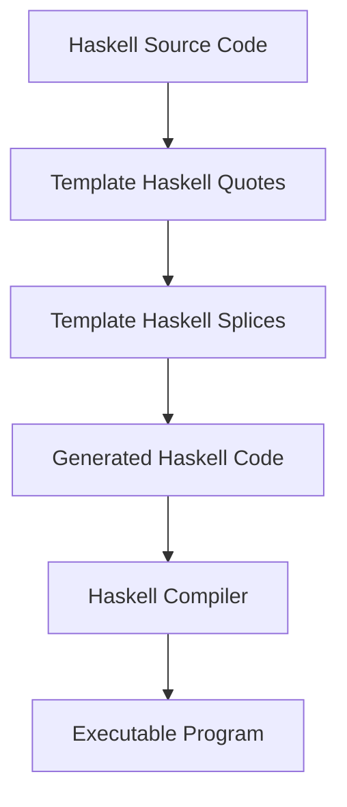

## 3.4 Metaprogramming with Template Haskell

Metaprogramming is a powerful technique that allows developers to write programs that generate other programs. In Haskell, Template Haskell (TH) is the tool of choice for metaprogramming, enabling the generation and manipulation of Haskell code at compile time. This section will delve into the intricacies of Template Haskell, exploring its core concepts, use cases, and practical applications.

### Template Haskell Overview

Template Haskell is a Haskell extension that provides a framework for compile-time metaprogramming. It allows you to generate and manipulate Haskell code programmatically, offering a way to eliminate repetitive boilerplate code and create domain-specific languages (DSLs).

#### Key Concepts

- **Splices and Quotes**: The fundamental building blocks of Template Haskell, allowing you to embed generated code within Haskell source files.
- **Quasi-Quoters**: A mechanism for defining custom syntax within Haskell code.
- **Reification**: The process of inspecting existing Haskell code to generate new code based on it.

#### Benefits of Template Haskell

- **Code Generation**: Automate the creation of repetitive code structures.
- **DSL Creation**: Develop custom languages tailored to specific problem domains.
- **Compile-Time Checks**: Ensure correctness of generated code before runtime.

### Splices and Quotes

In Template Haskell, splices and quotes are used to embed and generate code. Understanding these concepts is crucial for effective metaprogramming.

#### Quotes

Quotes are used to construct Template Haskell expressions. They allow you to write Haskell code that represents Haskell code.

```haskell
{-# LANGUAGE TemplateHaskell #-}

module Main where

import Language.Haskell.TH

-- A simple quoted expression
expr :: Q Exp
expr = [| 1 + 2 |]
```

In this example, `[| 1 + 2 |]` is a quoted expression that represents the code `1 + 2`.

#### Splices

Splices are used to insert generated code into Haskell source files. They evaluate quoted expressions and embed the result.

```haskell
{-# LANGUAGE TemplateHaskell #-}

module Main where

import Language.Haskell.TH

-- A splice that evaluates the quoted expression
main :: IO ()
main = print $(expr)
```

Here, `$(expr)` is a splice that evaluates the quoted expression `expr` and inserts the result into the code.

### Use Cases for Template Haskell

Template Haskell is versatile and can be applied in various scenarios to enhance code quality and maintainability.

#### Eliminating Boilerplate

One of the primary use cases for Template Haskell is the elimination of boilerplate code. By generating repetitive code structures automatically, you can reduce errors and improve maintainability.

**Example: Deriving Instances**

Consider a scenario where you need to derive instances for multiple data types. Template Haskell can automate this process.

```haskell
{-# LANGUAGE TemplateHaskell #-}

import Language.Haskell.TH

-- Automatically derive Show instances for a list of types
deriveShow :: [Name] -> Q [Dec]
deriveShow names = mapM deriveShowForName names
  where
    deriveShowForName name = [d| instance Show $(conT name) where show = ... |]
```

#### Creating Domain-Specific Languages (DSLs)

Template Haskell is also useful for creating DSLs, allowing you to define custom syntax and semantics tailored to specific problem domains.

**Example: Simple Arithmetic DSL**

```haskell
{-# LANGUAGE TemplateHaskell #-}

import Language.Haskell.TH

-- Define a simple arithmetic DSL
data Expr = Add Expr Expr | Val Int

-- Generate code for evaluating expressions
evalExpr :: Expr -> Q Exp
evalExpr (Val n) = [| n |]
evalExpr (Add x y) = [| $(evalExpr x) + $(evalExpr y) |]
```

### Advanced Techniques

#### Quasi-Quoters

Quasi-quoters extend Template Haskell by allowing you to define custom syntax within Haskell code. They are particularly useful for embedding DSLs.

```haskell
{-# LANGUAGE QuasiQuotes #-}

import Language.Haskell.TH.Quote

-- Define a simple quasi-quoter for arithmetic expressions
arith :: QuasiQuoter
arith = QuasiQuoter { quoteExp = parseArithExp, ... }

-- Example usage
main = print [arith| 1 + 2 |]
```

#### Reification

Reification is the process of inspecting existing Haskell code to generate new code based on it. This is useful for tasks like generating documentation or performing code analysis.

```haskell
{-# LANGUAGE TemplateHaskell #-}

import Language.Haskell.TH

-- Reify a type and generate a string representation
reifyType :: Name -> Q Exp
reifyType name = do
  info <- reify name
  [| show info |]
```

### Visualizing Template Haskell

To better understand the flow of Template Haskell, consider the following diagram illustrating the interaction between splices, quotes, and the Haskell compiler:



This diagram shows how Template Haskell integrates into the Haskell compilation process, transforming source code into executable programs.

### Practical Applications

#### Code Generation for Data Types

Template Haskell can be used to generate boilerplate code for data types, such as JSON serialization/deserialization functions.

```haskell
{-# LANGUAGE TemplateHaskell #-}

import Language.Haskell.TH
import Data.Aeson

-- Generate JSON instances for a data type
deriveJSON :: Name -> Q [Dec]
deriveJSON name = [d|
  instance ToJSON $(conT name) where
    toJSON = ...
  instance FromJSON $(conT name) where
    parseJSON = ...
  |]
```

#### Performance Optimization

By generating specialized code at compile time, Template Haskell can optimize performance-critical sections of your codebase.

### Design Considerations

When using Template Haskell, consider the following:

- **Compile-Time Overhead**: Template Haskell can increase compile times due to code generation.
- **Complexity**: Metaprogramming can introduce complexity, making code harder to understand and maintain.
- **Debugging**: Generated code can be difficult to debug, so ensure thorough testing.

### Haskell Unique Features

Template Haskell leverages Haskell's strong type system and purity to provide safe and efficient metaprogramming capabilities. Its integration with the Haskell compiler ensures that generated code is type-checked and optimized.

### Differences and Similarities

Template Haskell is often compared to other metaprogramming tools in different languages, such as macros in Lisp or C++. Unlike macros, Template Haskell operates at the level of Haskell's abstract syntax tree, providing more robust and type-safe code generation.

### Try It Yourself

Experiment with Template Haskell by modifying the examples provided. Try creating a simple DSL or generating code for a custom data type. Explore the possibilities of metaprogramming in Haskell and see how it can enhance your codebase.

### References and Links

- [Template Haskell Documentation](https://www.haskell.org/haskellwiki/Template_Haskell)
- [Haskell Language Extensions](https://downloads.haskell.org/~ghc/latest/docs/html/users_guide/exts/template_haskell.html)

### Knowledge Check

- What are the primary components of Template Haskell?
- How can Template Haskell be used to eliminate boilerplate code?
- What are the benefits and drawbacks of using Template Haskell?

### Embrace the Journey

Metaprogramming with Template Haskell opens up a world of possibilities for Haskell developers. By mastering these techniques, you can create more efficient, maintainable, and expressive code. Remember, this is just the beginning. Keep experimenting, stay curious, and enjoy the journey!

## Quiz: Metaprogramming with Template Haskell



### What is the primary purpose of Template Haskell?

- [x] To generate and manipulate Haskell code at compile time
- [ ] To execute Haskell code at runtime
- [ ] To optimize Haskell code for performance
- [ ] To provide a graphical user interface for Haskell

> **Explanation:** Template Haskell is primarily used for compile-time code generation and manipulation.

### Which of the following is a key component of Template Haskell?

- [x] Splices
- [ ] Threads
- [ ] Monads
- [ ] Arrays

> **Explanation:** Splices are a fundamental component of Template Haskell, used to embed generated code.

### How does Template Haskell help in eliminating boilerplate code?

- [x] By generating repetitive code structures automatically
- [ ] By providing runtime optimizations
- [ ] By offering a graphical interface
- [ ] By simplifying syntax

> **Explanation:** Template Haskell automates the creation of repetitive code, reducing boilerplate.

### What is a Quasi-Quoter in Template Haskell?

- [x] A mechanism for defining custom syntax within Haskell code
- [ ] A tool for optimizing Haskell code
- [ ] A type of Haskell data structure
- [ ] A runtime library for Haskell

> **Explanation:** Quasi-quoters allow for custom syntax definitions in Haskell code.

### What is reification in the context of Template Haskell?

- [x] Inspecting existing Haskell code to generate new code
- [ ] Executing Haskell code at runtime
- [ ] Optimizing Haskell code for performance
- [ ] Providing a graphical user interface for Haskell

> **Explanation:** Reification involves inspecting code to generate new code based on it.

### What is a potential drawback of using Template Haskell?

- [x] Increased compile-time overhead
- [ ] Reduced runtime performance
- [ ] Lack of type safety
- [ ] Limited language support

> **Explanation:** Template Haskell can increase compile times due to code generation.

### How does Template Haskell integrate with the Haskell compiler?

- [x] By transforming source code into executable programs
- [ ] By providing runtime optimizations
- [ ] By offering a graphical interface
- [ ] By simplifying syntax

> **Explanation:** Template Haskell transforms source code during compilation.

### What is the benefit of using Template Haskell for DSL creation?

- [x] It allows for defining custom syntax and semantics
- [ ] It provides runtime optimizations
- [ ] It simplifies syntax
- [ ] It offers a graphical interface

> **Explanation:** Template Haskell enables the creation of custom DSLs with specific syntax.

### What is the role of quotes in Template Haskell?

- [x] To construct Template Haskell expressions
- [ ] To execute Haskell code at runtime
- [ ] To optimize Haskell code for performance
- [ ] To provide a graphical user interface for Haskell

> **Explanation:** Quotes are used to construct expressions in Template Haskell.

### True or False: Template Haskell can be used to generate code for performance optimization.

- [x] True
- [ ] False

> **Explanation:** Template Haskell can generate specialized code to optimize performance-critical sections.


