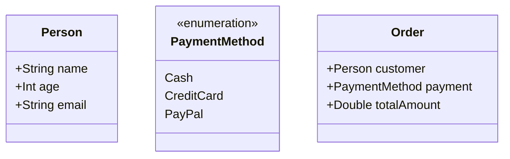

## 3.5 Functional Domain Modeling

Functional domain modeling is a powerful approach to representing business logic and domain concepts using Haskell's rich type system and functional paradigms. This section delves into the techniques and patterns that enable expert software engineers and architects to craft expressive, maintainable, and robust domain models in Haskell.

### Introduction to Functional Domain Modeling

Functional domain modeling involves using Haskell's types and functions to represent and manipulate domain concepts. By leveraging Haskell's strong static typing, algebraic data types, and functional programming principles, we can create models that are both expressive and type-safe.

#### Key Concepts

- **Domain Model**: A representation of the concepts and rules of a specific domain.
- **Algebraic Data Types (ADTs)**: Types formed by combining other types, offering a way to model complex data structures.
- **Type Safety**: Ensuring that operations on data are valid and meaningful, reducing runtime errors.

### Algebraic Data Types in Modeling

Algebraic data types (ADTs) are a cornerstone of functional domain modeling in Haskell. They allow us to define complex data structures in a concise and expressive manner. ADTs come in two main forms: product types and sum types.

#### Product Types

Product types, also known as tuples or records, combine multiple values into a single entity. They are useful for modeling entities with multiple attributes.

```haskell
-- A product type representing a Person
data Person = Person
  { name :: String
  , age :: Int
  , email :: String
  }
```

In this example, `Person` is a product type with three fields: `name`, `age`, and `email`. Each field has a specific type, ensuring type safety.

#### Sum Types

Sum types, also known as tagged unions or variant types, represent a choice between different types. They are ideal for modeling scenarios where a value can be one of several different types.

```haskell
-- A sum type representing a PaymentMethod
data PaymentMethod
  = Cash
  | CreditCard String
  | PayPal String
```

Here, `PaymentMethod` can be either `Cash`, `CreditCard` with a card number, or `PayPal` with an account identifier.

### Patterns in Functional Domain Modeling

Haskell's features enable the use of various patterns to create robust domain models. These patterns help manage complexity, ensure correctness, and enhance maintainability.

#### Pattern Matching

Pattern matching is a powerful feature in Haskell that allows us to deconstruct data types and perform operations based on their structure.

```haskell
-- Function to describe a payment method
describePayment :: PaymentMethod -> String
describePayment Cash = "Payment by cash"
describePayment (CreditCard number) = "Payment by credit card: " ++ number
describePayment (PayPal account) = "Payment by PayPal: " ++ account
```

In this example, pattern matching is used to handle different cases of the `PaymentMethod` type, providing a clear and concise way to implement logic based on the type's structure.

#### Type Classes and Polymorphism

Type classes in Haskell provide a way to define generic interfaces that can be implemented by different types. This allows for polymorphic behavior, where functions can operate on any type that implements a given interface.

```haskell
-- Type class for serializable types
class Serializable a where
  serialize :: a -> String

-- Implementing Serializable for Person
instance Serializable Person where
  serialize (Person name age email) =
    "Person: " ++ name ++ ", Age: " ++ show age ++ ", Email: " ++ email
```

Here, the `Serializable` type class defines a `serialize` function, and we implement it for the `Person` type, allowing us to serialize `Person` instances to a string.

#### Higher-Order Functions

Higher-order functions are functions that take other functions as arguments or return functions as results. They are essential for creating flexible and reusable domain models.

```haskell
-- Function to apply a discount to a price
applyDiscount :: (Double -> Double) -> Double -> Double
applyDiscount discount price = discount price

-- Example usage
tenPercentOff :: Double -> Double
tenPercentOff price = price * 0.9

-- Applying the discount
discountedPrice = applyDiscount tenPercentOff 100.0
```

In this example, `applyDiscount` is a higher-order function that takes a discount function and a price, applying the discount to the price.

### Visualizing Functional Domain Modeling

To better understand the relationships and structures within a domain model, we can use diagrams to visualize the components and their interactions.



This class diagram illustrates a simple domain model with `Person`, `PaymentMethod`, and `Order` classes, highlighting their attributes and relationships.

### Design Considerations

When modeling a domain in Haskell, consider the following:

- **Expressiveness**: Use Haskell's type system to capture domain invariants and constraints.
- **Maintainability**: Design models that are easy to understand and modify.
- **Type Safety**: Leverage Haskell's strong typing to prevent invalid states and operations.

### Haskell Unique Features

Haskell's unique features, such as lazy evaluation and type inference, offer additional benefits for domain modeling:

- **Lazy Evaluation**: Enables efficient handling of large or infinite data structures.
- **Type Inference**: Reduces boilerplate code by inferring types automatically.

### Differences and Similarities with Other Patterns

Functional domain modeling shares similarities with object-oriented domain modeling but differs in its emphasis on immutability and pure functions. Unlike object-oriented models, Haskell models avoid mutable state and side effects, leading to more predictable and reliable systems.

### Try It Yourself

Experiment with the following exercises to deepen your understanding of functional domain modeling:

1. **Extend the `PaymentMethod` type** to include a new payment option, such as `Cryptocurrency`.
2. **Implement a function** that calculates the total price of an order, including tax and discounts.
3. **Create a new type class** for `Printable` entities and implement it for `Person` and `Order`.

### References and Links

- [Haskell Documentation](https://www.haskell.org/documentation/)
- [Learn You a Haskell for Great Good!](http://learnyouahaskell.com/)
- [Real World Haskell](http://book.realworldhaskell.org/)

### Knowledge Check

- **What are the benefits of using algebraic data types in domain modeling?**
- **How does pattern matching enhance code clarity and maintainability?**
- **Why is type safety important in functional domain modeling?**

### Embrace the Journey

Remember, mastering functional domain modeling in Haskell is a journey. As you explore these concepts, you'll gain the skills to build more complex and reliable systems. Keep experimenting, stay curious, and enjoy the process!

## Quiz: Functional Domain Modeling



### What is a key benefit of using algebraic data types in Haskell?

- [x] They allow for expressive and type-safe domain models.
- [ ] They enable mutable state management.
- [ ] They simplify the use of global variables.
- [ ] They eliminate the need for functions.

> **Explanation:** Algebraic data types provide a way to define complex data structures in a type-safe and expressive manner, which is crucial for domain modeling.

### How does pattern matching contribute to functional domain modeling?

- [x] It allows for concise and clear handling of different data structures.
- [ ] It enables mutable state changes.
- [ ] It simplifies the use of global variables.
- [ ] It eliminates the need for functions.

> **Explanation:** Pattern matching allows for deconstructing data types and implementing logic based on their structure, enhancing code clarity and maintainability.

### What is the role of type classes in Haskell?

- [x] They define generic interfaces for polymorphic behavior.
- [ ] They enable mutable state management.
- [ ] They simplify the use of global variables.
- [ ] They eliminate the need for functions.

> **Explanation:** Type classes provide a way to define interfaces that can be implemented by different types, allowing for polymorphic behavior.

### What is a higher-order function?

- [x] A function that takes other functions as arguments or returns functions as results.
- [ ] A function that manages global state.
- [ ] A function that eliminates the need for variables.
- [ ] A function that simplifies the use of loops.

> **Explanation:** Higher-order functions are functions that take other functions as arguments or return functions as results, enabling flexible and reusable code.

### What is lazy evaluation in Haskell?

- [x] A feature that allows efficient handling of large or infinite data structures.
- [ ] A feature that enables mutable state management.
- [ ] A feature that simplifies the use of global variables.
- [ ] A feature that eliminates the need for functions.

> **Explanation:** Lazy evaluation allows Haskell to handle large or infinite data structures efficiently by evaluating expressions only when needed.

### How does Haskell's type inference benefit domain modeling?

- [x] It reduces boilerplate code by inferring types automatically.
- [ ] It enables mutable state management.
- [ ] It simplifies the use of global variables.
- [ ] It eliminates the need for functions.

> **Explanation:** Type inference reduces the need for explicit type annotations, making code more concise and easier to read.

### What is the difference between product types and sum types?

- [x] Product types combine multiple values, while sum types represent a choice between types.
- [ ] Product types enable mutable state, while sum types manage global variables.
- [ ] Product types simplify loops, while sum types eliminate functions.
- [ ] Product types handle large data, while sum types manage small data.

> **Explanation:** Product types combine multiple values into a single entity, while sum types represent a choice between different types.

### Why is immutability important in functional domain modeling?

- [x] It leads to more predictable and reliable systems.
- [ ] It enables mutable state management.
- [ ] It simplifies the use of global variables.
- [ ] It eliminates the need for functions.

> **Explanation:** Immutability ensures that data cannot be changed, leading to more predictable and reliable systems by avoiding side effects.

### What is the purpose of a domain model?

- [x] To represent the concepts and rules of a specific domain.
- [ ] To manage global state.
- [ ] To simplify the use of loops.
- [ ] To eliminate the need for variables.

> **Explanation:** A domain model represents the concepts and rules of a specific domain, providing a structured way to understand and manipulate domain data.

### True or False: Haskell's functional domain modeling avoids mutable state and side effects.

- [x] True
- [ ] False

> **Explanation:** Haskell's functional domain modeling emphasizes immutability and pure functions, avoiding mutable state and side effects for more reliable systems.


