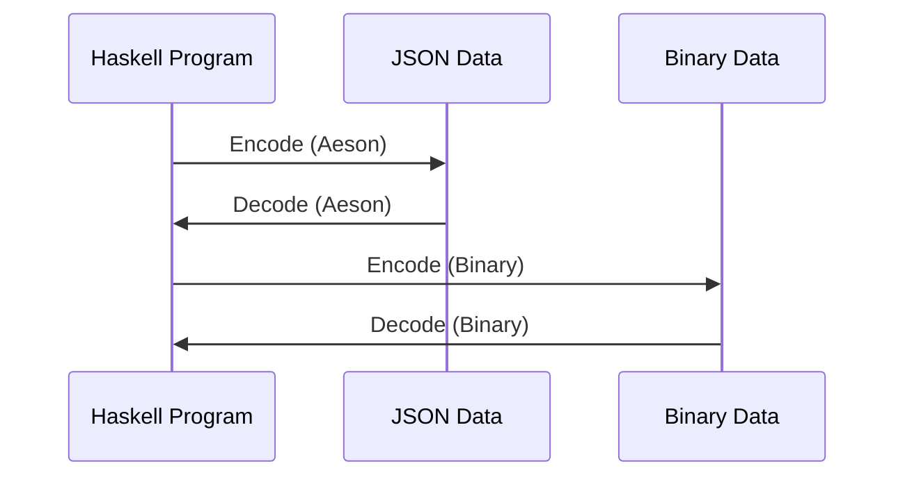

## 3.6 Serialization and Deserialization (Aeson, Binary)

Serialization and deserialization are crucial processes in software engineering, enabling data to be converted to a format suitable for storage or transmission and then back to its original form. In Haskell, two prominent libraries facilitate these processes: **Aeson** for JSON data and **Binary** for efficient binary data serialization. This section delves into these libraries, providing expert guidance on their usage, best practices, and integration into Haskell applications.

### Introduction to Data Formats

Before diving into the libraries, let's briefly discuss the data formats we'll be working with:

- **JSON (JavaScript Object Notation)**: A lightweight data interchange format that's easy for humans to read and write and easy for machines to parse and generate. It's widely used for APIs and configuration files.
- **Binary**: A format that represents data in binary form, which is more compact and efficient for storage and transmission compared to text-based formats like JSON.

### Aeson Library: Encoding and Decoding JSON Data

The Aeson library is the go-to choice for handling JSON in Haskell. It provides a robust and efficient way to encode and decode JSON data, leveraging Haskell's strong type system to ensure data integrity.

#### Key Features of Aeson

- **Type Safety**: Aeson leverages Haskell's type system to ensure that JSON data is correctly mapped to Haskell types.
- **Performance**: It is optimized for speed, making it suitable for high-performance applications.
- **Flexibility**: Supports custom encoding and decoding logic through typeclass instances.

#### Basic Usage of Aeson

Let's start with a simple example of encoding and decoding JSON using Aeson.

```haskell
{-# LANGUAGE OverloadedStrings #-}

import Data.Aeson
import qualified Data.ByteString.Lazy as B
import Data.Text (Text)

-- Define a data type
data Person = Person
  { name :: Text
  , age  :: Int
  } deriving (Show, Generic)

-- Automatically derive JSON instances
instance FromJSON Person
instance ToJSON Person

-- Encode a Person to JSON
encodePerson :: Person -> B.ByteString
encodePerson = encode

-- Decode JSON to a Person
decodePerson :: B.ByteString -> Maybe Person
decodePerson = decode

main :: IO ()
main = do
  let person = Person "Alice" 30
  let json = encodePerson person
  putStrLn $ "Encoded JSON: " ++ show json

  case decodePerson json of
    Just p  -> putStrLn $ "Decoded Person: " ++ show p
    Nothing -> putStrLn "Failed to decode JSON"
```

**Explanation**:
- We define a `Person` data type with `name` and `age` fields.
- Using `Generic`, we automatically derive `FromJSON` and `ToJSON` instances, allowing Aeson to handle the conversion.
- `encode` and `decode` functions are used to convert between `Person` and JSON.

#### Customizing JSON Instances

Sometimes, the default JSON representation doesn't match the desired format. Aeson allows customization through manual instance definitions.

```haskell
instance FromJSON Person where
  parseJSON = withObject "Person" $ \v -> Person
    <$> v .: "name"
    <*> v .: "age"

instance ToJSON Person where
  toJSON (Person name age) =
    object ["name" .= name, "age" .= age]
```

**Explanation**:
- `parseJSON` uses `withObject` to extract fields from a JSON object.
- `toJSON` constructs a JSON object from a `Person`.

#### Handling Optional Fields

JSON data often contains optional fields. Aeson provides tools to handle these gracefully.

```haskell
data Person = Person
  { name :: Text
  , age  :: Maybe Int
  } deriving (Show, Generic)

instance FromJSON Person where
  parseJSON = withObject "Person" $ \v -> Person
    <$> v .: "name"
    <*> v .:? "age" -- Use .:? for optional fields
```

**Explanation**:
- The `age` field is now `Maybe Int`, indicating it may be absent.
- `.:?` is used to parse optional fields.

### Binary Library: Efficient Binary Data Serialization

The Binary library provides a way to serialize data into a compact binary format, which is often more efficient than JSON for storage and transmission.

#### Key Features of Binary

- **Efficiency**: Binary serialization is typically faster and results in smaller data sizes compared to text-based formats.
- **Simplicity**: Provides a straightforward API for defining serialization logic.

#### Basic Usage of Binary

Let's explore how to use the Binary library for serialization.

```haskell
import Data.Binary
import qualified Data.ByteString.Lazy as B

-- Define a data type
data Person = Person
  { name :: String
  , age  :: Int
  } deriving (Show)

-- Implement Binary instance
instance Binary Person where
  put (Person name age) = do
    put name
    put age

  get = do
    name <- get
    age <- get
    return (Person name age)

-- Serialize a Person to binary
serializePerson :: Person -> B.ByteString
serializePerson = encode

-- Deserialize binary to a Person
deserializePerson :: B.ByteString -> Person
deserializePerson = decode

main :: IO ()
main = do
  let person = Person "Alice" 30
  let binaryData = serializePerson person
  putStrLn $ "Serialized Binary: " ++ show binaryData

  let decodedPerson = deserializePerson binaryData
  putStrLn $ "Deserialized Person: " ++ show decodedPerson
```

**Explanation**:
- We define a `Person` data type and implement the `Binary` instance.
- `put` and `get` functions are used to define how a `Person` is serialized and deserialized.

#### Advanced Binary Serialization

For more complex data types, you can customize the serialization logic further.

```haskell
data ComplexData = ComplexData
  { field1 :: Int
  , field2 :: String
  , field3 :: [Double]
  } deriving (Show)

instance Binary ComplexData where
  put (ComplexData f1 f2 f3) = do
    put f1
    put f2
    put (length f3)
    mapM_ put f3

  get = do
    f1 <- get
    f2 <- get
    len <- get
    f3 <- replicateM len get
    return (ComplexData f1 f2 f3)
```

**Explanation**:
- We serialize the length of the list `field3` to ensure correct deserialization.
- `replicateM` is used to deserialize the list.

### Visualizing Serialization and Deserialization

To better understand the flow of serialization and deserialization, let's visualize the process using Mermaid.js diagrams.



**Diagram Explanation**:
- The diagram illustrates the bidirectional flow between Haskell data structures and JSON/Binary formats using Aeson and Binary libraries.

### Best Practices for Serialization and Deserialization

- **Choose the Right Format**: Use JSON for human-readable data and Binary for efficiency.
- **Leverage Type Safety**: Utilize Haskell's type system to ensure data integrity.
- **Handle Errors Gracefully**: Always handle potential decoding errors to prevent runtime crashes.
- **Optimize for Performance**: Profile your application to determine if serialization is a bottleneck and optimize accordingly.

### References and Further Reading

- [Aeson Library Documentation](https://hackage.haskell.org/package/aeson)
- [Binary Library Documentation](https://hackage.haskell.org/package/binary)

### Knowledge Check

- **Question**: What are the advantages of using Binary over JSON for serialization?
- **Exercise**: Modify the `Person` data type to include a list of addresses and update the Aeson and Binary instances accordingly.

### Embrace the Journey

Serialization and deserialization are fundamental to building robust Haskell applications. By mastering Aeson and Binary, you can efficiently handle data interchange in your systems. Remember, this is just the beginning. Keep experimenting, stay curious, and enjoy the journey!

## Quiz: Serialization and Deserialization (Aeson, Binary)



### What is the primary advantage of using the Aeson library in Haskell?

- [x] Type-safe JSON encoding and decoding
- [ ] Faster binary serialization
- [ ] Simplified error handling
- [ ] Automatic database integration

> **Explanation:** Aeson provides type-safe JSON encoding and decoding, leveraging Haskell's strong type system.

### Which function is used to encode data to JSON using Aeson?

- [ ] decode
- [x] encode
- [ ] serialize
- [ ] toJSON

> **Explanation:** The `encode` function is used to convert Haskell data types to JSON.

### How do you handle optional fields in Aeson?

- [ ] Use `.:`
- [x] Use `.:?`
- [ ] Use `.?`
- [ ] Use `:?`

> **Explanation:** The `.:?` operator is used to parse optional fields in Aeson.

### What is the key benefit of using the Binary library?

- [ ] Human-readable data format
- [x] Efficient binary data serialization
- [ ] Built-in error handling
- [ ] Automatic type inference

> **Explanation:** The Binary library provides efficient binary data serialization, which is faster and more compact.

### Which function is used to decode binary data in the Binary library?

- [ ] encode
- [ ] serialize
- [x] decode
- [ ] fromBinary

> **Explanation:** The `decode` function is used to convert binary data back to Haskell data types.

### What is the purpose of the `put` function in the Binary library?

- [x] To define how data is serialized
- [ ] To decode binary data
- [ ] To handle errors
- [ ] To convert JSON to binary

> **Explanation:** The `put` function specifies how data is serialized into binary format.

### How can you customize JSON encoding in Aeson?

- [ ] By using `encode`
- [x] By defining custom `ToJSON` instances
- [ ] By using `decode`
- [ ] By using `put`

> **Explanation:** Custom `ToJSON` instances allow you to define how data is encoded to JSON.

### What is a common use case for binary serialization?

- [ ] Human-readable configuration files
- [x] Efficient data storage and transmission
- [ ] Real-time data visualization
- [ ] Interactive web applications

> **Explanation:** Binary serialization is commonly used for efficient data storage and transmission.

### Which Haskell feature does Aeson leverage for JSON handling?

- [ ] Lazy evaluation
- [x] Strong static typing
- [ ] Concurrency
- [ ] Monads

> **Explanation:** Aeson leverages Haskell's strong static typing for type-safe JSON handling.

### True or False: Aeson can automatically derive JSON instances for any data type.

- [ ] True
- [x] False

> **Explanation:** Aeson can automatically derive JSON instances for data types that derive `Generic`.




