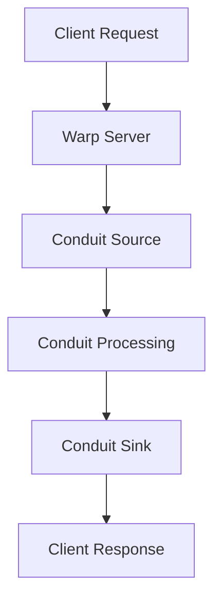

## 3.7 Network Programming with Libraries like Conduit and Warp

In this section, we delve into the world of network programming in Haskell using two powerful libraries: **Conduit** and **Warp**. These libraries are essential tools for building efficient, scalable, and high-performance network applications in Haskell. We will explore their features, provide detailed code examples, and guide you through building web applications leveraging these libraries.

### Introduction to Conduit and Warp

**Conduit** is a Haskell library designed for efficient and safe stream processing. It allows you to handle large data streams with minimal memory usage, making it ideal for network applications that require processing of continuous data flows.

**Warp**, on the other hand, is a fast and lightweight web server library for Haskell. It is built on top of the WAI (Web Application Interface) standard, which provides a common interface for web applications and servers in Haskell. Warp is known for its performance and is widely used in production environments.

### Why Use Conduit and Warp?

- **Efficiency**: Both libraries are optimized for performance. Conduit provides a way to process data in constant memory, while Warp is designed to handle high loads with minimal overhead.
- **Safety**: Haskell's strong type system ensures that your network code is safe and free from common errors such as buffer overflows.
- **Scalability**: These libraries are built to scale with your application's needs, whether you're handling a few connections or thousands.

### Getting Started with Conduit

#### What is Conduit?

Conduit is a library for managing streams of data. It allows you to process data incrementally, which is crucial for handling large datasets or continuous data streams without consuming excessive memory.

#### Basic Concepts

- **Source**: A producer of data.
- **Sink**: A consumer of data.
- **Conduit**: A transformer that can both consume and produce data.

#### Installing Conduit

To use Conduit in your Haskell project, add it to your project's dependencies. If you're using Stack, add the following to your `stack.yaml`:

```yaml
extra-deps:
- conduit-1.3.4.2
```

#### Simple Conduit Example

Let's start with a simple example that reads lines from a file and prints them to the console using Conduit.

```haskell
import Conduit

main :: IO ()
main = runConduitRes $
    sourceFile "example.txt" .| decodeUtf8C .| mapC (T.toUpper) .| sinkStdout
```

- **sourceFile**: Reads data from a file.
- **decodeUtf8C**: Decodes the byte stream into text.
- **mapC**: Applies a function to each element in the stream.
- **sinkStdout**: Outputs the stream to the standard output.

### Advanced Conduit Usage

#### Combining Sources and Sinks

Conduit allows you to compose complex data processing pipelines by combining multiple sources, sinks, and conduits.

```haskell
import Conduit
import qualified Data.Conduit.List as CL

processData :: IO ()
processData = runConduit $
    CL.sourceList [1..10] .| CL.map (*2) .| CL.filter even .| CL.consume >>= print
```

- **CL.sourceList**: Creates a source from a list.
- **CL.map**: Maps a function over the stream.
- **CL.filter**: Filters elements based on a predicate.
- **CL.consume**: Collects the stream into a list.

#### Error Handling in Conduit

Conduit provides mechanisms for handling errors gracefully within your data processing pipelines.

```haskell
import Conduit
import Control.Exception (try, SomeException)

safeProcess :: IO ()
safeProcess = runConduitRes $
    sourceFile "example.txt" .| handleC (try . processLine) .| sinkNull
  where
    processLine :: ByteString -> IO ()
    processLine line = putStrLn $ "Processing: " ++ show line
```

- **handleC**: Catches exceptions in the conduit pipeline.
- **try**: Attempts an IO action and returns either an exception or a result.

### Introduction to Warp

#### What is Warp?

Warp is a high-performance web server library for Haskell. It is designed to be fast, lightweight, and easy to use, making it a popular choice for building web applications in Haskell.

#### Installing Warp

To use Warp, add it to your project's dependencies. If you're using Stack, add the following to your `stack.yaml`:

```yaml
extra-deps:
- warp-3.3.13
```

#### Basic Warp Example

Let's create a simple web server using Warp that responds with "Hello, World!" to any request.

```haskell
import Network.Wai
import Network.Wai.Handler.Warp
import Network.HTTP.Types (status200)

main :: IO ()
main = run 8080 app

app :: Application
app _ respond = respond $ responseLBS status200 [("Content-Type", "text/plain")] "Hello, World!"
```

- **run**: Starts the Warp server on the specified port.
- **Application**: A type representing a web application.
- **responseLBS**: Creates a response with a status code, headers, and body.

### Building Web Applications with Warp

#### Routing Requests

Warp can be combined with routing libraries like `wai-routes` to handle different endpoints.

```haskell
import Network.Wai
import Network.Wai.Handler.Warp
import Network.HTTP.Types (status200)
import Web.Routes

main :: IO ()
main = run 8080 app

app :: Application
app req respond = case pathInfo req of
    ["hello"] -> respond $ responseLBS status200 [("Content-Type", "text/plain")] "Hello, World!"
    _         -> respond $ responseLBS status404 [("Content-Type", "text/plain")] "Not Found"
```

- **pathInfo**: Extracts the path from the request.
- **status404**: Represents a 404 Not Found status code.

#### Middleware in Warp

Middleware allows you to modify requests and responses, enabling features like logging, authentication, and more.

```haskell
import Network.Wai
import Network.Wai.Handler.Warp
import Network.Wai.Middleware.RequestLogger

main :: IO ()
main = run 8080 $ logStdout app

app :: Application
app _ respond = respond $ responseLBS status200 [("Content-Type", "text/plain")] "Hello, World!"
```

- **logStdout**: Logs requests to the standard output.

### Integrating Conduit and Warp

Conduit and Warp can be combined to build powerful web applications that efficiently handle streaming data.

#### Streaming Responses

You can use Conduit to stream data directly to the client in a Warp application.

```haskell
import Network.Wai
import Network.Wai.Handler.Warp
import Network.HTTP.Types (status200)
import Conduit

main :: IO ()
main = run 8080 app

app :: Application
app _ respond = respond $ responseStream status200 [("Content-Type", "text/plain")] $ \write flush -> do
    runConduit $ yieldMany [1..10] .| mapM_C (\i -> write (fromString $ show i ++ "\n") >> flush)
```

- **responseStream**: Sends a streaming response to the client.
- **yieldMany**: Produces a stream from a list.
- **mapM_C**: Applies an action to each element in the stream.

### Visualizing Conduit and Warp Interaction

To better understand how Conduit and Warp interact, let's visualize the data flow in a typical application.



**Diagram Description**: This flowchart illustrates the interaction between a client request and the Warp server, which processes the request using Conduit and sends a response back to the client.

### Best Practices for Network Programming in Haskell

- **Use Conduit for Streaming**: Leverage Conduit for handling large or continuous data streams efficiently.
- **Optimize Warp Performance**: Use Warp's configuration options to tune performance for your specific use case.
- **Handle Errors Gracefully**: Implement robust error handling in your Conduit pipelines and Warp applications.
- **Utilize Middleware**: Take advantage of middleware to add cross-cutting concerns like logging and authentication.

### References and Further Reading

- [Conduit on Hackage](https://hackage.haskell.org/package/conduit)
- [Warp on Hackage](https://hackage.haskell.org/package/warp)
- [WAI (Web Application Interface)](https://hackage.haskell.org/package/wai)

### Try It Yourself

Experiment with the code examples provided in this section. Try modifying the Conduit pipelines to process different types of data or add new routes to the Warp server. Explore the documentation for Conduit and Warp to discover additional features and capabilities.

## Quiz: Network Programming with Libraries like Conduit and Warp



### What is the primary purpose of the Conduit library in Haskell?

- [x] Efficient stream processing
- [ ] Database management
- [ ] User interface design
- [ ] Cryptographic operations

> **Explanation:** Conduit is designed for efficient and safe stream processing, allowing you to handle large data streams with minimal memory usage.

### Which of the following is a key feature of the Warp library?

- [x] High-performance web server
- [ ] Image processing
- [ ] Machine learning
- [ ] File compression

> **Explanation:** Warp is a fast and lightweight web server library for Haskell, known for its performance and scalability.

### How does Conduit handle large data streams efficiently?

- [x] Incremental processing
- [ ] Storing all data in memory
- [ ] Using global variables
- [ ] Compiling data to binary

> **Explanation:** Conduit processes data incrementally, which is crucial for handling large datasets or continuous data streams without consuming excessive memory.

### What is the role of middleware in a Warp application?

- [x] Modify requests and responses
- [ ] Compile the application
- [ ] Manage database connections
- [ ] Encrypt data

> **Explanation:** Middleware in Warp allows you to modify requests and responses, enabling features like logging, authentication, and more.

### Which function is used to start a Warp server on a specific port?

- [x] run
- [ ] startServer
- [ ] initServer
- [ ] launch

> **Explanation:** The `run` function is used to start the Warp server on the specified port.

### In a Conduit pipeline, what is a "Sink"?

- [x] A consumer of data
- [ ] A producer of data
- [ ] A transformer of data
- [ ] A logger of data

> **Explanation:** In Conduit, a Sink is a consumer of data, responsible for processing or storing the data it receives.

### How can you handle errors in a Conduit pipeline?

- [x] Using handleC
- [ ] Using tryCatch
- [ ] Using error
- [ ] Using throw

> **Explanation:** Conduit provides the `handleC` function to catch exceptions in the conduit pipeline, allowing for graceful error handling.

### What is the purpose of the `responseStream` function in Warp?

- [x] Send a streaming response to the client
- [ ] Compress the response data
- [ ] Authenticate the client
- [ ] Log the request

> **Explanation:** The `responseStream` function is used to send a streaming response to the client, allowing for efficient data transfer.

### Which of the following is a common use case for combining Conduit and Warp?

- [x] Building web applications that handle streaming data
- [ ] Developing desktop applications
- [ ] Creating static websites
- [ ] Designing mobile apps

> **Explanation:** Combining Conduit and Warp is ideal for building web applications that efficiently handle streaming data.

### True or False: Warp is built on top of the WAI (Web Application Interface) standard.

- [x] True
- [ ] False

> **Explanation:** Warp is indeed built on top of the WAI standard, which provides a common interface for web applications and servers in Haskell.



Remember, this is just the beginning. As you progress, you'll build more complex and interactive web applications. Keep experimenting, stay curious, and enjoy the journey!
