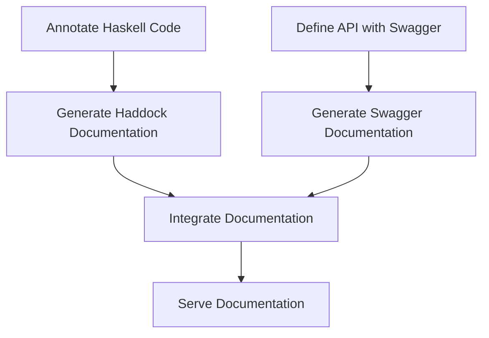

## 3.8 API Design and Documentation with Haddock and Swagger

In the world of software development, APIs (Application Programming Interfaces) play a crucial role in enabling different software systems to communicate with each other. In Haskell, designing and documenting APIs effectively is essential for creating robust, maintainable, and user-friendly applications. This section delves into the use of Haddock and Swagger (OpenAPI) for API design and documentation in Haskell, providing expert insights and best practices.

### Understanding Haddock

**Haddock** is a documentation-generation tool specifically designed for Haskell. It extracts documentation from annotated source code, allowing developers to create comprehensive and navigable documentation for their Haskell projects.

#### Key Features of Haddock

- **Automatic Documentation Generation**: Haddock automatically generates documentation from Haskell source code, making it easy to keep documentation up to date.
- **Hyperlinked Output**: The generated documentation includes hyperlinks, allowing users to easily navigate between different parts of the documentation.
- **Customizable Output**: Developers can customize the appearance and content of the documentation using various options and templates.

#### Using Haddock in Haskell Projects

To use Haddock in your Haskell project, follow these steps:

1. **Install Haddock**: Ensure that Haddock is installed on your system. It is typically included with the Haskell Platform.

2. **Annotate Your Code**: Add comments and annotations to your Haskell source code. Haddock uses special syntax to identify documentation comments.

   ```haskell
   -- | This function adds two numbers.
   add :: Int -> Int -> Int
   add x y = x + y
   ```

3. **Generate Documentation**: Run Haddock to generate the documentation. This can be done using the command line or integrated into your build process.

   ```bash
   haddock --html --output=docs src/MyModule.hs
   ```

4. **View the Documentation**: Open the generated HTML files in a web browser to view the documentation.

#### Best Practices for Using Haddock

- **Consistent Commenting**: Use consistent commenting styles and conventions throughout your codebase to ensure uniform documentation.
- **Detailed Descriptions**: Provide detailed descriptions for functions, types, and modules to enhance the usefulness of the documentation.
- **Examples and Usage**: Include examples and usage scenarios in your documentation to help users understand how to use your API effectively.

### Introducing Swagger (OpenAPI)

**Swagger**, now known as **OpenAPI**, is a specification for describing and documenting RESTful APIs. It provides a standard way to define API endpoints, request/response formats, and other API characteristics.

#### Key Features of Swagger

- **Standardized API Description**: Swagger provides a standardized format for describing APIs, making it easier for developers to understand and consume APIs.
- **Interactive Documentation**: Swagger UI allows developers to interact with the API documentation, making it easier to test and explore API endpoints.
- **Code Generation**: Swagger can generate client and server code in various programming languages, reducing development time and effort.

#### Using Swagger in Haskell Projects

To use Swagger in your Haskell project, follow these steps:

1. **Define Your API**: Use the Swagger specification to define your API endpoints, request/response formats, and other details.

   ```yaml
   openapi: 3.0.0
   info:
     title: Sample API
     version: 1.0.0
   paths:
     /add:
       get:
         summary: Add two numbers
         parameters:
           - name: x
             in: query
             required: true
             schema:
               type: integer
           - name: y
             in: query
             required: true
             schema:
               type: integer
         responses:
           '200':
             description: The sum of the two numbers
             content:
               application/json:
                 schema:
                   type: integer
   ```

2. **Generate Documentation**: Use tools like Swagger UI to generate interactive documentation from your Swagger specification.

3. **Integrate with Haskell**: Use libraries like `servant-swagger` to integrate Swagger with your Haskell application.

   ```haskell
   -- Define your API using Servant
   type API = "add" :> QueryParam "x" Int :> QueryParam "y" Int :> Get '[JSON] Int

   -- Generate Swagger documentation
   apiSwagger :: Swagger
   apiSwagger = toSwagger (Proxy :: Proxy API)
   ```

4. **Serve the Documentation**: Serve the generated Swagger documentation alongside your API to provide users with easy access to the API details.

#### Best Practices for Using Swagger

- **Comprehensive API Description**: Ensure that your Swagger specification includes all necessary details about your API, including parameters, request/response formats, and error codes.
- **Consistent Naming Conventions**: Use consistent naming conventions for API endpoints, parameters, and data models to enhance readability and maintainability.
- **Versioning**: Include versioning information in your Swagger specification to manage changes and updates to your API over time.

### Combining Haddock and Swagger for Effective API Documentation

By combining Haddock and Swagger, you can create comprehensive and user-friendly documentation for your Haskell APIs. Haddock provides detailed documentation for your Haskell code, while Swagger offers a standardized and interactive way to describe and document your RESTful APIs.

#### Workflow for Combining Haddock and Swagger

1. **Document Haskell Code with Haddock**: Use Haddock to generate detailed documentation for your Haskell codebase, including functions, types, and modules.

2. **Define API with Swagger**: Use Swagger to define and document your API endpoints, request/response formats, and other details.

3. **Integrate Documentation**: Integrate the Haddock and Swagger documentation to provide users with a comprehensive view of your API and its implementation.

4. **Maintain Documentation**: Regularly update and maintain both Haddock and Swagger documentation to ensure accuracy and relevance.

### Visualizing the API Documentation Process

Below is a diagram illustrating the process of generating API documentation using Haddock and Swagger in a Haskell project.



**Figure 1**: The process of generating API documentation using Haddock and Swagger in a Haskell project.

### References and Further Reading

- [Haddock Documentation](https://www.haskell.org/haddock/)
- [Swagger for Haskell](https://hackage.haskell.org/package/servant-swagger)
- [OpenAPI Specification](https://swagger.io/specification/)
- [Servant Library](https://hackage.haskell.org/package/servant)

### Knowledge Check

- What are the key features of Haddock and how do they benefit Haskell developers?
- How does Swagger enhance the documentation and usability of RESTful APIs?
- Describe the process of integrating Haddock and Swagger documentation in a Haskell project.

### Try It Yourself

Experiment with the code examples provided in this section. Try modifying the Haddock comments and Swagger specification to see how the generated documentation changes. Explore the use of different Swagger tools and libraries to enhance your API documentation.

### Embrace the Journey

Remember, mastering API design and documentation is an ongoing journey. As you continue to explore and experiment with Haddock and Swagger, you'll discover new ways to enhance your Haskell projects. Stay curious, keep learning, and enjoy the process!

## Quiz: API Design and Documentation with Haddock and Swagger



### What is the primary purpose of Haddock in Haskell projects?

- [x] To generate documentation from Haskell source code
- [ ] To compile Haskell code into executable binaries
- [ ] To manage Haskell package dependencies
- [ ] To optimize Haskell code for performance

> **Explanation:** Haddock is a tool used to generate documentation from Haskell source code, making it easier to maintain and navigate.

### Which of the following is a key feature of Swagger?

- [x] Standardized API description
- [ ] Automatic code optimization
- [ ] Real-time error detection
- [ ] Memory management

> **Explanation:** Swagger provides a standardized format for describing APIs, enhancing their usability and understanding.

### How can you integrate Swagger with a Haskell application?

- [x] By using libraries like `servant-swagger`
- [ ] By writing custom parsers for Swagger files
- [ ] By embedding Swagger UI directly into Haskell code
- [ ] By converting Swagger files to JSON manually

> **Explanation:** Libraries like `servant-swagger` allow you to integrate Swagger with Haskell applications, facilitating API documentation.

### What is the benefit of combining Haddock and Swagger for API documentation?

- [x] It provides comprehensive and user-friendly documentation
- [ ] It reduces the need for code comments
- [ ] It eliminates the need for version control
- [ ] It automates code testing

> **Explanation:** Combining Haddock and Swagger provides comprehensive documentation for both the Haskell codebase and the API endpoints.

### Which tool allows for interactive API documentation?

- [x] Swagger UI
- [ ] Haddock
- [ ] GHC
- [ ] Cabal

> **Explanation:** Swagger UI provides interactive documentation, allowing users to explore and test API endpoints.

### What is a best practice when using Haddock?

- [x] Provide detailed descriptions for functions and types
- [ ] Use minimal comments to reduce clutter
- [ ] Focus only on module-level documentation
- [ ] Avoid using examples in documentation

> **Explanation:** Providing detailed descriptions for functions and types enhances the usefulness of the documentation.

### What should be included in a Swagger specification for comprehensive API documentation?

- [x] Parameters, request/response formats, and error codes
- [ ] Only the API endpoints
- [ ] Only the request formats
- [ ] Only the response formats

> **Explanation:** A comprehensive Swagger specification includes parameters, request/response formats, and error codes.

### How does Haddock identify documentation comments in Haskell code?

- [x] By using special syntax for comments
- [ ] By analyzing the function signatures
- [ ] By reading external documentation files
- [ ] By scanning for keywords in the code

> **Explanation:** Haddock uses special syntax to identify documentation comments in Haskell code.

### What is a key consideration when defining API endpoints in Swagger?

- [x] Use consistent naming conventions
- [ ] Minimize the number of endpoints
- [ ] Avoid using query parameters
- [ ] Focus only on GET requests

> **Explanation:** Consistent naming conventions enhance the readability and maintainability of API endpoints.

### True or False: Swagger can generate client and server code in various programming languages.

- [x] True
- [ ] False

> **Explanation:** Swagger can generate client and server code in various programming languages, reducing development time and effort.


