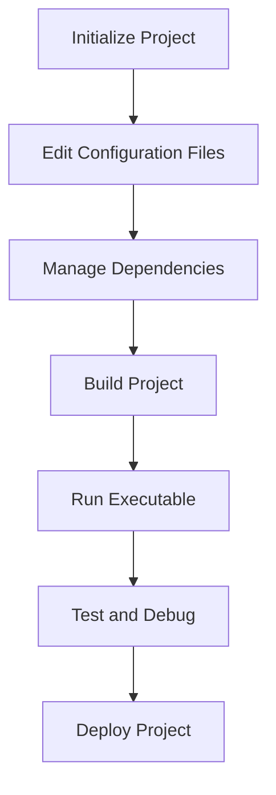

## 3.9 Package Management and Build Tools (Cabal, Stack)

In the Haskell ecosystem, managing packages and building projects efficiently is crucial for developing scalable and maintainable software. Two primary tools facilitate this process: **Cabal** and **Stack**. Both tools offer unique features and capabilities, catering to different needs and preferences of Haskell developers. In this section, we will delve into the functionalities, advantages, and best practices associated with using Cabal and Stack for Haskell project management.

### Understanding Cabal

**Cabal** is the standard build tool and package format for Haskell. It provides a comprehensive framework for managing Haskell software, including dependency resolution, building, and packaging.

#### Key Features of Cabal

- **Package Description**: Cabal uses a `.cabal` file to describe the package, including its dependencies, modules, and build instructions.
- **Dependency Management**: Cabal resolves dependencies by consulting the Hackage repository, ensuring that all required packages are available and compatible.
- **Build Process**: Cabal automates the build process, compiling Haskell source files and linking them into executables or libraries.
- **Sandboxing**: Cabal supports sandboxing, allowing developers to isolate dependencies for individual projects, preventing conflicts between different projects.

#### Creating a Cabal Project

To create a new Cabal project, follow these steps:

1. **Initialize the Project**: Use the `cabal init` command to set up a new project. This command generates a basic `.cabal` file and a directory structure for your project.

   ```bash
   cabal init
   ```

2. **Edit the .cabal File**: Customize the generated `.cabal` file to specify your project's name, version, dependencies, and other metadata.

   ```cabal
   name:           my-project
   version:        0.1.0.0
   build-type:     Simple
   cabal-version:  >=1.10

   library
     exposed-modules:     MyProject
     build-depends:       base >=4.7 && <5
     hs-source-dirs:      src
     default-language:    Haskell2010
   ```

3. **Build the Project**: Use the `cabal build` command to compile your project. Cabal will automatically download and install any missing dependencies.

   ```bash
   cabal build
   ```

4. **Run the Executable**: If your project includes an executable, you can run it using the `cabal run` command.

   ```bash
   cabal run my-executable
   ```

#### Managing Dependencies with Cabal

Cabal handles dependencies through the `.cabal` file, where you specify the packages your project depends on. Cabal resolves these dependencies by consulting the Hackage repository, ensuring that all required packages are available and compatible.

- **Adding Dependencies**: To add a new dependency, simply include it in the `build-depends` section of your `.cabal` file.

  ```cabal
  build-depends:       base >=4.7 && <5, text, containers
  ```

- **Updating Dependencies**: Use the `cabal update` command to refresh the list of available packages from Hackage.

  ```bash
  cabal update
  ```

- **Installing Dependencies**: Run `cabal install` to download and install the specified dependencies.

  ```bash
  cabal install
  ```

### Exploring Stack

**Stack** is a cross-platform program for developing Haskell projects. It emphasizes reproducible builds and ease of use, making it a popular choice among Haskell developers.

#### Key Features of Stack

- **Reproducible Builds**: Stack ensures that builds are reproducible by using curated package sets called Stackage snapshots.
- **Project Isolation**: Stack creates isolated environments for each project, preventing dependency conflicts.
- **Ease of Use**: Stack provides a simple and intuitive command-line interface, making it easy to manage Haskell projects.
- **Integration with Cabal**: Stack uses Cabal under the hood for building projects, allowing developers to leverage Cabal's features while benefiting from Stack's enhancements.

#### Creating a Stack Project

To create a new Stack project, follow these steps:

1. **Initialize the Project**: Use the `stack new` command to create a new project. Stack will generate a basic project structure and a `stack.yaml` file.

   ```bash
   stack new my-project
   ```

2. **Edit the stack.yaml File**: Customize the `stack.yaml` file to specify the resolver (Stackage snapshot) and any additional settings.

   ```yaml
   resolver: lts-18.0
   packages:
   - .
   ```

3. **Build the Project**: Use the `stack build` command to compile your project. Stack will automatically download and install any missing dependencies.

   ```bash
   stack build
   ```

4. **Run the Executable**: If your project includes an executable, you can run it using the `stack exec` command.

   ```bash
   stack exec my-executable
   ```

#### Managing Dependencies with Stack

Stack manages dependencies through the `stack.yaml` file, where you specify the resolver and any additional packages.

- **Adding Dependencies**: To add a new dependency, include it in the `extra-deps` section of your `stack.yaml` file.

  ```yaml
  extra-deps:
  - text-1.2.4.1
  - containers-0.6.2.1
  ```

- **Updating Dependencies**: Use the `stack update` command to refresh the list of available packages from Stackage.

  ```bash
  stack update
  ```

- **Installing Dependencies**: Run `stack build` to download and install the specified dependencies.

  ```bash
  stack build
  ```

### Comparing Cabal and Stack

Both Cabal and Stack offer powerful features for managing Haskell projects, but they have different strengths and use cases.

#### Cabal vs. Stack: Key Differences

- **Reproducibility**: Stack emphasizes reproducible builds through Stackage snapshots, while Cabal relies on the latest available versions from Hackage.
- **Ease of Use**: Stack provides a more user-friendly interface and workflow, especially for beginners.
- **Flexibility**: Cabal offers more flexibility in terms of dependency resolution and package management.
- **Community Support**: Both tools have active communities, but Stack is often preferred for its simplicity and reproducibility.

#### When to Use Cabal

- **Advanced Dependency Management**: If you need fine-grained control over dependencies and versions, Cabal is a better choice.
- **Custom Build Processes**: Cabal allows for more customization in the build process, making it suitable for complex projects.

#### When to Use Stack

- **Reproducible Builds**: If reproducibility is a priority, Stack's use of Stackage snapshots ensures consistent builds.
- **Ease of Use**: Stack's intuitive interface and workflow make it ideal for new Haskell developers or those who prefer simplicity.

### Best Practices for Using Cabal and Stack

- **Version Control**: Always use version control for your `.cabal` and `stack.yaml` files to track changes in dependencies and build configurations.
- **Documentation**: Document your project's dependencies and build instructions to make it easier for others to contribute or maintain the project.
- **Testing**: Regularly test your project with different versions of dependencies to ensure compatibility and stability.
- **Continuous Integration**: Set up continuous integration (CI) pipelines to automate testing and building of your project.

### Visualizing the Workflow

To better understand the workflow of using Cabal and Stack, let's visualize the process of creating, building, and managing a Haskell project with these tools.



**Caption**: The workflow of managing a Haskell project using Cabal and Stack involves initializing the project, editing configuration files, managing dependencies, building the project, running executables, testing, debugging, and deploying.

### References and Further Reading

- [Cabal Official Documentation](https://www.haskell.org/cabal/)
- [Stack Official Documentation](https://docs.haskellstack.org/en/stable/README/)
- [Hackage Repository](https://hackage.haskell.org/)
- [Stackage Repository](https://www.stackage.org/)

### Knowledge Check

- **What are the primary differences between Cabal and Stack?**
- **How does Stack ensure reproducible builds?**
- **What are the benefits of using sandboxing in Cabal?**
- **How can you add a new dependency to a Stack project?**

### Embrace the Journey

Remember, mastering package management and build tools in Haskell is a journey. As you progress, you'll gain a deeper understanding of how to efficiently manage dependencies, build projects, and ensure reproducibility. Keep experimenting, stay curious, and enjoy the process!

## Quiz: Package Management and Build Tools (Cabal, Stack)



### What is the primary purpose of Cabal in Haskell?

- [x] To manage packages and automate the build process
- [ ] To provide a graphical user interface for Haskell development
- [ ] To replace the Haskell compiler
- [ ] To serve as a version control system

> **Explanation:** Cabal is used for managing packages and automating the build process in Haskell projects.

### How does Stack ensure reproducible builds?

- [x] By using curated package sets called Stackage snapshots
- [ ] By downloading the latest versions of packages from Hackage
- [ ] By using a graphical interface for package management
- [ ] By integrating with Git for version control

> **Explanation:** Stack uses Stackage snapshots, which are curated sets of package versions, to ensure reproducible builds.

### What file does Cabal use to describe a package?

- [x] .cabal file
- [ ] stack.yaml file
- [ ] package.json file
- [ ] build.gradle file

> **Explanation:** Cabal uses a `.cabal` file to describe the package, including its dependencies and build instructions.

### Which tool is known for its ease of use and reproducibility?

- [x] Stack
- [ ] Cabal
- [ ] GHC
- [ ] HLint

> **Explanation:** Stack is known for its ease of use and reproducibility, making it a popular choice among Haskell developers.

### How can you add a new dependency to a Cabal project?

- [x] By editing the `build-depends` section in the `.cabal` file
- [ ] By creating a new `dependencies.txt` file
- [ ] By using the `stack add` command
- [ ] By modifying the `stack.yaml` file

> **Explanation:** In a Cabal project, you add a new dependency by editing the `build-depends` section in the `.cabal` file.

### What is the role of the `stack.yaml` file in a Stack project?

- [x] To specify the resolver and additional settings for the project
- [ ] To replace the `.cabal` file
- [ ] To serve as a version control file
- [ ] To provide a graphical interface for project management

> **Explanation:** The `stack.yaml` file specifies the resolver and additional settings for a Stack project.

### Which tool supports sandboxing to isolate dependencies?

- [x] Cabal
- [ ] Stack
- [ ] GHC
- [ ] HLint

> **Explanation:** Cabal supports sandboxing, allowing developers to isolate dependencies for individual projects.

### What command is used to initialize a new Stack project?

- [x] stack new
- [ ] cabal init
- [ ] stack init
- [ ] cabal new

> **Explanation:** The `stack new` command is used to initialize a new Stack project.

### Which tool is preferred for advanced dependency management?

- [x] Cabal
- [ ] Stack
- [ ] GHC
- [ ] HLint

> **Explanation:** Cabal is preferred for advanced dependency management due to its flexibility and control over dependencies.

### True or False: Stack integrates with Cabal under the hood for building projects.

- [x] True
- [ ] False

> **Explanation:** Stack integrates with Cabal under the hood, allowing developers to leverage Cabal's features while benefiting from Stack's enhancements.


