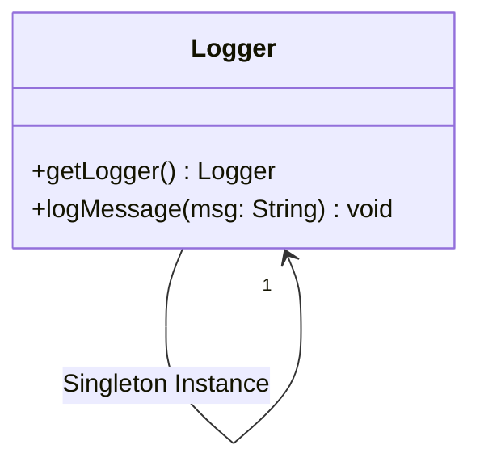
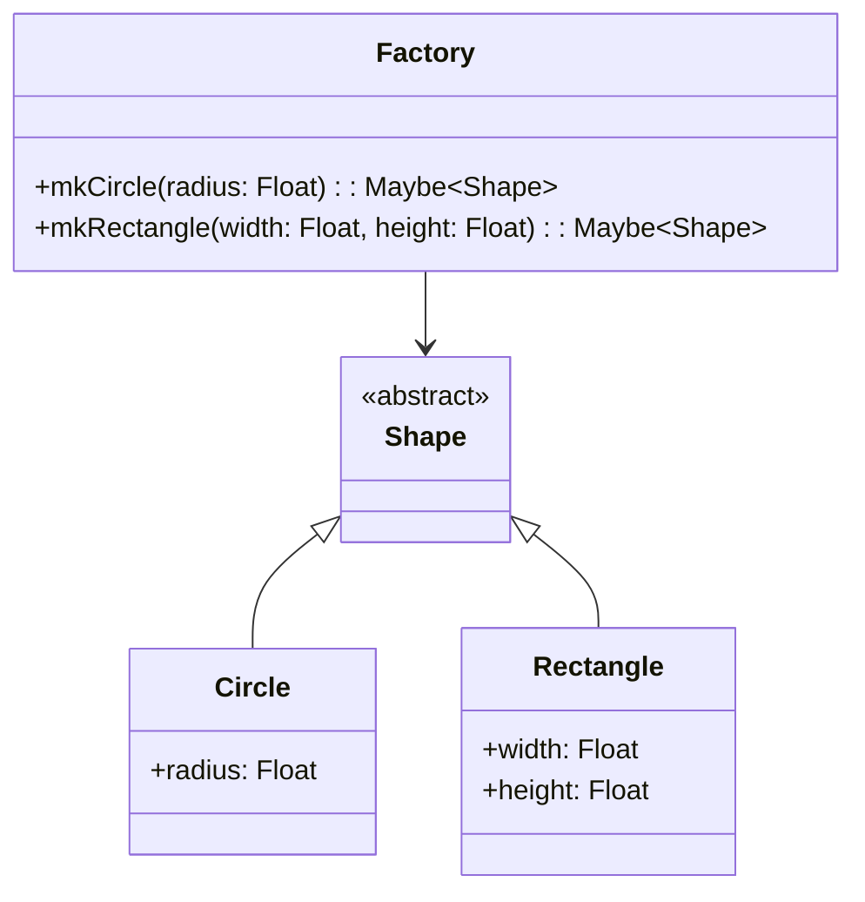

## 4.1 Adapting Creational Patterns to Purely Functional Haskell

In the world of software design, creational patterns are essential for managing object creation mechanisms, aiming to create objects in a manner suitable to the situation. However, when we transition from an object-oriented paradigm to a purely functional one like Haskell, we encounter unique challenges and opportunities. This section explores how to adapt traditional creational design patterns to Haskell's functional paradigm, leveraging its unique features such as immutability, pure functions, and strong type systems.

### Challenges in Translating Creational Patterns to Functional Context

Creational patterns in object-oriented programming (OOP) often rely on mutable state and class hierarchies. In Haskell, we must rethink these patterns to align with functional principles:

- **Immutability**: In Haskell, data structures are immutable by default, which means once created, they cannot be changed. This requires a shift in how we think about object creation and modification.
- **Pure Functions**: Haskell emphasizes pure functions, which have no side effects and always produce the same output for the same input. This purity must be maintained even when implementing creational patterns.
- **Lack of Classes**: Haskell does not have classes in the traditional OOP sense. Instead, it uses type classes, which provide a form of polymorphism but without the inheritance model found in OOP.

### Functional Alternatives to Creational Patterns

To adapt creational patterns to Haskell, we focus on functional alternatives that emphasize immutability and pure functions. Let's explore some of these adaptations.

#### Singleton Pattern

**Intent**: Ensure a class has only one instance and provide a global point of access to it.

**Haskell Approach**: In Haskell, we can achieve a singleton pattern using modules and constants. Since Haskell modules can encapsulate state and behavior, they serve as a natural way to implement singletons.

```haskell
module Logger (getLogger, logMessage) where

-- Logger is a singleton instance
data Logger = Logger

getLogger :: Logger
getLogger = Logger

logMessage :: Logger -> String -> IO ()
logMessage Logger msg = putStrLn msg
```

**Key Participants**:
- **Module**: Encapsulates the singleton instance.
- **Constant**: Represents the singleton instance.

**Design Considerations**:
- Use modules to encapsulate the singleton logic.
- Ensure that the singleton instance is immutable.

#### Factory Pattern

**Intent**: Define an interface for creating an object, but let subclasses alter the type of objects that will be created.

**Haskell Approach**: In Haskell, we use smart constructors and phantom types to implement the factory pattern. Smart constructors ensure that objects are created in a valid state.

```haskell
data Shape = Circle Float | Rectangle Float Float

-- Smart constructor for Circle
mkCircle :: Float -> Maybe Shape
mkCircle radius
  | radius > 0 = Just (Circle radius)
  | otherwise  = Nothing

-- Smart constructor for Rectangle
mkRectangle :: Float -> Float -> Maybe Shape
mkRectangle width height
  | width > 0 && height > 0 = Just (Rectangle width height)
  | otherwise               = Nothing
```

**Key Participants**:
- **Smart Constructors**: Functions that encapsulate the creation logic.
- **Phantom Types**: Used to enforce type constraints at compile time.

**Design Considerations**:
- Use smart constructors to ensure valid object creation.
- Leverage Haskell's type system to enforce constraints.

#### Builder Pattern

**Intent**: Separate the construction of a complex object from its representation, allowing the same construction process to create different representations.

**Haskell Approach**: Use function chaining and record syntax to implement the builder pattern. This allows for a flexible and composable way to construct objects.

```haskell
data Car = Car
  { make  :: String
  , model :: String
  , year  :: Int
  } deriving Show

defaultCar :: Car
defaultCar = Car { make = "Unknown", model = "Unknown", year = 0 }

setMake :: String -> Car -> Car
setMake m car = car { make = m }

setModel :: String -> Car -> Car
setModel m car = car { model = m }

setYear :: Int -> Car -> Car
setYear y car = car { year = y }

-- Building a car using function chaining
myCar :: Car
myCar = setMake "Toyota" . setModel "Corolla" . setYear 2020 $ defaultCar
```

**Key Participants**:
- **Record Syntax**: Provides a way to define and update fields.
- **Function Chaining**: Allows for a composable way to build objects.

**Design Considerations**:
- Use record syntax for easy field updates.
- Chain functions to build complex objects incrementally.

#### Prototype Pattern

**Intent**: Specify the kinds of objects to create using a prototypical instance, and create new objects by copying this prototype.

**Haskell Approach**: Use record updates to implement the prototype pattern. This allows for creating new instances by modifying existing ones.

```haskell
data Prototype = Prototype
  { protoName :: String
  , protoValue :: Int
  } deriving Show

clonePrototype :: Prototype -> Prototype
clonePrototype proto = proto { protoValue = protoValue proto + 1 }

-- Example usage
original :: Prototype
original = Prototype { protoName = "Original", protoValue = 42 }

newInstance :: Prototype
newInstance = clonePrototype original
```

**Key Participants**:
- **Record Updates**: Used to clone and modify existing instances.

**Design Considerations**:
- Use record updates for efficient cloning.
- Ensure immutability by creating new instances rather than modifying existing ones.

#### Dependency Injection

**Intent**: A technique where an object receives other objects it depends on, rather than creating them internally.

**Haskell Approach**: Use the Reader Monad to implement dependency injection. This allows for passing dependencies implicitly through the computation.

```haskell
import Control.Monad.Reader

data Config = Config { configValue :: String }

type App = Reader Config

getConfigValue :: App String
getConfigValue = asks configValue

runApp :: Config -> App a -> a
runApp config app = runReader app config

-- Example usage
main :: IO ()
main = do
  let config = Config { configValue = "Hello, Haskell!" }
  putStrLn $ runApp config getConfigValue
```

**Key Participants**:
- **Reader Monad**: Encapsulates the dependency injection logic.

**Design Considerations**:
- Use the Reader Monad for implicit dependency passing.
- Ensure that dependencies are immutable and passed through the computation.

### Visualizing Creational Patterns in Haskell

To better understand how these patterns are adapted in Haskell, let's visualize the process using Mermaid.js diagrams.

#### Singleton Pattern Visualization



**Description**: This diagram shows the Logger module encapsulating the singleton instance.

#### Factory Pattern Visualization



**Description**: This diagram illustrates the use of smart constructors to create different shapes.

### Haskell Unique Features

Haskell's unique features, such as immutability, pure functions, and a strong type system, play a crucial role in adapting creational patterns:

- **Immutability**: Ensures that once data is created, it cannot be changed, leading to safer and more predictable code.
- **Pure Functions**: Encourage a declarative style of programming, where functions describe what they do rather than how they do it.
- **Strong Type System**: Provides compile-time guarantees about the behavior of the code, reducing runtime errors.

### Differences and Similarities with OOP Patterns

While adapting creational patterns to Haskell, it's important to note the differences and similarities with their OOP counterparts:

- **Singleton Pattern**: In OOP, singletons often involve mutable state and global access. In Haskell, we achieve this through modules and constants, maintaining immutability.
- **Factory Pattern**: OOP factories often rely on class hierarchies and inheritance. In Haskell, we use smart constructors and type classes to achieve similar functionality.
- **Builder Pattern**: OOP builders often involve mutable objects. In Haskell, we use function chaining and record syntax to build immutable objects.
- **Prototype Pattern**: OOP prototypes involve cloning mutable objects. In Haskell, we use record updates to create new instances from existing ones.

### Try It Yourself

To deepen your understanding, try modifying the code examples:

- **Singleton Pattern**: Add a function to the `Logger` module that formats messages before logging them.
- **Factory Pattern**: Extend the `Shape` data type with a new shape, such as `Triangle`, and implement a smart constructor for it.
- **Builder Pattern**: Add additional fields to the `Car` data type, such as `color` and `engineType`, and update the builder functions accordingly.
- **Prototype Pattern**: Modify the `clonePrototype` function to allow for more complex modifications, such as changing the `protoName`.

### Knowledge Check

Before moving on, let's test your understanding of adapting creational patterns to Haskell.

## Quiz: Adapting Creational Patterns to Purely Functional Haskell



### Which Haskell feature is crucial for implementing the Singleton pattern?

- [x] Modules
- [ ] Mutable State
- [ ] Inheritance
- [ ] Interfaces

> **Explanation:** Modules in Haskell encapsulate state and behavior, making them ideal for implementing singletons.

### What is the primary purpose of smart constructors in Haskell?

- [x] To ensure objects are created in a valid state
- [ ] To provide mutable state
- [ ] To implement inheritance
- [ ] To manage side effects

> **Explanation:** Smart constructors encapsulate creation logic, ensuring that objects are always in a valid state.

### How does the Builder pattern differ in Haskell compared to OOP?

- [x] It uses function chaining and record syntax
- [ ] It relies on mutable objects
- [ ] It uses inheritance
- [ ] It requires global state

> **Explanation:** In Haskell, the Builder pattern uses function chaining and record syntax to build immutable objects.

### What is a key advantage of using the Reader Monad for dependency injection in Haskell?

- [x] It allows for implicit dependency passing
- [ ] It provides mutable state
- [ ] It enables inheritance
- [ ] It requires global state

> **Explanation:** The Reader Monad allows for implicit dependency passing through the computation.

### Which of the following is NOT a feature of Haskell's type system?

- [ ] Strong typing
- [ ] Type inference
- [x] Inheritance
- [ ] Type classes

> **Explanation:** Haskell does not have inheritance in the traditional OOP sense; it uses type classes for polymorphism.

### What is the primary benefit of immutability in Haskell?

- [x] Safer and more predictable code
- [ ] Easier to implement inheritance
- [ ] Allows for mutable state
- [ ] Requires less memory

> **Explanation:** Immutability ensures that data cannot be changed once created, leading to safer and more predictable code.

### How can you extend the Factory pattern in Haskell?

- [x] By adding new smart constructors
- [ ] By using inheritance
- [ ] By modifying global state
- [ ] By creating mutable objects

> **Explanation:** In Haskell, you can extend the Factory pattern by adding new smart constructors for additional types.

### What is a common pitfall when adapting OOP patterns to Haskell?

- [x] Misapplying mutable state concepts
- [ ] Using too many pure functions
- [ ] Overusing modules
- [ ] Ignoring type inference

> **Explanation:** A common pitfall is trying to apply mutable state concepts from OOP to Haskell, which emphasizes immutability.

### Which pattern uses record updates for cloning objects in Haskell?

- [x] Prototype Pattern
- [ ] Singleton Pattern
- [ ] Factory Pattern
- [ ] Builder Pattern

> **Explanation:** The Prototype Pattern in Haskell uses record updates to clone and modify existing instances.

### True or False: Haskell's type system supports traditional class inheritance.

- [ ] True
- [x] False

> **Explanation:** Haskell does not support traditional class inheritance; it uses type classes for polymorphism.



Remember, this is just the beginning. As you progress, you'll build more complex and interactive systems using Haskell's functional paradigm. Keep experimenting, stay curious, and enjoy the journey!
