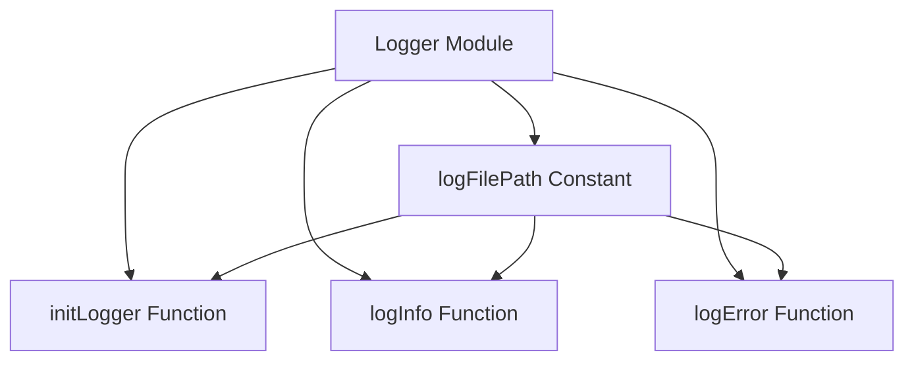

## 4.2 Singleton Pattern Using Modules and Constants

In the realm of software design patterns, the Singleton Pattern is a well-known creational pattern that ensures a class has only one instance and provides a global point of access to it. While this pattern is prevalent in object-oriented programming, implementing it in a functional language like Haskell requires a different approach due to its emphasis on immutability and purity. In this section, we will explore how to implement the Singleton Pattern in Haskell using modules and constants, while maintaining the language's functional integrity.

### Singleton Concept

The Singleton Pattern is designed to restrict the instantiation of a class to a single object. This is particularly useful when exactly one object is needed to coordinate actions across the system. Common examples include configuration settings, logging mechanisms, and connection pools.

#### Key Participants

- **Singleton Class**: The class that is responsible for creating and managing its single instance.
- **Client**: The entities that access the Singleton instance.

### Implementation in Haskell

In Haskell, we can achieve the Singleton Pattern by leveraging modules and constants. This approach allows us to encapsulate state and provide shared access without compromising on purity.

#### Using Modules to Encapsulate State

Modules in Haskell serve as a way to group related functions, types, and values. By using a module, we can encapsulate the state and expose only the necessary interface to the outside world.

```haskell
module Logger (logMessage) where

-- Define a constant for the logger configuration
loggerConfig :: String
loggerConfig = "Logging configuration"

-- Function to log a message
logMessage :: String -> IO ()
logMessage message = putStrLn $ loggerConfig ++ ": " ++ message
```

In this example, the `Logger` module encapsulates the logging configuration and provides a `logMessage` function to log messages. The `loggerConfig` is a constant that acts as the shared state, ensuring that all logging operations use the same configuration.

#### Defining Constants at the Top Level

Constants in Haskell can be defined at the top level of a module, providing a way to share immutable values across the application.

```haskell
module Config (getConfig) where

-- Define a constant for the configuration
config :: String
config = "Application configuration"

-- Function to retrieve the configuration
getConfig :: String
getConfig = config
```

Here, the `Config` module defines a constant `config` that holds the application configuration. The `getConfig` function provides access to this constant, ensuring that all parts of the application use the same configuration.

### Avoiding Global State

One of the challenges in implementing the Singleton Pattern in Haskell is avoiding global state, which can lead to side effects and impurity. By using modules and constants, we can maintain purity while providing shared access.

#### Maintaining Purity

Haskell's emphasis on purity means that functions should not have side effects. By encapsulating state within modules and using constants, we can ensure that our Singleton implementation remains pure.

```haskell
module Database (getConnection) where

-- Define a constant for the database connection string
connectionString :: String
connectionString = "Database connection string"

-- Function to get the database connection
getConnection :: IO String
getConnection = return connectionString
```

In this example, the `Database` module encapsulates the database connection string as a constant. The `getConnection` function returns this constant, ensuring that the database connection remains consistent across the application.

### Example: Creating a Logger or Configuration Module

Let's consider a more comprehensive example of creating a logger module using the Singleton Pattern in Haskell.

```haskell
module Logger (initLogger, logInfo, logError) where

import System.IO

-- Define a constant for the log file path
logFilePath :: FilePath
logFilePath = "application.log"

-- Initialize the logger by opening the log file
initLogger :: IO Handle
initLogger = openFile logFilePath AppendMode

-- Log an informational message
logInfo :: Handle -> String -> IO ()
logInfo handle message = hPutStrLn handle $ "INFO: " ++ message

-- Log an error message
logError :: Handle -> String -> IO ()
logError handle message = hPutStrLn handle $ "ERROR: " ++ message
```

In this example, the `Logger` module provides functions to initialize the logger and log informational and error messages. The `logFilePath` constant defines the path to the log file, ensuring that all logging operations use the same file.

### Try It Yourself

To experiment with the Singleton Pattern in Haskell, try modifying the logger module to include additional log levels, such as `DEBUG` or `WARN`. You can also explore different ways to manage the log file, such as rotating logs or compressing old logs.

### Visualizing the Singleton Pattern in Haskell

To better understand the Singleton Pattern in Haskell, let's visualize the relationship between modules, constants, and functions using a Mermaid.js diagram.



**Diagram Description**: This diagram illustrates the `Logger` module, which contains the `logFilePath` constant and three functions: `initLogger`, `logInfo`, and `logError`. The constant is used by all three functions to ensure consistent logging behavior.

### Design Considerations

When implementing the Singleton Pattern in Haskell, consider the following:

- **Immutability**: Ensure that the shared state is immutable to maintain purity.
- **Encapsulation**: Use modules to encapsulate state and expose only the necessary interface.
- **Concurrency**: Consider thread safety if the Singleton is accessed concurrently.

### Haskell Unique Features

Haskell's unique features, such as immutability and purity, make it well-suited for implementing the Singleton Pattern using modules and constants. By leveraging these features, we can create a Singleton that is both efficient and maintainable.

### Differences and Similarities

The Singleton Pattern in Haskell differs from its implementation in object-oriented languages due to the absence of mutable state and class-based structures. However, the core concept of providing a single point of access remains the same.

### Knowledge Check

- **Question**: How does Haskell's emphasis on immutability affect the implementation of the Singleton Pattern?
- **Exercise**: Modify the logger module to include a `DEBUG` log level and test its functionality.

### Embrace the Journey

Remember, mastering design patterns in Haskell is a journey. As you progress, you'll discover new ways to leverage Haskell's unique features to create efficient and maintainable software. Keep experimenting, stay curious, and enjoy the journey!

## Quiz: Singleton Pattern Using Modules and Constants



### What is the primary purpose of the Singleton Pattern?

- [x] To ensure a class has only one instance
- [ ] To allow multiple instances of a class
- [ ] To encapsulate multiple classes
- [ ] To provide a global variable

> **Explanation:** The Singleton Pattern is designed to ensure that a class has only one instance and provides a global point of access to it.

### How does Haskell implement the Singleton Pattern?

- [x] Using modules and constants
- [ ] Using mutable state
- [ ] Using classes and objects
- [ ] Using inheritance

> **Explanation:** Haskell implements the Singleton Pattern using modules to encapsulate state and constants to provide shared access while maintaining purity.

### What is a key benefit of using modules in Haskell?

- [x] Encapsulation of state
- [ ] Allowing mutable state
- [ ] Enabling inheritance
- [ ] Supporting polymorphism

> **Explanation:** Modules in Haskell allow for the encapsulation of state, providing a way to group related functions, types, and values.

### Why is immutability important in Haskell?

- [x] It maintains purity and prevents side effects
- [ ] It allows for mutable state
- [ ] It supports object-oriented programming
- [ ] It enables inheritance

> **Explanation:** Immutability is important in Haskell because it maintains purity and prevents side effects, which are key principles of functional programming.

### What is a common use case for the Singleton Pattern?

- [x] Logging mechanisms
- [ ] Creating multiple instances of a class
- [ ] Implementing inheritance
- [ ] Supporting polymorphism

> **Explanation:** A common use case for the Singleton Pattern is logging mechanisms, where a single instance is needed to coordinate actions across the system.

### How can you ensure thread safety in a Singleton implementation?

- [x] Consider concurrency in the design
- [ ] Use mutable state
- [ ] Allow multiple instances
- [ ] Avoid encapsulation

> **Explanation:** To ensure thread safety in a Singleton implementation, consider concurrency in the design and ensure that the shared state is accessed safely.

### What is a potential pitfall of the Singleton Pattern?

- [x] Global state leading to side effects
- [ ] Allowing multiple instances
- [ ] Supporting polymorphism
- [ ] Enabling inheritance

> **Explanation:** A potential pitfall of the Singleton Pattern is global state, which can lead to side effects and impurity if not managed properly.

### How does Haskell's approach to Singleton differ from object-oriented languages?

- [x] It uses modules and constants instead of classes
- [ ] It uses mutable state
- [ ] It supports inheritance
- [ ] It allows multiple instances

> **Explanation:** Haskell's approach to Singleton differs from object-oriented languages by using modules and constants instead of classes and mutable state.

### What is the role of a constant in a Singleton implementation?

- [x] To provide shared, immutable state
- [ ] To allow mutable state
- [ ] To support inheritance
- [ ] To enable polymorphism

> **Explanation:** In a Singleton implementation, a constant provides shared, immutable state, ensuring consistency across the application.

### True or False: Haskell's Singleton Pattern can be implemented using inheritance.

- [ ] True
- [x] False

> **Explanation:** False. Haskell's Singleton Pattern cannot be implemented using inheritance, as Haskell is a functional language that does not support inheritance.



By understanding and implementing the Singleton Pattern using modules and constants in Haskell, you can create efficient, maintainable, and pure software solutions. Keep exploring and experimenting with these concepts to deepen your understanding and enhance your Haskell programming skills.
