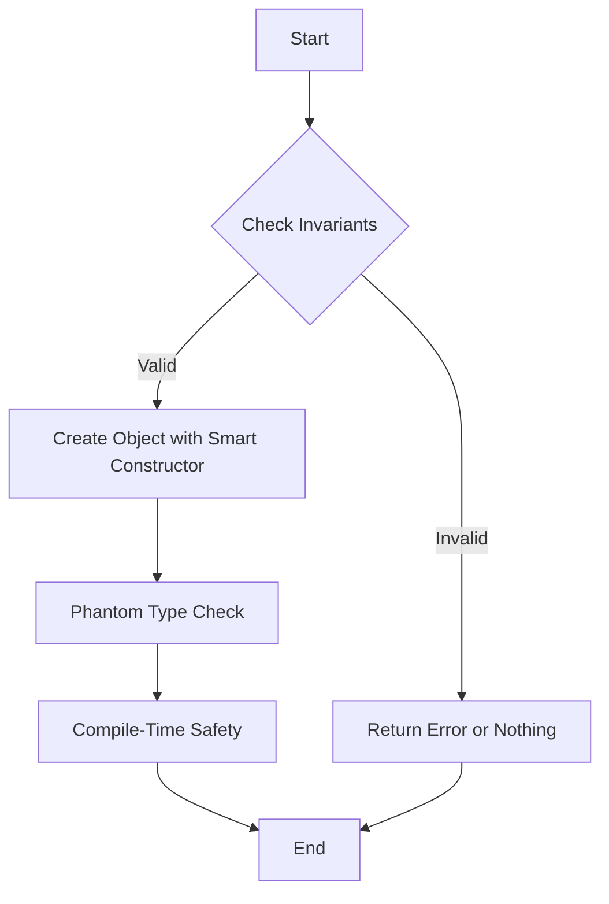

## 4.3 Factory Patterns with Smart Constructors and Phantom Types

In the realm of Haskell, the Factory Pattern takes on a unique form, leveraging the language's powerful type system to ensure safety and correctness. This section delves into the use of Smart Constructors and Phantom Types to create robust and secure data structures. Let's explore how these concepts can be applied effectively in Haskell.

### Factory Concept: Encapsulating Object Creation

The Factory Pattern is a creational design pattern that provides an interface for creating objects in a superclass but allows subclasses to alter the type of objects that will be created. In Haskell, this pattern is adapted to functional programming paradigms, focusing on type safety and immutability.

#### Smart Constructors

Smart Constructors are functions that enforce invariants during the creation of data types. Unlike regular constructors, Smart Constructors can perform checks and transformations to ensure that only valid data is constructed. This approach is particularly useful in Haskell, where data integrity is paramount.

**Example of a Smart Constructor:**

```haskell
-- Define a data type for a non-empty list
data NonEmptyList a = NonEmptyList a [a]

-- Smart constructor for NonEmptyList
nonEmptyList :: a -> [a] -> Maybe (NonEmptyList a)
nonEmptyList x xs = if null xs then Nothing else Just (NonEmptyList x xs)

-- Usage
main :: IO ()
main = do
    let validList = nonEmptyList 1 [2, 3, 4]
    let invalidList = nonEmptyList 1 []
    print validList    -- Just (NonEmptyList 1 [2,3,4])
    print invalidList  -- Nothing
```

In this example, the `nonEmptyList` function ensures that a `NonEmptyList` is only created if the list is not empty, thus enforcing the invariant at the point of construction.

#### Phantom Types

Phantom Types are types that are used at compile-time to enforce additional constraints without affecting runtime behavior. They are called "phantom" because they do not correspond to actual data stored in the type.

**Example of Phantom Types:**

```haskell
{-# LANGUAGE GADTs #-}

-- Define a phantom type for units of measurement
data Meter
data Kilometer

-- Define a data type with a phantom type parameter
data Distance a where
    Distance :: Double -> Distance a

-- Conversion functions
toKilometers :: Distance Meter -> Distance Kilometer
toKilometers (Distance m) = Distance (m / 1000)

toMeters :: Distance Kilometer -> Distance Meter
toMeters (Distance km) = Distance (km * 1000)

-- Usage
main :: IO ()
main = do
    let distInMeters = Distance 1500 :: Distance Meter
    let distInKilometers = toKilometers distInMeters
    print distInKilometers  -- Distance 1.5
```

In this example, Phantom Types are used to distinguish between different units of measurement, preventing incorrect conversions at compile-time.

### Key Participants

- **Smart Constructors**: Functions that validate and construct data types, ensuring invariants are maintained.
- **Phantom Types**: Type parameters that provide compile-time checks without affecting runtime data.

### Applicability

- **Data Integrity**: Use Smart Constructors to enforce data invariants and prevent invalid states.
- **Type Safety**: Employ Phantom Types to add compile-time checks and prevent misuse of data types.
- **Complex Data Structures**: Apply these patterns when constructing complex data structures that require validation and safety guarantees.

### Sample Code Snippet

Let's combine Smart Constructors and Phantom Types in a practical example:

```haskell
{-# LANGUAGE GADTs #-}

-- Define a phantom type for account states
data Active
data Inactive

-- Define a data type for bank accounts with a phantom type parameter
data BankAccount a where
    BankAccount :: String -> Double -> BankAccount Active
    InactiveAccount :: String -> BankAccount Inactive

-- Smart constructor for creating an active bank account
createActiveAccount :: String -> Double -> Maybe (BankAccount Active)
createActiveAccount name balance
    | balance >= 0 = Just (BankAccount name balance)
    | otherwise = Nothing

-- Function to deactivate an account
deactivateAccount :: BankAccount Active -> BankAccount Inactive
deactivateAccount (BankAccount name _) = InactiveAccount name

-- Usage
main :: IO ()
main = do
    let activeAccount = createActiveAccount "Alice" 1000
    case activeAccount of
        Just acc -> print "Account created successfully"
        Nothing -> print "Failed to create account"
```

In this example, we define a `BankAccount` type with a phantom type parameter to distinguish between active and inactive accounts. The `createActiveAccount` function acts as a Smart Constructor, ensuring that only accounts with a non-negative balance are created.

### Design Considerations

- **When to Use**: Use Smart Constructors and Phantom Types when you need to enforce invariants and add compile-time checks without runtime overhead.
- **Pitfalls**: Be cautious of overusing Phantom Types, as they can complicate type signatures and make code harder to understand.
- **Performance**: Smart Constructors may introduce additional checks, but they ensure data integrity, which can prevent costly errors.

### Haskell Unique Features

Haskell's strong static type system and support for advanced type features like Generalized Algebraic Data Types (GADTs) make it an ideal language for implementing Smart Constructors and Phantom Types. These features allow developers to leverage the type system to catch errors at compile-time, reducing runtime failures.

### Differences and Similarities

- **Smart Constructors vs. Regular Constructors**: Smart Constructors provide additional validation, whereas regular constructors do not.
- **Phantom Types vs. Regular Types**: Phantom Types exist only at compile-time, providing additional type safety without affecting runtime data.

### Visualizing Factory Patterns with Smart Constructors and Phantom Types

To better understand the interaction between Smart Constructors and Phantom Types, let's visualize the process using a diagram.



**Diagram Description**: This flowchart illustrates the process of using Smart Constructors and Phantom Types. It begins with checking invariants, creating the object if valid, and applying phantom type checks for compile-time safety.

### Try It Yourself

Experiment with the provided code examples by modifying the invariants or adding new phantom types. For instance, try creating a `BankAccount` with a negative balance and observe how the Smart Constructor prevents its creation. Additionally, explore adding more phantom types to represent different account states or currencies.

### Knowledge Check

- **Question**: What is the primary purpose of a Smart Constructor in Haskell?
- **Challenge**: Modify the `Distance` example to include a new phantom type for miles and implement conversion functions.

### Embrace the Journey

Remember, mastering these patterns is a journey. As you continue to explore Haskell's powerful type system, you'll discover new ways to leverage Smart Constructors and Phantom Types to build robust and secure applications. Keep experimenting, stay curious, and enjoy the process!

## Quiz: Factory Patterns with Smart Constructors and Phantom Types



### What is a Smart Constructor in Haskell?

- [x] A function that enforces invariants during data creation
- [ ] A type that exists only at compile-time
- [ ] A regular constructor with no additional checks
- [ ] A function that performs side effects

> **Explanation:** A Smart Constructor is a function that enforces invariants during the creation of data types, ensuring only valid data is constructed.

### What is the role of Phantom Types in Haskell?

- [x] To provide compile-time checks without affecting runtime data
- [ ] To store additional data at runtime
- [ ] To perform side effects
- [ ] To replace regular constructors

> **Explanation:** Phantom Types are used to enforce additional constraints at compile-time without affecting the runtime representation of data.

### How do Smart Constructors enhance data integrity?

- [x] By validating data before construction
- [ ] By storing data in a different format
- [ ] By performing side effects
- [ ] By ignoring invalid data

> **Explanation:** Smart Constructors validate data before constructing it, ensuring that only valid data is created, thus enhancing data integrity.

### What is a potential pitfall of using Phantom Types?

- [x] They can complicate type signatures
- [ ] They affect runtime performance
- [ ] They perform side effects
- [ ] They replace regular constructors

> **Explanation:** Phantom Types can complicate type signatures, making the code harder to understand if overused.

### How can you prevent creating an invalid `NonEmptyList`?

- [x] Use a Smart Constructor to check if the list is empty
- [ ] Use a regular constructor
- [ ] Use a Phantom Type
- [ ] Perform side effects

> **Explanation:** A Smart Constructor can check if the list is empty and prevent the creation of an invalid `NonEmptyList`.

### What is the benefit of using Phantom Types for units of measurement?

- [x] They prevent incorrect conversions at compile-time
- [ ] They store additional data at runtime
- [ ] They perform side effects
- [ ] They replace regular constructors

> **Explanation:** Phantom Types can distinguish between different units of measurement, preventing incorrect conversions at compile-time.

### What does the `nonEmptyList` function return if the list is empty?

- [x] Nothing
- [ ] Just (NonEmptyList a)
- [ ] An error
- [ ] A side effect

> **Explanation:** The `nonEmptyList` function returns `Nothing` if the list is empty, indicating that the invariant is not satisfied.

### What is the purpose of the `createActiveAccount` function?

- [x] To ensure only accounts with a non-negative balance are created
- [ ] To perform side effects
- [ ] To replace regular constructors
- [ ] To store additional data at runtime

> **Explanation:** The `createActiveAccount` function ensures that only accounts with a non-negative balance are created, enforcing the invariant.

### Can Phantom Types affect runtime data?

- [x] False
- [ ] True

> **Explanation:** Phantom Types do not affect runtime data; they exist only at compile-time to provide additional type safety.

### What is a key advantage of using Smart Constructors and Phantom Types together?

- [x] They provide both runtime and compile-time safety
- [ ] They perform side effects
- [ ] They replace regular constructors
- [ ] They store additional data at runtime

> **Explanation:** Using Smart Constructors and Phantom Types together provides both runtime and compile-time safety, ensuring data integrity and type correctness.


