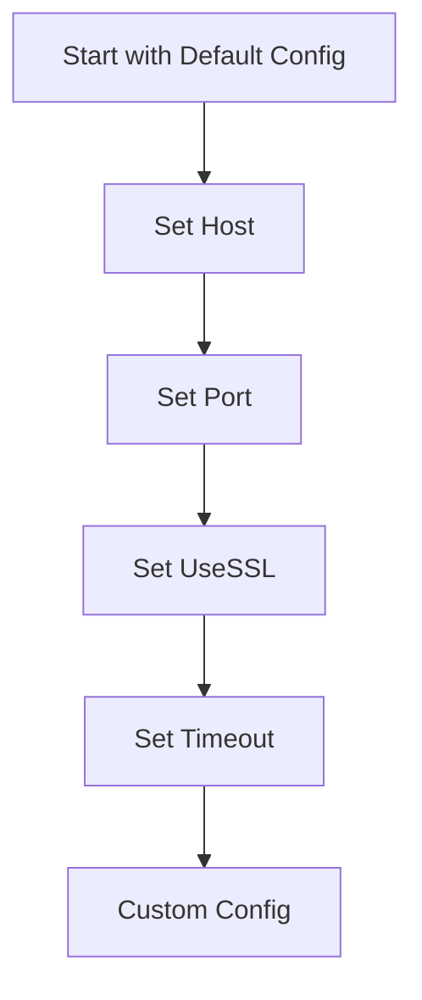

## 4.4 Builder Pattern with Function Chaining and Record Syntax

In the world of software design patterns, the Builder Pattern stands out as a powerful tool for constructing complex objects step by step. This pattern is particularly useful when an object requires numerous optional parameters or when the construction process involves multiple steps. In Haskell, a functional programming language known for its strong type system and immutability, the Builder Pattern can be elegantly implemented using function chaining and record syntax. This approach not only leverages Haskell's strengths but also ensures immutability and thread safety, making it an ideal choice for concurrent and parallel programming.

### Understanding the Builder Pattern

**Builder Concept**: The Builder Pattern is a creational design pattern that allows for the step-by-step construction of complex objects. Unlike other creational patterns, the Builder Pattern does not require that products have a common interface. Instead, it focuses on the construction process, allowing for different representations of the object being built.

**Key Participants**:
- **Builder**: Defines the interface for creating parts of the product.
- **Concrete Builder**: Implements the Builder interface and constructs and assembles parts of the product.
- **Director**: Constructs an object using the Builder interface.
- **Product**: Represents the complex object under construction.

**Applicability**: Use the Builder Pattern when:
- The construction process must allow different representations for the object that is constructed.
- The algorithm for creating a complex object should be independent of the parts that make up the object and how they are assembled.
- The construction process must be able to construct objects in a step-by-step manner.

### Implementing the Builder Pattern in Haskell

In Haskell, we can implement the Builder Pattern using records with default values and function chaining to set fields. This approach is both idiomatic and efficient, taking advantage of Haskell's functional nature and strong type system.

#### Using Records with Default Values

Haskell's record syntax provides a convenient way to define data structures with named fields. By defining default values for these fields, we can create a flexible and extensible builder.

```haskell
-- Define a data type for a network configuration
data NetworkConfig = NetworkConfig
  { host :: String
  , port :: Int
  , useSSL :: Bool
  , timeout :: Int
  } deriving (Show)

-- Define a default configuration
defaultConfig :: NetworkConfig
defaultConfig = NetworkConfig
  { host = "localhost"
  , port = 80
  , useSSL = False
  , timeout = 30
  }
```

In this example, `NetworkConfig` is a record with fields for `host`, `port`, `useSSL`, and `timeout`. The `defaultConfig` provides default values for these fields, which can be overridden using function chaining.

#### Function Chaining to Set Fields

Function chaining allows us to modify specific fields of a record while preserving immutability. By defining a series of functions that update individual fields, we can construct a customized configuration.

```haskell
-- Define functions to update fields
setHost :: String -> NetworkConfig -> NetworkConfig
setHost h config = config { host = h }

setPort :: Int -> NetworkConfig -> NetworkConfig
setPort p config = config { port = p }

setUseSSL :: Bool -> NetworkConfig -> NetworkConfig
setUseSSL ssl config = config { useSSL = ssl }

setTimeout :: Int -> NetworkConfig -> NetworkConfig
setTimeout t config = config { timeout = t }

-- Construct a custom configuration using function chaining
customConfig :: NetworkConfig
customConfig = setHost "example.com"
             . setPort 443
             . setUseSSL True
             . setTimeout 60
             $ defaultConfig
```

In this example, we define functions `setHost`, `setPort`, `setUseSSL`, and `setTimeout` to update individual fields of the `NetworkConfig` record. The `customConfig` is constructed by chaining these functions together, starting with the `defaultConfig`.

### Advantages of the Builder Pattern in Haskell

The Builder Pattern in Haskell offers several advantages, particularly in terms of immutability and thread safety:

- **Immutability**: By using records with default values and function chaining, we ensure that the original configuration remains unchanged. This immutability is a cornerstone of functional programming and provides numerous benefits, including easier reasoning about code and reduced risk of bugs.

- **Thread Safety**: Immutability inherently provides thread safety, as there are no mutable shared states that can lead to race conditions. This makes the Builder Pattern an excellent choice for concurrent and parallel programming in Haskell.

- **Flexibility and Extensibility**: The use of records with default values allows for easy extension of the configuration. New fields can be added to the record without affecting existing code, and default values ensure backward compatibility.

- **Readability and Maintainability**: Function chaining provides a clear and concise way to construct complex objects. Each function call represents a single step in the construction process, making the code easy to read and maintain.

### Example: Configuring a Network Connection with Optional Settings

Let's consider a practical example of configuring a network connection with optional settings. We'll use the Builder Pattern to construct a `NetworkConfig` object with various optional parameters.

```haskell
-- Define a data type for a network configuration
data NetworkConfig = NetworkConfig
  { host :: String
  , port :: Int
  , useSSL :: Bool
  , timeout :: Int
  } deriving (Show)

-- Define a default configuration
defaultConfig :: NetworkConfig
defaultConfig = NetworkConfig
  { host = "localhost"
  , port = 80
  , useSSL = False
  , timeout = 30
  }

-- Define functions to update fields
setHost :: String -> NetworkConfig -> NetworkConfig
setHost h config = config { host = h }

setPort :: Int -> NetworkConfig -> NetworkConfig
setPort p config = config { port = p }

setUseSSL :: Bool -> NetworkConfig -> NetworkConfig
setUseSSL ssl config = config { useSSL = ssl }

setTimeout :: Int -> NetworkConfig -> NetworkConfig
setTimeout t config = config { timeout = t }

-- Construct a custom configuration using function chaining
customConfig :: NetworkConfig
customConfig = setHost "example.com"
             . setPort 443
             . setUseSSL True
             . setTimeout 60
             $ defaultConfig

-- Print the custom configuration
main :: IO ()
main = print customConfig
```

In this example, we define a `NetworkConfig` data type with fields for `host`, `port`, `useSSL`, and `timeout`. We provide a `defaultConfig` with default values and define functions to update each field. The `customConfig` is constructed by chaining these functions together, starting with the `defaultConfig`. Finally, we print the `customConfig` to verify the result.

### Visualizing the Builder Pattern in Haskell

To better understand the flow of the Builder Pattern in Haskell, let's visualize the process using a Mermaid.js diagram.



**Diagram Description**: This flowchart illustrates the process of constructing a custom configuration using the Builder Pattern in Haskell. We start with a default configuration and apply a series of transformations (set host, set port, set useSSL, set timeout) to produce the final custom configuration.

### Design Considerations

When implementing the Builder Pattern in Haskell, consider the following:

- **When to Use**: The Builder Pattern is ideal for constructing complex objects with numerous optional parameters. It is particularly useful when the construction process involves multiple steps or when different representations of the object are required.

- **Performance**: While the Builder Pattern provides flexibility and immutability, it may introduce overhead due to the creation of intermediate objects. Consider the performance implications in performance-critical applications.

- **Error Handling**: Ensure that the builder functions handle invalid input gracefully. Consider using Haskell's type system to enforce constraints and prevent invalid configurations.

### Haskell Unique Features

Haskell's unique features, such as strong static typing, immutability, and higher-order functions, make it an excellent choice for implementing the Builder Pattern. The use of records with default values and function chaining leverages these features to create a flexible and robust solution.

### Differences and Similarities

The Builder Pattern in Haskell shares similarities with its implementation in other languages, such as Java or C++. However, Haskell's functional nature and emphasis on immutability provide a distinct approach. Unlike object-oriented languages, Haskell does not require a separate builder class. Instead, it uses records and functions to achieve the same result.

### Try It Yourself

Now that we've explored the Builder Pattern in Haskell, try modifying the code examples to experiment with different configurations. For instance, add a new field to the `NetworkConfig` record and update the builder functions accordingly. Observe how the flexibility of the Builder Pattern allows for easy extension and customization.

### Knowledge Check

- What are the key participants in the Builder Pattern?
- How does Haskell's immutability benefit the Builder Pattern?
- What are the advantages of using function chaining in Haskell?
- How can you extend the `NetworkConfig` record to include additional fields?

### Embrace the Journey

Remember, this is just the beginning. As you progress, you'll discover more advanced design patterns and techniques in Haskell. Keep experimenting, stay curious, and enjoy the journey!

## Quiz: Builder Pattern with Function Chaining and Record Syntax



### What is the primary purpose of the Builder Pattern?

- [x] To construct complex objects step by step
- [ ] To enforce a single instance of a class
- [ ] To provide a simplified interface to a complex system
- [ ] To define a family of algorithms

> **Explanation:** The Builder Pattern is used to construct complex objects step by step, allowing for different representations of the object being built.

### How does Haskell's immutability benefit the Builder Pattern?

- [x] It ensures thread safety by preventing shared mutable state
- [ ] It allows for dynamic typing
- [ ] It simplifies error handling
- [ ] It enables polymorphism

> **Explanation:** Haskell's immutability ensures thread safety by preventing shared mutable state, which is a common source of bugs in concurrent programming.

### What is the role of function chaining in the Builder Pattern?

- [x] To modify specific fields of a record while preserving immutability
- [ ] To enforce type safety
- [ ] To provide a default implementation for methods
- [ ] To create a single instance of a class

> **Explanation:** Function chaining allows for the modification of specific fields of a record while preserving immutability, which is a key aspect of the Builder Pattern in Haskell.

### Which of the following is a key advantage of using records with default values in Haskell?

- [x] Flexibility and extensibility
- [ ] Dynamic typing
- [ ] Automatic memory management
- [ ] Inheritance

> **Explanation:** Using records with default values provides flexibility and extensibility, allowing for easy extension of the configuration without affecting existing code.

### How can you extend the `NetworkConfig` record to include additional fields?

- [x] Add new fields to the record and update the builder functions
- [ ] Use inheritance to create a subclass
- [ ] Override the existing fields
- [ ] Use dynamic typing to add fields at runtime

> **Explanation:** To extend the `NetworkConfig` record, add new fields to the record and update the builder functions accordingly.

### What is a potential drawback of the Builder Pattern in Haskell?

- [x] It may introduce overhead due to the creation of intermediate objects
- [ ] It enforces dynamic typing
- [ ] It requires a separate builder class
- [ ] It does not support immutability

> **Explanation:** The Builder Pattern may introduce overhead due to the creation of intermediate objects, which can impact performance in performance-critical applications.

### What is a unique feature of Haskell that enhances the Builder Pattern?

- [x] Strong static typing
- [ ] Dynamic typing
- [ ] Inheritance
- [ ] Reflection

> **Explanation:** Haskell's strong static typing enhances the Builder Pattern by providing compile-time guarantees and preventing invalid configurations.

### How does the Builder Pattern in Haskell differ from its implementation in object-oriented languages?

- [x] It uses records and functions instead of a separate builder class
- [ ] It requires inheritance
- [ ] It enforces dynamic typing
- [ ] It does not support polymorphism

> **Explanation:** In Haskell, the Builder Pattern uses records and functions instead of a separate builder class, leveraging Haskell's functional nature and immutability.

### What is the purpose of the `defaultConfig` in the Builder Pattern?

- [x] To provide default values for fields that can be overridden
- [ ] To enforce a single instance of a class
- [ ] To define a family of algorithms
- [ ] To provide a simplified interface to a complex system

> **Explanation:** The `defaultConfig` provides default values for fields that can be overridden using function chaining, allowing for flexible and customizable configurations.

### True or False: The Builder Pattern in Haskell inherently provides thread safety.

- [x] True
- [ ] False

> **Explanation:** True. The Builder Pattern in Haskell inherently provides thread safety due to its reliance on immutability, which prevents shared mutable state.


