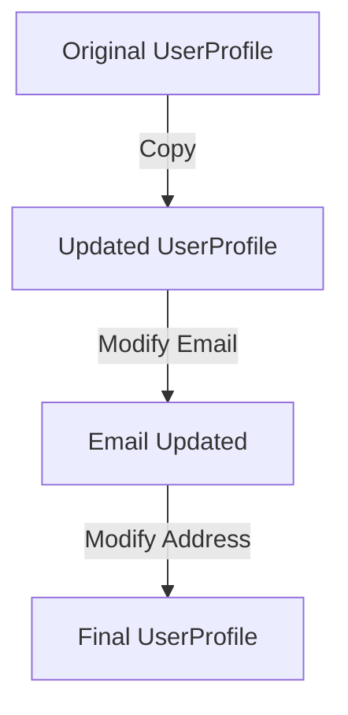

## 4.5 Prototype Pattern Using Record Updates

### Introduction to the Prototype Pattern

The Prototype Pattern is a creational design pattern that allows for the creation of new objects by copying existing ones, known as prototypes. This pattern is particularly useful when the cost of creating a new instance of an object is more expensive than copying an existing one. In Haskell, we can leverage the power of record updates to implement this pattern efficiently.

### Understanding Record Updates in Haskell

Haskell's record syntax provides a convenient way to create and manipulate data structures. Record updates allow us to create a new record by copying an existing one and modifying some of its fields. This feature aligns perfectly with the Prototype Pattern, enabling us to reuse and extend data structures without altering the original.

#### Key Benefits of Using Record Updates

- **Immutability**: Haskell's immutable data structures ensure that the original object remains unchanged, providing safety and predictability.
- **Efficiency**: Copying and modifying records is computationally efficient, especially when dealing with large data structures.
- **Simplicity**: Record updates offer a straightforward syntax for modifying data structures, making the code easy to read and maintain.

### Implementing the Prototype Pattern with Record Updates

Let's explore how to implement the Prototype Pattern in Haskell using record updates. We'll use a practical example of modifying user profiles to illustrate the concept.

#### Example: User Profile Management

Consider a scenario where we have a user profile represented as a Haskell record. We want to create a new profile by copying an existing one and updating specific fields, such as the user's email or address.

```haskell
-- Define a UserProfile data type with record syntax
data UserProfile = UserProfile
  { userId :: Int
  , userName :: String
  , userEmail :: String
  , userAddress :: String
  } deriving (Show)

-- Function to update the email of a user profile
updateEmail :: UserProfile -> String -> UserProfile
updateEmail profile newEmail = profile { userEmail = newEmail }

-- Function to update the address of a user profile
updateAddress :: UserProfile -> String -> UserProfile
updateAddress profile newAddress = profile { userAddress = newAddress }

-- Example usage
main :: IO ()
main = do
  let originalProfile = UserProfile 1 "Alice" "alice@example.com" "123 Main St"
  let updatedProfile = updateEmail originalProfile "alice.new@example.com"
  let finalProfile = updateAddress updatedProfile "456 Elm St"
  print originalProfile
  print finalProfile
```

In this example, we define a `UserProfile` data type with fields for user ID, name, email, and address. We then create functions `updateEmail` and `updateAddress` to modify these fields using record updates. The `main` function demonstrates how to use these functions to create a new profile based on an existing one.

### Visualizing Record Updates

To better understand how record updates work in Haskell, let's visualize the process using a diagram.



This diagram illustrates the flow of creating a new user profile by copying the original, updating the email, and then updating the address.

### Design Considerations

When using the Prototype Pattern with record updates in Haskell, consider the following:

- **Field Selection**: Carefully choose which fields to update to avoid unintended modifications.
- **Data Integrity**: Ensure that the copied object maintains data integrity, especially when dealing with complex data structures.
- **Performance**: While record updates are efficient, be mindful of performance implications when working with very large data structures.

### Haskell's Unique Features

Haskell's strong static typing and type inference play a crucial role in implementing the Prototype Pattern. The type system ensures that only valid updates are performed, reducing the risk of runtime errors. Additionally, Haskell's lazy evaluation can optimize performance by deferring computations until necessary.

### Differences and Similarities with Other Patterns

The Prototype Pattern is often compared to the Factory Pattern. While both patterns deal with object creation, the Prototype Pattern focuses on cloning existing objects, whereas the Factory Pattern involves creating new instances from scratch. In Haskell, the Prototype Pattern is particularly advantageous due to the language's emphasis on immutability and efficient data manipulation.

### Try It Yourself

To deepen your understanding of the Prototype Pattern using record updates, try modifying the example code:

- Add a new field to the `UserProfile` data type, such as `userPhone`.
- Implement a function to update the new field.
- Experiment with creating multiple copies of a user profile with different combinations of updated fields.

### Knowledge Check

- What are the key benefits of using record updates in Haskell?
- How does Haskell's type system enhance the implementation of the Prototype Pattern?
- Compare and contrast the Prototype Pattern with the Factory Pattern.

### Conclusion

The Prototype Pattern using record updates in Haskell provides a powerful mechanism for creating new objects by copying existing ones. By leveraging Haskell's unique features, such as immutability and strong typing, developers can efficiently manage data structures and ensure data integrity. As you continue to explore Haskell's design patterns, remember to experiment and apply these concepts to real-world scenarios.

## Quiz: Prototype Pattern Using Record Updates



### What is the primary purpose of the Prototype Pattern?

- [x] To create new objects by copying existing ones
- [ ] To create new objects from scratch
- [ ] To manage object dependencies
- [ ] To encapsulate object creation logic

> **Explanation:** The Prototype Pattern focuses on creating new objects by copying existing ones, which is particularly useful when object creation is expensive.

### How do record updates in Haskell support the Prototype Pattern?

- [x] By allowing modifications to copies of existing records
- [ ] By creating new records from scratch
- [ ] By managing dependencies between records
- [ ] By providing a factory method for record creation

> **Explanation:** Record updates in Haskell enable modifications to copies of existing records, aligning with the Prototype Pattern's goal of object cloning.

### What is a key benefit of using record updates in Haskell?

- [x] Immutability ensures original objects remain unchanged
- [ ] It allows for dynamic typing
- [ ] It simplifies garbage collection
- [ ] It enhances runtime performance

> **Explanation:** Immutability in Haskell ensures that original objects remain unchanged, providing safety and predictability when using record updates.

### Which Haskell feature enhances the implementation of the Prototype Pattern?

- [x] Strong static typing
- [ ] Dynamic typing
- [ ] Weak typing
- [ ] No typing

> **Explanation:** Haskell's strong static typing ensures that only valid updates are performed, reducing the risk of runtime errors.

### How does the Prototype Pattern differ from the Factory Pattern?

- [x] Prototype clones existing objects, Factory creates new instances
- [ ] Prototype creates new instances, Factory clones existing objects
- [ ] Both patterns create new instances from scratch
- [ ] Both patterns clone existing objects

> **Explanation:** The Prototype Pattern focuses on cloning existing objects, while the Factory Pattern involves creating new instances from scratch.

### What is a potential pitfall when using record updates?

- [x] Unintended modifications to fields
- [ ] Increased memory usage
- [ ] Decreased performance
- [ ] Complex syntax

> **Explanation:** Careful selection of fields to update is necessary to avoid unintended modifications when using record updates.

### How can you visualize the process of record updates?

- [x] Using a flowchart to show the sequence of updates
- [ ] Using a pie chart to represent data distribution
- [ ] Using a bar graph to compare performance
- [ ] Using a scatter plot to show relationships

> **Explanation:** A flowchart can effectively illustrate the sequence of updates in the record update process.

### What should you consider when updating large data structures?

- [x] Performance implications
- [ ] Syntax complexity
- [ ] Type system limitations
- [ ] Lack of immutability

> **Explanation:** When working with large data structures, it's important to consider performance implications of record updates.

### What is an advantage of Haskell's lazy evaluation in the Prototype Pattern?

- [x] It defers computations until necessary
- [ ] It increases memory usage
- [ ] It simplifies syntax
- [ ] It enhances dynamic typing

> **Explanation:** Haskell's lazy evaluation can optimize performance by deferring computations until they are necessary.

### True or False: The Prototype Pattern is only useful in object-oriented programming.

- [ ] True
- [x] False

> **Explanation:** The Prototype Pattern is applicable in functional programming, such as Haskell, where it can be implemented using record updates.



Remember, this is just the beginning. As you progress, you'll build more complex and interactive systems using Haskell's design patterns. Keep experimenting, stay curious, and enjoy the journey!
