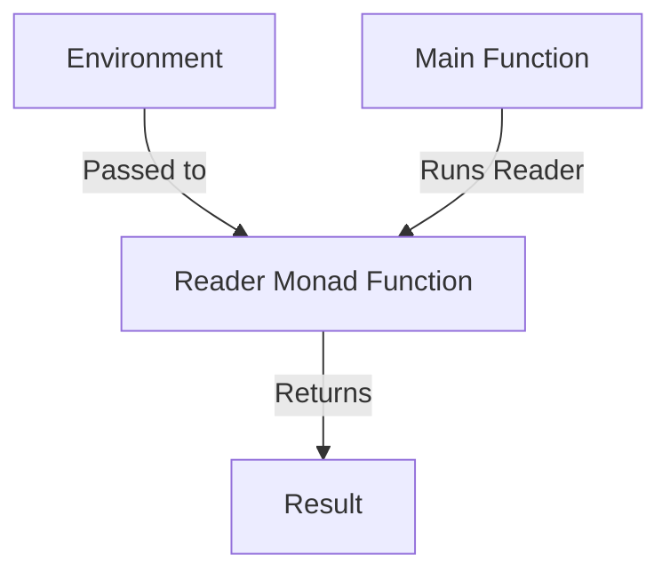

## 4.6 Dependency Injection Using the Reader Monad

In the world of software engineering, **Dependency Injection (DI)** is a design pattern that allows for the decoupling of components by injecting dependencies rather than hard-coding them. This pattern is particularly useful for creating flexible and testable applications. In Haskell, the **Reader Monad** provides an elegant way to implement dependency injection, allowing us to pass a shared environment implicitly throughout our application.

### Understanding Dependency Injection

**Dependency Injection** is a technique where an object receives its dependencies from an external source rather than creating them itself. This approach promotes loose coupling and enhances testability, as dependencies can be easily swapped out or mocked during testing.

#### Key Benefits of Dependency Injection

- **Decoupling**: Separates the creation of dependencies from their usage, leading to more modular code.
- **Testability**: Facilitates unit testing by allowing dependencies to be replaced with mocks or stubs.
- **Flexibility**: Enables easy configuration changes without modifying the core logic.

### The Reader Monad: A Functional Approach

The **Reader Monad** in Haskell is a powerful abstraction that allows functions to access shared read-only state. It encapsulates the pattern of passing a shared environment implicitly, making it an ideal tool for implementing dependency injection in a functional programming context.

#### Key Characteristics of the Reader Monad

- **Environment Passing**: Automatically passes a shared environment to functions without explicit parameter passing.
- **Immutability**: Ensures that the environment remains unchanged, promoting referential transparency.
- **Composability**: Allows for the composition of functions that depend on a shared environment.

### Implementing Dependency Injection with the Reader Monad

To implement dependency injection using the Reader Monad, we structure our code to depend on an environment, which can be a configuration, database connection, or any other shared resource. This environment is then passed implicitly using the Reader Monad.

#### Step-by-Step Implementation

1. **Define the Environment**: Create a data structure representing the shared environment.

2. **Create Reader Monad Functions**: Define functions that operate within the Reader Monad, accessing the environment as needed.

3. **Run the Reader Monad**: Execute the Reader Monad by providing the environment, allowing functions to access the shared state.

#### Example: Accessing Configuration

Let's walk through an example where we use the Reader Monad to access configuration settings in a Haskell application.

```haskell
{-# LANGUAGE OverloadedStrings #-}

import Control.Monad.Reader

-- Define the environment
data Config = Config
  { configHost :: String
  , configPort :: Int
  }

-- Define a Reader Monad function
getHost :: Reader Config String
getHost = do
  config <- ask
  return (configHost config)

getPort :: Reader Config Int
getPort = do
  config <- ask
  return (configPort config)

-- Run the Reader Monad
main :: IO ()
main = do
  let config = Config "localhost" 8080
  putStrLn $ "Host: " ++ runReader getHost config
  putStrLn $ "Port: " ++ show (runReader getPort config)
```

In this example, we define a `Config` data type representing our environment. We then create Reader Monad functions `getHost` and `getPort` to access the host and port from the configuration. Finally, we run these functions by providing the `Config` environment.

### Visualizing the Reader Monad

To better understand how the Reader Monad works, let's visualize the flow of data using a diagram.



**Diagram Explanation**: The environment is passed to the Reader Monad function, which accesses it and returns a result. The main function runs the Reader Monad by providing the environment.

### Key Participants in Dependency Injection with Reader Monad

- **Environment**: The shared state or configuration that functions depend on.
- **Reader Monad Functions**: Functions that operate within the Reader Monad, accessing the environment.
- **Main Function**: The entry point of the application, responsible for providing the environment and running the Reader Monad.

### Applicability of the Reader Monad

The Reader Monad is particularly useful in scenarios where:

- **Shared Configuration**: Multiple functions need access to a common configuration or state.
- **Read-Only State**: The environment is immutable and does not change during execution.
- **Testability**: Dependencies need to be easily swapped out for testing purposes.

### Design Considerations

When using the Reader Monad for dependency injection, consider the following:

- **Complexity**: While the Reader Monad simplifies dependency management, it can introduce complexity if overused.
- **Performance**: Ensure that the environment is efficiently passed and accessed, especially in performance-critical applications.
- **Scalability**: Design the environment to be easily extendable as the application grows.

### Haskell Unique Features

Haskell's strong static typing and immutability make it an ideal language for implementing dependency injection with the Reader Monad. The language's emphasis on pure functions and referential transparency aligns well with the principles of dependency injection.

### Differences and Similarities with Other Patterns

The Reader Monad shares similarities with other dependency injection patterns, such as:

- **Service Locator**: Both patterns provide a way to access dependencies, but the Reader Monad does so in a more functional and type-safe manner.
- **Constructor Injection**: While constructor injection involves passing dependencies explicitly, the Reader Monad passes them implicitly.

### Try It Yourself

To deepen your understanding, try modifying the example code to include additional configuration settings, such as a database connection string. Experiment with creating new Reader Monad functions to access these settings.

### Knowledge Check

- **Question**: What are the benefits of using the Reader Monad for dependency injection?
- **Exercise**: Implement a Reader Monad function that accesses a database connection from the environment.

### Embrace the Journey

Remember, mastering dependency injection using the Reader Monad is just the beginning. As you progress, you'll build more complex and flexible applications. Keep experimenting, stay curious, and enjoy the journey!

## Quiz: Dependency Injection Using the Reader Monad



### What is the primary purpose of the Reader Monad in Haskell?

- [x] To pass a shared environment implicitly to functions
- [ ] To manage mutable state
- [ ] To handle asynchronous computations
- [ ] To perform input/output operations

> **Explanation:** The Reader Monad is used to pass a shared environment implicitly to functions, allowing them to access this environment without explicit parameter passing.

### How does the Reader Monad enhance testability?

- [x] By allowing dependencies to be easily swapped out or mocked
- [ ] By providing built-in testing functions
- [ ] By enforcing strict type checking
- [ ] By simplifying error handling

> **Explanation:** The Reader Monad enhances testability by allowing dependencies to be easily swapped out or mocked, facilitating unit testing.

### What is a key characteristic of the Reader Monad?

- [x] Immutability of the environment
- [ ] Ability to handle side effects
- [ ] Support for asynchronous operations
- [ ] Dynamic typing

> **Explanation:** The Reader Monad ensures that the environment remains immutable, promoting referential transparency and functional purity.

### Which of the following is NOT a benefit of dependency injection?

- [ ] Decoupling of components
- [ ] Enhanced testability
- [ ] Increased flexibility
- [x] Increased complexity

> **Explanation:** While dependency injection offers many benefits, it can sometimes increase complexity, especially if overused or improperly implemented.

### What is the role of the main function in the Reader Monad pattern?

- [x] To provide the environment and run the Reader Monad
- [ ] To define the environment structure
- [ ] To handle errors and exceptions
- [ ] To perform input/output operations

> **Explanation:** The main function is responsible for providing the environment and running the Reader Monad, allowing functions to access the shared state.

### How does the Reader Monad differ from constructor injection?

- [x] It passes dependencies implicitly rather than explicitly
- [ ] It requires mutable state
- [ ] It is only used for asynchronous operations
- [ ] It does not support type safety

> **Explanation:** The Reader Monad passes dependencies implicitly, whereas constructor injection involves passing them explicitly.

### What is a potential drawback of using the Reader Monad?

- [x] Increased complexity if overused
- [ ] Lack of type safety
- [ ] Difficulty in handling side effects
- [ ] Poor performance in all scenarios

> **Explanation:** While the Reader Monad simplifies dependency management, it can introduce complexity if overused or improperly structured.

### Which of the following is a key participant in the Reader Monad pattern?

- [x] Environment
- [ ] Mutable State
- [ ] Asynchronous Task
- [ ] Error Handler

> **Explanation:** The environment is a key participant in the Reader Monad pattern, representing the shared state or configuration that functions depend on.

### True or False: The Reader Monad can be used to manage mutable state.

- [ ] True
- [x] False

> **Explanation:** False. The Reader Monad is used for passing a shared, immutable environment, not for managing mutable state.

### What should you consider when designing the environment for the Reader Monad?

- [x] Scalability and extendability
- [ ] Support for mutable state
- [ ] Dynamic typing
- [ ] Built-in error handling

> **Explanation:** When designing the environment for the Reader Monad, consider scalability and extendability to accommodate future growth and changes.


