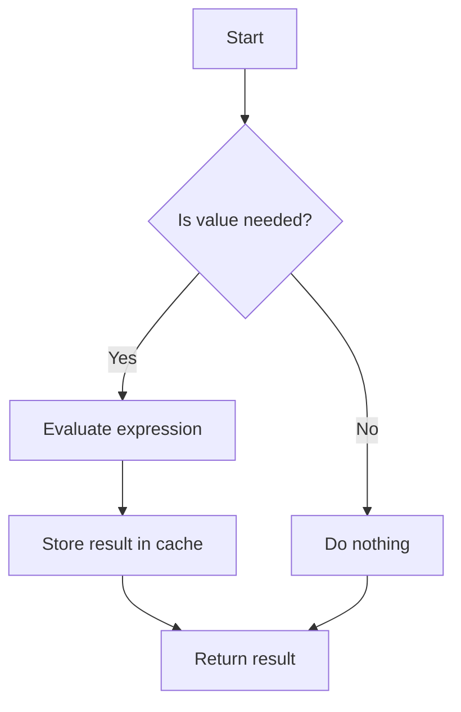

## 4.7 Lazy Initialization and Memoization

In the realm of functional programming, Haskell stands out with its unique approach to computation through lazy evaluation. This section delves into the concepts of lazy initialization and memoization, two powerful techniques that can significantly enhance the efficiency and performance of Haskell programs. We will explore how these concepts are implemented in Haskell, provide practical examples, and discuss best practices for their use.

### Lazy Evaluation: Deferring Computation Until Needed

Lazy evaluation is a core feature of Haskell that allows expressions to be evaluated only when their values are needed. This can lead to significant performance improvements, especially when dealing with large data structures or complex computations.

#### Key Concepts of Lazy Evaluation

- **Non-strict Semantics**: Haskell's evaluation strategy is non-strict, meaning that function arguments are not evaluated unless explicitly required.
- **Thunks**: A deferred computation is represented as a "thunk," which is a placeholder for the value that will be computed when needed.
- **Infinite Data Structures**: Lazy evaluation enables the creation and manipulation of infinite data structures, such as streams, without causing infinite loops or memory overflow.

#### Example: Lazy Lists

Consider the following example of an infinite list of natural numbers:

```haskell
naturals :: [Integer]
naturals = [0..]
```

In Haskell, `naturals` is an infinite list, but due to lazy evaluation, elements are only computed as they are accessed. This allows us to work with potentially infinite sequences in a finite context.

### Memoization: Caching the Results of Expensive Operations

Memoization is a technique used to store the results of expensive function calls and reuse them when the same inputs occur again. This can drastically reduce computation time for functions that are called repeatedly with the same arguments.

#### Implementing Memoization in Haskell

Memoization can be implemented in Haskell using various techniques, including:

- **Pure Functions**: Leveraging Haskell's pure functions to ensure that memoized results are consistent and reliable.
- **Data Structures**: Using data structures like arrays or maps to store computed values.
- **Libraries**: Utilizing libraries such as `MemoTrie` for efficient and safe memoization.

#### Example: Fibonacci Sequence with Memoization

Let's implement a memoized version of the Fibonacci sequence:

```haskell
import Data.Map (Map)
import qualified Data.Map as Map

fibMemo :: Integer -> Integer
fibMemo = (map fib [0..] !!)
  where fib 0 = 0
        fib 1 = 1
        fib n = fibMemo (n - 1) + fibMemo (n - 2)
```

In this example, we use a list to cache the results of the Fibonacci function, allowing us to avoid redundant calculations.

### Implementation Techniques

#### Using `unsafePerformIO` for Global Memoization

While `unsafePerformIO` can be used for global memoization, it should be approached with caution due to potential side effects and impurity. It allows us to perform IO operations in a pure context, but misuse can lead to unpredictable behavior.

#### Employing Libraries like `MemoTrie`

The `MemoTrie` library provides a safe and efficient way to implement memoization in Haskell. It uses tries (prefix trees) to store computed values, offering fast lookup times.

```haskell
import Data.MemoTrie

fibMemoTrie :: Integer -> Integer
fibMemoTrie = memo fib
  where fib 0 = 0
        fib 1 = 1
        fib n = fibMemoTrie (n - 1) + fibMemoTrie (n - 2)
```

### Design Considerations

- **When to Use Lazy Initialization**: Use lazy initialization when dealing with potentially large or infinite data structures, or when computations can be deferred until absolutely necessary.
- **When to Use Memoization**: Memoization is beneficial when functions are computationally expensive and called repeatedly with the same arguments.
- **Performance Trade-offs**: While lazy evaluation and memoization can improve performance, they can also introduce overhead. It's important to profile and test your code to ensure that these techniques are providing the desired benefits.

### Haskell Unique Features

Haskell's lazy evaluation model is unique among programming languages, allowing for elegant solutions to problems that would be cumbersome in strict languages. Its strong type system and pure functional nature make it an ideal candidate for implementing memoization safely and effectively.

### Differences and Similarities

Lazy initialization and memoization are often confused, but they serve different purposes. Lazy initialization defers computation, while memoization caches results. Both can be used together to optimize performance, but they address different aspects of computation.

### Try It Yourself

Experiment with the provided code examples by modifying them to explore different scenarios. For instance, try implementing memoization for other recursive functions or explore the effects of lazy evaluation on different data structures.

### Visualizing Lazy Evaluation and Memoization

To better understand these concepts, let's visualize the process of lazy evaluation and memoization using a flowchart.



This diagram illustrates the decision-making process involved in lazy evaluation and memoization. The expression is only evaluated if the value is needed, and the result is stored in a cache for future use.

### References and Links

For further reading on lazy evaluation and memoization in Haskell, consider the following resources:

- [Haskell Wiki: Lazy Evaluation](https://wiki.haskell.org/Lazy_evaluation)
- [Haskell Wiki: Memoization](https://wiki.haskell.org/Memoization)
- [MemoTrie Library Documentation](https://hackage.haskell.org/package/MemoTrie)

### Knowledge Check

- What are the benefits of lazy evaluation in Haskell?
- How does memoization improve the performance of recursive functions?
- What are the potential pitfalls of using `unsafePerformIO` for memoization?

### Embrace the Journey

Remember, mastering lazy initialization and memoization is just one step in your journey to becoming a Haskell expert. Keep experimenting, stay curious, and enjoy the process of learning and applying these powerful techniques.

## Quiz: Lazy Initialization and Memoization



### What is lazy evaluation in Haskell?

- [x] Deferring computation until the result is needed
- [ ] Evaluating all expressions at the start of the program
- [ ] Caching results of computations
- [ ] Using strict evaluation for all functions

> **Explanation:** Lazy evaluation in Haskell means that expressions are not evaluated until their results are needed, allowing for efficient computation.

### What is memoization?

- [x] Caching the results of expensive operations
- [ ] Deferring computation until needed
- [ ] Using strict evaluation for all functions
- [ ] Evaluating all expressions at the start of the program

> **Explanation:** Memoization involves storing the results of expensive function calls and reusing them when the same inputs occur again.

### Which library can be used for safe memoization in Haskell?

- [x] MemoTrie
- [ ] Data.List
- [ ] Control.Monad
- [ ] System.IO

> **Explanation:** The `MemoTrie` library provides a safe and efficient way to implement memoization in Haskell.

### What is a thunk in Haskell?

- [x] A deferred computation
- [ ] A strict evaluation
- [ ] A type of data structure
- [ ] A function argument

> **Explanation:** A thunk is a placeholder for a deferred computation in Haskell's lazy evaluation model.

### How can memoization improve performance?

- [x] By caching results of expensive operations
- [x] By reducing redundant calculations
- [ ] By deferring computation until needed
- [ ] By using strict evaluation

> **Explanation:** Memoization improves performance by caching results and reducing redundant calculations, especially in recursive functions.

### What is the risk of using `unsafePerformIO` for memoization?

- [x] It can lead to unpredictable behavior
- [ ] It is always safe and recommended
- [ ] It makes the code faster
- [ ] It simplifies the code

> **Explanation:** `unsafePerformIO` can lead to unpredictable behavior due to side effects and impurity, so it should be used with caution.

### What is the main advantage of lazy evaluation?

- [x] Efficient computation of large or infinite data structures
- [x] Deferred computation until necessary
- [ ] Immediate evaluation of all expressions
- [ ] Strict evaluation of function arguments

> **Explanation:** Lazy evaluation allows for efficient computation by deferring evaluation until necessary, which is particularly useful for large or infinite data structures.

### What is the purpose of a cache in memoization?

- [x] To store computed results for reuse
- [ ] To defer computation
- [ ] To evaluate expressions immediately
- [ ] To simplify code

> **Explanation:** A cache in memoization stores computed results so they can be reused, reducing the need for redundant calculations.

### How does lazy evaluation handle infinite data structures?

- [x] By evaluating elements only as needed
- [ ] By evaluating all elements at once
- [ ] By using strict evaluation
- [ ] By caching all elements

> **Explanation:** Lazy evaluation handles infinite data structures by evaluating elements only as they are needed, preventing infinite loops or memory overflow.

### True or False: Memoization and lazy evaluation are the same.

- [ ] True
- [x] False

> **Explanation:** Memoization and lazy evaluation are different concepts. Memoization caches results, while lazy evaluation defers computation until needed.


