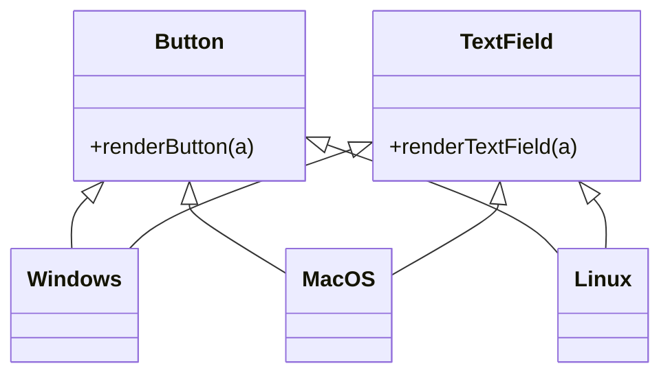

## 4.8 Abstract Factory with Type Classes

### Introduction to Abstract Factory Design Pattern

The Abstract Factory design pattern is a creational pattern that provides an interface for creating families of related or dependent objects without specifying their concrete classes. This pattern is particularly useful when a system needs to be independent of how its objects are created, composed, and represented. In Haskell, we can leverage type classes to implement the Abstract Factory pattern, allowing us to define interfaces for object creation and provide different implementations for different types.

### Key Concepts

- **Abstract Factory**: A pattern used to create families of related objects.
- **Type Classes**: Haskell's way of defining interfaces that can have multiple implementations.
- **Polymorphism**: The ability to present the same interface for different data types.

### Type Classes as Factories

In Haskell, type classes can be used to define a set of functions that must be implemented by any data type that wishes to be an instance of that class. This makes type classes an ideal tool for implementing the Abstract Factory pattern, as they allow us to define a common interface for creating objects, while leaving the specifics of the implementation to the individual data types.

### Example: Rendering Interfaces for Different UI Elements

Let's consider a scenario where we need to render different UI elements, such as buttons and text fields, for different platforms (e.g., Windows, macOS, Linux). We can use the Abstract Factory pattern with type classes to define a common interface for rendering these elements, and then provide different implementations for each platform.

#### Step 1: Define the Type Classes

First, we define a type class for each UI element that we want to render. Each type class will have a method for rendering the element.

```haskell
-- Define a type class for rendering buttons
class Button a where
    renderButton :: a -> String

-- Define a type class for rendering text fields
class TextField a where
    renderTextField :: a -> String
```

#### Step 2: Create Data Types for Each Platform

Next, we create data types for each platform that we want to support. Each data type will represent a specific platform.

```haskell
-- Define data types for each platform
data Windows = Windows
data MacOS = MacOS
data Linux = Linux
```

#### Step 3: Implement the Type Classes for Each Platform

Now, we implement the type classes for each platform. Each implementation will provide a platform-specific way of rendering the UI elements.

```haskell
-- Implement the Button type class for Windows
instance Button Windows where
    renderButton _ = "Rendering a Windows button"

-- Implement the TextField type class for Windows
instance TextField Windows where
    renderTextField _ = "Rendering a Windows text field"

-- Implement the Button type class for MacOS
instance Button MacOS where
    renderButton _ = "Rendering a macOS button"

-- Implement the TextField type class for MacOS
instance TextField MacOS where
    renderTextField _ = "Rendering a macOS text field"

-- Implement the Button type class for Linux
instance Button Linux where
    renderButton _ = "Rendering a Linux button"

-- Implement the TextField type class for Linux
instance TextField Linux where
    renderTextField _ = "Rendering a Linux text field"
```

#### Step 4: Use the Abstract Factory

Finally, we can use the Abstract Factory to render UI elements for a specific platform. We simply create an instance of the platform's data type and call the appropriate rendering methods.

```haskell
-- Function to render UI elements for a specific platform
renderUI :: (Button a, TextField a) => a -> (String, String)
renderUI platform = (renderButton platform, renderTextField platform)

-- Example usage
main :: IO ()
main = do
    let windowsUI = renderUI Windows
    let macUI = renderUI MacOS
    let linuxUI = renderUI Linux

    putStrLn $ "Windows UI: " ++ show windowsUI
    putStrLn $ "macOS UI: " ++ show macUI
    putStrLn $ "Linux UI: " ++ show linuxUI
```

### Visualizing the Abstract Factory Pattern

To better understand how the Abstract Factory pattern works with type classes in Haskell, let's visualize the relationships between the components using a class diagram.



### Key Participants

- **Type Classes (`Button`, `TextField`)**: Define the interface for creating objects.
- **Concrete Implementations (`Windows`, `MacOS`, `Linux`)**: Provide specific implementations of the type classes for different platforms.

### Applicability

Use the Abstract Factory pattern with type classes in Haskell when:

- You need to create families of related objects without specifying their concrete classes.
- You want to provide different implementations for different data types.
- You want to leverage Haskell's type system to enforce interface contracts.

### Design Considerations

- **Flexibility**: The Abstract Factory pattern provides flexibility by allowing different implementations for different data types.
- **Scalability**: Adding support for new platforms is easy, as it only requires implementing the existing type classes for the new platform.
- **Complexity**: The pattern can introduce complexity, especially when dealing with a large number of type classes and implementations.

### Haskell Unique Features

- **Type Classes**: Haskell's type classes provide a powerful way to define interfaces and enforce contracts, making them ideal for implementing the Abstract Factory pattern.
- **Strong Static Typing**: Haskell's type system ensures that only valid implementations of the type classes can be used, reducing runtime errors.

### Differences and Similarities

- **Abstract Factory vs. Factory Method**: The Abstract Factory pattern is used to create families of related objects, while the Factory Method pattern is used to create a single object. In Haskell, both patterns can be implemented using type classes, but the Abstract Factory pattern typically involves multiple type classes and implementations.

### Try It Yourself

Experiment with the code examples provided in this section. Try adding support for a new platform, such as Android, by creating a new data type and implementing the `Button` and `TextField` type classes for it. Observe how easy it is to extend the system with new platforms using the Abstract Factory pattern.

### Knowledge Check

- What is the purpose of the Abstract Factory design pattern?
- How can type classes be used to implement the Abstract Factory pattern in Haskell?
- What are the benefits of using the Abstract Factory pattern with type classes?
- How does the Abstract Factory pattern differ from the Factory Method pattern?

### Summary

In this section, we explored the Abstract Factory design pattern and how it can be implemented using type classes in Haskell. We discussed the key concepts, provided a detailed example, and highlighted the unique features of Haskell that make it well-suited for this pattern. By using type classes as factories, we can create flexible and scalable systems that support multiple implementations for different data types.

## Quiz: Abstract Factory with Type Classes



### What is the main purpose of the Abstract Factory design pattern?

- [x] To create families of related objects without specifying their concrete classes.
- [ ] To create a single object with a specific implementation.
- [ ] To enforce a strict hierarchy of object creation.
- [ ] To simplify the creation of complex objects.

> **Explanation:** The Abstract Factory design pattern is used to create families of related or dependent objects without specifying their concrete classes.

### How do type classes in Haskell help implement the Abstract Factory pattern?

- [x] By defining interfaces for object creation.
- [ ] By providing a way to inherit behavior from other classes.
- [ ] By allowing dynamic typing of objects.
- [ ] By enforcing a single implementation for each type.

> **Explanation:** Type classes in Haskell define interfaces that can have multiple implementations, making them ideal for implementing the Abstract Factory pattern.

### Which of the following is a benefit of using the Abstract Factory pattern with type classes?

- [x] Flexibility in providing different implementations for different data types.
- [ ] Simplification of object creation for a single type.
- [ ] Reduction in the number of classes needed for implementation.
- [ ] Enforcing a strict object creation hierarchy.

> **Explanation:** The Abstract Factory pattern with type classes provides flexibility by allowing different implementations for different data types.

### What is a key difference between the Abstract Factory and Factory Method patterns?

- [x] Abstract Factory creates families of related objects, while Factory Method creates a single object.
- [ ] Abstract Factory is used for single object creation, while Factory Method is for families of objects.
- [ ] Abstract Factory enforces a strict hierarchy, while Factory Method does not.
- [ ] Abstract Factory is simpler to implement than Factory Method.

> **Explanation:** The Abstract Factory pattern is used to create families of related objects, while the Factory Method pattern is used to create a single object.

### In the provided example, what role do the `Windows`, `MacOS`, and `Linux` data types play?

- [x] They provide specific implementations of the type classes for different platforms.
- [ ] They define the interfaces for object creation.
- [ ] They enforce a strict hierarchy of object creation.
- [ ] They simplify the creation of complex objects.

> **Explanation:** The `Windows`, `MacOS`, and `Linux` data types provide specific implementations of the type classes for different platforms.

### What is a potential drawback of using the Abstract Factory pattern?

- [x] It can introduce complexity, especially with many type classes and implementations.
- [ ] It enforces a strict object creation hierarchy.
- [ ] It limits the flexibility of object creation.
- [ ] It reduces the scalability of the system.

> **Explanation:** The Abstract Factory pattern can introduce complexity, especially when dealing with a large number of type classes and implementations.

### How does Haskell's strong static typing benefit the Abstract Factory pattern?

- [x] It ensures that only valid implementations of the type classes can be used.
- [ ] It allows for dynamic typing of objects.
- [ ] It simplifies the creation of complex objects.
- [ ] It enforces a strict object creation hierarchy.

> **Explanation:** Haskell's strong static typing ensures that only valid implementations of the type classes can be used, reducing runtime errors.

### What is the role of the `renderUI` function in the provided example?

- [x] It renders UI elements for a specific platform using the appropriate type class implementations.
- [ ] It defines the interfaces for object creation.
- [ ] It enforces a strict hierarchy of object creation.
- [ ] It simplifies the creation of complex objects.

> **Explanation:** The `renderUI` function renders UI elements for a specific platform using the appropriate type class implementations.

### How can you extend the system to support a new platform using the Abstract Factory pattern?

- [x] By creating a new data type and implementing the existing type classes for it.
- [ ] By modifying the existing type classes to include the new platform.
- [ ] By enforcing a strict hierarchy of object creation.
- [ ] By simplifying the creation of complex objects.

> **Explanation:** To support a new platform, you can create a new data type and implement the existing type classes for it.

### True or False: The Abstract Factory pattern is only applicable in object-oriented programming languages.

- [ ] True
- [x] False

> **Explanation:** The Abstract Factory pattern can be implemented in functional programming languages like Haskell using type classes.



Remember, this is just the beginning. As you progress, you'll build more complex and interactive systems using Haskell's powerful type system and design patterns. Keep experimenting, stay curious, and enjoy the journey!

---
