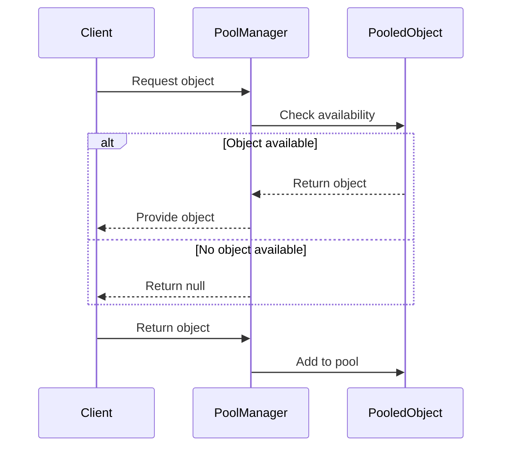

## 4.9 Object Pool Pattern in Haskell

In this section, we delve into the Object Pool Pattern, a creational design pattern that is particularly useful for managing expensive-to-create resources efficiently. This pattern is essential in scenarios where the cost of initializing a class instance is high, and the rate of instantiation is frequent. By reusing objects from a pool, we can significantly reduce the overhead of object creation and destruction, leading to improved performance and resource utilization.

### Object Pool Concept

The Object Pool Pattern is a design pattern that aims to reduce the cost of resource acquisition by reusing objects that are expensive to create. This pattern is particularly useful in environments where resources such as database connections, threads, or network connections are limited or costly to initialize.

#### Key Participants

- **Pool Manager**: Manages the lifecycle of pooled objects, including creation, reuse, and destruction.
- **Pooled Object**: The resource that is being managed by the pool.
- **Client**: The entity that requests and returns objects to the pool.

#### Intent

The primary intent of the Object Pool Pattern is to manage the reuse of objects that are expensive to create, ensuring that resources are efficiently utilized and minimizing the overhead associated with frequent instantiation.

### Applicability

The Object Pool Pattern is applicable in scenarios where:

- The cost of initializing a class instance is high.
- The rate of instantiation is frequent.
- There are a limited number of resources available.
- Resource management and performance optimization are critical.

### Implementation in Haskell

In Haskell, implementing the Object Pool Pattern involves managing state and ensuring thread safety. We can achieve this using `IORef`, `MVar`, or Software Transactional Memory (STM). Let's explore these options in detail.

#### Managing State with `IORef` and `MVar`

`IORef` and `MVar` are two constructs in Haskell that allow us to manage mutable state in the `IO` monad. While `IORef` provides a simple way to store mutable variables, `MVar` offers additional capabilities for synchronization, making it suitable for concurrent programming.

```haskell
import Control.Concurrent.MVar
import Control.Monad (forM_)

-- Define a simple object pool using MVar
data ObjectPool a = ObjectPool (MVar [a])

-- Initialize the pool with a list of objects
initializePool :: [a] -> IO (ObjectPool a)
initializePool objects = do
    pool <- newMVar objects
    return $ ObjectPool pool

-- Acquire an object from the pool
acquireObject :: ObjectPool a -> IO (Maybe a)
acquireObject (ObjectPool pool) = do
    objects <- takeMVar pool
    case objects of
        [] -> do
            putMVar pool []
            return Nothing
        (x:xs) -> do
            putMVar pool xs
            return (Just x)

-- Release an object back to the pool
releaseObject :: ObjectPool a -> a -> IO ()
releaseObject (ObjectPool pool) obj = do
    objects <- takeMVar pool
    putMVar pool (obj:objects)

-- Example usage
main :: IO ()
main = do
    pool <- initializePool [1..10]
    forM_ [1..5] $ \_ -> do
        obj <- acquireObject pool
        case obj of
            Just x -> putStrLn $ "Acquired: " ++ show x
            Nothing -> putStrLn "No object available"
        releaseObject pool 1
```

In this example, we define an `ObjectPool` using `MVar` to manage a list of objects. The `initializePool` function initializes the pool with a list of objects, while `acquireObject` and `releaseObject` manage the acquisition and release of objects, respectively.

#### Using Software Transactional Memory (STM)

STM is a powerful concurrency abstraction in Haskell that allows us to compose atomic transactions. It provides a higher-level alternative to `MVar` for managing shared state in concurrent programs.

```haskell
import Control.Concurrent.STM
import Control.Monad (forM_)

-- Define a simple object pool using STM
data ObjectPoolSTM a = ObjectPoolSTM (TVar [a])

-- Initialize the pool with a list of objects
initializePoolSTM :: [a] -> IO (ObjectPoolSTM a)
initializePoolSTM objects = do
    pool <- newTVarIO objects
    return $ ObjectPoolSTM pool

-- Acquire an object from the pool
acquireObjectSTM :: ObjectPoolSTM a -> IO (Maybe a)
acquireObjectSTM (ObjectPoolSTM pool) = atomically $ do
    objects <- readTVar pool
    case objects of
        [] -> return Nothing
        (x:xs) -> do
            writeTVar pool xs
            return (Just x)

-- Release an object back to the pool
releaseObjectSTM :: ObjectPoolSTM a -> a -> IO ()
releaseObjectSTM (ObjectPoolSTM pool) obj = atomically $ do
    objects <- readTVar pool
    writeTVar pool (obj:objects)

-- Example usage
mainSTM :: IO ()
mainSTM = do
    pool <- initializePoolSTM [1..10]
    forM_ [1..5] $ \_ -> do
        obj <- acquireObjectSTM pool
        case obj of
            Just x -> putStrLn $ "Acquired: " ++ show x
            Nothing -> putStrLn "No object available"
        releaseObjectSTM pool 1
```

In this example, we use `TVar` to manage the pool state, and `atomically` to ensure that operations on the pool are atomic. This approach provides a more robust solution for concurrent programming, as STM handles synchronization and rollback automatically.

### Design Considerations

When implementing the Object Pool Pattern in Haskell, consider the following:

- **Thread Safety**: Ensure that the pool is thread-safe, especially in concurrent environments. STM provides a convenient way to achieve this.
- **Resource Management**: Carefully manage the lifecycle of pooled objects to avoid resource leaks.
- **Performance**: Measure the performance benefits of using an object pool, as the overhead of managing the pool may outweigh the benefits in some cases.

### Haskell Unique Features

Haskell's unique features, such as STM and `MVar`, provide powerful tools for implementing the Object Pool Pattern. These constructs allow us to manage state and ensure thread safety in a functional programming environment, making Haskell well-suited for this pattern.

### Differences and Similarities

The Object Pool Pattern is often confused with other creational patterns, such as the Singleton Pattern. However, the key difference is that the Object Pool Pattern manages a pool of reusable objects, while the Singleton Pattern ensures that only one instance of a class exists.

### Try It Yourself

Experiment with the code examples provided by modifying the pool size or the type of objects being pooled. Try implementing a pool for a different resource, such as database connections or network sockets, to see how the pattern can be adapted to various scenarios.

### Visualizing the Object Pool Pattern

To better understand the Object Pool Pattern, let's visualize the process of acquiring and releasing objects from the pool.



This sequence diagram illustrates the interaction between the client, pool manager, and pooled objects. The client requests an object from the pool manager, which checks for availability and either provides an object or returns null. Once the client is done with the object, it is returned to the pool for future use.

### Knowledge Check

- What are the key benefits of using the Object Pool Pattern?
- How does STM enhance thread safety in Haskell?
- What are some potential pitfalls when implementing an object pool?

### Embrace the Journey

Remember, mastering design patterns is a journey. As you explore the Object Pool Pattern in Haskell, consider how it can be applied to different scenarios in your projects. Keep experimenting, stay curious, and enjoy the process of learning and applying these powerful concepts.

## Quiz: Object Pool Pattern in Haskell



### What is the primary intent of the Object Pool Pattern?

- [x] To manage the reuse of objects that are expensive to create
- [ ] To ensure only one instance of a class exists
- [ ] To provide a way to create families of related objects
- [ ] To separate the construction of a complex object from its representation

> **Explanation:** The Object Pool Pattern is designed to manage the reuse of objects that are expensive to create, reducing the overhead of frequent instantiation.

### Which Haskell construct is used for thread-safe state management in the Object Pool Pattern?

- [x] STM (Software Transactional Memory)
- [ ] IORef
- [ ] MVar
- [ ] TVar

> **Explanation:** STM (Software Transactional Memory) is used for thread-safe state management in Haskell, providing atomic transactions for concurrent programming.

### What is a key difference between the Object Pool Pattern and the Singleton Pattern?

- [x] The Object Pool Pattern manages a pool of reusable objects, while the Singleton Pattern ensures only one instance of a class exists.
- [ ] The Object Pool Pattern is used for creating families of related objects, while the Singleton Pattern is not.
- [ ] The Object Pool Pattern separates construction from representation, while the Singleton Pattern does not.
- [ ] The Object Pool Pattern is used for thread safety, while the Singleton Pattern is not.

> **Explanation:** The Object Pool Pattern manages a pool of reusable objects, whereas the Singleton Pattern ensures only one instance of a class exists.

### What is the role of the Pool Manager in the Object Pool Pattern?

- [x] To manage the lifecycle of pooled objects, including creation, reuse, and destruction
- [ ] To provide a single point of access to a resource
- [ ] To create families of related objects
- [ ] To separate the construction of a complex object from its representation

> **Explanation:** The Pool Manager manages the lifecycle of pooled objects, including their creation, reuse, and destruction.

### Which of the following is a benefit of using the Object Pool Pattern?

- [x] Improved performance and resource utilization
- [ ] Ensuring only one instance of a class exists
- [ ] Creating families of related objects
- [ ] Separating construction from representation

> **Explanation:** The Object Pool Pattern improves performance and resource utilization by reusing objects that are expensive to create.

### How does STM handle synchronization in Haskell?

- [x] By providing atomic transactions and automatic rollback
- [ ] By using locks and semaphores
- [ ] By ensuring only one instance of a class exists
- [ ] By separating construction from representation

> **Explanation:** STM handles synchronization by providing atomic transactions and automatic rollback, simplifying concurrent programming.

### What is the purpose of the `acquireObject` function in the Object Pool Pattern?

- [x] To acquire an object from the pool for use
- [ ] To release an object back to the pool
- [ ] To initialize the pool with a list of objects
- [ ] To manage the lifecycle of pooled objects

> **Explanation:** The `acquireObject` function acquires an object from the pool for use by the client.

### What is a potential pitfall when implementing an object pool?

- [x] Resource leaks due to improper management of pooled objects
- [ ] Ensuring only one instance of a class exists
- [ ] Creating families of related objects
- [ ] Separating construction from representation

> **Explanation:** A potential pitfall when implementing an object pool is resource leaks due to improper management of pooled objects.

### Which Haskell construct provides a simple way to store mutable variables?

- [x] IORef
- [ ] STM
- [ ] MVar
- [ ] TVar

> **Explanation:** `IORef` provides a simple way to store mutable variables in Haskell.

### True or False: The Object Pool Pattern is only applicable in object-oriented programming languages.

- [ ] True
- [x] False

> **Explanation:** False. The Object Pool Pattern is applicable in both object-oriented and functional programming languages, including Haskell.



By understanding and implementing the Object Pool Pattern in Haskell, you can effectively manage resources and improve the performance of your applications. Keep exploring and experimenting with different design patterns to enhance your Haskell programming skills.
