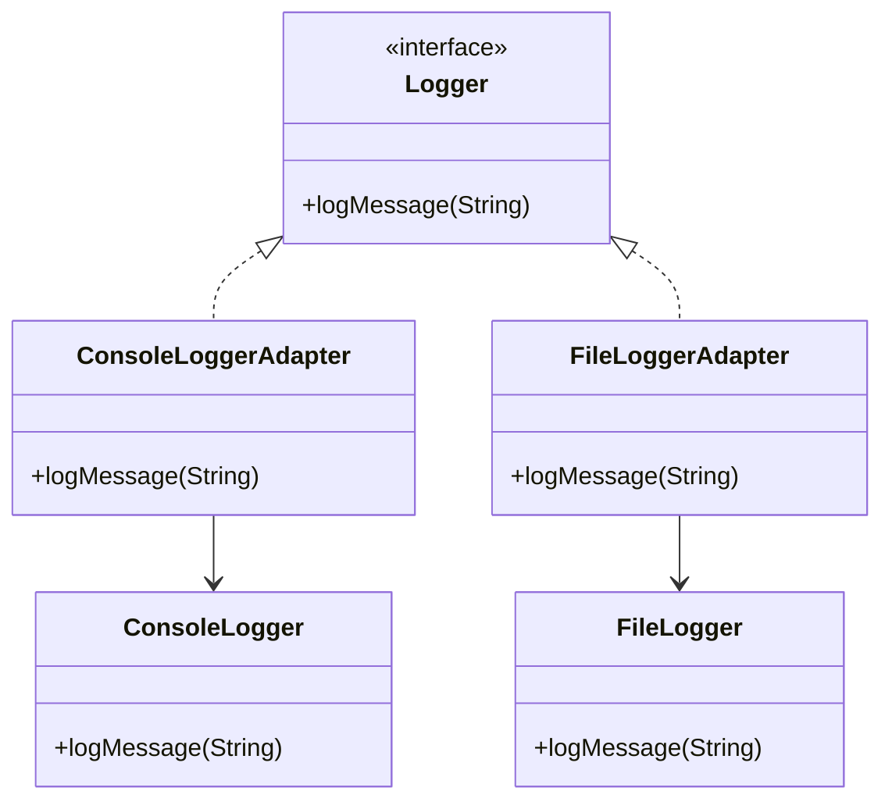
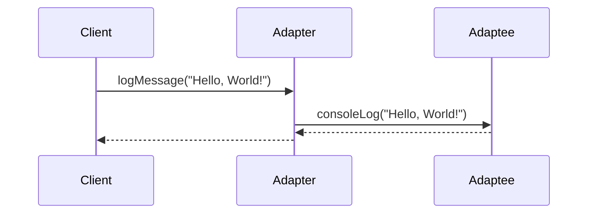

## 5.1 Adapter Pattern with Type Classes and Newtypes

In the world of software design, the Adapter Pattern is a structural pattern that allows incompatible interfaces to work together. In Haskell, we can leverage the power of type classes and newtypes to implement this pattern effectively. This section will guide you through understanding and applying the Adapter Pattern in Haskell, focusing on type classes and newtypes.

### Intent

The primary intent of the Adapter Pattern is to enable the integration of interfaces that are not directly compatible. In Haskell, this is achieved by defining a common interface using type classes and adapting existing types to this interface using newtypes.

### Key Concepts

- **Type Classes**: Define a set of functions that can be implemented by different types.
- **Newtypes**: Provide a way to create a distinct type from an existing one, allowing us to define new instances for type classes.

### Diagrams

To visualize the Adapter Pattern in Haskell, consider the following Mermaid.js diagram illustrating the relationship between type classes, newtypes, and existing types:



**Diagram Description**: This diagram shows how `ConsoleLoggerAdapter` and `FileLoggerAdapter` implement the `Logger` interface, adapting the `ConsoleLogger` and `FileLogger` classes, respectively.

### Key Participants

- **Target Interface**: The interface expected by the client, defined using a type class.
- **Adaptee**: The existing interface that needs adaptation.
- **Adapter**: A newtype that implements the target interface by wrapping the adaptee.

### Applicability

Use the Adapter Pattern in Haskell when:

- You need to integrate third-party libraries with incompatible interfaces.
- You want to provide a uniform interface to a set of disparate classes.
- You need to decouple the client code from specific implementations.

### Sample Code Snippet

Let's explore a practical example of adapting different logging frameworks to a standard interface using Haskell's type classes and newtypes.

#### Step 1: Define the Target Interface

First, we define a type class `Logger` that represents the common interface for logging.

```haskell
class Logger a where
    logMessage :: a -> String -> IO ()
```

#### Step 2: Define the Adaptees

Suppose we have two existing logging frameworks: `ConsoleLogger` and `FileLogger`.

```haskell
data ConsoleLogger = ConsoleLogger

consoleLog :: ConsoleLogger -> String -> IO ()
consoleLog _ msg = putStrLn ("Console: " ++ msg)

data FileLogger = FileLogger FilePath

fileLog :: FileLogger -> String -> IO ()
fileLog (FileLogger path) msg = appendFile path (msg ++ "\n")
```

#### Step 3: Implement the Adapters

We use newtypes to wrap the existing loggers and provide instances of the `Logger` type class.

```haskell
newtype ConsoleLoggerAdapter = ConsoleLoggerAdapter ConsoleLogger

instance Logger ConsoleLoggerAdapter where
    logMessage (ConsoleLoggerAdapter logger) msg = consoleLog logger msg

newtype FileLoggerAdapter = FileLoggerAdapter FileLogger

instance Logger FileLoggerAdapter where
    logMessage (FileLoggerAdapter logger) msg = fileLog logger msg
```

#### Step 4: Use the Adapters

Now, we can use the adapters to log messages through a unified interface.

```haskell
main :: IO ()
main = do
    let consoleLogger = ConsoleLoggerAdapter ConsoleLogger
    let fileLogger = FileLoggerAdapter (FileLogger "log.txt")
    
    logMessage consoleLogger "Logging to console"
    logMessage fileLogger "Logging to file"
```

### Design Considerations

- **Simplicity**: The Adapter Pattern simplifies client code by providing a consistent interface.
- **Flexibility**: Newtypes allow us to define multiple adapters for the same adaptee, offering flexibility in how we integrate different systems.
- **Performance**: Newtypes in Haskell are zero-cost abstractions, meaning they do not introduce runtime overhead.

### Haskell Unique Features

Haskell's type system and functional nature provide unique advantages when implementing the Adapter Pattern:

- **Type Safety**: Type classes ensure that only compatible types can be used with the adapter.
- **Immutability**: Haskell's immutable data structures prevent side effects, making adapters more predictable.
- **Lazy Evaluation**: Allows for efficient handling of potentially large or infinite data streams.

### Differences and Similarities

The Adapter Pattern is often confused with the Decorator Pattern. While both involve wrapping objects, the Adapter Pattern focuses on interface compatibility, whereas the Decorator Pattern adds additional behavior.

### Try It Yourself

Experiment with the code examples by:

- Adding a new logging framework and creating an adapter for it.
- Modifying the `Logger` type class to include additional logging methods.
- Implementing a composite logger that logs to multiple destinations simultaneously.

### Visualizing the Adapter Pattern

To further illustrate the Adapter Pattern, consider the following sequence diagram showing the interaction between the client, adapter, and adaptee:



**Diagram Description**: This sequence diagram demonstrates how the client interacts with the adapter, which in turn delegates the logging operation to the adaptee.

### References and Links

- [Haskell Type Classes](https://wiki.haskell.org/Type_class)
- [Haskell Newtype](https://wiki.haskell.org/Newtype)
- [Adapter Pattern on Wikipedia](https://en.wikipedia.org/wiki/Adapter_pattern)

### Knowledge Check

- How does the Adapter Pattern differ from the Decorator Pattern?
- What are the benefits of using newtypes in Haskell?
- How can type classes enhance the flexibility of the Adapter Pattern?

### Exercises

1. Implement an adapter for a third-party HTTP client library.
2. Extend the `Logger` type class to support log levels (e.g., INFO, DEBUG, ERROR).
3. Create a composite adapter that combines multiple logging frameworks.

### Embrace the Journey

Remember, mastering design patterns in Haskell is a journey. As you explore the Adapter Pattern, you'll gain insights into the power of type classes and newtypes. Keep experimenting, stay curious, and enjoy the process of building robust and flexible software systems!

## Quiz: Adapter Pattern with Type Classes and Newtypes



### What is the primary purpose of the Adapter Pattern?

- [x] To allow incompatible interfaces to work together.
- [ ] To add new functionality to existing objects.
- [ ] To create a family of related objects.
- [ ] To define a one-to-many dependency between objects.

> **Explanation:** The Adapter Pattern is used to enable incompatible interfaces to work together by providing a common interface.

### How does Haskell's `newtype` help in implementing the Adapter Pattern?

- [x] It allows creating a distinct type from an existing one, enabling new type class instances.
- [ ] It provides a way to inherit behavior from another type.
- [ ] It allows for dynamic typing in Haskell.
- [ ] It introduces runtime overhead for type conversion.

> **Explanation:** `newtype` in Haskell creates a distinct type without runtime overhead, allowing new type class instances.

### Which Haskell feature is used to define a common interface in the Adapter Pattern?

- [x] Type Classes
- [ ] Data Types
- [ ] Modules
- [ ] Instances

> **Explanation:** Type classes in Haskell define a set of functions that can be implemented by different types, serving as a common interface.

### What is the role of the `Adapter` in the Adapter Pattern?

- [x] It implements the target interface by wrapping the adaptee.
- [ ] It defines the target interface.
- [ ] It provides additional functionality to the adaptee.
- [ ] It manages the lifecycle of the adaptee.

> **Explanation:** The Adapter wraps the adaptee and implements the target interface, enabling compatibility.

### Which of the following is a benefit of using type classes in the Adapter Pattern?

- [x] They ensure type safety and flexibility.
- [ ] They allow for dynamic method dispatch.
- [ ] They provide runtime polymorphism.
- [ ] They introduce mutable state.

> **Explanation:** Type classes ensure type safety and provide flexibility by allowing different types to implement the same interface.

### What is a common use case for the Adapter Pattern in Haskell?

- [x] Integrating third-party libraries with incompatible interfaces.
- [ ] Adding new methods to existing data types.
- [ ] Creating complex data structures.
- [ ] Managing concurrent operations.

> **Explanation:** The Adapter Pattern is commonly used to integrate third-party libraries with incompatible interfaces by providing a common interface.

### How can you extend the `Logger` type class to support log levels?

- [x] By adding new methods to the type class for each log level.
- [ ] By creating a new type class for each log level.
- [ ] By using inheritance to add log levels.
- [ ] By modifying the existing data types.

> **Explanation:** Extending the `Logger` type class involves adding new methods for each log level, allowing different implementations.

### What is the advantage of using `newtype` over `data` in Haskell?

- [x] `newtype` has no runtime overhead and is more efficient.
- [ ] `newtype` supports multiple constructors.
- [ ] `newtype` allows for mutable state.
- [ ] `newtype` provides dynamic typing.

> **Explanation:** `newtype` is a zero-cost abstraction in Haskell, meaning it has no runtime overhead compared to `data`.

### What is the difference between the Adapter and Decorator patterns?

- [x] The Adapter Pattern focuses on interface compatibility, while the Decorator Pattern adds behavior.
- [ ] The Adapter Pattern adds behavior, while the Decorator Pattern focuses on interface compatibility.
- [ ] Both patterns serve the same purpose.
- [ ] The Adapter Pattern is used for inheritance, while the Decorator Pattern is used for composition.

> **Explanation:** The Adapter Pattern focuses on making interfaces compatible, while the Decorator Pattern adds additional behavior to objects.

### True or False: Newtypes in Haskell introduce runtime overhead.

- [x] False
- [ ] True

> **Explanation:** Newtypes in Haskell are a zero-cost abstraction, meaning they do not introduce runtime overhead.


