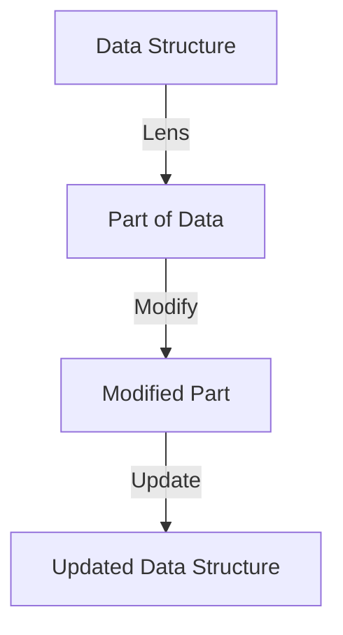

## 5.10 Implementing Patterns with Lenses and Optics

In the realm of functional programming, Haskell stands out with its emphasis on immutability and pure functions. However, this can sometimes make data manipulation cumbersome, especially when dealing with deeply nested structures. Enter **Lenses and Optics**—powerful abstractions that simplify accessing and modifying immutable data structures. In this section, we will delve into how Lenses and Optics can be used to implement structural design patterns in Haskell, enhancing both code readability and maintainability.

### Understanding Lenses and Optics

**Lenses** are composable tools that allow you to focus on a part of a data structure. They provide a way to get, set, and modify data in a functional way. **Optics** is a broader term that encompasses Lenses, Prisms, and other related abstractions.

#### Key Concepts

- **Lenses**: Focus on a single part of a data structure.
- **Prisms**: Deal with data structures that can be in one of several forms.
- **Traversals**: Allow you to focus on multiple parts of a data structure.
- **Iso**: Represents an isomorphism between two data types.

### Advantages of Using Lenses and Optics

- **Composability**: Lenses can be composed to access deeply nested data.
- **Immutability**: They allow updates to immutable data structures without compromising immutability.
- **Reusability**: Once defined, lenses can be reused across different parts of the application.

### Libraries and Tools

The most popular library for working with Lenses in Haskell is the [`lens`](https://hackage.haskell.org/package/lens) library. It provides a comprehensive suite of tools for working with Lenses, Prisms, and other optics.

### Basic Lens Operations

Let's start with some basic operations using Lenses. Consider a simple data structure:

```haskell
{-# LANGUAGE TemplateHaskell #-}

import Control.Lens

data Person = Person
  { _name :: String
  , _age  :: Int
  } deriving (Show)

makeLenses ''Person
```

Here, we define a `Person` data type with `name` and `age` fields. The `makeLenses` function from the `lens` library automatically generates lenses for these fields.

#### Accessing Data

To access data using a lens, we use the `view` function:

```haskell
john :: Person
john = Person "John Doe" 30

-- Accessing the name field
johnName :: String
johnName = view name john
```

#### Modifying Data

To modify data, we use the `set` and `over` functions:

```haskell
-- Setting a new age
olderJohn :: Person
olderJohn = set age 31 john

-- Incrementing the age
olderJohn' :: Person
olderJohn' = over age (+1) john
```

### Composing Lenses

One of the most powerful features of lenses is their ability to compose. This is particularly useful for accessing and modifying deeply nested data structures.

Consider a more complex data structure:

```haskell
data Company = Company
  { _companyName :: String
  , _employees   :: [Person]
  } deriving (Show)

makeLenses ''Company
```

To access the age of the first employee in a company, we can compose lenses:

```haskell
firstEmployeeAge :: Company -> Int
firstEmployeeAge = view (employees . ix 0 . age)
```

### Implementing Design Patterns with Lenses

Lenses can be used to implement various design patterns in Haskell. Let's explore some examples.

#### Adapter Pattern

The Adapter Pattern allows incompatible interfaces to work together. In Haskell, we can use lenses to adapt data structures to a common interface.

Suppose we have two different data structures representing a user:

```haskell
data UserV1 = UserV1
  { _usernameV1 :: String
  , _emailV1    :: String
  }

data UserV2 = UserV2
  { _usernameV2 :: String
  , _contactV2  :: String
  }

makeLenses ''UserV1
makeLenses ''UserV2
```

We can define a common interface using lenses:

```haskell
class User a where
  username :: Lens' a String
  contact  :: Lens' a String

instance User UserV1 where
  username = usernameV1
  contact  = emailV1

instance User UserV2 where
  username = usernameV2
  contact  = contactV2
```

Now, we can work with both `UserV1` and `UserV2` using the same interface.

#### Composite Pattern

The Composite Pattern is used to treat individual objects and compositions of objects uniformly. Lenses can help manage the complexity of composite structures.

Consider a file system where each file or directory can contain other files or directories:

```haskell
data FileSystem
  = File { _fileName :: String }
  | Directory { _dirName :: String, _contents :: [FileSystem] }

makeLenses ''FileSystem
```

We can define a traversal to access all file names in a directory:

```haskell
fileNames :: Traversal' FileSystem String
fileNames f (File name) = File <$> f name
fileNames f (Directory name contents) =
  Directory name <$> traverse (fileNames f) contents
```

### Visualizing Lenses and Optics

To better understand how lenses work, let's visualize the process of accessing and modifying data using lenses.



**Diagram Explanation**: This diagram illustrates how a lens focuses on a part of a data structure, modifies it, and updates the original structure with the changes.

### Try It Yourself

Experiment with the following code by modifying the data structures and lenses:

```haskell
-- Define a new data structure
data Address = Address
  { _street :: String
  , _city   :: String
  }

makeLenses ''Address

-- Create a person with an address
data PersonWithAddress = PersonWithAddress
  { _personName :: String
  , _personAge  :: Int
  , _address    :: Address
  }

makeLenses ''PersonWithAddress

-- Access and modify the city of a person's address
updateCity :: PersonWithAddress -> String -> PersonWithAddress
updateCity person newCity = set (address . city) newCity person
```

### Design Considerations

When using lenses, consider the following:

- **Performance**: While lenses are powerful, they can introduce overhead. Use them judiciously in performance-critical code.
- **Complexity**: Overusing lenses can make code difficult to read. Balance the use of lenses with clarity.
- **Type Safety**: Lenses leverage Haskell's type system to ensure safe data manipulation.

### Haskell Unique Features

Haskell's strong type system and emphasis on immutability make lenses particularly useful. They provide a way to work with immutable data structures efficiently, leveraging Haskell's type inference and functional composition.

### Differences and Similarities

Lenses are often compared to getters and setters in object-oriented programming. However, unlike traditional setters, lenses maintain immutability and are composable. They are similar to functional programming concepts like map and fold, as they provide a way to traverse and modify data structures.

### Knowledge Check

- **Question**: How do lenses maintain immutability while allowing data modification?
- **Exercise**: Implement a lens for a nested data structure and use it to update a field.

### Embrace the Journey

Remember, mastering lenses and optics is a journey. As you explore these concepts, you'll unlock new ways to write clean, efficient, and maintainable Haskell code. Keep experimenting, stay curious, and enjoy the process!

## Quiz: Implementing Patterns with Lenses and Optics



### What is the primary advantage of using lenses in Haskell?

- [x] They allow for composable data manipulation.
- [ ] They enable mutable state.
- [ ] They simplify type inference.
- [ ] They eliminate the need for data types.

> **Explanation:** Lenses provide a way to compose data manipulations, making it easier to work with complex data structures.

### Which library is commonly used for lenses in Haskell?

- [x] lens
- [ ] optics
- [ ] prism
- [ ] traversal

> **Explanation:** The `lens` library is the most popular choice for working with lenses in Haskell.

### How do lenses differ from traditional setters?

- [x] Lenses maintain immutability.
- [ ] Lenses allow direct state mutation.
- [ ] Lenses are not composable.
- [ ] Lenses require mutable data structures.

> **Explanation:** Unlike traditional setters, lenses maintain immutability and are composable.

### What is a Prism in the context of optics?

- [x] A tool for working with data structures that can be in one of several forms.
- [ ] A way to focus on a single part of a data structure.
- [ ] A method for traversing multiple parts of a data structure.
- [ ] An isomorphism between two data types.

> **Explanation:** Prisms are used to work with data structures that can be in one of several forms.

### Which function is used to access data using a lens?

- [x] view
- [ ] set
- [ ] over
- [ ] modify

> **Explanation:** The `view` function is used to access data through a lens.

### What is the purpose of the `makeLenses` function?

- [x] To automatically generate lenses for data fields.
- [ ] To create a new data type.
- [ ] To modify existing lenses.
- [ ] To delete lenses.

> **Explanation:** The `makeLenses` function generates lenses for data fields automatically.

### How can lenses be composed?

- [x] By chaining them together using the `.` operator.
- [ ] By using the `+` operator.
- [ ] By nesting them within each other.
- [ ] By using the `*` operator.

> **Explanation:** Lenses can be composed by chaining them together with the `.` operator.

### What is the role of the `over` function in lens operations?

- [x] To modify data through a lens.
- [ ] To access data through a lens.
- [ ] To delete data through a lens.
- [ ] To create a new lens.

> **Explanation:** The `over` function is used to modify data through a lens.

### True or False: Lenses can introduce overhead in performance-critical code.

- [x] True
- [ ] False

> **Explanation:** While lenses are powerful, they can introduce overhead, so they should be used judiciously in performance-critical code.

### Which of the following is NOT a type of optic?

- [x] Filter
- [ ] Lens
- [ ] Prism
- [ ] Traversal

> **Explanation:** Filter is not a type of optic; Lens, Prism, and Traversal are types of optics.


