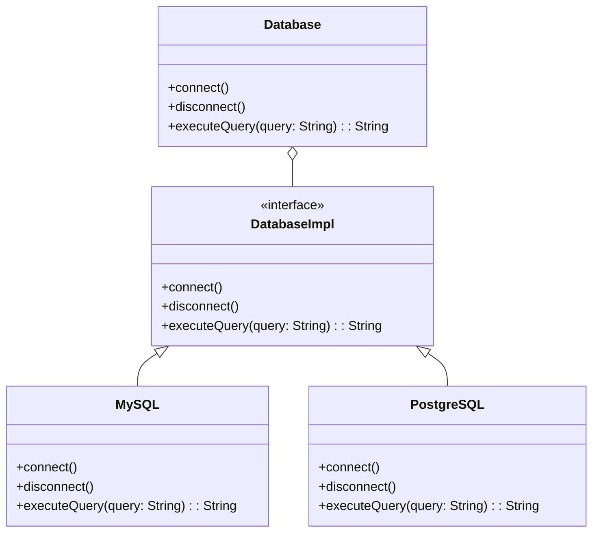

## 5.2 Bridge Pattern Using Existential Types

### Introduction

In the realm of software design patterns, the Bridge Pattern stands out as a powerful tool for decoupling an abstraction from its implementation. This separation allows both the abstraction and the implementation to evolve independently, providing flexibility and scalability. In Haskell, a language known for its strong type system and functional programming paradigm, we can leverage existential types to implement the Bridge Pattern effectively. This section will guide you through the concepts, implementation, and benefits of using the Bridge Pattern with existential types in Haskell.

### Bridge Pattern Concept

The Bridge Pattern is a structural design pattern that aims to separate an abstraction from its implementation so that the two can vary independently. This pattern is particularly useful when you want to avoid a permanent binding between an abstraction and its implementation. By using the Bridge Pattern, you can change the implementation without affecting the client code that uses the abstraction.

#### Key Participants

1. **Abstraction**: Defines the abstraction's interface and maintains a reference to an object of type Implementor.
2. **Refined Abstraction**: Extends the interface defined by Abstraction.
3. **Implementor**: Defines the interface for implementation classes. This interface does not need to correspond exactly to Abstraction's interface; in fact, the two interfaces can be quite different.
4. **Concrete Implementor**: Implements the Implementor interface and defines its concrete implementation.

### Existential Types in Haskell

Existential types in Haskell allow us to hide the concrete type behind an interface, achieving polymorphism without inheritance. This is particularly useful in functional programming, where we often want to abstract over different implementations without relying on traditional object-oriented inheritance.

#### How Existential Types Work

In Haskell, existential types are typically introduced using the `forall` keyword in combination with data constructors. This allows us to encapsulate a type within a data structure, hiding its concrete type from the outside world. Here's a simple example to illustrate the concept:

```haskell
{-# LANGUAGE ExistentialQuantification #-}

data Showable = forall a. Show a => MkShowable a

instance Show Showable where
    show (MkShowable a) = show a

example :: [Showable]
example = [MkShowable 5, MkShowable "Hello", MkShowable 3.14]

main :: IO ()
main = mapM_ print example
```

In this example, `Showable` is an existential type that can hold any value that implements the `Show` typeclass. The concrete type of the value is hidden, allowing us to treat different types uniformly.

### Implementing the Bridge Pattern with Existential Types

To demonstrate the Bridge Pattern using existential types in Haskell, let's consider a scenario where we want to abstract database operations over different backends. We'll define an abstraction for database operations and provide different implementations for various database systems.

#### Step 1: Define the Abstraction

First, we define an abstraction for database operations. This abstraction will provide a common interface for interacting with different database systems.

```haskell
{-# LANGUAGE ExistentialQuantification #-}

-- Define the abstraction for database operations
data Database = forall db. DatabaseImpl db => MkDatabase db

class DatabaseImpl db where
    connect :: db -> IO ()
    disconnect :: db -> IO ()
    executeQuery :: db -> String -> IO String
```

In this code, `Database` is an existential type that can hold any value implementing the `DatabaseImpl` typeclass. The `DatabaseImpl` typeclass defines the interface for database operations.

#### Step 2: Implement Concrete Implementations

Next, we implement concrete implementations for different database systems. For simplicity, let's consider two database systems: MySQL and PostgreSQL.

```haskell
-- MySQL implementation
data MySQL = MySQLConnection String

instance DatabaseImpl MySQL where
    connect (MySQLConnection connStr) = putStrLn $ "Connecting to MySQL: " ++ connStr
    disconnect _ = putStrLn "Disconnecting from MySQL"
    executeQuery _ query = do
        putStrLn $ "Executing MySQL query: " ++ query
        return "MySQL Result"

-- PostgreSQL implementation
data PostgreSQL = PostgreSQLConnection String

instance DatabaseImpl PostgreSQL where
    connect (PostgreSQLConnection connStr) = putStrLn $ "Connecting to PostgreSQL: " ++ connStr
    disconnect _ = putStrLn "Disconnecting from PostgreSQL"
    executeQuery _ query = do
        putStrLn $ "Executing PostgreSQL query: " ++ query
        return "PostgreSQL Result"
```

Here, we define `MySQL` and `PostgreSQL` as concrete implementations of the `DatabaseImpl` typeclass. Each implementation provides its own logic for connecting, disconnecting, and executing queries.

#### Step 3: Use the Bridge Pattern

Finally, we use the Bridge Pattern to interact with different database systems through the common abstraction.

```haskell
-- Function to perform database operations
performDatabaseOperations :: Database -> IO ()
performDatabaseOperations (MkDatabase db) = do
    connect db
    result <- executeQuery db "SELECT * FROM users"
    putStrLn $ "Query Result: " ++ result
    disconnect db

main :: IO ()
main = do
    let mysqlDb = MkDatabase (MySQLConnection "mysql://localhost")
    let postgresDb = MkDatabase (PostgreSQLConnection "postgresql://localhost")

    putStrLn "Using MySQL Database:"
    performDatabaseOperations mysqlDb

    putStrLn "\nUsing PostgreSQL Database:"
    performDatabaseOperations postgresDb
```

In this code, `performDatabaseOperations` takes a `Database` abstraction and performs operations using the provided implementation. The client code can switch between different database systems without modifying the logic for database operations.

### Visualizing the Bridge Pattern

To better understand the Bridge Pattern using existential types, let's visualize the relationship between the abstraction and its implementations.



This diagram illustrates how the `Database` abstraction is decoupled from its concrete implementations (`MySQL` and `PostgreSQL`) through the `DatabaseImpl` interface.

### Design Considerations

When using the Bridge Pattern with existential types in Haskell, consider the following:

- **Flexibility**: The Bridge Pattern provides flexibility by allowing different implementations to be swapped without affecting the client code.
- **Complexity**: Introducing existential types can add complexity to the codebase. Ensure that the benefits of abstraction outweigh the added complexity.
- **Type Safety**: Existential types hide the concrete type, which can lead to loss of type safety. Use this pattern judiciously and ensure that the interface is well-defined.

### Haskell Unique Features

Haskell's strong type system and support for existential types make it uniquely suited for implementing the Bridge Pattern. The use of typeclasses allows for polymorphism without inheritance, and existential types provide a way to encapsulate different implementations behind a common interface.

### Differences and Similarities

The Bridge Pattern is often confused with the Adapter Pattern. While both patterns involve abstraction, the Bridge Pattern focuses on decoupling an abstraction from its implementation, allowing both to vary independently. In contrast, the Adapter Pattern is used to make two incompatible interfaces compatible.

### Try It Yourself

To deepen your understanding of the Bridge Pattern using existential types, try modifying the code examples provided:

- **Add a new database system**: Implement a new database system (e.g., SQLite) and integrate it with the existing abstraction.
- **Extend the interface**: Add new operations to the `DatabaseImpl` typeclass and implement them in the concrete implementations.
- **Experiment with error handling**: Introduce error handling in the database operations and observe how it affects the abstraction.

### Knowledge Check

- **What is the primary goal of the Bridge Pattern?**
- **How do existential types contribute to polymorphism in Haskell?**
- **What are the key differences between the Bridge Pattern and the Adapter Pattern?**

### Conclusion

The Bridge Pattern using existential types in Haskell provides a powerful mechanism for decoupling abstractions from their implementations. By leveraging Haskell's type system and functional programming paradigm, we can achieve polymorphism and flexibility without relying on traditional inheritance. As you explore this pattern, remember to balance the benefits of abstraction with the complexity it introduces. Keep experimenting, stay curious, and enjoy the journey of mastering design patterns in Haskell!

## Quiz: Bridge Pattern Using Existential Types



### What is the primary purpose of the Bridge Pattern?

- [x] To decouple an abstraction from its implementation.
- [ ] To provide a way to create objects without specifying the exact class.
- [ ] To define a family of algorithms and make them interchangeable.
- [ ] To ensure a class has only one instance.

> **Explanation:** The Bridge Pattern is designed to decouple an abstraction from its implementation, allowing them to vary independently.

### How do existential types contribute to polymorphism in Haskell?

- [x] By hiding the concrete type behind an interface.
- [ ] By allowing inheritance between classes.
- [ ] By enforcing strict type checking at compile time.
- [ ] By providing dynamic typing capabilities.

> **Explanation:** Existential types in Haskell hide the concrete type, allowing different implementations to be treated uniformly through a common interface.

### Which of the following is a key participant in the Bridge Pattern?

- [x] Abstraction
- [ ] Singleton
- [ ] Factory
- [ ] Observer

> **Explanation:** The Abstraction is a key participant in the Bridge Pattern, defining the interface and maintaining a reference to an Implementor.

### What is a potential downside of using existential types?

- [x] Loss of type safety
- [ ] Increased performance
- [ ] Simplified code structure
- [ ] Enhanced readability

> **Explanation:** Existential types can lead to a loss of type safety because the concrete type is hidden, which can complicate debugging and maintenance.

### How does the Bridge Pattern differ from the Adapter Pattern?

- [x] The Bridge Pattern decouples abstraction from implementation, while the Adapter Pattern makes interfaces compatible.
- [ ] The Bridge Pattern is used for creating objects, while the Adapter Pattern is used for structuring code.
- [ ] The Bridge Pattern is a behavioral pattern, while the Adapter Pattern is a creational pattern.
- [ ] The Bridge Pattern is used for concurrency, while the Adapter Pattern is used for parallelism.

> **Explanation:** The Bridge Pattern focuses on decoupling abstraction from implementation, allowing both to vary independently, whereas the Adapter Pattern is used to make two incompatible interfaces compatible.

### What is a benefit of using the Bridge Pattern?

- [x] Flexibility in changing implementations without affecting client code.
- [ ] Simplified error handling.
- [ ] Improved performance through caching.
- [ ] Reduced memory usage.

> **Explanation:** The Bridge Pattern provides flexibility by allowing different implementations to be swapped without affecting the client code.

### In the provided example, what role does the `DatabaseImpl` typeclass play?

- [x] It defines the interface for database operations.
- [ ] It provides a concrete implementation for MySQL.
- [ ] It is responsible for connecting to the database.
- [ ] It handles error logging.

> **Explanation:** The `DatabaseImpl` typeclass defines the interface for database operations, which concrete implementations must adhere to.

### What is a common use case for the Bridge Pattern?

- [x] Abstracting database operations over different backends.
- [ ] Implementing a singleton logger.
- [ ] Creating a factory for object creation.
- [ ] Managing state transitions in a state machine.

> **Explanation:** A common use case for the Bridge Pattern is abstracting database operations over different backends, allowing for flexibility and scalability.

### Which Haskell feature is particularly useful for implementing the Bridge Pattern?

- [x] Existential types
- [ ] Lazy evaluation
- [ ] List comprehensions
- [ ] Pattern matching

> **Explanation:** Existential types are particularly useful for implementing the Bridge Pattern in Haskell, as they allow for hiding the concrete type behind an interface.

### True or False: The Bridge Pattern is a creational design pattern.

- [ ] True
- [x] False

> **Explanation:** The Bridge Pattern is a structural design pattern, not a creational one. It focuses on decoupling abstraction from implementation.


