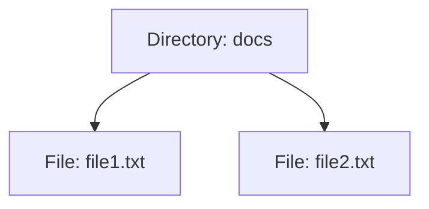

## 5.3 Composite Pattern with Recursive Data Structures

In this section, we delve into the Composite Pattern, a structural design pattern that is particularly powerful in Haskell due to its synergy with recursive data structures. The Composite Pattern allows us to treat individual objects and compositions of objects uniformly, which is a natural fit for Haskell's functional paradigm.

### Composite Concept

The Composite Pattern is used to represent part-whole hierarchies. It enables clients to treat individual objects and compositions of objects uniformly. This is particularly useful when dealing with tree-like structures, such as file systems, organizational hierarchies, or UI components.

#### Key Participants

- **Component**: An interface for all objects in the composition, both leaf and composite.
- **Leaf**: Represents leaf objects in the composition. A leaf has no children.
- **Composite**: Represents a composite object that can have children. It implements child-related operations.

### Recursive Data Structures

Recursive data structures are a natural fit for the Composite Pattern. In Haskell, we can define data types that reference themselves, allowing us to create complex hierarchical structures.

#### Defining Recursive Data Structures

Let's start by defining a simple recursive data structure to represent a file system:

```haskell
-- A file system can be either a File or a Directory
data FileSystem = File String Int | Directory String [FileSystem]
  deriving (Show, Eq)

-- Example: A file named "file.txt" with size 100
fileExample :: FileSystem
fileExample = File "file.txt" 100

-- Example: A directory named "docs" containing two files
directoryExample :: FileSystem
directoryExample = Directory "docs" [File "file1.txt" 200, File "file2.txt" 300]
```

In this example, `FileSystem` is a recursive data structure where a `Directory` can contain a list of `FileSystem` objects, allowing for nested directories and files.

### Using Lists or Trees to Represent Hierarchies

Lists and trees are common structures used to represent hierarchies in recursive data structures. In our file system example, directories are represented as lists of `FileSystem` objects.

#### Example: Representing a File System

Let's expand our file system example to include operations that can be performed on the file system, such as calculating the total size of a directory:

```haskell
-- Calculate the total size of a FileSystem
totalSize :: FileSystem -> Int
totalSize (File _ size) = size
totalSize (Directory _ contents) = sum (map totalSize contents)

-- Example usage
main :: IO ()
main = do
  let total = totalSize directoryExample
  putStrLn $ "Total size: " ++ show total
```

In this code, we define a `totalSize` function that recursively calculates the total size of a `FileSystem`. This function demonstrates how recursive data structures can be used to perform operations on hierarchical data.

### Visualizing the Composite Pattern

To better understand the Composite Pattern, let's visualize the structure of our file system using a tree diagram.



In this diagram, the `Directory` node contains two `File` nodes, illustrating the hierarchical structure of the file system.

### Applicability

The Composite Pattern is applicable in scenarios where you need to represent part-whole hierarchies. It is particularly useful when:

- You want to treat individual objects and compositions uniformly.
- You need to perform operations on a hierarchy of objects.
- You are working with tree-like structures, such as file systems or organizational charts.

### Haskell Unique Features

Haskell's strong support for recursive data structures and pattern matching makes it an ideal language for implementing the Composite Pattern. The ability to define recursive types and use pattern matching to deconstruct them simplifies the implementation of operations on hierarchical data.

#### Pattern Matching and Algebraic Data Types

Haskell's pattern matching allows us to easily deconstruct recursive data structures and perform operations based on their structure. This is a powerful feature that simplifies the implementation of the Composite Pattern.

### Differences and Similarities

The Composite Pattern is often compared to other structural patterns, such as the Decorator Pattern. While both patterns involve composing objects, the Composite Pattern focuses on part-whole hierarchies, whereas the Decorator Pattern focuses on adding behavior to individual objects.

### Design Considerations

When using the Composite Pattern in Haskell, consider the following:

- **Performance**: Recursive operations can be expensive, especially on large hierarchies. Consider using lazy evaluation to defer computation until necessary.
- **Complexity**: While the Composite Pattern simplifies the treatment of hierarchical data, it can introduce complexity in terms of managing recursive structures.
- **Type Safety**: Haskell's strong type system ensures that operations on recursive data structures are type-safe, reducing the risk of runtime errors.

### Try It Yourself

To gain a deeper understanding of the Composite Pattern, try modifying the file system example to include additional operations, such as searching for a file by name or listing all files in a directory. Experiment with different recursive data structures and see how they affect the implementation of these operations.

### Knowledge Check

- What is the Composite Pattern, and how does it relate to recursive data structures?
- How can you represent a file system using recursive data structures in Haskell?
- What are the key participants in the Composite Pattern?
- How does Haskell's pattern matching facilitate the implementation of the Composite Pattern?

### Embrace the Journey

Remember, mastering design patterns is a journey. As you explore the Composite Pattern and recursive data structures, you'll gain valuable insights into the power of functional programming in Haskell. Keep experimenting, stay curious, and enjoy the journey!

## Quiz: Composite Pattern with Recursive Data Structures



### What is the primary purpose of the Composite Pattern?

- [x] To treat individual objects and compositions uniformly
- [ ] To add behavior to individual objects
- [ ] To optimize performance of recursive operations
- [ ] To simplify the implementation of algorithms

> **Explanation:** The Composite Pattern is designed to treat individual objects and compositions uniformly, allowing for operations on hierarchical structures.

### Which data structure is commonly used to represent hierarchies in the Composite Pattern?

- [x] Trees
- [ ] Arrays
- [ ] HashMaps
- [ ] Linked Lists

> **Explanation:** Trees are commonly used to represent hierarchical structures in the Composite Pattern, as they naturally support part-whole hierarchies.

### How does Haskell's pattern matching benefit the Composite Pattern?

- [x] It simplifies the deconstruction of recursive data structures
- [ ] It improves performance of recursive operations
- [ ] It allows for dynamic typing
- [ ] It enables polymorphism

> **Explanation:** Haskell's pattern matching simplifies the deconstruction of recursive data structures, making it easier to implement operations on them.

### What is a key consideration when using the Composite Pattern in Haskell?

- [x] Performance of recursive operations
- [ ] Dynamic typing
- [ ] Lack of type safety
- [ ] Inability to handle large data sets

> **Explanation:** Performance of recursive operations is a key consideration when using the Composite Pattern, as they can be expensive on large hierarchies.

### Which of the following is a key participant in the Composite Pattern?

- [x] Component
- [ ] Decorator
- [ ] Adapter
- [ ] Proxy

> **Explanation:** The Component is a key participant in the Composite Pattern, serving as an interface for all objects in the composition.

### What is the role of a Leaf in the Composite Pattern?

- [x] Represents leaf objects with no children
- [ ] Represents composite objects with children
- [ ] Adds behavior to individual objects
- [ ] Optimizes recursive operations

> **Explanation:** A Leaf represents leaf objects in the composition, which have no children.

### How can you calculate the total size of a directory in a file system represented by a recursive data structure?

- [x] By recursively summing the sizes of all files and directories
- [ ] By iterating over all files and directories
- [ ] By using a hash map to store sizes
- [ ] By dynamically calculating sizes at runtime

> **Explanation:** You can calculate the total size of a directory by recursively summing the sizes of all files and directories within it.

### What is a potential drawback of using the Composite Pattern?

- [x] Complexity in managing recursive structures
- [ ] Lack of type safety
- [ ] Inability to handle large data sets
- [ ] Poor performance on small hierarchies

> **Explanation:** The Composite Pattern can introduce complexity in managing recursive structures, especially in large hierarchies.

### How can you modify the file system example to include additional operations?

- [x] By adding new functions that operate on the recursive data structure
- [ ] By changing the data structure to a non-recursive type
- [ ] By using dynamic typing
- [ ] By optimizing the existing functions

> **Explanation:** You can modify the file system example by adding new functions that operate on the recursive data structure, allowing for additional operations.

### True or False: The Composite Pattern is often compared to the Decorator Pattern.

- [x] True
- [ ] False

> **Explanation:** True. The Composite Pattern is often compared to the Decorator Pattern, as both involve composing objects, but they focus on different aspects.




