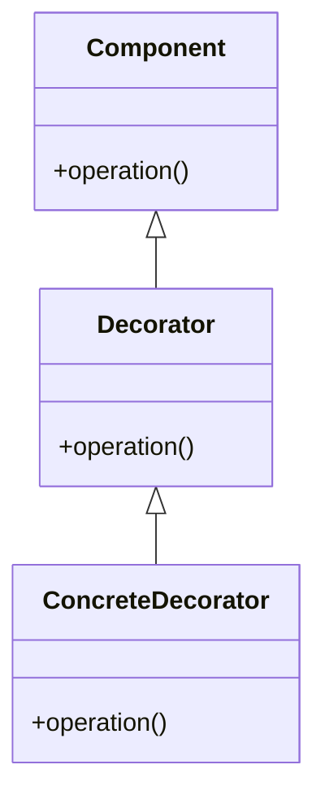

## 5.4 Decorator Pattern with Higher-Order Functions and Monads

The Decorator Pattern is a structural design pattern that allows behavior to be added to individual objects, either statically or dynamically, without affecting the behavior of other objects from the same class. In Haskell, we leverage higher-order functions and monads to implement this pattern, offering a powerful way to extend functionality in a functional programming paradigm.

### Intent

The primary intent of the Decorator Pattern is to attach additional responsibilities to an object dynamically. Decorators provide a flexible alternative to subclassing for extending functionality. In Haskell, this is achieved through higher-order functions and monads, which allow us to wrap functions with additional behavior and layer effects.

### Key Participants

- **Component**: The original object or function to which additional responsibilities are added.
- **Decorator**: A higher-order function or monadic transformation that adds new behavior to the component.
- **Concrete Decorator**: Specific implementations of decorators that add distinct functionalities.

### Applicability

Use the Decorator Pattern in Haskell when:

- You want to add responsibilities to individual objects dynamically and transparently, without affecting other objects.
- You want to extend functionality in a way that is orthogonal to the core logic.
- You need to implement cross-cutting concerns such as logging, authentication, or transaction management.

### Implementation in Haskell

#### Higher-Order Functions

Higher-order functions are functions that take other functions as arguments or return them as results. They are a natural fit for implementing the Decorator Pattern in Haskell.

```haskell
-- A simple function that greets a user
greet :: String -> String
greet name = "Hello, " ++ name

-- A decorator that adds exclamation marks to the greeting
exclaimDecorator :: (String -> String) -> String -> String
exclaimDecorator f name = f name ++ "!!!"

-- Using the decorator
main :: IO ()
main = putStrLn $ exclaimDecorator greet "Alice"
```

In this example, `exclaimDecorator` is a higher-order function that takes a function `f` and a `name`, applies `f` to `name`, and adds exclamation marks to the result.

#### Monads

Monads in Haskell provide a way to structure programs with effects. They can be used to implement decorators by layering additional effects.

```haskell
import Control.Monad.Writer

-- A function that logs messages
logMessage :: String -> Writer [String] ()
logMessage msg = tell [msg]

-- A decorator that logs the greeting
logDecorator :: (String -> Writer [String] String) -> String -> Writer [String] String
logDecorator f name = do
    result <- f name
    logMessage $ "Greeted: " ++ name
    return result

-- The original greeting function wrapped in a Writer monad
greetWithLog :: String -> Writer [String] String
greetWithLog name = return $ "Hello, " ++ name

-- Using the decorator
mainWithLog :: IO ()
mainWithLog = do
    let (result, log) = runWriter $ logDecorator greetWithLog "Bob"
    putStrLn result
    mapM_ putStrLn log
```

In this example, `logDecorator` is a monadic decorator that logs the greeting action. The `Writer` monad is used to accumulate log messages.

### Visualizing the Decorator Pattern



**Diagram Explanation**: The diagram illustrates the relationship between the component, decorator, and concrete decorator. The decorator extends the component, and the concrete decorator provides specific implementations.

### Design Considerations

- **When to Use**: Use decorators when you need to add responsibilities to objects dynamically. They are particularly useful for implementing cross-cutting concerns.
- **Pitfalls**: Be cautious of excessive use of decorators, as they can lead to complex and hard-to-maintain code. Ensure that each decorator has a single responsibility.

### Haskell Unique Features

Haskell's type system and functional nature make it uniquely suited for implementing the Decorator Pattern. Higher-order functions and monads provide a clean and expressive way to extend functionality.

### Differences and Similarities

The Decorator Pattern in Haskell differs from its implementation in object-oriented languages. Instead of wrapping objects, we wrap functions and use monads to manage effects. This approach is more flexible and composable.

### Example: Extending Middleware in a Web Application

Let's consider a practical example of using the Decorator Pattern to extend middleware in a web application.

```haskell
import Network.Wai
import Network.Wai.Handler.Warp (run)
import Network.HTTP.Types (status200)

-- A simple application that responds with "Hello, World!"
app :: Application
app _ respond = respond $ responseLBS status200 [("Content-Type", "text/plain")] "Hello, World!"

-- A middleware that logs requests
logMiddleware :: Middleware
logMiddleware app req respond = do
    putStrLn $ "Request: " ++ show (pathInfo req)
    app req respond

-- A middleware that adds a custom header
headerMiddleware :: Middleware
headerMiddleware app req respond = app req $ \res -> do
    let headers = ("X-Custom-Header", "MyValue") : responseHeaders res
    respond $ mapResponseHeaders (const headers) res

-- Composing middlewares
main :: IO ()
main = run 8080 $ logMiddleware $ headerMiddleware app
```

In this example, `logMiddleware` and `headerMiddleware` are decorators that add logging and custom headers to the application, respectively. They are composed to create a pipeline of middleware.

### Try It Yourself

Experiment with the code examples by modifying the decorators to add different behaviors. Try creating a decorator that measures the execution time of a function or one that caches results.

### Knowledge Check

- What are the key differences between using higher-order functions and monads for implementing the Decorator Pattern?
- How can you ensure that decorators remain maintainable and do not lead to complex code?

### Embrace the Journey

Remember, mastering design patterns in Haskell is a journey. As you explore the Decorator Pattern, you'll discover new ways to extend functionality and manage effects. Keep experimenting, stay curious, and enjoy the journey!

## Quiz: Decorator Pattern with Higher-Order Functions and Monads



### What is the primary intent of the Decorator Pattern?

- [x] To dynamically add responsibilities to objects or functions.
- [ ] To create a new class hierarchy.
- [ ] To simplify code by removing functionality.
- [ ] To enforce strict type checking.

> **Explanation:** The Decorator Pattern is used to dynamically add responsibilities to objects or functions without modifying their structure.

### How are higher-order functions used in the Decorator Pattern?

- [x] By wrapping functions with additional behavior.
- [ ] By creating new data types.
- [ ] By enforcing type constraints.
- [ ] By simplifying function signatures.

> **Explanation:** Higher-order functions in the Decorator Pattern wrap existing functions to add new behavior.

### What role do monads play in the Decorator Pattern?

- [x] They layer effects and manage side effects.
- [ ] They enforce strict type checking.
- [ ] They simplify function signatures.
- [ ] They create new data types.

> **Explanation:** Monads are used to layer effects and manage side effects in the Decorator Pattern.

### What is a potential pitfall of using too many decorators?

- [x] Code can become complex and hard to maintain.
- [ ] It simplifies code too much.
- [ ] It enforces too many constraints.
- [ ] It reduces code readability.

> **Explanation:** Excessive use of decorators can lead to complex and hard-to-maintain code.

### How can decorators be composed in Haskell?

- [x] By chaining higher-order functions or monadic transformations.
- [ ] By creating new data types.
- [ ] By enforcing type constraints.
- [ ] By simplifying function signatures.

> **Explanation:** Decorators can be composed by chaining higher-order functions or monadic transformations.

### What is a common use case for the Decorator Pattern in web applications?

- [x] Extending middleware functionality.
- [ ] Simplifying database queries.
- [ ] Enforcing strict type checking.
- [ ] Reducing code complexity.

> **Explanation:** The Decorator Pattern is commonly used to extend middleware functionality in web applications.

### How does Haskell's type system benefit the Decorator Pattern?

- [x] It provides a clean and expressive way to extend functionality.
- [ ] It enforces strict type checking.
- [ ] It simplifies function signatures.
- [ ] It creates new data types.

> **Explanation:** Haskell's type system provides a clean and expressive way to extend functionality using the Decorator Pattern.

### What is a key difference between the Decorator Pattern in Haskell and object-oriented languages?

- [x] Haskell wraps functions and uses monads, while OO languages wrap objects.
- [ ] Haskell creates new data types, while OO languages use inheritance.
- [ ] Haskell enforces strict type checking, while OO languages do not.
- [ ] Haskell simplifies function signatures, while OO languages do not.

> **Explanation:** In Haskell, the Decorator Pattern wraps functions and uses monads, whereas object-oriented languages wrap objects.

### What is the role of the `Writer` monad in the provided example?

- [x] To accumulate log messages.
- [ ] To enforce strict type checking.
- [ ] To simplify function signatures.
- [ ] To create new data types.

> **Explanation:** The `Writer` monad is used to accumulate log messages in the provided example.

### True or False: The Decorator Pattern can only be implemented using monads in Haskell.

- [ ] True
- [x] False

> **Explanation:** The Decorator Pattern can be implemented using both higher-order functions and monads in Haskell.


