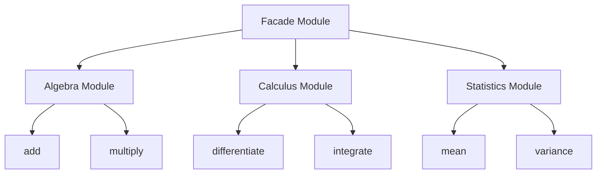

## 5.5 Facade Pattern Using Module Exports

The Facade Pattern is a structural design pattern that provides a simplified interface to a complex subsystem. In Haskell, we can achieve this by using module exports to control the visibility of functions and types, thereby hiding the complexity of the underlying implementation. This section will guide you through understanding and implementing the Facade Pattern using module exports in Haskell.

### Facade Pattern Overview

**Intent**: The primary intent of the Facade Pattern is to provide a unified and straightforward interface to a set of interfaces in a subsystem, making it easier to use and understand. By doing so, it reduces the complexity of interacting with the subsystem and promotes a cleaner separation of concerns.

**Key Participants**:
- **Facade**: The simplified interface that clients interact with.
- **Subsystem Classes**: The complex components that the facade simplifies.

**Applicability**: Use the Facade Pattern when:
- You want to provide a simple interface to a complex subsystem.
- There are many dependencies between clients and the implementation classes of an abstraction.
- You need to layer your subsystems.

### Using Modules in Haskell

In Haskell, modules are used to group related functions, types, and typeclasses. By controlling what is exported from a module, you can create a facade that exposes only the necessary parts of a subsystem, hiding the rest.

#### Module Exports

When defining a module in Haskell, you can specify which functions and types are exported. This allows you to hide implementation details and expose only the necessary interface.

```haskell
module MyModule (exportedFunction, ExportedType) where

-- This function is exported
exportedFunction :: Int -> Int
exportedFunction x = x + 1

-- This type is exported
data ExportedType = Constructor Int

-- This function is not exported
hiddenFunction :: Int -> Int
hiddenFunction x = x * 2
```

In the example above, `exportedFunction` and `ExportedType` are accessible to users of `MyModule`, while `hiddenFunction` remains hidden.

### Implementing the Facade Pattern

To implement the Facade Pattern using module exports, follow these steps:

1. **Identify the Subsystem**: Determine the complex subsystem that requires a simplified interface.
2. **Define the Facade Module**: Create a module that will serve as the facade, exposing only the necessary functions and types.
3. **Implement the Facade**: Within the facade module, implement functions that interact with the subsystem, providing a simplified interface.
4. **Control Exports**: Use module exports to hide the complexity of the subsystem, exposing only the facade functions.

#### Example: Simplifying a Complex Library

Let's consider a scenario where we have a complex library for handling mathematical operations. The library consists of multiple modules, each handling different aspects of mathematics, such as algebra, calculus, and statistics.

**Subsystem Modules**:

- `Algebra.hs`
- `Calculus.hs`
- `Statistics.hs`

Each module contains various functions and types related to its domain.

```haskell
-- Algebra.hs
module Algebra (add, multiply) where

add :: Int -> Int -> Int
add x y = x + y

multiply :: Int -> Int -> Int
multiply x y = x * y

complexOperation :: Int -> Int -> Int
complexOperation x y = (x + y) * (x - y)
```

```haskell
-- Calculus.hs
module Calculus (differentiate, integrate) where

differentiate :: (Double -> Double) -> Double -> Double
differentiate f x = (f (x + h) - f x) / h
  where h = 1e-5

integrate :: (Double -> Double) -> Double -> Double -> Double
integrate f a b = sum [f x * deltaX | x <- [a, a + deltaX .. b]]
  where deltaX = 1e-3
```

```haskell
-- Statistics.hs
module Statistics (mean, variance) where

mean :: [Double] -> Double
mean xs = sum xs / fromIntegral (length xs)

variance :: [Double] -> Double
variance xs = mean (map (\x -> (x - m) ^ 2) xs)
  where m = mean xs
```

**Facade Module**:

Now, let's create a facade module that provides a simplified interface to these mathematical operations.

```haskell
-- MathFacade.hs
module MathFacade (add, multiply, differentiate, integrate, mean, variance) where

import Algebra (add, multiply)
import Calculus (differentiate, integrate)
import Statistics (mean, variance)
```

In `MathFacade.hs`, we import only the necessary functions from each subsystem module and re-export them. This provides a unified interface for users, hiding the complexity of the individual modules.

### Design Considerations

When implementing the Facade Pattern in Haskell, consider the following:

- **Simplicity vs. Flexibility**: The facade should simplify the interface without overly restricting access to necessary functionality.
- **Performance**: Ensure that the facade does not introduce unnecessary overhead.
- **Maintainability**: Keep the facade module updated as the subsystem evolves.

### Haskell Unique Features

Haskell's strong type system and module system make it particularly well-suited for implementing the Facade Pattern. By leveraging type safety and module exports, you can create robust and maintainable facades.

### Differences and Similarities

The Facade Pattern is often confused with the Adapter Pattern. While both provide a simplified interface, the Adapter Pattern is used to make two incompatible interfaces compatible, whereas the Facade Pattern simplifies a complex subsystem.

### Try It Yourself

Experiment with the code examples provided by modifying the subsystem modules and the facade module. Try adding new functions to the subsystem and updating the facade to expose them. This will help reinforce your understanding of how module exports can be used to implement the Facade Pattern.

### Visualizing the Facade Pattern

Below is a diagram illustrating the relationship between the facade module and the subsystem modules.



**Diagram Description**: The diagram shows the `MathFacade` module interacting with the `Algebra`, `Calculus`, and `Statistics` modules. The facade provides a simplified interface by re-exporting selected functions from each subsystem module.

### Knowledge Check

- What is the primary intent of the Facade Pattern?
- How does the Facade Pattern differ from the Adapter Pattern?
- What are the benefits of using module exports in Haskell to implement the Facade Pattern?

### Summary

In this section, we explored the Facade Pattern and how it can be implemented in Haskell using module exports. By providing a simplified interface to a complex subsystem, the Facade Pattern enhances usability and maintainability. Haskell's module system allows for precise control over what is exposed, making it an ideal language for implementing this pattern.

Remember, this is just the beginning. As you progress, you'll build more complex and interactive systems using the Facade Pattern. Keep experimenting, stay curious, and enjoy the journey!

## Quiz: Facade Pattern Using Module Exports



### What is the primary intent of the Facade Pattern?

- [x] To provide a simplified interface to a complex subsystem.
- [ ] To make two incompatible interfaces compatible.
- [ ] To enhance performance by optimizing subsystem interactions.
- [ ] To enforce strict access control to subsystem components.

> **Explanation:** The Facade Pattern aims to provide a simplified interface to a complex subsystem, making it easier to use and understand.

### How does the Facade Pattern differ from the Adapter Pattern?

- [x] The Facade Pattern simplifies a complex subsystem, while the Adapter Pattern makes two incompatible interfaces compatible.
- [ ] The Facade Pattern is used for performance optimization, while the Adapter Pattern is used for security.
- [ ] The Facade Pattern is specific to Haskell, while the Adapter Pattern is universal.
- [ ] The Facade Pattern is used for concurrency, while the Adapter Pattern is used for parallelism.

> **Explanation:** The Facade Pattern simplifies a complex subsystem, whereas the Adapter Pattern is used to make two incompatible interfaces compatible.

### What is a key benefit of using module exports in Haskell for the Facade Pattern?

- [x] It allows precise control over what is exposed, hiding complexity.
- [ ] It automatically optimizes the performance of the subsystem.
- [ ] It enforces runtime type checking for all functions.
- [ ] It provides built-in concurrency support.

> **Explanation:** Module exports in Haskell allow precise control over what is exposed, which helps in hiding the complexity of the subsystem.

### Which of the following is not a participant in the Facade Pattern?

- [x] Adapter
- [ ] Facade
- [ ] Subsystem Classes
- [ ] Client

> **Explanation:** The Adapter is not a participant in the Facade Pattern; it is part of the Adapter Pattern.

### In Haskell, how can you hide a function from being accessed outside a module?

- [x] By not including it in the module's export list.
- [ ] By using the `private` keyword.
- [ ] By prefixing it with an underscore.
- [ ] By declaring it as `hidden`.

> **Explanation:** In Haskell, a function can be hidden by not including it in the module's export list.

### What is a potential drawback of the Facade Pattern?

- [x] It may oversimplify the interface, restricting access to necessary functionality.
- [ ] It increases the complexity of the subsystem.
- [ ] It requires extensive use of global variables.
- [ ] It mandates the use of object-oriented programming.

> **Explanation:** A potential drawback of the Facade Pattern is that it may oversimplify the interface, restricting access to necessary functionality.

### What is the role of the Facade in the Facade Pattern?

- [x] To provide a unified and straightforward interface to a complex subsystem.
- [ ] To enforce strict security measures on subsystem access.
- [ ] To optimize the performance of the subsystem.
- [ ] To convert data formats between different subsystems.

> **Explanation:** The Facade provides a unified and straightforward interface to a complex subsystem.

### Which Haskell feature is particularly useful for implementing the Facade Pattern?

- [x] Module exports
- [ ] Lazy evaluation
- [ ] List comprehensions
- [ ] Pattern matching

> **Explanation:** Module exports are particularly useful for implementing the Facade Pattern in Haskell.

### What should be considered when designing a facade?

- [x] Simplicity vs. Flexibility
- [ ] Use of global variables
- [ ] Direct access to all subsystem components
- [ ] Mandatory use of recursion

> **Explanation:** When designing a facade, it's important to balance simplicity with flexibility.

### True or False: The Facade Pattern can only be used in object-oriented programming languages.

- [x] False
- [ ] True

> **Explanation:** The Facade Pattern can be used in any programming paradigm, including functional programming languages like Haskell.


