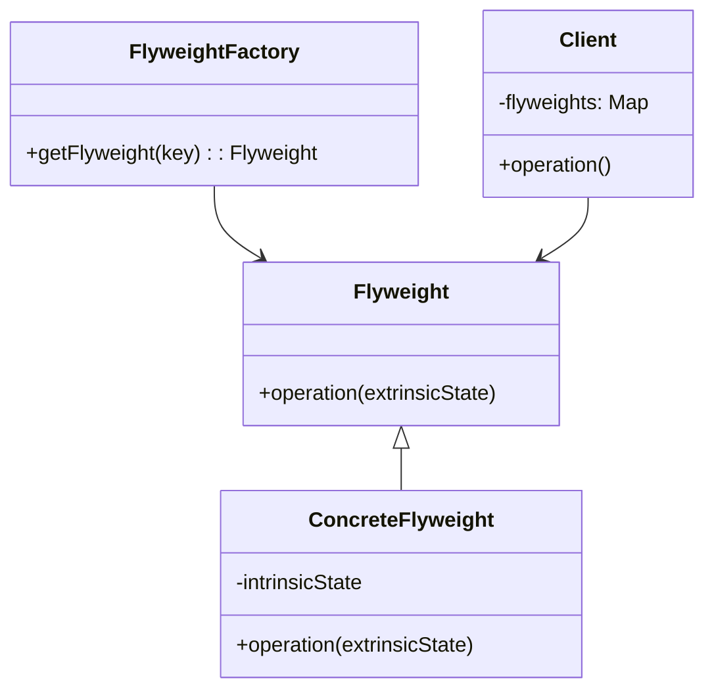

## 5.6 Flyweight Pattern with Sharing and Thunks

In the realm of software design patterns, the Flyweight Pattern stands out as a powerful technique for optimizing memory usage by sharing common data. In Haskell, this pattern is particularly effective due to the language's inherent features such as immutability, lazy evaluation, and the use of thunks. This section will delve into the intricacies of implementing the Flyweight Pattern in Haskell, providing you with the knowledge to enhance your applications' performance and efficiency.

### Flyweight Concept

The Flyweight Pattern is a structural design pattern that aims to minimize memory usage by sharing as much data as possible with similar objects. It is particularly useful in applications where numerous objects are created, and many of them share common data. By storing shared data externally and referencing it, the Flyweight Pattern reduces the overall memory footprint.

#### Key Participants

- **Flyweight**: The interface through which flyweights can act on extrinsic data.
- **Concrete Flyweight**: Implements the Flyweight interface and stores intrinsic data.
- **Flyweight Factory**: Manages and creates flyweight objects, ensuring shared data is reused.
- **Client**: Uses flyweight objects and provides extrinsic data.

### Implementation in Haskell

Haskell's unique features, such as immutability and lazy evaluation, make it an ideal language for implementing the Flyweight Pattern. Let's explore how these features can be leveraged to create efficient and memory-optimized applications.

#### Leveraging Immutable Data and Lazy Evaluation

In Haskell, data is immutable by default, meaning once a data structure is created, it cannot be altered. This immutability is advantageous for the Flyweight Pattern because shared data can be safely referenced without the risk of unintended modifications.

Lazy evaluation, another cornerstone of Haskell, allows computations to be deferred until their results are needed. This feature is crucial for the Flyweight Pattern as it enables the creation of thunks—deferred computations that can be shared across multiple objects.

#### Using Thunks to Share Computations

Thunks in Haskell are essentially placeholders for deferred computations. They are created automatically by the Haskell runtime when an expression is not immediately evaluated. By using thunks, we can ensure that computations are only performed once and their results are shared across multiple instances, reducing redundant calculations and memory usage.

### Example: Caching Shared Configuration Data

To illustrate the Flyweight Pattern in Haskell, let's consider an example where we cache shared configuration data. This scenario is common in applications where multiple components need access to the same configuration settings.

```haskell
module FlyweightExample where

import Data.Map (Map)
import qualified Data.Map as Map

-- Define a type for configuration settings
type ConfigKey = String
type ConfigValue = String
type Config = Map ConfigKey ConfigValue

-- A function to create a configuration map
createConfig :: [(ConfigKey, ConfigValue)] -> Config
createConfig = Map.fromList

-- A function to retrieve a configuration value
getConfigValue :: Config -> ConfigKey -> Maybe ConfigValue
getConfigValue config key = Map.lookup key config

-- Example usage
main :: IO ()
main = do
    let configData = [("host", "localhost"), ("port", "8080")]
    let config = createConfig configData
    print $ getConfigValue config "host"
    print $ getConfigValue config "port"
```

In this example, we define a configuration map using Haskell's `Map` data structure. The `createConfig` function initializes the map, and `getConfigValue` retrieves values based on keys. By using a shared configuration map, we avoid duplicating data across different components, thus implementing the Flyweight Pattern.

### Visualizing the Flyweight Pattern

To better understand the Flyweight Pattern, let's visualize its structure using a Mermaid.js diagram.



**Diagram Description**: This diagram illustrates the relationships between the key participants in the Flyweight Pattern. The `FlyweightFactory` manages the creation and sharing of `ConcreteFlyweight` instances, which store intrinsic data. The `Client` interacts with these flyweights, providing extrinsic data as needed.

### Design Considerations

When implementing the Flyweight Pattern in Haskell, consider the following:

- **Memory vs. Performance Trade-Off**: While the Flyweight Pattern reduces memory usage, it may introduce additional complexity in managing shared data. Ensure that the benefits outweigh the costs in your specific use case.
- **Concurrency**: Haskell's immutable data structures are inherently thread-safe, making them suitable for concurrent applications. However, be mindful of potential bottlenecks when accessing shared data.
- **Lazy Evaluation**: Leverage lazy evaluation to defer computations and share results across multiple instances. This can significantly improve performance in scenarios with redundant calculations.

### Haskell Unique Features

Haskell's functional programming paradigm offers several unique features that enhance the implementation of the Flyweight Pattern:

- **Pure Functions**: Haskell's emphasis on pure functions ensures that shared data remains consistent and free from side effects.
- **Type System**: Haskell's strong static typing helps prevent errors when managing shared data, providing compile-time guarantees of correctness.
- **Higher-Order Functions**: Use higher-order functions to abstract common operations on shared data, further reducing code duplication.

### Differences and Similarities

The Flyweight Pattern is often compared to other design patterns, such as the Singleton Pattern. While both patterns aim to reduce memory usage, the Flyweight Pattern focuses on sharing data across multiple instances, whereas the Singleton Pattern ensures a single instance of a class.

### Try It Yourself

To deepen your understanding of the Flyweight Pattern in Haskell, try modifying the example code:

- **Add More Configuration Keys**: Extend the configuration map with additional keys and values. Observe how the shared data structure handles the increased data.
- **Implement a Flyweight Factory**: Create a factory function that manages the creation and retrieval of configuration maps, ensuring shared data is reused.
- **Experiment with Lazy Evaluation**: Introduce complex computations in the configuration values and observe how lazy evaluation optimizes performance.

### Knowledge Check

Before moving on, consider the following questions to reinforce your understanding:

- How does the Flyweight Pattern optimize memory usage in Haskell?
- What role do thunks play in implementing the Flyweight Pattern?
- How can lazy evaluation enhance the performance of applications using the Flyweight Pattern?

### Embrace the Journey

Remember, mastering design patterns is a journey. As you continue to explore Haskell and its powerful features, you'll discover new ways to optimize your applications and solve complex problems. Keep experimenting, stay curious, and enjoy the process of learning and growing as a software engineer.

## Quiz: Flyweight Pattern with Sharing and Thunks



### What is the primary goal of the Flyweight Pattern?

- [x] To minimize memory usage by sharing common data
- [ ] To ensure a single instance of a class
- [ ] To encapsulate object creation
- [ ] To separate interface from implementation

> **Explanation:** The Flyweight Pattern aims to minimize memory usage by sharing as much data as possible with similar objects.

### How does Haskell's immutability benefit the Flyweight Pattern?

- [x] It ensures shared data remains consistent and free from side effects
- [ ] It allows data to be modified in place
- [ ] It requires additional synchronization mechanisms
- [ ] It increases the complexity of data management

> **Explanation:** Haskell's immutability ensures that shared data remains consistent and free from side effects, making it ideal for the Flyweight Pattern.

### What is a thunk in Haskell?

- [x] A placeholder for a deferred computation
- [ ] A type of data structure
- [ ] A function that modifies data
- [ ] A concurrency primitive

> **Explanation:** A thunk in Haskell is a placeholder for a deferred computation, allowing computations to be shared and performed only when needed.

### How does lazy evaluation enhance the Flyweight Pattern?

- [x] By deferring computations until their results are needed
- [ ] By performing all computations eagerly
- [ ] By increasing the memory footprint
- [ ] By introducing side effects

> **Explanation:** Lazy evaluation enhances the Flyweight Pattern by deferring computations until their results are needed, reducing redundant calculations.

### Which Haskell feature helps prevent errors when managing shared data?

- [x] Strong static typing
- [ ] Dynamic typing
- [ ] Mutable data structures
- [ ] Implicit type conversion

> **Explanation:** Haskell's strong static typing helps prevent errors when managing shared data, providing compile-time guarantees of correctness.

### What is the role of the Flyweight Factory?

- [x] To manage and create flyweight objects
- [ ] To modify shared data
- [ ] To encapsulate object behavior
- [ ] To provide a single instance of a class

> **Explanation:** The Flyweight Factory manages and creates flyweight objects, ensuring shared data is reused.

### How can higher-order functions be used in the Flyweight Pattern?

- [x] To abstract common operations on shared data
- [ ] To modify intrinsic data
- [ ] To increase code duplication
- [ ] To introduce side effects

> **Explanation:** Higher-order functions can be used to abstract common operations on shared data, reducing code duplication.

### What is a common use case for the Flyweight Pattern in Haskell?

- [x] Caching shared configuration data
- [ ] Implementing a singleton object
- [ ] Encapsulating object creation
- [ ] Separating interface from implementation

> **Explanation:** A common use case for the Flyweight Pattern in Haskell is caching shared configuration data to reduce memory usage.

### How does the Flyweight Pattern differ from the Singleton Pattern?

- [x] The Flyweight Pattern focuses on sharing data across multiple instances
- [ ] The Flyweight Pattern ensures a single instance of a class
- [ ] The Flyweight Pattern encapsulates object creation
- [ ] The Flyweight Pattern separates interface from implementation

> **Explanation:** The Flyweight Pattern focuses on sharing data across multiple instances, whereas the Singleton Pattern ensures a single instance of a class.

### True or False: The Flyweight Pattern can introduce additional complexity in managing shared data.

- [x] True
- [ ] False

> **Explanation:** While the Flyweight Pattern reduces memory usage, it may introduce additional complexity in managing shared data.



By understanding and implementing the Flyweight Pattern in Haskell, you can create more efficient and memory-optimized applications. Continue exploring Haskell's powerful features and design patterns to enhance your skills as a software engineer.
