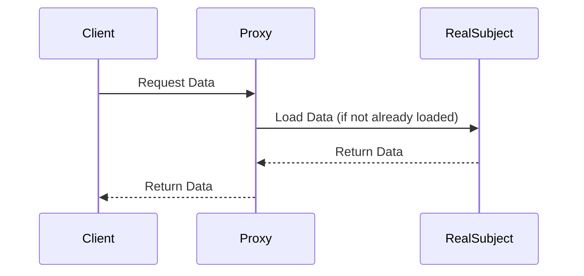

## 5.7 Proxy Pattern with Lazy Evaluation and the ST Monad

In this section, we delve into the Proxy Pattern, a structural design pattern that plays a crucial role in controlling access to objects. We will explore how Haskell's lazy evaluation and the ST Monad can be leveraged to implement this pattern effectively. This approach not only enhances performance by deferring computations but also ensures safety when dealing with mutable references.

### Proxy Concept

The Proxy Pattern is a structural design pattern that provides a surrogate or placeholder for another object to control access to it. This pattern is particularly useful in scenarios where direct access to an object is either costly or undesirable. By introducing a proxy, we can manage the complexity and overhead associated with the object.

#### Key Participants

- **Subject**: The common interface for RealSubject and Proxy.
- **RealSubject**: The actual object that the proxy represents.
- **Proxy**: The surrogate that controls access to the RealSubject.

### Lazy Evaluation as Proxy

Lazy evaluation is a core feature of Haskell that defers computation until the result is needed. This characteristic can be harnessed to implement the Proxy Pattern by delaying the creation or loading of resources until they are explicitly required.

#### Benefits of Lazy Evaluation

- **Performance Optimization**: By deferring computations, we avoid unnecessary processing, which can lead to significant performance gains.
- **Resource Management**: Lazy evaluation allows for efficient management of resources, such as memory and CPU, by only allocating them when necessary.

#### Using the ST Monad for Safe Mutable References

The ST Monad in Haskell provides a way to perform mutable operations safely within a local scope. It ensures that mutable state changes do not leak outside the computation, maintaining the purity of the functional paradigm.

#### Example: Loading Resources On-Demand

Consider a scenario where we need to load large datasets. Using a proxy with lazy evaluation, we can defer the loading process until the data is actually needed, thus optimizing resource usage.

```haskell
import Control.Monad.ST
import Data.STRef

-- Define a proxy for a large dataset
data DatasetProxy = DatasetProxy { loadData :: ST s (STRef s [Int]) }

-- Function to create a proxy for the dataset
createDatasetProxy :: [Int] -> DatasetProxy
createDatasetProxy dataset = DatasetProxy {
    loadData = do
        ref <- newSTRef []
        writeSTRef ref dataset
        return ref
}

-- Function to access the dataset through the proxy
accessDataset :: DatasetProxy -> ST s [Int]
accessDataset proxy = do
    ref <- loadData proxy
    readSTRef ref

-- Example usage
exampleUsage :: [Int]
exampleUsage = runST $ do
    let dataset = [1..1000000]  -- A large dataset
    let proxy = createDatasetProxy dataset
    accessDataset proxy
```

In this example, the `DatasetProxy` acts as a proxy for a large dataset. The actual data is only loaded when `accessDataset` is called, demonstrating lazy evaluation in action.

### Visualizing the Proxy Pattern with Lazy Evaluation

To better understand the flow of the Proxy Pattern with lazy evaluation, let's visualize the process using a sequence diagram.



**Diagram Description**: The client requests data from the proxy. If the data is not already loaded, the proxy requests it from the real subject. Once loaded, the data is returned to the client.

### Applicability

The Proxy Pattern with lazy evaluation and the ST Monad is applicable in scenarios where:

- **Resource-Intensive Operations**: When operations are resource-intensive and should be deferred until necessary.
- **Access Control**: When access to an object needs to be controlled or restricted.
- **Lazy Initialization**: When objects should be initialized only when required.

### Design Considerations

When implementing the Proxy Pattern in Haskell, consider the following:

- **Lazy Evaluation Pitfalls**: Be mindful of potential space leaks due to deferred computations.
- **ST Monad Scope**: Ensure that mutable operations within the ST Monad do not escape their intended scope.
- **Concurrency**: Consider thread safety when accessing shared resources through proxies.

### Haskell Unique Features

Haskell's unique features, such as lazy evaluation and the ST Monad, provide powerful tools for implementing the Proxy Pattern. These features allow for efficient resource management and safe mutable operations, setting Haskell apart from other languages.

### Differences and Similarities

The Proxy Pattern in Haskell shares similarities with its implementation in other languages, such as providing a surrogate for another object. However, Haskell's lazy evaluation and ST Monad introduce unique advantages, such as deferred computation and safe mutable state management.

### Try It Yourself

To deepen your understanding, try modifying the example code to:

- **Add Logging**: Implement logging to track when the dataset is loaded.
- **Simulate Delay**: Introduce a delay in loading the dataset to simulate a resource-intensive operation.
- **Experiment with Different Data Structures**: Use different data structures, such as trees or graphs, to explore the flexibility of the Proxy Pattern.

### Knowledge Check

- **Question**: What are the key benefits of using lazy evaluation in the Proxy Pattern?
- **Exercise**: Implement a proxy for a network resource that only establishes a connection when data is requested.

### Embrace the Journey

Remember, mastering design patterns in Haskell is a journey. As you explore the Proxy Pattern with lazy evaluation and the ST Monad, you'll gain insights into efficient resource management and safe mutable operations. Keep experimenting, stay curious, and enjoy the journey!

## Quiz: Proxy Pattern with Lazy Evaluation and the ST Monad



### What is the primary role of the Proxy Pattern?

- [x] To control access to an object
- [ ] To enhance the performance of an object
- [ ] To provide a user interface for an object
- [ ] To manage the lifecycle of an object

> **Explanation:** The Proxy Pattern is primarily used to control access to an object, acting as a surrogate or placeholder.

### How does lazy evaluation benefit the Proxy Pattern?

- [x] By deferring computation until necessary
- [ ] By increasing the complexity of the code
- [ ] By making the code more difficult to understand
- [ ] By reducing the need for error handling

> **Explanation:** Lazy evaluation defers computation until the result is needed, optimizing performance and resource usage.

### What is the purpose of the ST Monad in Haskell?

- [x] To perform mutable operations safely within a local scope
- [ ] To handle exceptions in Haskell
- [ ] To manage input and output operations
- [ ] To provide concurrency support

> **Explanation:** The ST Monad allows for safe mutable operations within a local scope, ensuring purity in functional programming.

### In the provided example, when is the dataset loaded?

- [x] When `accessDataset` is called
- [ ] When `createDatasetProxy` is called
- [ ] At the start of the program
- [ ] When the program ends

> **Explanation:** The dataset is loaded when `accessDataset` is called, demonstrating lazy evaluation.

### What is a potential pitfall of lazy evaluation?

- [x] Space leaks due to deferred computations
- [ ] Increased memory usage
- [ ] Reduced code readability
- [ ] Increased error rates

> **Explanation:** Lazy evaluation can lead to space leaks if not managed properly, as deferred computations accumulate.

### Which of the following is a key participant in the Proxy Pattern?

- [x] Proxy
- [ ] Adapter
- [ ] Observer
- [ ] Decorator

> **Explanation:** The Proxy is a key participant in the Proxy Pattern, acting as a surrogate for the RealSubject.

### What is a common use case for the Proxy Pattern?

- [x] Loading resources on-demand
- [ ] Implementing user interfaces
- [ ] Managing database connections
- [ ] Handling exceptions

> **Explanation:** The Proxy Pattern is commonly used for loading resources on-demand, optimizing resource usage.

### How does the ST Monad maintain purity in Haskell?

- [x] By ensuring mutable state changes do not leak outside the computation
- [ ] By providing error handling mechanisms
- [ ] By managing input and output operations
- [ ] By supporting concurrency

> **Explanation:** The ST Monad maintains purity by ensuring that mutable state changes are confined to a local scope.

### What is a benefit of using the Proxy Pattern with lazy evaluation?

- [x] Efficient resource management
- [ ] Increased code complexity
- [ ] Reduced performance
- [ ] Increased error rates

> **Explanation:** The Proxy Pattern with lazy evaluation allows for efficient resource management by deferring computations.

### True or False: The Proxy Pattern in Haskell can be implemented without using lazy evaluation.

- [x] True
- [ ] False

> **Explanation:** While lazy evaluation enhances the Proxy Pattern, it can still be implemented without it, though with different trade-offs.



By understanding and applying the Proxy Pattern with lazy evaluation and the ST Monad, you can create efficient, scalable, and maintainable Haskell applications. Keep exploring and experimenting with these powerful concepts!
