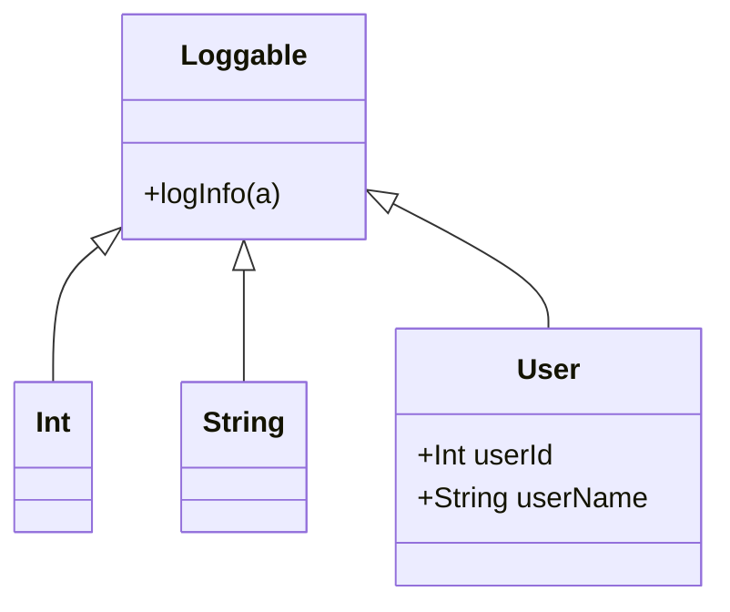

## 5.8 Extension Methods via Type Class Instances

In the world of functional programming, Haskell stands out with its powerful type system and the concept of type classes. One of the elegant ways to extend functionality in Haskell is through type class instances, which allow us to add methods to existing types without altering their original definitions. This section will delve into how we can leverage type class instances to achieve extension methods in Haskell, providing a robust mechanism to enhance and adapt functionality.

### Extending Functionality

In object-oriented programming languages, extension methods allow developers to add new methods to existing types without modifying their source code. Haskell, being a functional language, approaches this concept through type classes. By defining new type class instances, we can introduce additional behaviors to existing types, effectively extending their functionality.

#### Key Concepts

- **Type Classes**: A type class in Haskell is a sort of interface that defines some behavior. If a type is an instance of a type class, it supports and implements the behavior the type class describes.
- **Instances**: Instances are concrete implementations of type classes for specific types. By creating instances, we can define how a type should behave according to the type class's contract.
- **Extension Methods**: These are methods added to existing types via type class instances, enabling new functionality without altering the original type definition.

### Type Classes for Extensions

To extend functionality using type classes, we follow a structured approach:

1. **Define a Type Class**: Create a type class that encapsulates the desired behavior or functionality.
2. **Implement Instances**: Provide instances of the type class for the types you wish to extend.
3. **Use the Extended Functionality**: Utilize the new methods provided by the type class instances in your code.

#### Example: Adding Logging Capabilities

Let's consider a scenario where we want to add logging capabilities to various data types. We can achieve this by defining a `Loggable` type class and implementing it for different types.

```haskell
-- Define the Loggable type class
class Loggable a where
    logInfo :: a -> String

-- Implement Loggable for Int
instance Loggable Int where
    logInfo x = "Logging Int: " ++ show x

-- Implement Loggable for String
instance Loggable String where
    logInfo s = "Logging String: " ++ s

-- Implement Loggable for a custom data type
data User = User { userId :: Int, userName :: String }

instance Loggable User where
    logInfo user = "Logging User: " ++ userName user ++ " with ID: " ++ show (userId user)

-- Example usage
main :: IO ()
main = do
    putStrLn $ logInfo (42 :: Int)
    putStrLn $ logInfo "Hello, Haskell!"
    putStrLn $ logInfo (User 1 "Alice")
```

In this example, we define a `Loggable` type class with a single method `logInfo`. We then create instances of `Loggable` for `Int`, `String`, and a custom `User` type. This allows us to log information about these types without modifying their original definitions.

### Visualizing Type Class Instances

To better understand how type class instances work, let's visualize the relationship between type classes, instances, and types using a class diagram.



In this diagram, the `Loggable` type class is shown as an interface with the `logInfo` method. The `Int`, `String`, and `User` types are depicted as classes that implement the `Loggable` interface, indicating that they provide concrete implementations of the `logInfo` method.

### Applicability

The use of type class instances to extend functionality is particularly useful in the following scenarios:

- **Decoupling**: When you want to decouple functionality from data types, allowing for more modular and reusable code.
- **Open/Closed Principle**: When adhering to the open/closed principle, where types are open for extension but closed for modification.
- **Cross-Cutting Concerns**: When dealing with cross-cutting concerns such as logging, serialization, or validation, which can be abstracted into type classes and applied to various types.

### Design Considerations

When using type class instances for extension methods, consider the following:

- **Type Safety**: Ensure that the type class methods are type-safe and do not introduce runtime errors.
- **Instance Overlap**: Be cautious of overlapping instances, which can lead to ambiguity and unexpected behavior.
- **Performance**: Consider the performance implications of using type classes, especially in performance-critical applications.

### Haskell Unique Features

Haskell's type system and type classes provide unique features that enhance the implementation of extension methods:

- **Type Inference**: Haskell's powerful type inference system reduces the need for explicit type annotations, making code more concise.
- **Higher-Order Functions**: The ability to pass functions as arguments and return them as results allows for flexible and reusable type class methods.
- **Lazy Evaluation**: Haskell's lazy evaluation strategy can optimize performance by deferring computations until necessary.

### Differences and Similarities

While extension methods in Haskell via type class instances share similarities with extension methods in object-oriented languages, there are key differences:

- **No Inheritance**: Unlike object-oriented languages, Haskell does not use inheritance. Instead, it relies on type classes and instances to achieve polymorphism.
- **Explicit Instances**: In Haskell, you must explicitly define instances for each type, whereas object-oriented languages often use implicit inheritance.

### Try It Yourself

To deepen your understanding, try modifying the code example to add logging capabilities to other data types, such as `Bool` or `Maybe`. Experiment with creating more complex type classes that encapsulate multiple methods.

### Knowledge Check

- **Question**: What is the primary purpose of using type class instances in Haskell?
- **Exercise**: Implement a `Serializable` type class that provides a method to serialize data types to JSON strings. Create instances for `Int`, `String`, and a custom data type.

### Embrace the Journey

Remember, mastering type class instances and extension methods in Haskell is a journey. As you progress, you'll discover more advanced patterns and techniques that will enhance your functional programming skills. Keep experimenting, stay curious, and enjoy the journey!

## Quiz: Extension Methods via Type Class Instances



### What is a type class in Haskell?

- [x] An interface that defines behavior for types
- [ ] A concrete implementation of a type
- [ ] A data structure for storing values
- [ ] A function that operates on types

> **Explanation:** A type class in Haskell is an interface that defines behavior for types, allowing them to implement specific methods.

### How do you extend functionality in Haskell using type classes?

- [x] By defining new type class instances for existing types
- [ ] By modifying the original type definitions
- [ ] By using inheritance
- [ ] By creating new data types

> **Explanation:** Functionality is extended in Haskell by defining new type class instances for existing types, without altering their original definitions.

### What is the purpose of the `logInfo` method in the `Loggable` type class?

- [x] To log information about a data type
- [ ] To modify a data type
- [ ] To serialize a data type
- [ ] To compare two data types

> **Explanation:** The `logInfo` method is used to log information about a data type, providing a string representation for logging purposes.

### What is a key benefit of using type class instances for extension methods?

- [x] Decoupling functionality from data types
- [ ] Increasing code complexity
- [ ] Reducing code readability
- [ ] Limiting code reuse

> **Explanation:** A key benefit is decoupling functionality from data types, allowing for more modular and reusable code.

### What should you be cautious of when using type class instances?

- [x] Instance overlap
- [ ] Type safety
- [ ] Code readability
- [ ] Code duplication

> **Explanation:** Be cautious of instance overlap, which can lead to ambiguity and unexpected behavior in your code.

### What is a unique feature of Haskell's type system?

- [x] Type inference
- [ ] Inheritance
- [ ] Dynamic typing
- [ ] Implicit type conversion

> **Explanation:** Haskell's type system features type inference, which reduces the need for explicit type annotations.

### How does Haskell achieve polymorphism?

- [x] Through type classes and instances
- [ ] Through inheritance
- [ ] Through dynamic typing
- [ ] Through implicit type conversion

> **Explanation:** Haskell achieves polymorphism through type classes and instances, allowing different types to implement the same interface.

### What is a potential performance consideration when using type classes?

- [x] Performance implications in critical applications
- [ ] Increased memory usage
- [ ] Reduced code readability
- [ ] Increased code complexity

> **Explanation:** Consider the performance implications of using type classes, especially in performance-critical applications.

### How can you experiment with the `Loggable` type class?

- [x] By adding logging capabilities to other data types
- [ ] By modifying the `Loggable` type class definition
- [ ] By removing existing instances
- [ ] By changing the `logInfo` method signature

> **Explanation:** Experiment by adding logging capabilities to other data types, such as `Bool` or `Maybe`.

### True or False: Haskell uses inheritance to achieve polymorphism.

- [ ] True
- [x] False

> **Explanation:** False. Haskell does not use inheritance; it achieves polymorphism through type classes and instances.


